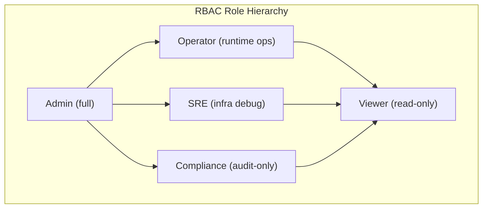

# AdapterOS Security Architecture

**Document Version:** 1.0
**Last Updated:** 2025-11-19
**Status:** Production Ready
**Maintained by:** AdapterOS Security Team

---

## Table of Contents

1. [Overview](#overview)
2. [Authentication](#authentication)
3. [Authorization (RBAC)](#authorization-rbac)
4. [Token Management](#token-management)
5. [IP Access Control](#ip-access-control)
6. [Rate Limiting](#rate-limiting)
7. [Tenant Isolation](#tenant-isolation)
8. [Audit Logging](#audit-logging)
9. [Session Management](#session-management)
10. [Security Best Practices](#security-best-practices)
11. [API Reference](#api-reference)

---

## Overview

AdapterOS implements defense-in-depth security with multiple layers:

```
┌─────────────────────────────────────────────────┐
│           Request Flow Security Layers          │
├─────────────────────────────────────────────────┤
│ 1. IP Access Control (Allowlist/Denylist)      │
│ 2. Rate Limiting (Per-Tenant DDoS Protection)  │
│ 3. JWT Validation (Ed25519 Signatures)         │
│ 4. Token Revocation Check (Blacklist)          │
│ 5. Session Activity Tracking                   │
│ 6. RBAC Permission Check (Deny-by-Default)     │
│ 7. Tenant Isolation Validation                 │
│ 8. Audit Logging (Immutable Trail)             │
└─────────────────────────────────────────────────┘
```

### Key Security Principles

- **Zero Trust:** Every request is authenticated and authorized
- **Deny by Default:** Explicit permission required for all actions
- **Defense in Depth:** Multiple security layers
- **Audit Everything:** Comprehensive logging of all security events
- **Tenant Isolation:** Strict boundaries between tenants
- **Time-Limited Tokens:** 8-hour JWT expiry with refresh mechanism

---

## Authentication

### JWT with Ed25519 Signatures

AdapterOS uses **Ed25519** digital signatures for JWT tokens in production mode, providing:

- **Fast verification:** ~60,000 signatures/second
- **Small signatures:** 64 bytes
- **High security:** ~128-bit security level
- **Deterministic:** Same message always produces same signature

### Token Structure

```rust
pub struct Claims {
    pub sub: String,        // User ID
    pub email: String,      // User email
    pub role: String,       // Role (admin, operator, sre, compliance, viewer)
    pub tenant_id: String,  // Tenant context
    pub exp: i64,           // Expiry timestamp (8 hours)
    pub iat: i64,           // Issued at timestamp
    pub jti: String,        // JWT ID (BLAKE3 hash for revocation)
    pub nbf: i64,           // Not before timestamp
}
```

### Password Security

- **Algorithm:** Argon2id (memory-hard, GPU-resistant)
- **Minimum Length:** 12 characters
- **Complexity:** Recommended (uppercase, lowercase, numbers, symbols)
- **Storage:** Only salted hash stored, never plaintext

### Authentication Flow

```
1. User submits email + password
   ↓
2. Check account lockout (5 failed attempts in 15 min)
   ↓
3. Query user from database
   ↓
4. Verify password with Argon2id
   ↓
5. Check IP access control
   ↓
6. Generate JWT with Ed25519 signature
   ↓
7. Create session record
   ↓
8. Track auth attempt (audit log)
   ↓
9. Return JWT token
```

### Bootstrap Admin

Initial setup requires creating the first admin user via the **bootstrap endpoint**:

```bash
curl -X POST https://api.adapteros.local/v1/auth/bootstrap \
  -H "Content-Type: application/json" \
  -d '{
    "email": "admin@company.com",
    "password": "SecurePassword123!",
    "display_name": "System Administrator"
  }'
```

**Security:** Bootstrap is **disabled** after the first user is created.

---

## Authorization (RBAC)

> **Full Reference:** See [RBAC.md](RBAC.md) for comprehensive role-based access control documentation including all 40 permissions and usage examples.

### Role Hierarchy



**Text representation:** `Admin > Operator > SRE > Compliance > Viewer`

### Permission Matrix

| Permission          | Admin | Operator | SRE | Compliance | Viewer |
|---------------------|-------|----------|-----|------------|--------|
| **Adapters**        |       |          |     |            |        |
| AdapterList         | ✅    | ✅       | ✅  | ✅         | ✅     |
| AdapterView         | ✅    | ✅       | ✅  | ✅         | ✅     |
| AdapterRegister     | ✅    | ✅       | ❌  | ❌         | ❌     |
| AdapterLoad/Unload  | ✅    | ✅       | ✅  | ❌         | ❌     |
| AdapterDelete       | ✅    | ❌       | ❌  | ❌         | ❌     |
| **Training**        |       |          |     |            |        |
| TrainingStart       | ✅    | ✅       | ❌  | ❌         | ❌     |
| TrainingCancel      | ✅    | ✅       | ❌  | ❌         | ❌     |
| TrainingView        | ✅    | ✅       | ✅  | ✅         | ✅     |
| **Inference**       |       |          |     |            |        |
| InferenceExecute    | ✅    | ✅       | ✅  | ❌         | ❌     |
| **Tenants**         |       |          |     |            |        |
| TenantManage        | ✅    | ❌       | ❌  | ❌         | ❌     |
| TenantView          | ✅    | ✅       | ✅  | ✅         | ✅     |
| **Policies**        |       |          |     |            |        |
| PolicyView          | ✅    | ✅       | ✅  | ✅         | ✅     |
| PolicyValidate      | ✅    | ❌       | ❌  | ✅         | ❌     |
| PolicyApply         | ✅    | ❌       | ❌  | ❌         | ❌     |
| PolicySign          | ✅    | ❌       | ❌  | ❌         | ❌     |
| **Audit**           |       |          |     |            |        |
| AuditView           | ✅    | ❌       | ✅  | ✅         | ❌     |
| **Nodes**           |       |          |     |            |        |
| NodeManage          | ✅    | ❌       | ❌  | ❌         | ❌     |

### Role Descriptions

#### 1. Admin
- **Full Control:** All permissions
- **Use Cases:** System configuration, user management, policy enforcement
- **Security:** Bypasses tenant isolation (can access all tenants)

#### 2. Operator
- **Runtime Operations:** Manage adapters, training, inference
- **Use Cases:** Day-to-day operations, model deployment
- **Restrictions:** Cannot delete adapters, manage tenants, or sign policies

#### 3. SRE
- **Infrastructure & Debugging:** Troubleshoot, monitor, test inference
- **Use Cases:** Performance debugging, incident response
- **Restrictions:** Cannot register/delete adapters or start training

#### 4. Compliance
- **Audit & Policy Oversight:** View audit logs, validate policies
- **Use Cases:** Compliance reviews, policy audits
- **Restrictions:** Read-only except for policy validation

#### 5. Viewer
- **Strict Read-Only:** View all resources
- **Use Cases:** Stakeholder visibility, reporting
- **Restrictions:** No write operations whatsoever

### Usage in Handlers

```rust
use adapteros_server_api::permissions::{require_permission, Permission};

pub async fn my_handler(
    Extension(claims): Extension<Claims>,
) -> Result<Json<Response>, (StatusCode, Json<ErrorResponse>)> {
    // Check permission
    require_permission(&claims, Permission::AdapterRegister)?;

    // Proceed with operation
    Ok(Json(response))
}
```

---

## Token Management

### Token Lifecycle

```
Issue (Login)
  ↓
Active (8 hours)
  ↓
Refresh (if near expiry)
  ↓
Revoke (Logout / Security Event)
  ↓
Expired (Auto-cleanup)
```

### Revocation Mechanisms

#### 1. Manual Logout
User explicitly logs out via `/v1/auth/logout`

#### 2. Token Refresh
Old token revoked when new token issued via `/v1/auth/refresh`

#### 3. Bulk Revocation
Admin revokes all user tokens (e.g., on password change)

#### 4. Automatic Expiry
Tokens expire after 8 hours, revocations cleaned up after expiry

### Revocation Checking

Every authenticated request checks the `revoked_tokens` table:

```sql
SELECT COUNT(*) FROM revoked_tokens WHERE jti = ?
```

**Performance:** Indexed lookup (~0.1ms), negligible overhead

---

## IP Access Control

### Allowlist/Denylist Model

```
Decision Logic:
1. Check denylist → If match, DENY
2. Check if allowlist exists
   - If yes and IP not on allowlist → DENY
   - If yes and IP on allowlist → ALLOW
3. If no allowlist, ALLOW
```

### Global vs Tenant-Specific Rules

- **Global Rules:** `tenant_id = NULL` (apply to all tenants)
- **Tenant Rules:** `tenant_id = 'tenant-a'` (apply only to specific tenant)

### CIDR Range Support

```sql
INSERT INTO ip_access_control (id, ip_address, ip_range, list_type, tenant_id, ...)
VALUES ('rule-1', '192.168.1.100', '192.168.1.0/24', 'allow', 'tenant-a', ...);
```

### Temporary Blocks

```sql
-- Block IP for 24 hours
expires_at = datetime('now', '+24 hours')
```

### API Examples

```bash
# Add IP to denylist
curl -X POST https://api.adapteros.local/v1/security/ip-access \
  -H "Authorization: Bearer $TOKEN" \
  -d '{
    "ip_address": "192.168.1.100",
    "list_type": "deny",
    "tenant_id": "tenant-a",
    "reason": "suspicious activity"
  }'

# List all rules
curl https://api.adapteros.local/v1/security/ip-access?tenant_id=tenant-a \
  -H "Authorization: Bearer $TOKEN"
```

---

## Rate Limiting

### Per-Tenant Quotas

Default: **1000 requests per minute** per tenant

### Sliding Window Algorithm

```
Window: 60 seconds
Max Requests: 1000

Request 1 @ t=0s   → Count = 1   → Allow
Request 2 @ t=1s   → Count = 2   → Allow
...
Request 1001 @ t=30s → Count = 1001 → DENY (429 Too Many Requests)

Window resets @ t=60s → Count = 0
```

### Response Headers

```
HTTP/1.1 429 Too Many Requests
Content-Type: application/json

{
  "error": "rate limit exceeded",
  "code": "RATE_LIMIT_EXCEEDED",
  "details": "rate limit: 1001/1000 requests, resets at 1732017600"
}
```

### Admin Override

```bash
# Update rate limit for tenant
curl -X PUT https://api.adapteros.local/v1/security/rate-limit/tenant-a \
  -H "Authorization: Bearer $ADMIN_TOKEN" \
  -d '{"max_requests": 5000}'

# Reset rate limit (emergency)
curl -X DELETE https://api.adapteros.local/v1/security/rate-limit/tenant-a \
  -H "Authorization: Bearer $ADMIN_TOKEN"
```

---

## Tenant Isolation

### Enforcement Points

1. **JWT Claims:** Every token includes `tenant_id`
2. **Middleware Validation:** Checks `tenant_id` matches resource
3. **Database Queries:** All queries scoped to `tenant_id`

### Validation Function

```rust
use adapteros_server_api::security::validate_tenant_isolation;

pub async fn get_adapter(
    Extension(claims): Extension<Claims>,
    Path(adapter_id): Path<String>,
) -> Result<Json<Adapter>, (StatusCode, Json<ErrorResponse>)> {
    let adapter = db.get_adapter(&adapter_id).await?;

    // Enforce tenant isolation
    validate_tenant_isolation(&claims, &adapter.tenant_id)?;

    Ok(Json(adapter))
}
```

### Admin Bypass

Admin role (with `role = "admin"`) can access **all tenants** for management.

---

## Audit Logging

### Log Structure

```sql
CREATE TABLE audit_logs (
    id TEXT PRIMARY KEY,
    timestamp TEXT NOT NULL,
    user_id TEXT NOT NULL,
    user_role TEXT NOT NULL,
    tenant_id TEXT NOT NULL,
    action TEXT NOT NULL,           -- e.g., "adapter.register"
    resource_type TEXT NOT NULL,    -- e.g., "adapter"
    resource_id TEXT,
    status TEXT NOT NULL,            -- "success" or "failure"
    error_message TEXT,
    ip_address TEXT,
    metadata_json TEXT
);
```

### Logged Events

- **Authentication:** Login, logout, token refresh, failed attempts
- **Authorization:** Permission denials, tenant isolation violations
- **Adapters:** Register, delete, load, unload
- **Training:** Start, cancel, completion
- **Policies:** Apply, sign, validate
- **Tenants:** Create, update, pause

### Query Examples

```bash
# All actions by user
curl "https://api.adapteros.local/v1/audit/logs?user_id=user-123" \
  -H "Authorization: Bearer $TOKEN"

# Failed login attempts
curl "https://api.adapteros.local/v1/audit/logs?action=auth.login&status=failure" \
  -H "Authorization: Bearer $TOKEN"

# Resource history
curl "https://api.adapteros.local/v1/audit/logs?resource_type=adapter&resource_id=adapter-xyz" \
  -H "Authorization: Bearer $TOKEN"
```

---

## Session Management

### Active Sessions

All sessions tracked in `user_sessions` table:

```sql
CREATE TABLE user_sessions (
    jti TEXT PRIMARY KEY,
    user_id TEXT NOT NULL,
    tenant_id TEXT NOT NULL,
    created_at TEXT NOT NULL,
    expires_at TEXT NOT NULL,
    ip_address TEXT,
    user_agent TEXT,
    last_activity TEXT NOT NULL
);
```

### List Active Sessions

```bash
curl https://api.adapteros.local/v1/auth/sessions \
  -H "Authorization: Bearer $TOKEN"
```

**Response:**
```json
{
  "sessions": [
    {
      "jti": "abc123",
      "created_at": "2025-11-19T10:00:00Z",
      "ip_address": "192.168.1.100",
      "last_activity": "2025-11-19T10:30:00Z"
    }
  ]
}
```

### Revoke Session

```bash
curl -X DELETE https://api.adapteros.local/v1/auth/sessions/abc123 \
  -H "Authorization: Bearer $TOKEN"
```

---

## Security Best Practices

### 1. Production Checklist

- [ ] Enable Ed25519 JWT signing (`use_ed25519 = true`)
- [ ] Configure IP allowlist for admin endpoints
- [ ] Set appropriate rate limits per tenant
- [ ] Enable audit logging
- [ ] Rotate JWT signing keys periodically
- [ ] Monitor failed authentication attempts
- [ ] Review audit logs regularly
- [ ] Backup revoked tokens table

### 2. Key Rotation

```bash
# Generate new Ed25519 keypair
adapteros-cli crypto generate-keypair --output /etc/adapteros/jwt-key.pem

# Update configuration
production_mode: true
jwt_mode: "eddsa"
jwt_key_path: "/etc/adapteros/jwt-key.pem"

# Restart server (existing tokens remain valid until expiry)
systemctl restart adapteros-server
```

### 3. Incident Response

#### Compromised Account
```bash
# Revoke all user tokens
curl -X POST https://api.adapteros.local/v1/auth/revoke-all \
  -H "Authorization: Bearer $ADMIN_TOKEN" \
  -d '{"user_id": "compromised-user", "reason": "account compromise"}'

# Disable user
curl -X PUT https://api.adapteros.local/v1/users/compromised-user \
  -H "Authorization: Bearer $ADMIN_TOKEN" \
  -d '{"disabled": true}'
```

#### Suspicious IP
```bash
# Block IP immediately
curl -X POST https://api.adapteros.local/v1/security/ip-access \
  -H "Authorization: Bearer $ADMIN_TOKEN" \
  -d '{
    "ip_address": "suspicious.ip",
    "list_type": "deny",
    "reason": "suspicious activity detected"
  }'
```

### 4. Compliance Queries

```sql
-- All privileged actions in last 30 days
SELECT * FROM audit_logs
WHERE action IN ('adapter.delete', 'policy.sign', 'tenant.create')
  AND timestamp >= datetime('now', '-30 days')
ORDER BY timestamp DESC;

-- Failed authentication by IP
SELECT ip_address, COUNT(*) as attempts
FROM auth_attempts
WHERE success = 0
  AND attempted_at >= datetime('now', '-7 days')
GROUP BY ip_address
HAVING attempts > 10
ORDER BY attempts DESC;
```

---

## API Reference

### Authentication Endpoints

| Method | Endpoint | Description | Auth Required |
|--------|----------|-------------|---------------|
| POST | `/v1/auth/bootstrap` | Create initial admin | No |
| POST | `/v1/auth/login` | Login with email/password | No |
| POST | `/v1/auth/logout` | Logout and revoke token | Yes |
| POST | `/v1/auth/refresh` | Refresh JWT token | Yes |
| GET | `/v1/auth/sessions` | List active sessions | Yes |
| DELETE | `/v1/auth/sessions/:jti` | Revoke specific session | Yes |

### Security Management Endpoints

| Method | Endpoint | Description | Permission Required |
|--------|----------|-------------|---------------------|
| GET | `/v1/security/ip-access` | List IP rules | Admin/SRE |
| POST | `/v1/security/ip-access` | Add IP rule | Admin |
| DELETE | `/v1/security/ip-access/:id` | Remove IP rule | Admin |
| GET | `/v1/security/rate-limit/:tenant_id` | Get rate limit | Admin/SRE |
| PUT | `/v1/security/rate-limit/:tenant_id` | Update rate limit | Admin |
| DELETE | `/v1/security/rate-limit/:tenant_id` | Reset rate limit | Admin |

### Audit Endpoints

| Method | Endpoint | Description | Permission Required |
|--------|----------|-------------|---------------------|
| GET | `/v1/audit/logs` | Query audit logs | Admin/SRE/Compliance |
| GET | `/v1/audit/stats` | Audit statistics | Admin/Compliance |
| GET | `/v1/audit/failed-attempts/:email` | Failed auth attempts | Admin/SRE |

---

## Security Contact

**Security Issues:** security@adapteros.com
**Bug Bounty:** https://adapteros.com/security/bounty
**PGP Key:** Available at https://adapteros.com/security/pgp

---

## See Also

- [RBAC.md](RBAC.md) - Complete RBAC permission matrix and role specifications
- [AUTHENTICATION.md](AUTHENTICATION.md) - Detailed authentication flow and token management
- [CLAUDE.md (RBAC section)](../CLAUDE.md#rbac-5-roles-40-permissions) - Quick reference for RBAC implementation

---

**Copyright:** © 2025 JKCA / James KC Auchterlonie. All rights reserved.
