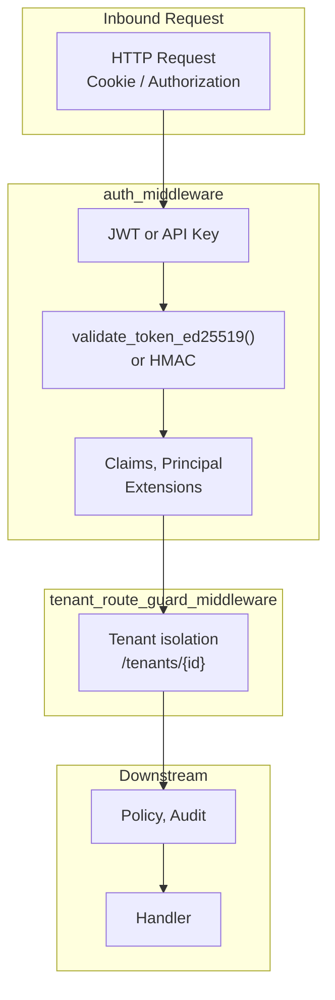

# SECURITY

Auth, RBAC, path hygiene. Source: `adapteros-server-api/auth`, `adapteros-core/path_security.rs`.

---

## Auth Flow

**Types:** `Claims`, `Principal`, `PrincipalType` (User, Service, Anonymous). Set in `axum::Extension`.

---

## Auth Modes

| Mode | Config | Behavior |
|------|--------|----------|
| JWT Ed25519 | jwt_mode = "ed25519" | Validate with public key |
| JWT HMAC | jwt_mode = "hmac" | Validate with shared secret |
| API Key | Header X-API-Key | Lookup in db, map to principal |

---

## Dev Bypass

| Method | Effect | Code |
|--------|--------|------|
| `AOS_DEV_NO_AUTH=1` | Skips auth | `is_public_path()` check |
| `security.dev_bypass = true` | Skips auth (debug builds) | `set_dev_bypass_from_config()` |

**Gate:** `validate_production_security_env()` blocks dev bypass in release builds.

---

## Path Hygiene

Forbidden: `/tmp`, `/private/tmp`, `/var/tmp`. Enforced by `adapteros-core/src/path_security.rs`.

**Canonical runtime root:** `./var/` (or `AOS_VAR_DIR`). See [VAR_STRUCTURE.md](VAR_STRUCTURE.md).

---

## Reporting

Report vulnerabilities to MLNavigator Inc R&D. Include: description, steps, impact, mitigations.
