# AdapterOS Training Guide

Complete guide to training custom LoRA adapters in AdapterOS, covering the entire pipeline from dataset preparation through deployment.

**Last Updated:** 2025-12-11

---

## Table of Contents

1. [Overview](#overview)
2. [Training Flow Diagram](#training-flow-diagram)
3. [Dataset Preparation](#dataset-preparation)
4. [Training Pipeline](#training-pipeline)
5. [GPU Integration](#gpu-integration)
6. [MoE Training](#moe-training)
7. [Provenance and Versioning](#provenance-and-versioning)
8. [Backend Selection](#backend-selection)
9. [Quick Start Examples](#quick-start-examples)
10. [API Reference](#api-reference)
11. [Troubleshooting](#troubleshooting)

---

## Overview

AdapterOS converts training data into production-ready LoRA adapters packaged as `.aos` archives. The system supports:

- **Multiple Backends**: MLX (primary), CoreML/ANE (acceleration), Metal (kernels)
- **Multi-format Datasets**: JSONL, JSON, plain text
- **Full Provenance Tracking**: Dataset lineage, training evidence, and audit trails
- **Version Control**: Repository-based adapter versioning with promotion workflows
- **Deterministic Training**: HKDF-seeded for reproducibility
- **Q15 Quantization**: Gate values quantized with denominator 32767.0

### Key Features

- **Automatic Backend Selection**: Optimal GPU/ANE backend based on system capabilities
- **Training Evidence System**: Policy-enforced documentation of data sources
- **Repository Versioning**: Git-like workflow for adapter lifecycle management
- **Real-time Metrics**: Loss tracking, throughput monitoring, GPU utilization
- **Manifest Signing**: Ed25519 signatures for integrity verification

---

## Training Flow Diagram

```mermaid
flowchart TB
    subgraph "1. Dataset Preparation"
        A1[Upload Files<br/>JSONL/JSON/TXT] --> A2[Parse & Validate]
        A2 --> A3[Store Metadata<br/>+ BLAKE3 Hash]
        A3 --> A4[Dataset Ready]
    end

    subgraph "2. Training Configuration"
        B1[Select Repository] --> B2[Choose Base Model]
        B2 --> B3[Configure Parameters<br/>rank, alpha, epochs]
        B3 --> B4[Select Backend<br/>CoreML/Metal/MLX/CPU]
        B4 --> B5[Add Dataset Versions]
    end

    subgraph "3. Training Execution"
        C1[Validate Trust Gates] --> C2[Create Draft Version]
        C2 --> C3[Init Backend Kernels]
        C3 --> C4[Load Training Examples]
        C4 --> C5[MicroLoRATrainer.train]
        C5 --> C6[Per-Epoch Callbacks<br/>loss, metrics, telemetry]
        C6 --> C7[Training Complete]
    end

    subgraph "4. Packaging & Registration"
        D1[Quantize Weights<br/>Q15] --> D2[Package .aos<br/>safetensors + manifest]
        D2 --> D3[BLAKE3 Hash]
        D3 --> D4[Ed25519 Sign]
        D4 --> D5[Register Version<br/>ready state]
    end

    subgraph "5. Deployment"
        E1[Promote Version] --> E2[Activate on Branch]
        E2 --> E3[Deprecate Previous]
        E3 --> E4[Load in Worker]
        E4 --> E5[Inference Ready]
    end

    A4 --> B1
    B5 --> C1
    C7 --> D1
    D5 --> E1

    style A1 fill:#e1f5ff
    style C5 fill:#fff4e1
    style D2 fill:#ffe1f5
    style E5 fill:#e1ffe1
```



### Pipeline Stages Summary

1. **Dataset Preparation** - Ingest documents, generate training examples, validate format
2. **Training Configuration** - Select repository, base model, hyperparameters, and datasets
3. **Training Execution** - Trust validation, backend init, training loop with metrics
4. **Packaging & Registration** - Q15 quantization, .aos packaging, signing, version registration
5. **Deployment** - Version promotion, activation, worker loading

---

## Dataset Preparation

### Supported File Formats

#### JSONL Format (Recommended)

One JSON object per line with input-output pairs:

```jsonl
{"input": "What is 2+2?", "target": "The answer is 4", "weight": 1.0}
{"input": "Explain Rust", "target": "Rust is a systems programming language with memory safety guarantees."}
{"input": "What is Python?", "target": "Python is a high-level programming language known for simplicity."}
```

**Field Names Recognized:**
- Input: `input`, `prompt`, `text`, `content`
- Target: `target`, `output`, `completion`, `response`

#### JSON Format

Array of objects or nested structure:

```json
{
  "version": "1.0",
  "examples": [
    {"prompt": "Question 1", "completion": "Answer 1"},
    {"prompt": "Question 2", "completion": "Answer 2"}
  ]
}
```

#### Plain Text Format

Line-based or block-based:

```
Line 1 becomes example 1
Line 2 becomes example 2

Or use blank-line separated blocks:

Input block

Target block

Next input

Next target
```

### Dataset Upload

**Via API:**

```bash
curl -X POST http://localhost:8080/v1/datasets/upload \
  -F "name=my-dataset" \
  -F "description=Training data for custom adapter" \
  -F "format=jsonl" \
  -F "file=@training.jsonl" \
  -F "dataset_type=training" \
  -F "purpose=Question answering for domain X" \
  -F "source_location=https://github.com/org/dataset" \
  -F "collection_method=manual"
```

**Via CLI:**

```bash
./aosctl dataset upload \
  --path training.jsonl \
  --name my-dataset \
  --format jsonl \
  --description "Training data"
```

### Dataset Validation

All datasets must pass validation before training:

```bash
curl -X POST http://localhost:8080/v1/datasets/{dataset_id}/validate

# Or via CLI
./aosctl dataset validate {dataset_id}
```

**Validation Checks:**
- JSON/JSONL syntax correctness
- Required fields present (`input`, `target`)
- BLAKE3 hash integrity
- Schema compliance
- Minimum example count (10 examples)

### Dataset Management

**List Datasets:**
```bash
./aosctl dataset list
curl http://localhost:8080/v1/datasets
```

**Get Statistics:**
```bash
./aosctl dataset stats {dataset_id}
```

**Preview Examples:**
```bash
./aosctl dataset preview {dataset_id} --limit 5
```

**Delete Dataset:**
```bash
./aosctl dataset delete {dataset_id}
```

---

## Training Pipeline

### Canonical 5-Step Pipeline

AdapterOS training follows these steps:

**1. Ingest** - `DocumentIngestor::new(opts, tokenizer).ingest_pdf_path(path)?`

Supported formats: PDF, plain text, markdown

**2. Generate** - `generate_training_data(&doc, &tokenizer, &config)?`

Strategies:
- **Identity**: Unsupervised (input == target)
- **QuestionAnswer**: Q&A pairs from content
- **MaskedLM**: Masked language modeling

**3. Dataset** - `TrainingDatasetManager::new(db, path, tok).create_dataset_from_documents(req).await?`

Properties:
- BLAKE3 content addressing
- Schema validation
- `validation_status` must be `'valid'`

**4. Train** - `MicroLoRATrainer::new(cfg)?.train(examples, adapter_id).await?`

Configuration:
- `rank`: LoRA rank (default 16)
- `alpha`: LoRA alpha scaling (default 32)
- `epochs`: Training epochs
- `learning_rate`: Optimizer LR
- `backend`: CoreML/Metal/MLX/CPU

**5. Package** - `AdapterPackager::package_aos_for_tenant(...).await?`

Output: `.aos` archive with:
- Safetensors weights (Q15 quantized)
- JSON manifest (`rank`, `alpha`, `training_backend`, `determinism`, `gate_q15_denominator=32767`, `quantization="q15"`)
- Ed25519 signature

### Training Job Lifecycle

Training jobs progress through states:

```
pending → running → completed/failed/cancelled
```

**Job Tracking Fields:**
- **Progress**: Percentage, current epoch, examples/tokens processed
- **Loss**: Per-epoch loss values, final loss
- **Backend**: Selected backend (CoreML/Metal/MLX/CPU) + reason
- **Determinism**: Seed, mode
- **GPU**: Requirements (`require_gpu`, `max_gpu_memory_mb`), utilization
- **Performance**: Throughput (examples/sec, tokens/sec), training time
- **Artifacts**: .aos path, package hash, manifest summary, signature status

### Training Configuration

**Basic Configuration:**

```rust
use adapteros_lora_worker::training::TrainingConfig;

let config = TrainingConfig {
    rank: 16,              // LoRA rank
    alpha: 32.0,           // LoRA alpha scaling
    learning_rate: 1e-4,   // Optimizer learning rate
    batch_size: 8,         // Batch size
    epochs: 3,             // Number of epochs
    hidden_dim: 768,       // Model hidden dimension
    ..Default::default()
};
```

**With GPU Requirements:**

```rust
let config = TrainingConfig::default()
    .with_backend(TrainingBackend::CoreML)
    .with_gpu_required()
    .with_max_gpu_memory(4096);  // 4GB limit
```

**Training Templates:**

- `general-code`: rank=16, alpha=32 (multi-language code)
- `framework-specific`: rank=12, alpha=24

---

## Codebase Training Pipeline

Codebase adapters are stream-scoped adapters trained on repository snapshots and streaming context. They extend a base (core) adapter with project-specific knowledge and require additional gating checks before deployment.

### Training Inputs

Codebase adapter training combines two input sources:

**1. Repository Snapshot:**
- `repo_id`: Repository identifier (e.g., "owner/repo")
- `repo_commit`: Git commit SHA at training time
- `manifest_hash`: BLAKE3 hash of the adapter manifest

**2. Stream Context:**
- `stream_id`: The bound chat session ID
- `context_digest`: BLAKE3 hash of accumulated stream context

```
┌─────────────────────┐     ┌─────────────────────┐
│  Repository State   │     │   Stream Context    │
│  ─────────────────  │     │  ─────────────────  │
│  repo_id            │     │  session_id         │
│  commit_sha         │     │  context_digest     │
│  manifest_hash      │     │  message_history    │
└─────────┬───────────┘     └──────────┬──────────┘
          │                            │
          └──────────────┬─────────────┘
                         ▼
              ┌─────────────────────┐
              │  Training Pipeline  │
              │  ─────────────────  │
              │  Base: core adapter │
              │  Backend: MLX/Metal │
              └──────────┬──────────┘
                         ▼
              ┌─────────────────────┐
              │  Codebase Adapter   │
              │  ─────────────────  │
              │  Stream-bound       │
              │  Auto-versioned     │
              └─────────────────────┘
```

### Deployment Gating Checks

Before a codebase adapter can be deployed/activated, the following preflight checks must pass:

| Check | Description | Error Code |
|-------|-------------|------------|
| **Repo Clean** | Repository has no uncommitted changes | `REPO_NOT_CLEAN` |
| **Base Model Hash Match** | Adapter was trained against the current base model | `BASE_MODEL_MISMATCH` |
| **No Conflicting Adapter** | No other codebase adapter active for the same stream | `CONFLICTING_ACTIVE_ADAPTER` |
| **CoreML Metadata Present** | If frozen, CoreML export metadata must exist | `MISSING_COREML_METADATA` |
| **Manifest Hash Valid** | Manifest hash matches expected value | `MANIFEST_HASH_MISMATCH` |

**Verification API:**

```bash
curl -X POST "$AOS_BASE_URL/v1/adapters/codebase/$ADAPTER_ID/verify" \
  -H "Authorization: Bearer $AOS_TOKEN" \
  -H "Content-Type: application/json" \
  -d '{
    "repo_path": "/path/to/repo",
    "expected_manifest_hash": "blake3:f1e2d3c4...",
    "session_id": "session-xyz789"
  }'
```

### Promotion Rule: Live to Frozen

Codebase adapters follow a specific promotion path for deterministic release:

```
live (MLX/Metal) → freeze → CoreML export → deterministic release
```

**States:**

1. **Live** (`frozen=false`): Adapter runs on MLX/Metal backend, may receive incremental updates from the session
2. **Frozen** (`frozen=true`): Adapter locked for CoreML export, no further updates accepted
3. **CoreML Exported**: Adapter has a verified CoreML package for ANE deployment

**Freezing a Codebase Adapter:**

```bash
# Unbind triggers automatic versioning and freezing
curl -X POST "$AOS_BASE_URL/v1/adapters/codebase/$ADAPTER_ID/unbind" \
  -H "Authorization: Bearer $AOS_TOKEN"

# Verify frozen state
curl "$AOS_BASE_URL/v1/adapters/codebase/$ADAPTER_ID" \
  -H "Authorization: Bearer $AOS_TOKEN"
# Response includes: "frozen": true, "coreml_package_hash": null

# Export to CoreML (after freezing)
curl -X POST "$AOS_BASE_URL/v1/adapters/$ADAPTER_ID/export/coreml" \
  -H "Authorization: Bearer $AOS_TOKEN"
```

### Single-Stream Rule

A critical constraint for codebase adapters:

> **Only one codebase adapter may be active per stream (session) at a time.**

This ensures deterministic behavior and prevents conflicts from multiple adapters trying to serve the same development context.

**Conflict Detection:**
- When activating a codebase adapter, the system checks for existing active adapters on the same stream
- If a conflict exists, activation fails with `CONFLICTING_ACTIVE_ADAPTER`
- The conflicting adapter must be explicitly deactivated first

### UI Session Binding

From the user interface perspective, codebase adapter binding happens at session start:

```
┌──────────────────┐     ┌──────────────────┐     ┌──────────────────┐
│  User starts     │ ──► │  System checks   │ ──► │  Session bound   │
│  chat session    │     │  for existing    │     │  to adapter      │
│                  │     │  codebase adapter│     │                  │
└──────────────────┘     └──────────────────┘     └──────────────────┘
                                 │
                                 ▼
                         ┌──────────────────┐
                         │  If none exists, │
                         │  create new      │
                         │  codebase adapter│
                         └──────────────────┘
```

**Binding Behavior:**
1. **Session Creation**: When a chat session is created with a codebase context, the UI can specify an initial adapter binding
2. **Automatic Binding**: If `session_id` is provided in the `CreateCodebaseAdapterRequest`, the adapter binds immediately
3. **Exclusive Binding**: Once bound, the adapter is exclusively tied to that session until unbound
4. **Versioning on Unbind**: When a session ends, the adapter auto-versions based on `versioning_threshold`

### Codebase Adapter Configuration Fields

| Field | Type | Description |
|-------|------|-------------|
| `repo_id` | string | Repository identifier |
| `repo_commit` | string | Git commit SHA |
| `stream_id` | string | Bound session ID |
| `context_digest` | string | BLAKE3 hash of stream context |
| `parent_version` | string | Previous adapter version ID (for lineage) |
| `frozen` | boolean | Whether adapter is locked for CoreML export |
| `base_adapter_id` | string | Core adapter this codebase extends |
| `versioning_threshold` | integer | Activation count before auto-version (default: 100) |

---

## GPU Integration

### Available Backends

AdapterOS supports multiple training backends with automatic selection:

#### 1. MLX (Primary)

- **Platform**: macOS with Apple Silicon
- **Best for**: All inference and training workloads
- **Feature flag**: `multi-backend` (default)
- **Selection priority**: 1 (highest)

#### 2. CoreML with ANE (Acceleration Layer)

- **Platform**: macOS 13+, Apple Silicon with ANE
- **Best for**: ANE-accelerated ops, power efficiency
- **Feature flag**: `coreml-backend`
- **Selection priority**: 2 (acceleration layer for MLX)

**CoreML Training Architecture:**
- LoRA-only training (base model weights never loaded/mutated)
- CoreML forward passes on ANE/GPU
- CPU-side gradients and optimizer updates
- Existing Rust gradient path (clipping, deterministic noise, NaN scrubbing)

#### 3. Metal GPU (Kernels)

- **Platform**: macOS with Metal-capable GPU
- **Best for**: Low-level GPU compute primitives
- **Feature flag**: `metal-backend`
- **Selection priority**: 3 (used by MLX internally)

#### 4. CPU

- **Platform**: All platforms
- **Best for**: Universal fallback
- **Feature flag**: Always available
- **Selection priority**: 4 (lowest)

### Backend Selection Process

When `init_kernels()` is invoked:

1. Validate GPU requirements (error if GPU required but unavailable)
2. If `preferred_backend` is set and available, use it
3. Otherwise auto-select in priority order: CoreML → MLX → Metal
4. If GPU is optional and all GPU candidates fail, fall back to CPU

**Detection Methods:**

```rust
use adapteros_lora_worker::training::MicroLoRATrainer;

// List available backends
let backends = MicroLoRATrainer::detect_available_backends();
for (backend, status) in backends {
    println!("{}: {}", backend.name(), status);
}

// Human-readable description
println!("{}", MicroLoRATrainer::describe_available_backends());
```

### GPU Training Configuration

**Backend Preference:**

```rust
let config = TrainingConfig::default()
    .with_backend(TrainingBackend::CoreML);
```

**GPU Required (fail if unavailable):**

```rust
let config = TrainingConfig::default()
    .with_gpu_required();
```

**GPU Memory Limit:**

```rust
let config = TrainingConfig::default()
    .with_max_gpu_memory(2048);  // 2GB max
```

### Initialization and Fallback

**Orchestrated Training:**

`TrainingService::run_training_job` calls `init_kernels(plan_bytes)` before `train_with_resume()`. Plan bytes are loaded from `AOS_MODEL_PATH` (CoreML `.mlpackage` paths or `model.safetensors`).

**Fallback Behavior:**
- **GPU optional + assets missing**: Falls back to CPU with log warning
- **GPU required + assets missing/init failed**: Fails job with clear error
- **Mid-training failure (GPU required)**: Fails job
- **Mid-training failure (GPU optional)**: Drops kernels, continues on CPU

### Metrics and Telemetry

**Training Start Event:**

```json
{
    "rank": 4,
    "epochs": 3,
    "examples": 100,
    "seed": "...",
    "backend": "CoreML",
    "using_gpu": true,
    "has_kernels": true,
    "config": {
        "batch_size": 8,
        "learning_rate": 0.0001,
        "alpha": 16.0,
        "hidden_dim": 768
    }
}
```

**Training Completion Event:**

```json
{
    "adapter_id": "microlora_1234567890",
    "final_loss": 0.0234,
    "training_time_ms": 15234,
    "seed": "...",
    "backend": "CoreML",
    "backend_device": "Apple Neural Engine",
    "using_gpu": true,
    "performance": {
        "examples_per_second": 6.55,
        "tokens_per_second": 4800.0,
        "total_examples": 100,
        "total_tokens": 480000,
        "total_epochs": 3,
        "rank": 4,
        "hidden_dim": 768
    }
}
```

**Per-Epoch Metrics:**

- Loss
- Examples/sec, tokens/sec
- Tokens per epoch
- Running totals

**GPU Metrics:**

- MLX: `mlx_memory_used` (stub returns 1MB), `mlx_utilization: null` when unavailable
- Metal: Best-effort via powermetrics
- CoreML: Device tagging (ANE/GPU/CPU), sampled forward latency (mean/p95)

---

## MoE Training

AdapterOS supports training LoRA adapters for Mixture of Experts (MoE) models like Qwen3-Coder-30B-A3B. MoE training uses routing-weighted shared LoRA, where the same LoRA weights are applied but scaled by expert routing weights.

### MoE Architecture Overview

MoE models route each token to a subset of experts (e.g., 8 out of 128). The adapter training accounts for this routing by scaling gradients proportionally to expert activation.

**Key Concepts:**

- **Routing-Weighted Shared LoRA**: Single set of LoRA weights, scaled by routing weights
- **Expert Routing**: Token-level routing determines which experts process each token
- **Q15 Routing Weights**: Routing weights quantized with denominator 32767.0

**Formula:**
```
expert_out = sum(routing_weight[e]) * (alpha/rank) * (B @ A) @ x
```

### MoE Training Configuration

**Configure MoE Training:**

```rust
use adapteros_lora_worker::training::{TrainingConfig, MoETrainingConfig, MoELoRAStrategy};

let config = TrainingConfig::default()
    .with_moe(128, 8)  // 128 experts, 8 active per token
    .with_rank(4)
    .with_alpha(8.0)
    .with_epochs(3);
```

**Full MoE Configuration:**

```rust
let moe_config = MoETrainingConfig {
    num_experts: 128,
    num_experts_per_token: 8,
    lora_strategy: MoELoRAStrategy::RoutingWeightedShared,
    use_routing_weights: true,
    moe_intermediate_size: Some(768),
};

let config = TrainingConfig::default()
    .with_moe_config(moe_config);
```

### MoE LoRA Strategies

| Strategy | Description | Use Case |
|----------|-------------|----------|
| `RoutingWeightedShared` | Single shared LoRA, scaled by routing | Default, efficient |
| `PerExpertLoRA` | Separate LoRA per expert | Future: higher capacity |

### MoE Training API

**Training MoE Adapter:**

```rust
let trainer = MicroLoRATrainer::new(config)?;
let result = trainer.train(&examples, "moe-adapter-v1").await?;

// Result includes MoE config in weights
assert!(result.weights.is_moe());
```

**MoE-Aware Forward Pass:**

The trainer uses `forward_moe()` which applies routing-weighted LoRA:

```rust
// Internal: routing weights scale LoRA output
fn apply_lora_moe(&self, hidden: &[f32], weights: &LoRAWeights, routing_weights: &[f32]) -> Vec<f32> {
    let lora_output = self.apply_lora(hidden, weights);
    let routing_scale: f32 = routing_weights.iter().sum();
    lora_output.iter().map(|v| v * routing_scale).collect()
}
```

### MoE .aos Packaging

MoE adapters are packaged with `moe_config` in the manifest:

```json
{
  "version": "2.0",
  "rank": 4,
  "alpha": 8.0,
  "base_model": "Qwen/Qwen3-Coder-30B-A3B",
  "moe_config": {
    "num_experts": 128,
    "num_experts_per_token": 8,
    "lora_strategy": "routing_weighted_shared",
    "use_routing_weights": true,
    "moe_intermediate_size": 768
  },
  "quantization": "q15",
  "gate_q15_denominator": 32767
}
```

### Loading MoE Adapters

**Validate MoE Compatibility:**

```rust
use adapteros_aos::{AosManager, MoEConfigManifest};

let manager = AosManager::builder()
    .with_cache(1024 * 1024 * 1024)
    .build()?;

// Load with MoE validation
let adapter = manager.load_moe(&path).await?;
assert!(adapter.is_moe_adapter());

// Validate against expected config
let expected = MoEConfigManifest {
    num_experts: 128,
    num_experts_per_token: 8,
    ..Default::default()
};
let adapter = manager.load_moe_validated(&path, &expected).await?;
```

**Discover MoE Adapters:**

```rust
// Find all MoE adapters in a directory
let moe_adapters = manager.discover_moe_adapters(&adapters_dir).await?;
for (path, config) in moe_adapters {
    println!("{}: {} experts", path.display(), config.num_experts);
}

// Find adapters compatible with specific config
let compatible = manager.find_compatible_moe_adapters(&adapters_dir, &expected_config).await?;
```

### MoE Hot-Swap

MoE adapters support hot-swap with validation:

```rust
// Hot-swap MoE adapter with automatic validation
manager.hot_swap_moe("slot1", &new_adapter_path).await?;

// Get active MoE adapters
let active = manager.get_active_moe_adapters();
for (slot, adapter) in active {
    if let Some(moe_config) = adapter.moe_config() {
        println!("Slot {}: {} experts", slot, moe_config.num_experts);
    }
}

// Check MoE memory usage
let moe_bytes = manager.moe_cache_size_bytes();
let moe_count = manager.moe_cache_count();
```

### MoE Best Practices

1. **Match Expert Configuration**: Ensure adapter `num_experts` matches target model
2. **Use Routing Weights**: Enable `use_routing_weights` for proper expert scaling
3. **Monitor Memory**: MoE models are large; use `moe_cache_size_bytes()` to track usage
4. **Validate on Load**: Use `load_moe_validated()` to catch configuration mismatches early
5. **Hot-Swap Validation**: Use `hot_swap_moe()` for atomic MoE adapter updates

---

## Provenance and Versioning

### Training Provenance System

AdapterOS implements comprehensive training provenance tracking (Policy: `cp-evidence-004`).

#### T1 Adapter Requirements

All T1 (persistent tier) adapters MUST have:

1. **Primary Dataset Specified** - `primary_dataset_id` field populated
2. **Evidence Entries** - At least one evidence entry documenting provenance
3. **Eval Dataset (Production)** - For production T1 adapters, `eval_dataset_id` required

**Violation Handling:**
- Missing primary dataset → Policy violation (non-compliant)
- Missing evidence entries → Policy violation (non-compliant)
- Missing eval dataset (production) → Warning (soft violation)

### Dataset Metadata Fields

Extended `training_datasets` table includes:

```sql
dataset_type          -- 'training', 'eval', 'red_team', 'logs', 'other'
purpose               -- Human-readable purpose
source_location       -- URL, path, or reference
collection_method     -- 'manual', 'sync', 'api', 'pipeline', 'scrape', 'other'
ownership             -- Owner contact/email
tenant_id             -- Tenant isolation
```

### Evidence System

#### Evidence Entry Types

| Type | Description | Example Reference |
|------|-------------|-------------------|
| `doc` | Documentation, design docs | `https://docs.example.com/dataset-spec.md` |
| `ticket` | JIRA/GitHub issue | `https://jira.example.com/PROJ-123` |
| `commit` | Git commit SHA | `https://github.com/org/repo/commit/abc123` |
| `policy_approval` | Policy review | `policy-review-2025-11-25.pdf` |
| `data_agreement` | Data usage agreement | `DUA-2025-001` |
| `review` | Code/data review | `https://github.com/org/repo/pull/456` |
| `audit` | Compliance audit | `audit-report-Q4-2025.pdf` |
| `other` | Other evidence | Custom reference |

#### Confidence Levels

- **high** - Verified, signed, or authoritative source
- **medium** - Documented but not formally verified
- **low** - Informal or incomplete documentation

#### Creating Evidence Entries

```rust
use adapteros_db::Db;

// Create evidence for dataset
let entry_id = db.create_evidence_entry(
    Some("dataset-123"),
    None,
    "commit",
    "https://github.com/org/dataset/commit/abc123",
    Some("Dataset v1.0 release"),
    "high",
    Some("ml-team@example.com"),
    None,
).await?;

// Create evidence for adapter
let entry_id = db.create_evidence_entry(
    None,
    Some("adapter-456"),
    "policy_approval",
    "policy-review-approved",
    Some("Legal review approved"),
    "high",
    Some("legal@example.com"),
    None,
).await?;

// Get adapter evidence
let evidence = db.get_adapter_evidence("adapter-456").await?;
let count = db.count_adapter_evidence("adapter-456").await?;
```

### Repository-Based Versioning

Training uses repository-based versioning with Git-like workflows:

#### Version Lifecycle

```
draft → training → ready/failed
```

**Start Training:**

```rust
// Requires repository, target branch, optional base version
start_training(
    repository_id,
    target_branch,
    base_version_id,  // Optional
    dataset_version_ids,
    config
)
```

- Draft adapter version created with commit and data spec hash
- Workers fetch base `.aos` (when supplied)
- Package new artifact to `{tenant}/{repo_name}/{version}.aos`
- Computed BLAKE3 hash stored

**Promote Version:**

```rust
promote_version(version_id, target_branch)
```

- Deprecates current active version on branch
- Marks promoted version as active

**Version States:**

- `draft` - Initial state, not yet training
- `training` - Training in progress
- `ready` - Training completed successfully
- `failed` - Training failed or cancelled

### Training Lineage & Trust

#### Trust Gates

Training requests are validated against trust gates:

**Error Codes:**
- `LINEAGE_REQUIRED` - Non-synthetic runs must include dataset_version_ids
- `DATASET_TRUST_BLOCKED` - Dataset trust_state=blocked
- `DATASET_TRUST_NEEDS_APPROVAL` - Dataset needs approval or unknown
- `DATA_SPEC_HASH_MISMATCH` - Hash mismatch with combined dataset manifests

**Metrics:**
- `training_jobs_rejected_lineage_required`
- `training_jobs_rejected_trust_blocked`
- `training_jobs_rejected_trust_needs_approval`

#### Adapter Health States

**Health Classification:**
- **Corrupt**: Storage issues (missing_bytes/missing_file/hash_mismatch)
- **Unsafe**: Dataset trust is blocked/regressed
- **Degraded**: Drift or warnings present
- **Healthy**: None of the above

**Metrics:**
- `adapter_versions_health_corrupt`
- `adapter_versions_health_unsafe`

**Subcodes:**
- Storage issues → storage domain codes
- Trust issues → `trust_blocked`
- Drift → drift codes

---

## Backend Selection

### Selection Policy

Backend selection follows explicit policies with telemetry tracking:

**Policy:**
- `preferred_backend=coreml` attempts CoreML first
- Fallbacks require explicit policy or availability
- No silent redirects
- All selections emit telemetry/reason strings

**Metadata Persistence:**

Training metadata persisted to manifests and job records:
- `training_backend` - Backend used (CoreML/Metal/MLX/CPU)
- `training_backend_reason` - Selection reason string
- `device` - Device tag (ANE/GPU/CPU)

### Observability

**Per-run Counters:**
- CoreML start/success/fallback
- Device tagging (ANE/GPU/CPU)
- Sampled CoreML forward latency (mean/p95)

**Artifacts:**

`.aos` metadata includes:
- Executed backend
- Reason string
- Device information
- Quantization: Q15
- AOS2 manifest shape (unchanged)

---

## Quick Start Examples

### Example 1: Basic Training

```bash
# 1. Prepare training data
cat > training.jsonl << 'EOF'
{"input": "What is Rust?", "target": "Rust is a systems programming language."}
{"input": "What is Python?", "target": "Python is a high-level programming language."}
{"input": "What is Go?", "target": "Go is a compiled language for concurrent programming."}
EOF

# 2. Upload dataset
DATASET_ID=$(curl -s -X POST http://localhost:8080/v1/datasets/upload \
  -F "name=lang-intro" \
  -F "format=jsonl" \
  -F "file=@training.jsonl" \
  | jq -r .dataset_id)

# 3. Validate dataset
curl -X POST http://localhost:8080/v1/datasets/$DATASET_ID/validate

# 4. Train adapter
./aosctl train \
  --dataset-id $DATASET_ID \
  --output adapters/custom.aos \
  --rank 16 \
  --epochs 3
```

### Example 2: GPU-Accelerated Training

```bash
# Train with CoreML backend (GPU required)
./aosctl train \
  --dataset-id $DATASET_ID \
  --output adapters/custom.aos \
  --rank 24 \
  --epochs 5 \
  --backend coreml \
  --require-gpu \
  --max-gpu-memory 4096
```

### Example 3: Training with Evidence

```rust
// 1. Upload dataset with metadata
let dataset_id = upload_dataset(
    "rust-qa-v1",
    "training",
    "Rust Q&A corpus",
    "https://github.com/org/rust-qa",
    "sync"
).await?;

// 2. Add evidence
db.create_evidence_entry(
    Some(&dataset_id),
    None,
    "commit",
    "https://github.com/org/rust-qa/commit/abc123",
    Some("Dataset v1.0 release"),
    "high",
    Some("ml-team@example.com"),
    None,
).await?;

db.create_evidence_entry(
    Some(&dataset_id),
    None,
    "policy_approval",
    "policy-review-approved",
    Some("Legal review approved"),
    "high",
    Some("legal@example.com"),
    None,
).await?;

// 3. Train adapter
let job_id = training_service.start_training_job(
    "rust-expert",
    config,
    None,  // template_id
    Some(repo_id),
    Some(dataset_id),
    Some(Arc::new(db)),
    Some(storage_root)
).await?;

// 4. Monitor progress
let status = training_service.get_job_status(&job_id).await?;
println!("Status: {:?}, Loss: {:.6}", status.state, status.current_loss);
```

### Example 4: Repository-Based Versioning

```bash
# 1. Create repository
REPO_ID=$(curl -s -X POST http://localhost:8080/v1/repositories \
  -H "Content-Type: application/json" \
  -d '{
    "name": "code-assistant",
    "description": "Code completion adapter"
  }' | jq -r .repository_id)

# 2. Start training (creates draft version)
JOB_ID=$(curl -s -X POST http://localhost:8080/v1/training/start \
  -H "Content-Type: application/json" \
  -d '{
    "adapter_name": "code-assistant-v1",
    "repository_id": "'$REPO_ID'",
    "target_branch": "main",
    "dataset_id": "'$DATASET_ID'",
    "config": {
      "rank": 16,
      "alpha": 32,
      "epochs": 3
    }
  }' | jq -r .job_id)

# 3. Monitor training
watch -n 5 "curl -s http://localhost:8080/v1/training/jobs/$JOB_ID | jq"

# 4. Promote version (after completion)
VERSION_ID=$(curl -s http://localhost:8080/v1/training/jobs/$JOB_ID | jq -r .version_id)
curl -X POST http://localhost:8080/v1/repositories/$REPO_ID/versions/$VERSION_ID/promote \
  -H "Content-Type: application/json" \
  -d '{"target_branch": "main"}'
```

---

## API Reference

### Training Endpoints

#### Start Training Job

```
POST /v1/training/start
Content-Type: application/json
```

**Request:**

```json
{
  "adapter_name": "my-adapter",
  "repository_id": "repo-123",
  "target_branch": "main",
  "base_version_id": "version-abc",
  "dataset_id": "dataset-456",
  "config": {
    "rank": 16,
    "alpha": 32,
    "learning_rate": 0.0001,
    "epochs": 3,
    "batch_size": 8,
    "preferred_backend": "coreml",
    "require_gpu": true,
    "max_gpu_memory_mb": 4096
  }
}
```

**Response:**

```json
{
  "job_id": "job-789",
  "version_id": "version-xyz",
  "status": "pending",
  "backend": "coreml",
  "determinism_mode": "hkdf",
  "training_seed": "seed-hex",
  "require_gpu": true,
  "max_gpu_memory_mb": 4096
}
```

#### Get Job Status

```
GET /v1/training/jobs/{job_id}
```

**Response:**

```json
{
  "job_id": "job-789",
  "status": "running",
  "progress_percent": 65.0,
  "current_epoch": 2,
  "total_epochs": 3,
  "current_loss": 0.245,
  "backend": "coreml",
  "backend_device": "Apple Neural Engine",
  "backend_reason": "auto-selected (preferred)",
  "determinism_mode": "hkdf",
  "training_seed": "seed-hex",
  "examples_processed": 650,
  "tokens_processed": 48750,
  "throughput_examples_per_sec": 6.5,
  "gpu_utilization_pct": 85,
  "peak_gpu_memory_mb": 3072,
  "training_time_ms": 100000,
  "eta_seconds": 45
}
```

#### Get Job Metrics

```
GET /v1/training/jobs/{job_id}/metrics
```

**Response:**

```json
{
  "job_id": "job-789",
  "epochs": [
    {
      "epoch": 0,
      "loss": 0.456,
      "examples_per_sec": 6.2,
      "tokens_per_sec": 4650
    },
    {
      "epoch": 1,
      "loss": 0.312,
      "examples_per_sec": 6.5,
      "tokens_per_sec": 4875
    }
  ],
  "final_loss": 0.245,
  "total_training_time_ms": 100000,
  "total_examples": 900,
  "total_tokens": 67500
}
```

#### Get Job Artifacts

```
GET /v1/training/jobs/{job_id}/artifacts
```

**Response:**

```json
{
  "job_id": "job-789",
  "weights": {
    "hash": "b3:abc123...",
    "size_bytes": 524288
  },
  "package": {
    "path": "var/adapters/repo/tenant/adapter-id/adapter-id.aos",
    "hash": "b3:def456...",
    "manifest_rank": 16,
    "manifest_base_model": "qwen2.5-7b",
    "manifest_per_layer_hashes": true,
    "signature_status": "valid",
    "created_at": "2025-12-11T10:30:00Z"
  }
}
```

### Dataset Endpoints

See [Dataset Preparation](#dataset-preparation) section for complete dataset API reference.

---

## Troubleshooting

### Training Failures

#### Error: LINEAGE_REQUIRED

```
Training request rejected: LINEAGE_REQUIRED
Non-synthetic runs must include dataset_version_ids
```

**Fix:**
- Ensure `dataset_id` or `dataset_version_ids` are provided
- For synthetic/diagnostic runs, set `synthetic_mode=true`

#### Error: DATASET_TRUST_BLOCKED

```
Training request rejected: DATASET_TRUST_BLOCKED
Dataset trust_state=blocked
```

**Fix:**
1. List dataset versions for the job
2. Check `trust_state` and `trust_reason`
3. Remediate trust issues or apply override if policy allows

#### Error: GPU Required But Unavailable

```
GPU acceleration required but no suitable GPU backend available.
Available backends:
  - CoreML (ANE): unavailable (missing ANE or feature)
  - MLX: unavailable (feature/runtime)
  - Metal: unavailable (no macOS Metal device)
  - CPU: always available
```

**Fix:**
1. Remove `require_gpu` flag to allow CPU fallback
2. Install required GPU backend (CoreML/Metal/MLX)
3. Check feature flags in build: `cargo build --features coreml-backend`

#### Error: Out of Memory

```
Training failed: out of memory (peak: 8192 MB, limit: 4096 MB)
```

**Fix:**
```bash
# Reduce batch size
./aosctl train --dataset-id $ID --batch-size 2

# Reduce sequence length
./aosctl train --dataset-id $ID --max-seq-length 256

# Increase memory limit
./aosctl train --dataset-id $ID --max-gpu-memory 8192
```

### Dataset Issues

#### Error: Dataset Not Validated

```
Training failed: dataset validation_status is not 'valid'
```

**Fix:**
```bash
# Validate dataset
curl -X POST http://localhost:8080/v1/datasets/$DATASET_ID/validate

# Check validation results
curl http://localhost:8080/v1/datasets/$DATASET_ID | jq .validation_status
```

#### Error: Not Enough Examples

```
Training failed: Not enough training examples: 5 < 10
```

**Fix:**
- Add more examples to dataset (minimum 10 required)
- Check dataset preview to verify examples loaded correctly

### Performance Issues

#### Slow Training

**Diagnostics:**
```bash
# Check throughput metrics
curl http://localhost:8080/v1/training/jobs/$JOB_ID/metrics | jq .throughput_examples_per_sec

# Check backend selection
curl http://localhost:8080/v1/training/jobs/$JOB_ID | jq .backend
```

**Optimizations:**
- Use GPU backend (CoreML/Metal/MLX) instead of CPU
- Increase batch size (if memory allows)
- Reduce sequence length
- Use lower rank (8 instead of 16)

#### NaN Loss

```
Training stability check failed: NaN loss detected
```

**Causes:**
- Learning rate too high
- Poor data normalization
- Numerical overflow

**Fix:**
```rust
// Reduce learning rate
config.learning_rate = 1e-5;  // Instead of 1e-4

// Check data quality
for example in &examples {
    assert!(!example.target.iter().any(|&v| v > 1e3));
}
```

#### Exploding Gradients

```
Gradient norm exceeded 100.0: 523.5
```

**Fix:**
- Metrics system will suggest LR adjustment (factor 0.5)
- Reduce learning rate manually
- Check for data quality issues

### Adapter Health Issues

#### Corrupt Adapter

```
Adapter health: corrupt
Subcode: missing_file
```

**Fix:**
1. Check storage_reconciliation_issues
2. Reconcile artifacts
3. Re-run health check

#### Unsafe Adapter

```
Adapter health: unsafe
Subcode: trust_blocked
```

**Fix:**
1. Inspect linked dataset versions
2. Check trust_state and trust_at_training_time
3. Resolve trust issues or detach problematic datasets

---

## Best Practices

### 1. Dataset Quality

- **Minimum 100 examples** for meaningful training
- **Diverse examples** covering edge cases
- **Consistent formatting** across all examples
- **Validate before training** to catch issues early

### 2. Training Configuration

- **Start with defaults**: rank=16, alpha=32, epochs=3
- **Use GPU when available** for faster training
- **Monitor metrics** during training
- **Save training logs** for debugging

### 3. Provenance Tracking

- **Always add evidence** for T1 adapters
- **Use high confidence** for critical evidence (commits, approvals)
- **Link eval datasets** for production adapters
- **Document ownership** for accountability

### 4. Version Management

- **Use repositories** for production adapters
- **Version incrementally** (semantic versioning)
- **Test before promotion** to avoid regressions
- **Keep backup versions** for rollback

### 5. Performance Optimization

- **Use CoreML/ANE** for best power efficiency (macOS)
- **Monitor GPU utilization** to ensure hardware is being used
- **Tune batch size** based on available memory
- **Use appropriate rank** (higher rank = more capacity, slower training)

---

## References

### Documentation

- [AGENTS.md](../AGENTS.md) - Main developer guide
- [TRAINING_METRICS.md](TRAINING_METRICS.md) - Detailed metrics system
- [AOS_FORMAT.md](AOS_FORMAT.md) - .aos archive specification
- [DATABASE.md](DATABASE.md) - Complete schema
- [ACCESS_CONTROL.md](ACCESS_CONTROL.md) - Permission requirements and RBAC

### Code References

| Area | File | Key Functions |
|------|------|---------------|
| Training pipeline | `crates/adapteros-orchestrator/src/training.rs` | `start_training_job`, `run_training_job` |
| Dataset manager | `crates/adapteros-orchestrator/src/training_dataset_integration.rs` | `load_dataset_examples` |
| Trainer | `crates/adapteros-lora-worker/src/training/trainer.rs` | `MicroLoRATrainer::train` |
| Packager | `crates/adapteros-lora-worker/src/training/packager.rs` | `package_aos_for_tenant` |
| Evidence | `crates/adapteros-db/src/lib.rs` | `create_evidence_entry` |

### Testing

**Run training tests:**

```bash
# Unit tests
cargo test -p adapteros-lora-worker training
cargo test -p adapteros-orchestrator training

# Integration tests
cargo test -p adapteros-server-api training
cargo test -p adapteros-server-api lineage
```

**Conformance tests:**
- Training lineage: `crates/adapteros-server-api/tests/training_lineage_conformance.rs`
- Orchestrator parity: `crates/adapteros-orchestrator/tests/training_lineage_conformance.rs`
- Adapter health: `crates/adapteros-server-api/tests/adapter_health_conformance.rs`

---

MLNavigator Inc 2025-12-11
