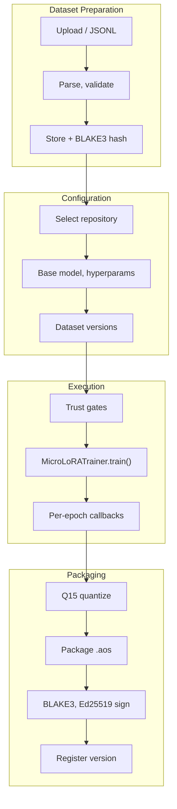

# TRAINING

LoRA adapter training. Source: `crates/adapteros-lora-worker/`, `crates/adapteros-server-api/src/handlers/training.rs`, `crates/adapteros-cli/src/commands/train*.rs`.

---

## Flow



---

## CLI

### Control-plane training

```bash
./aosctl train start <repo-id> --dataset-version-ids <id> --base-model-id <model>
./aosctl train status <job-id>
./aosctl train list --status running
```

**Source:** `crates/adapteros-cli/src/commands/train_cli.rs`. Calls `POST /v1/training/jobs`.

### Local training

```bash
./aosctl train local --data ./data.jsonl --output ./out --base-model /path/to/model
./aosctl train local --resume  # Resume from checkpoint
```

**Source:** `crates/adapteros-cli/src/commands/train.rs`. Uses `MicroLoRATrainer` from `crates/adapteros-lora-worker`.

### Docs training

```bash
./aosctl train-docs --docs-dir ./docs --dry-run
./aosctl train-docs --docs-dir ./docs --register --tenant-id default --base-model-id Llama-3.2-3B-Instruct-4bit
```

**Source:** `crates/adapteros-cli/src/commands/train_docs.rs`.

---

## Dataset

- JSONL: `{"input":"...","target":"..."}` per line
- JSON, plain text supported
- Schema: `crates/adapteros-types/training_example_schema.json`
- Types: `TrainingExample::Sft`, `TrainingExample::Preference` (DPO)

---

## Backends

MLX (primary), CoreML/ANE, Metal. Auto-selected by capability. See [MLX_GUIDE.md](MLX_GUIDE.md).

---

## Determinism

- HKDF-seeded via `derive_seed`
- Q15 denominator: 32767.0
- See [DETERMINISM.md](DETERMINISM.md)
