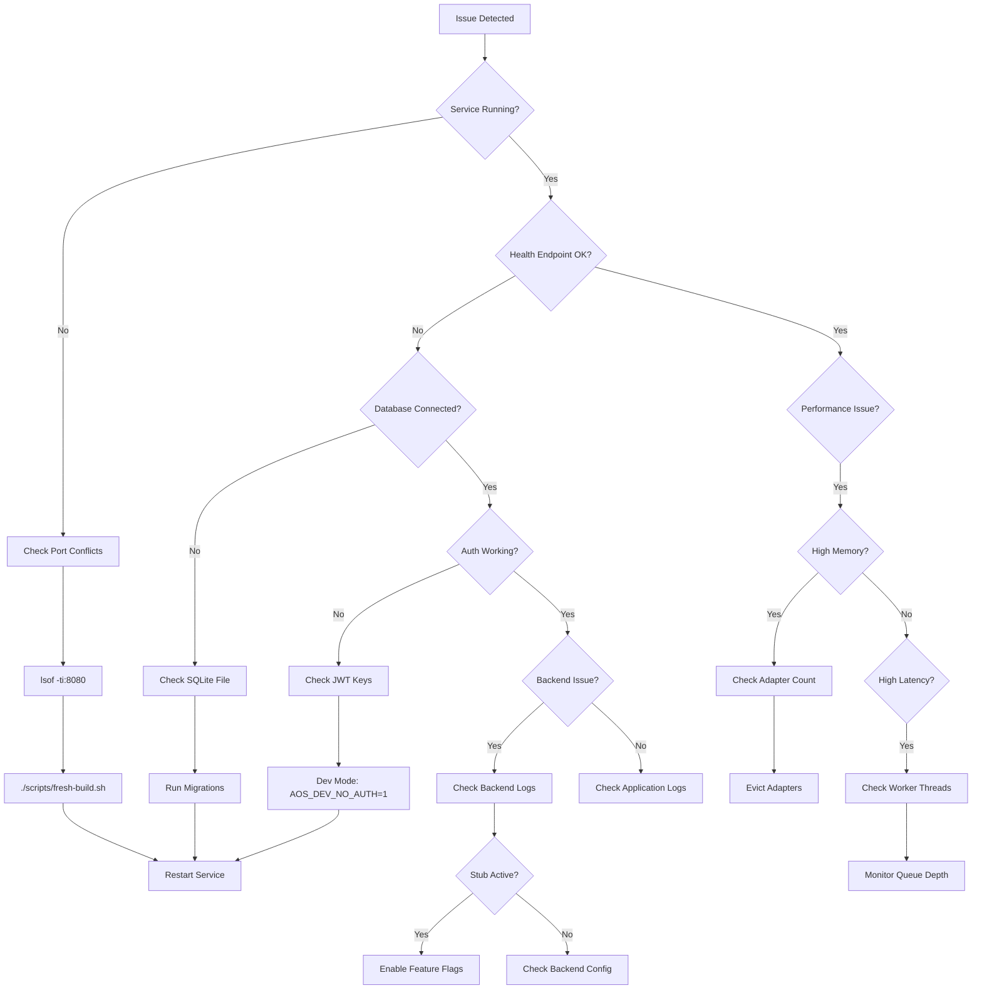
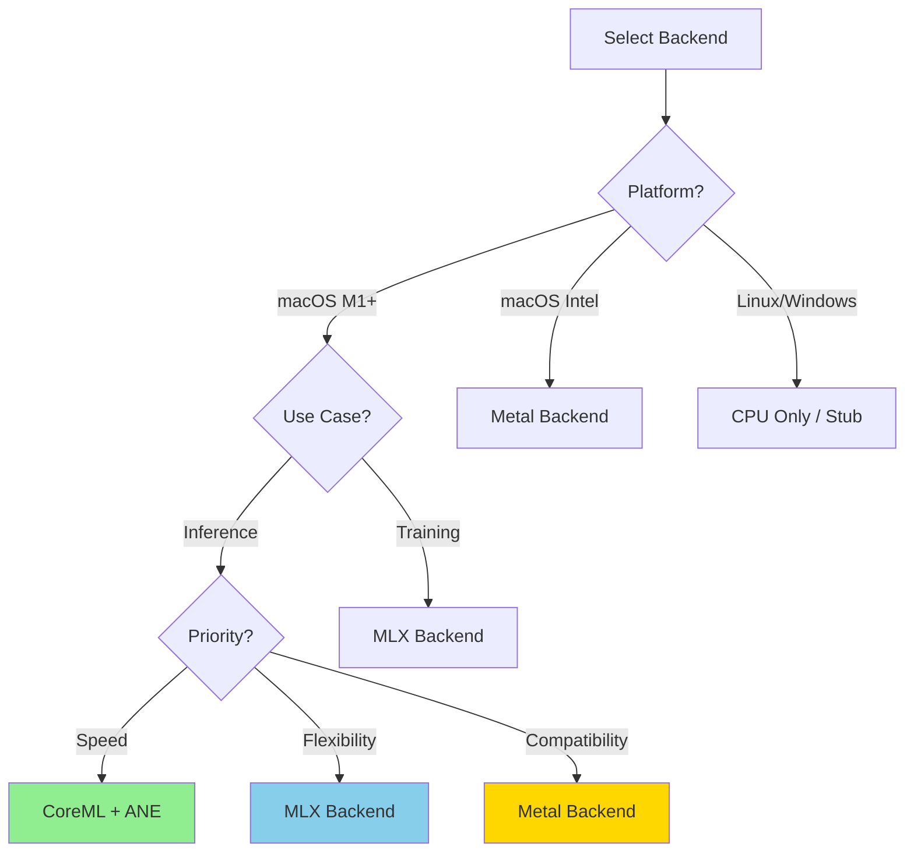

# adapterOS Troubleshooting Guide

**Comprehensive troubleshooting guide for common adapterOS deployment, configuration, and runtime issues.**

**Last Updated:** 2025-12-11
**Version:** 2.0
**Maintained By:** adapterOS Support Team

---

## Table of Contents

- [Quick Diagnostics](#quick-diagnostics)
- [Common Issues and Solutions](#common-issues-and-solutions)
- [Build Issues](#build-issues)
- [Runtime Issues](#runtime-issues)
- [Database Issues](#database-issues)
- [Network and Port Issues](#network-and-port-issues)
- [Backend-Specific Issues](#backend-specific-issues)
- [Getting Help](#getting-help)

---

## Quick Diagnostics

### Diagnostic Flowchart



### System Health Check

Run this first when investigating any issue:

```bash
# Check if service is running
ps aux | grep adapteros-server

# Check health endpoints (canonical paths; no /api prefix)
curl -f http://localhost:8080/healthz && echo "✓ Health OK" || echo "✗ Health FAIL"
curl -f http://localhost:8080/readyz && echo "✓ Ready OK" || echo "✗ Ready FAIL"

# Check recent logs (macOS/Linux)
tail -20 var/logs/backend.log 2>/dev/null || journalctl -u adapteros-server -n 20

# Check system resources
df -h var/
free -h 2>/dev/null || vm_stat  # macOS uses vm_stat

# Check database connectivity (SQLite)
sqlite3 var/aos-cp.sqlite3 "SELECT 1;" && echo "✓ DB OK" || echo "✗ DB FAIL"

# Check latest UI/client-side errors (includes UI panics)
sqlite3 var/aos-cp.sqlite3 \
  "SELECT created_at,error_type,code,page,message FROM client_errors ORDER BY created_at DESC LIMIT 10;"
```

### Log Analysis Commands

```bash
# Show last 50 lines with timestamps
tail -50 var/logs/backend.log | grep -E '^\d{4}-\d{2}-\d{2}'

# Search for errors in last hour
grep "ERROR" var/logs/backend.log | tail -20

# Count errors by type
grep "ERROR" var/logs/backend.log | cut -d' ' -f4- | sort | uniq -c | sort -nr

# Show memory-related warnings
grep -i "memory\|eviction\|headroom" var/logs/backend.log | tail -10

# Check for stub warnings (indicating missing features)
grep -i "stub\|fallback\|mock" var/logs/backend.log | tail -10
```

Structured UI/client errors are not in flat log files; they are stored in `var/aos-cp.sqlite3` (`client_errors`) and surfaced in the UI at `/errors`.

---

## Common Issues and Solutions

### "Dev Bypass" Button Not Visible

**Symptoms:**
- Login screen doesn't show dev bypass option
- Only username/password fields visible

**Cause:**
- Server not running in development mode
- `AOS_DEV_NO_AUTH` not set

**Solution:**

```bash
# Check if dev mode is enabled
grep "AOS_DEV_NO_AUTH" .env .env.local

# Enable dev bypass
echo "AOS_DEV_NO_AUTH=1" >> .env.local

# Restart server
AOS_DEV_NO_AUTH=1 ./start up
```

### Training Takes Too Long

**Symptoms:**
- Training job stuck at low percentage
- Estimated time keeps increasing
- No progress for several minutes

**Diagnosis:**

```bash
# Check training job status
curl -s http://localhost:8080/v1/training/jobs | jq '.[] | {id, status, progress}'

# Check system resources
top -l 1 | grep CPU  # macOS
top -bn1 | grep Cpu  # Linux

# Check if stub backend is active
grep "stub\|fallback" var/logs/backend.log | grep -i "mlx\|metal\|coreml"
```

**Solutions:**

1. **Use smaller file:**
   ```bash
   # Check file size
   ls -lh training/dataset.jsonl

   # Reduce to first 100 lines
   head -100 training/dataset.jsonl > training/dataset_small.jsonl
   ```

2. **Reduce epochs:**
   - In UI: Change epochs from 3 to 1
   - In config: Set `num_epochs = 1`

3. **Enable GPU acceleration:**
   ```bash
   # Check if MLX is enabled
   cargo tree -p adapteros-lora-worker -f "{p} {f}" | grep mlx

   # Rebuild with MLX (macOS only)
   cargo build --release --features mlx-backend
   ```

### Adapter Won't Load

**Symptoms:**
- Load button doesn't change status
- Status remains "Unloaded" or "Cold"
- "Out of memory" or "Eviction required" errors

**Diagnosis:**

```bash
# Check system memory
free -h 2>/dev/null || vm_stat | grep "Pages free"

# Check adapter count
curl -s http://localhost:8080/v1/metrics/system | jq '.adapters.loaded_count'

# Check adapter file integrity
./aosctl adapter inspect var/adapters/my_adapter.aos
```

**Solutions:**

1. **Free up memory:**
   ```bash
   # Unload unused adapters via UI or API
   curl -X POST http://localhost:8080/v1/adapters/{adapter_id}/unload
   ```

2. **Check file corruption:**
   ```bash
   # Re-upload adapter if corrupted
   # Verify file exists
   ls -lh var/adapters/
   ```

3. **Restart system:**
   ```bash
   ./start up  # Restarts with clean state
   ```

### No Difference in Compare Mode

**Symptoms:**
- Base model and adapter responses are identical
- Adapter doesn't seem to affect output
- Expected style/terminology missing

**Cause:**
- Prompt not related to training data
- Adapter not actually loaded
- Training data too small/generic

**Solutions:**

1. **Verify adapter is loaded:**
   ```bash
   curl -s http://localhost:8080/v1/adapters | jq '.[] | {id, status, name}'
   ```

2. **Use related prompts:**
   - If trained on Python code, ask Python-specific questions
   - Use terminology from your training file
   - Ask for code examples similar to training data

3. **Retrain with better data:**
   - Use larger file (100+ lines)
   - Use domain-specific content
   - Increase epochs to 3-5

### Permission Denied Errors

**Symptoms:**
- "403 Forbidden" on API calls
- "Insufficient permissions" errors
- Tenant isolation violations

**Diagnosis:**

```bash
# Check authentication
curl -v http://localhost:8080/v1/adapters

# Verify dev bypass is active
grep "Dev bypass" var/logs/backend.log | tail -5
```

**Solutions:**

1. **Use dev bypass login:**
   - Click "Dev Bypass (No Auth)" button in UI
   - Or set `AOS_DEV_NO_AUTH=1` and restart

2. **Check JWT token:**
   ```bash
   # If using token-based auth
   echo $TOKEN | cut -d'.' -f2 | base64 -d 2>/dev/null | jq .
   ```

---

## Build Issues

### Port Binding Conflicts

**Symptoms:**
- "Address already in use" error
- Server fails to start on port 8080 or 3200
- `./start up` or `trunk serve` fails

**Diagnosis:**

```bash
# Check what's using port 8080
lsof -ti:8080
lsof -ti:3200

# See process details
lsof -i:8080
```

**Solution:**

```bash
# Quick fix: Use fresh-build cleanup
./scripts/fresh-build.sh  # Stops services, cleans ports

# Manual cleanup
lsof -ti:8080 | xargs kill -9
lsof -ti:3200 | xargs kill -9

# Or change ports in config
export AOS_SERVER_PORT=8081
export AOS_UI_PORT=3201
```

### Compilation Failures

**Symptoms:**
- `cargo build` fails
- Missing dependencies or features
- Linker errors

**Diagnosis:**

```bash
# Check Rust toolchain
rustc --version
cargo --version

# Check for nightly
cat rust-toolchain.toml

# Verify feature flags
cargo tree -p adapteros-lora-worker -f "{p} {f}"
```

**Solutions:**

1. **Clean and rebuild:**
   ```bash
   cargo clean
   cargo build --release
   ```

2. **Update toolchain:**
   ```bash
   rustup update nightly
   rustup default nightly  # If required by rust-toolchain.toml
   ```

3. **Fix feature flags:**
   ```bash
   # MLX backend (macOS only)
   cargo build --release --features mlx-backend

   # CoreML backend (macOS only)
   cargo build --release --features coreml-backend

   # Metal backend (macOS only)
   cargo build --release --features metal-backend
   ```

4. **Check SQLx migrations:**
   ```bash
   # Prepare offline mode
   ./scripts/sqlx_prepare.sh

   # Or use online mode
   export DATABASE_URL=sqlite:var/aos-cp.sqlite3
   cargo build
   ```

### Missing Metal Shaders

**Symptoms:**
- "Metal kernels not found" error
- Metal backend fails to initialize
- Shader compilation errors

**Solution (macOS only):**

```bash
# Build Metal shaders
cd metal && bash build.sh

# Verify metallib exists
ls -la crates/adapteros-lora-kernel-mtl/metal/kernels.metallib

# Check Metal support
system_profiler SPDisplaysDataType | grep Metal
```

### Migration Signature Errors

**Symptoms:**
- "Migration signature mismatch" error
- Database initialization fails
- SQLx prepare fails

**Diagnosis:**

```bash
# Check migration files
ls -la migrations/

# Verify signatures file
cat migrations/signatures.json | jq .
```

**Solution:**

```bash
# Regenerate signatures
rm migrations/signatures.json
cargo sqlx migrate run

# Or use fresh database
rm var/aos-cp.sqlite3
cargo sqlx migrate run
```

---

## Runtime Issues

### Validate Readiness/Health Probes

**Goal:** Confirm `/readyz` and `/healthz` return expected responses using curl output as evidence.

**Steps (dev mode example on :8080):**

```bash
export AOS_DEV_JWT_SECRET=devsecret
cargo run -p adapteros-server &
SERVER_PID=$!
sleep 3  # wait for boot

curl -i http://localhost:8080/readyz
curl -i http://localhost:8080/healthz

kill $SERVER_PID
```

**Expected curl transcript (no workers registered in dev):**

```
/readyz  503 {"ready":false,"checks":{"db":{"ok":true,"latency_ms":0},"worker":{"ok":false,"hint":"no workers registered","latency_ms":0},"models_seeded":{"ok":true,"latency_ms":0}}}
/healthz 200 {"schema_version":"1.0","status":"healthy","version":"0.1.0","models":null}
```

**Notes:**
- Ready will stay 503 until a worker registers; health remains 200 in this state.
- The canonical paths are `/readyz` and `/healthz` (no `/api/` prefix).

### Server Won't Start

**Symptoms:**
- Service fails to start
- No process visible in `ps`
- Immediate exit after launch

**Diagnosis:**

```bash
# Try running directly to see errors
cargo run --bin adapteros-server

# Check configuration
cat configs/aos.toml

# Verify environment
env | grep AOS_
```

**Common Solutions:**

1. **Configuration file issues:**
   ```bash
   # Validate TOML syntax (requires Python)
   python3 -c "import tomllib; tomllib.load(open('configs/aos.toml', 'rb'))"

   # Check for required fields
   grep -E "database_url|server_port" configs/aos.toml
   ```

2. **Database initialization:**
   ```bash
   # Create database directory
   mkdir -p var/

   # Run migrations
   cargo sqlx migrate run --database-url sqlite:var/aos-cp.sqlite3
   ```

3. **Permission issues:**
   ```bash
   # Check directory permissions
   ls -ld var/

   # Fix if needed
   chmod 755 var/
   ```

### Adapter Loading Failures

**Symptoms:**
- Server starts but adapters fail to load
- "Adapter corrupted" errors
- Missing adapter warnings in logs

**Diagnosis:**

```bash
# Check adapter directory
ls -la var/adapters/

# Test adapter integrity
./aosctl adapter inspect var/adapters/*.aos

# Check loading logs
grep "adapter.*load\|adapter.*error" var/logs/backend.log | tail -20
```

**Solutions:**

1. **Fix corrupted adapters:**
   ```bash
   # Identify corrupted files
   for adapter in var/adapters/*.aos; do
     ./aosctl adapter inspect "$adapter" || echo "CORRUPTED: $adapter"
   done

   # Remove corrupted files
   rm var/adapters/corrupted_adapter.aos
   ```

2. **Re-import base model:**
   ```bash
   # Check if base model exists
   ls -la models/qwen2.5-7b-mlx/

   # Download if missing (example)
   # Follow model download instructions in docs/
   ```

### High Memory Usage

**Symptoms:**
- Memory usage > 85%
- Adapters fail to load
- System becomes slow/unresponsive
- OOM errors

**Diagnosis:**

```bash
# Check current memory usage
curl -s http://localhost:8080/v1/metrics/system | jq '.memory'

# Check system memory
free -h 2>/dev/null || vm_stat

# Check loaded adapters
curl -s http://localhost:8080/v1/adapters | jq '.[] | select(.status == "Loaded") | {id, name, memory_mb}'
```

**Solutions:**

1. **Immediate relief:**
   ```bash
   # Unload least-used adapters (via UI or API)
   curl -X POST http://localhost:8080/v1/adapters/{adapter_id}/unload
   ```

2. **Configuration changes:**
   ```toml
   # configs/aos.toml
   [memory]
   min_headroom_pct = 20  # Increase from default
   max_adapters_per_tenant = 5  # Reduce from default
   ```

3. **System-level:**
   ```bash
   # Check for memory leaks
   while true; do
     echo "$(date): $(curl -s http://localhost:8080/v1/metrics/system | jq '.memory.used_bytes')"
     sleep 60
   done

   # Restart if memory leak suspected
   ./start up
   ```

### High Latency

**Symptoms:**
- Inference requests take > 2 seconds
- p95 latency above target
- Slow UI responses

**Diagnosis:**

```bash
# Check latency metrics
curl -s http://localhost:8080/v1/metrics/system | jq '.inference.avg_latency_ms'

# Check queue depth
curl -s http://localhost:8080/v1/metrics/system | jq '.inference.queue_depth'

# Monitor requests
tail -f var/logs/backend.log | grep "inference_request"

# Check system load
uptime
top -l 1  # macOS
```

**Solutions:**

1. **Check for stub backends:**
   ```bash
   # Stub backends are much slower
   grep -i "stub\|fallback" var/logs/backend.log | tail -10

   # Enable real backend (macOS)
   cargo build --release --features mlx-backend
   ```

2. **Reduce adapter mixing:**
   ```toml
   # configs/aos.toml
   [router]
   k_sparse = 1  # Reduce from 3 for faster inference
   ```

3. **Check backend status:**
   ```bash
   # Ensure GPU/ANE is being used
   sudo powermetrics --samplers gpu_power -n 1 | grep "GPU"  # macOS
   ```

---

## Database Issues

### Connection Failures

**Symptoms:**
- "Database connection error"
- Service starts but API calls fail
- SQLite file locked

**Diagnosis:**

```bash
# Test database connectivity
sqlite3 var/aos-cp.sqlite3 "SELECT 1;"

# Check if file exists and is readable
ls -la var/aos-cp.sqlite3

# Check for locks
lsof var/aos-cp.sqlite3

# Check database schema version
sqlite3 var/aos-cp.sqlite3 "PRAGMA user_version;"
```

**Solutions:**

1. **File permissions:**
   ```bash
   # Fix permissions
   chmod 644 var/aos-cp.sqlite3
   chmod 755 var/
   ```

2. **Database locked:**
   ```bash
   # Check for multiple server instances
   ps aux | grep adapteros-server

   # Kill duplicate instances
   pkill -f adapteros-server

   # Restart single instance
   ./start up
   ```

3. **Corrupted database:**
   ```bash
   # Backup current database
   cp var/aos-cp.sqlite3 var/aos-cp.sqlite3.backup

   # Check integrity
   sqlite3 var/aos-cp.sqlite3 "PRAGMA integrity_check;"

   # If corrupted, restore from backup or recreate
   rm var/aos-cp.sqlite3
   cargo sqlx migrate run
   ```

### Migration Failures

**Symptoms:**
- "Migration failed" errors on startup
- Schema version mismatch
- Foreign key constraint errors

**Diagnosis:**

```bash
# Check current migration version
sqlite3 var/aos-cp.sqlite3 "SELECT * FROM _sqlx_migrations ORDER BY version DESC LIMIT 5;"

# List migration files
ls migrations/*.sql | tail -5

# Check for migration errors in logs
grep "migration" var/logs/backend.log | tail -20
```

**Solutions:**

1. **Run migrations manually:**
   ```bash
   # Run all pending migrations
   cargo sqlx migrate run --database-url sqlite:var/aos-cp.sqlite3

   # Or use CLI
   ./aosctl db migrate
   ```

2. **Reset database (dev only):**
   ```bash
   # WARNING: Deletes all data
   rm var/aos-cp.sqlite3
   cargo sqlx migrate run
   ./start up
   ```

3. **Fix foreign key issues:**
   ```bash
   # Check if foreign keys are enabled
   sqlite3 var/aos-cp.sqlite3 "PRAGMA foreign_keys;"

   # Should return 1 (enabled)
   # If not, check lib.rs opens with foreign_keys=true
   ```

---

## Network and Port Issues

### Port Conflicts

**Symptoms:**
- "Address already in use"
- Server fails to bind to port
- Systemd service fails

**Diagnosis:**

```bash
# Check what's using ports
lsof -i:8080
lsof -i:3200

# Check with netstat
netstat -an | grep LISTEN | grep -E '8080|3200'
```

**Solutions:**

```bash
# Method 1: Kill conflicting process
lsof -ti:8080 | xargs kill -9

# Method 2: Use fresh-build cleanup (comprehensive cleanup)
./scripts/fresh-build.sh

# Method 3: Change port
export AOS_SERVER_PORT=8081
./start up
```

### Connection Refused

**Symptoms:**
- Cannot connect to service
- "Connection refused" errors
- curl/browser can't reach server

**Diagnosis:**

```bash
# Check if service is listening
lsof -i:8080

# Test local connectivity
curl -v http://localhost:8080/healthz
curl -v http://127.0.0.1:8080/healthz

# Check firewall (macOS)
sudo pfctl -s rules | grep 8080
```

**Solutions:**

1. **Service not running:**
   ```bash
   # Start service
   ./start up

   # Verify it's listening
   lsof -i:8080
   ```

2. **Firewall blocking (macOS):**
   ```bash
   # Allow port through firewall
   sudo /usr/libexec/ApplicationFirewall/socketfilterfw --add $(which adapteros-server)
   sudo /usr/libexec/ApplicationFirewall/socketfilterfw --unblockapp $(which adapteros-server)
   ```

3. **Wrong bind address:**
   ```toml
   # configs/aos.toml
   [server]
   bind_address = "0.0.0.0"  # Allow external connections
   port = 8080
   ```

### CORS Issues (UI Development)

**Symptoms:**
- Browser console shows CORS errors
- UI can't reach API
- "Access-Control-Allow-Origin" errors

**Diagnosis:**

```bash
# Check if both servers are running
lsof -i:8080  # Backend
lsof -i:3200  # Frontend

# Test CORS headers
curl -v -H "Origin: http://localhost:3200" http://localhost:8080/healthz
```

**Solution:**

```bash
# Ensure both are running with correct config
# Terminal 1: Backend
AOS_DEV_NO_AUTH=1 ./start up

# Terminal 2: Frontend (Leptos dev server)
cd crates/adapteros-ui && trunk serve

# Or use canonical start script (serves static UI on 8080)
./start
```

---

## Backend-Specific Issues

### CoreML Backend Issues (macOS Only)

**Symptoms:**
- "CoreML not available" errors
- ANE not being utilized
- Slower than expected inference

**Diagnosis:**

```bash
# Check if running on macOS
uname -s  # Should show "Darwin"

# Check CoreML availability
system_profiler SPSoftwareDataType | grep "System Version"

# Check for ANE (Apple Neural Engine)
system_profiler SPiBridgeDataType 2>/dev/null | grep "Model Name"

# Check if CoreML backend is enabled
cargo tree -p adapteros-lora-kernel-coreml -f "{p} {f}"

# Look for CoreML logs
grep -i "coreml" var/logs/backend.log | tail -10
```

**Solutions:**

1. **Enable CoreML backend:**
   ```bash
   # Rebuild with CoreML support
   cargo build --release --features coreml-backend
   ```

2. **Verify CoreML models:**
   ```bash
   # Check for .mlmodel or .mlmodelc files
   find . -name "*.mlmodel*"
   ```

3. **Check macOS version:**
   - CoreML requires macOS 11.0+ (Big Sur)
   - ANE requires M1+ chips (not Intel Macs)

### MLX Backend Issues (macOS Only)

**Symptoms:**
- "MLX stub implementation active"
- No GPU acceleration
- Very slow inference
- Training takes hours instead of minutes

**Diagnosis:**

```bash
# Check if MLX feature is enabled
cargo tree -p adapteros-lora-worker -f "{p} {f}" | grep mlx

# Check for stub warnings in logs
grep -i "stub" var/logs/backend.log | grep -i "mlx"

# Check if MLX library is installed
brew list | grep mlx
pip3 list | grep mlx

# Verify Apple Silicon
uname -m  # Should show "arm64"
```

**Solutions:**

1. **Install MLX library:**
   ```bash
   # Install via pip
   pip3 install mlx

   # Or build from source
   git clone https://github.com/ml-explore/mlx.git
   cd mlx && mkdir build && cd build
   cmake .. && make -j
   sudo make install
   ```

2. **Enable MLX feature:**
   ```bash
   # Rebuild with MLX enabled
   cargo build --release --features mlx-backend

   # Set environment variable
   echo "AOS_BACKEND=mlx" >> .env.local
   ```

3. **Verify stub is NOT active:**
   ```bash
   # Should NOT see "stub" in version
   cargo run --bin adapteros-server 2>&1 | grep -i "mlx.*version"

   # Should see "MLX GPU backend initialized"
   grep "MLX.*initialized" var/logs/backend.log
   ```

### Metal Backend Issues (macOS Only)

**Symptoms:**
- Metal kernel compilation fails
- "Metal not available" errors
- GPU not being utilized

**Diagnosis:**

```bash
# Check Metal support
system_profiler SPDisplaysDataType | grep Metal

# Check if Metal backend is enabled
cargo tree -p adapteros-lora-kernel-mtl -f "{p} {f}"

# Check for compiled shaders
ls -la crates/adapteros-lora-kernel-mtl/metal/kernels.metallib

# Monitor GPU usage during inference
sudo powermetrics --samplers gpu_power -n 5
```

**Solutions:**

1. **Build Metal shaders:**
   ```bash
cd metal && bash build.sh

   # Verify compilation
   ls -lh crates/adapteros-lora-kernel-mtl/metal/kernels.metallib
   ```

2. **Enable Metal backend:**
   ```bash
   cargo build --release --features metal-backend
   ```

3. **Check GPU availability:**
   ```bash
   # List Metal devices
   system_profiler SPDisplaysDataType | grep -A10 "Metal"

   # On M-series Macs, you should see Metal Family 8 or 9
   ```

### Stub Detection and Resolution

**How to Identify Active Stubs:**

```bash
# Method 1: Check logs for stub warnings
grep -i "stub\|fallback\|mock" var/logs/backend.log | tail -20

# Method 2: Check feature flags
cargo tree --workspace -f "{p} {f}" | grep -E "mlx|metal|coreml"

# Method 3: Check runtime version strings
curl -s http://localhost:8080/v1/debug/backends | jq .
```

**Common Stub Indicators:**

| Log Message | Meaning | Solution |
|------------|---------|----------|
| "MLX stub implementation active" | MLX not compiled in | Add `--features mlx-backend` |
| "using software-based fallback" | No Secure Enclave | Expected on dev machines |
| "Mock KMS" in logs | Mock KMS backend active | Configure real KMS provider |
| "stub-0.1.0" in version | Stub backend | Rebuild with real backend |

**Production Readiness Checklist:**

Before deploying to production, verify NO stubs are active:

```bash
# Should return empty (no stub warnings)
grep -i "stub\|fallback" var/logs/backend.log | grep -v "development\|test"

# All features should show "enabled"
cargo tree --workspace -f "{p} {f}" | grep -E "mlx|metal|coreml"

# Health check should show real backends
curl http://localhost:8080/v1/metrics/system | jq '.backends'
```

### Backend Selection Strategy

**Decision Tree:**



**Recommendations:**

- **Apple Silicon (M1/M2/M3/M4):** Use MLX backend for best performance
- **macOS Intel:** Use Metal backend (limited performance)
- **Development/Testing:** Stubs are acceptable
- **Production:** Always use real backends, never stubs

---

## Getting Help

### When to Escalate

**Critical Issues (Escalate Immediately):**
- Service completely down in production
- Data loss or corruption
- Security breach
- Memory leak causing crashes

**High Priority Issues (Escalate within 1 hour):**
- Partial service degradation
- Authentication system failures
- Memory usage > 95%
- All training jobs failing

**Normal Issues (Escalate within 4 hours):**
- Performance degradation < 50%
- Single adapter loading failures
- UI rendering issues
- Configuration questions

### Diagnostic Information to Collect

When escalating issues, always include:

```bash
# System information
uname -a
sw_vers  # macOS only

# Memory info
free -h 2>/dev/null || vm_stat

# Disk space
df -h var/

# Service status
ps aux | grep adapteros-server

# Recent logs (last 100 lines)
tail -100 var/logs/backend.log

# Configuration (redact secrets)
grep -v "password\|secret\|key" configs/aos.toml

# Current metrics
curl -s http://localhost:8080/v1/metrics/system | jq .

# Database status
sqlite3 var/aos-cp.sqlite3 "PRAGMA integrity_check;"
sqlite3 var/aos-cp.sqlite3 "SELECT COUNT(*) FROM adapters;"

# Backend status
cargo tree --workspace -f "{p} {f}" | grep -E "mlx|metal|coreml"
grep -i "stub\|fallback" var/logs/backend.log | tail -20
```

### Quick Reference Commands

```bash
# Stop everything and restart fresh
./scripts/fresh-build.sh && ./start up

# Check system health
curl http://localhost:8080/healthz && echo OK

# View real-time logs
tail -f var/logs/backend.log

# Check what's using ports
lsof -i:8080 -i:3200

# Memory usage
curl -s http://localhost:8080/v1/metrics/system | jq '.memory'

# Loaded adapters
curl -s http://localhost:8080/v1/adapters | jq '.[] | {name, status}'

# Training jobs
curl -s http://localhost:8080/v1/training/jobs | jq '.[] | {id, status}'
```

### Common Error Codes

| Code | Meaning | Common Cause |
|------|---------|--------------|
| 401 | Unauthorized | Auth not bypassed in dev mode |
| 403 | Forbidden | Tenant isolation violation |
| 404 | Not Found | Adapter/model not loaded |
| 409 | Conflict | Adapter name already exists |
| 500 | Internal Server Error | Check logs for details |
| 501 | Not Implemented | Stub endpoint or disabled feature |
| 503 | Service Unavailable | Backend not ready |

### Support Channels

- **GitHub Issues:** https://github.com/mlnavigator/adapter-os/issues
- **Documentation:** `docs/`
- **In-App Help:** Navigate to `/help` in UI

---

**This troubleshooting guide should resolve most common adapterOS issues. For issues not covered here, please escalate with complete diagnostic information.**

**MLNavigator Inc © 2025**
