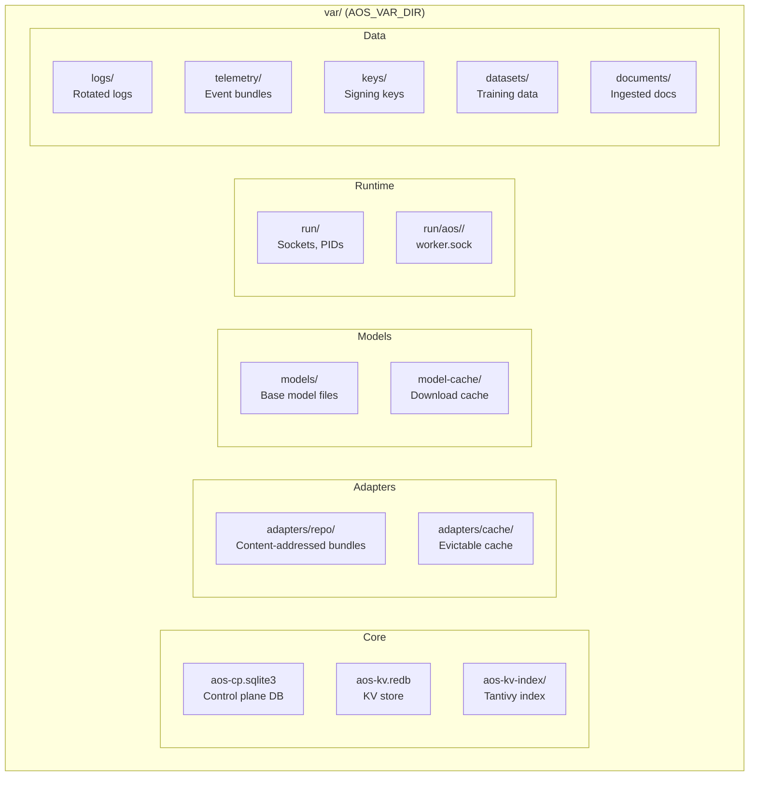

# VAR_STRUCTURE

Runtime data layout. Source: `adapteros-core/defaults.rs`, `path_security.rs`, `docs/VAR_STRUCTURE.md` (canonical spec).

---

## Override

```bash
AOS_VAR_DIR=/path/to/var
```

**Resolution:** `adapteros_core::resolve_var_dir()`, `rebase_var_path()`.

---

## Layout



---

## Path Mapping (config → resolved)

| Config key | Default | Resolved |
|------------|---------|----------|
| db.path | sqlite://var/aos-cp.sqlite3 | var/aos-cp.sqlite3 |
| paths.adapters_root | var/adapters | var/adapters |
| paths.datasets_root | var/datasets | var/datasets |
| paths.documents_root | var/documents | var/documents |
| db.kv_path | var/aos-kv.redb | var/aos-kv.redb |
| logging.log_dir | var/logs | var/logs |

**Worker socket:** `var/run/aos/<tenant_id>/worker.sock` (see `adapteros-core::defaults::DEFAULT_WORKER_SOCKET_PROD_ROOT`).

---

## Forbidden Paths

`path_security.rs` rejects: `/tmp`, `/private/tmp`, `/var/tmp`. Symlinks resolving to these are rejected.

---

## Cleanup

```bash
find ./crates -type d -name "var" -not -path "*/target/*" -exec rm -rf {} +
rm -f var/*-test.sqlite3* var/*_test.sqlite3*
rm -rf var/tmp
```
