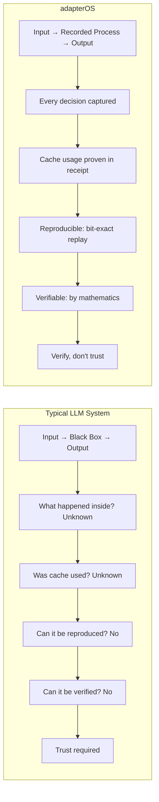
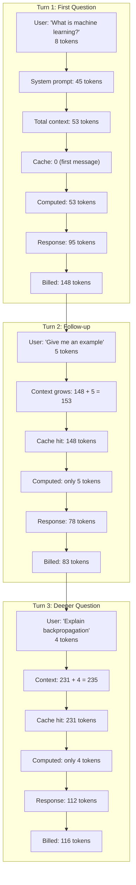
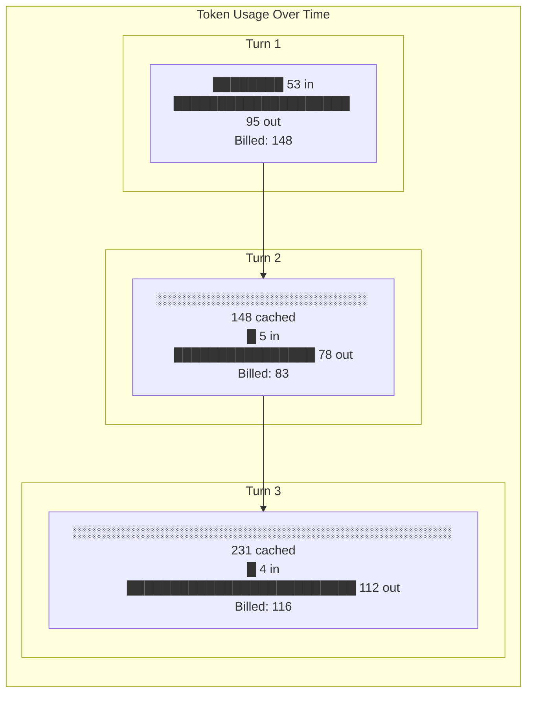
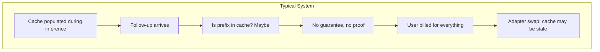
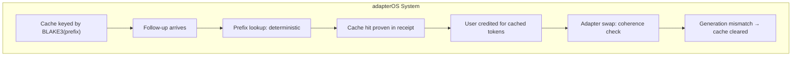
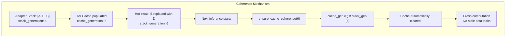
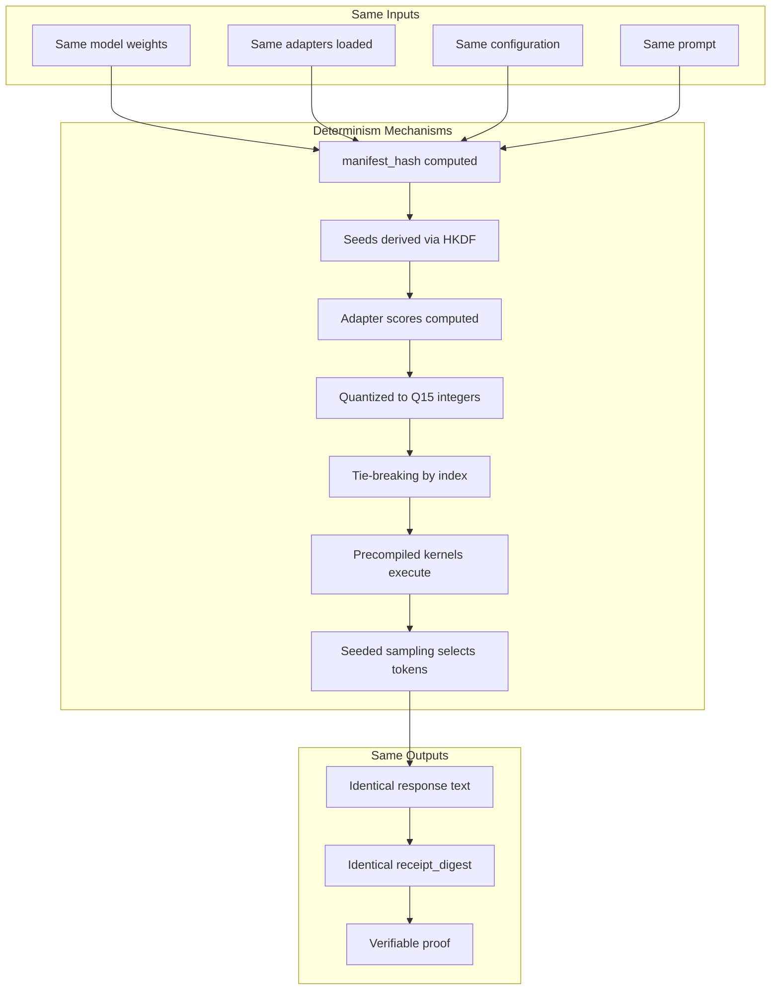
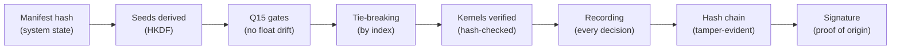
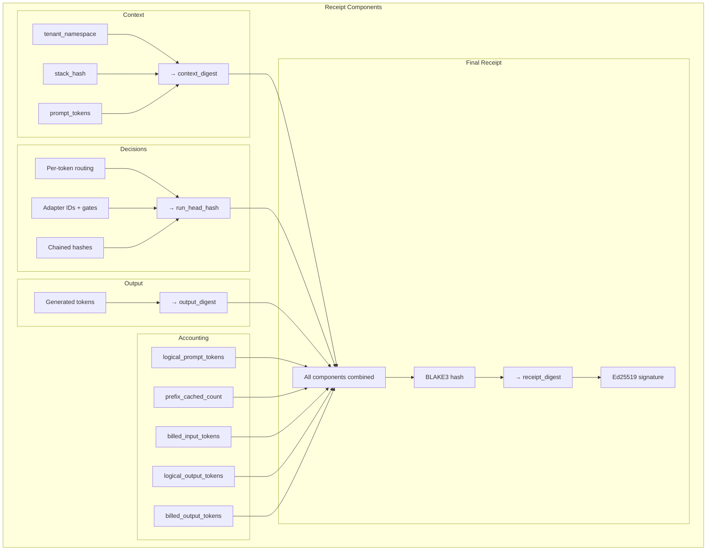
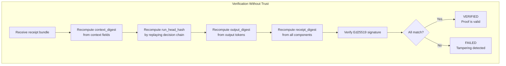

# Visual Guides: Understanding adapterOS

**Purpose:** Visual explanations of adapterOS concepts, comparisons with typical LLM systems, and token flow diagrams.

**Last Updated:** 2025-12-18

---

## Table of Contents

1. [Typical LLM vs adapterOS](#typical-llm-vs-adapteros)
2. [Token Flow Through a Conversation](#token-flow-through-a-conversation)
3. [KV Cache Comparison](#kv-cache-comparison)
4. [The Determinism Guarantee](#the-determinism-guarantee)
5. [Receipt Generation and Verification](#receipt-generation-and-verification)

---

## Typical LLM vs adapterOS

### The Fundamental Difference

### Feature Comparison

| Aspect | Typical LLM | adapterOS |
|--------|-------------|-----------|
| **Determinism** | Same input → different output | Same input → identical output |
| **Routing** | Hidden, variable | Quantized (Q15), recorded |
| **Cache usage** | May exist, unproven | Proven in receipt |
| **Token accounting** | Trust the count | Cryptographically verified |
| **Stop reason** | Often unstated | Enumerated, committed |
| **Receipt** | Log files (mutable) | Signed digest (immutable) |
| **Verification** | Requires provider access | Anyone, anywhere, offline |
| **Replay** | Approximate at best | Bit-exact reproduction |
| **Dispute resolution** | He-said-she-said | Mathematical proof |
| **Network dependency** | Required | Zero (UDS only) |

---

## Token Flow Through a Conversation

### Multi-Turn Conversation Example

### Token Accounting Summary

| Turn | Logical In | Cached | Computed | Output | Billed |
|------|------------|--------|----------|--------|--------|
| 1 | 53 | 0 | 53 | 95 | 148 |
| 2 | 153 | 148 | 5 | 78 | 83 |
| 3 | 235 | 231 | 4 | 112 | 116 |
| **Total** | — | **379** | **62** | **285** | **347** |

**Without cache credits:** 441 + 285 = 726 tokens billed  
**With adapterOS:** 347 tokens billed  
**Savings:** 52%

### Visual Token Timeline

---

## KV Cache Comparison

### Typical LLM KV Cache

### adapterOS KV Cache

### Cache Coherence on Adapter Hot-Swap

---

## The Determinism Guarantee

### How Identical Inputs Produce Identical Outputs

### The Determinism Chain

---

## Receipt Generation and Verification

### What Goes Into a Receipt

### Offline Verification

### Failure Reason Codes

| Code | Meaning |
|------|---------|
| `CONTEXT_MISMATCH` | Context fields don't hash to claimed digest |
| `TRACE_TAMPER` | Decision chain doesn't match run_head_hash |
| `OUTPUT_MISMATCH` | Output tokens don't match output_digest |
| `SIGNATURE_INVALID` | Ed25519 signature verification failed |
| `POLICY_MISMATCH` | Policy mask doesn't match expected |
| `BACKEND_MISMATCH` | Backend ID doesn't match expected |

---

## Related Documentation

- **[ARCHITECTURE.md](ARCHITECTURE.md)** - System architecture and components
- **[DETERMINISM.md](DETERMINISM.md)** - Determinism guarantees and mechanisms
- **[replay_spec.md](replay_spec.md)** - Replay harness and verification
- **[SECURITY.md](SECURITY.md)** - Security model and cryptographic proofs

---

MLNavigator Inc 2025-12-18.
