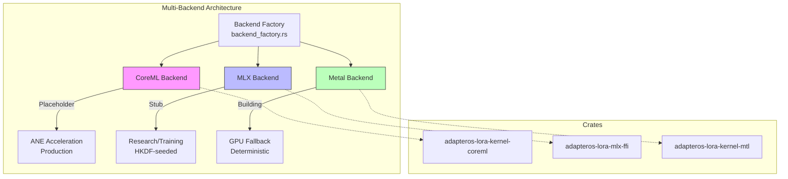

# AdapterOS Architecture

**Quick Navigation**:
- 📊 [Precision Diagrams](architecture/PRECISION-DIAGRAMS.md) - Code-verified architecture diagrams
- 📖 [Diagram Reference Guide](DIAGRAM_REFERENCE.md) - Quick lookup and navigation
- 🗄️ [Database Schema](database-schema/SCHEMA-DIAGRAM.md) - Complete ERD
- 🔄 [Workflow Diagrams](database-schema/workflows/) - Operational workflows
- 🔁 **[Flow Documentation](flows/README.md)** - Detailed operation flows (load → route → run → record → replay)
- 📐 **[Diagrams & Schemas](flows/DIAGRAMS.md)** - Lifecycle diagrams and telemetry schema

## System Overview

AdapterOS is a multi-tenant inference system with deterministic execution guarantees and evidence-grounded outputs.

**Status Legend**:
- ✅ **Implemented** - Production-ready, tested
- 🔧 **Planned** - Designed but not yet implemented
- ⚠️ **Partial** - Partially implemented, see notes

## Core Components

### 1. Inference Pipeline

```
Request → API → Worker → Router → Kernels → Response
                   ↓
                  RAG
```

### 2. Policy Engine

Enforces 23 policy packs covering:
- Network egress
- Determinism
- Evidence requirements
- Memory management
- Security isolation

### 3. Artifact Store

Content-addressed storage with:
- BLAKE3 hashing
- Ed25519 signatures
- SPDX SBOM validation

### 4. Registry

SQLite database tracking:
- Adapters
- Tenants
- Checkpoints
- ACLs

See [Database Schema](database-schema/README.md) for complete schema documentation and workflow animations.

### 5. Telemetry

Event system with:
- Canonical JSON (JCS)
- BLAKE3 event hashing
- Merkle-tree bundle signing
- Replay for determinism
- System metrics collection
- Policy violation tracking

## Data Flow

1. **Request arrives** via UDS socket
2. **Policy check** validates tenant and requirements
3. **Evidence retrieval** if required
4. **Router selects** K adapters with Q15 gates
5. **Kernels execute** fused attention + MLP
6. **Policy validates** output (units, confidence)
7. **Response emitted** with trace
8. **Telemetry logged** with sampling

## Isolation Model

- Process per tenant (unique UID/GID)
- Capability-scoped filesystem
- UDS-only communication
- No shared memory
- PF-enforced network isolation

## Determinism Guarantees

- Precompiled Metal kernels
- HKDF seed derivation
- Canonical JSON serialization
- Deterministic retrieval ordering
- Fixed compiler flags

## Security Boundaries

1. **Network**: Zero egress, UDS only
2. **Filesystem**: Cap-std handles
3. **Process**: Per-tenant isolation
4. **Keys**: Secure Enclave (macOS)
5. **Artifacts**: Signature verification

## Performance Optimizations

- Fused kernels (attention + MLP + LoRA)
- Triple-buffered Metal command queues
- Packed SoA adapter layout
- Q15 quantized routing
- KV cache slab allocator
- Real-time system monitoring
- Policy-driven resource management

---

## Multi-Backend Architecture

AdapterOS supports multiple inference backends with a unified `FusedKernels` trait interface.



**Backend Status:**

| Backend | Status | Determinism | Use Case | Crate |
|---------|--------|-------------|----------|-------|
| **CoreML** | ✅ Production | Guaranteed (ANE) | ANE acceleration, production | `adapteros-lora-kernel-coreml` |
| **MLX** | ✅ Production | HKDF-seeded | Production inference, training | `adapteros-lora-mlx-ffi` |
| **Metal** | ✅ Production | Guaranteed | Fallback, deterministic kernels | `adapteros-lora-kernel-mtl` |

**Selection Strategy:** CoreML-first (ANE production), MLX-active (production), Metal-fallback (deterministic)

**Status:**
- CoreML: Fully implemented and operational with ANE acceleration
- MLX: Fully implemented and production-ready with enterprise resilience
- Metal: Production-ready with deterministic GPU kernels

---

## Detailed Flow Documentation

For step-by-step technical references of key operations, see:

- **[Load Flow](flows/LOAD.md)** - Adapter loading and state initialization (✅ Implemented)
- **[Route Flow](flows/ROUTE.md)** - K-sparse adapter selection via Q15 gates (✅ Implemented)
- **[Run Flow](flows/RUN.md)** - Deterministic execution and inference (✅ Implemented)
- **[Record Flow](flows/RECORD.md)** - Telemetry event capture and bundle signing (✅ Implemented)
- **[Replay Flow](flows/REPLAY.md)** - Event log replay and divergence detection (🔧 Planned)

Each flow document includes:
- Mermaid.js diagrams
- Crate and module references
- Type signatures and state transitions
- Telemetry event examples
- Error handling patterns
- Testing coverage
- Reality vs Plan status

---

## Reality vs Plan: System-Wide Status

### ✅ Fully Implemented

| Feature | Status | Location |
|---------|--------|----------|
| **Load Flow** | ✅ Implemented | [flows/load.md](flows/LOAD.md) |
| Adapter lifecycle state machine | ✅ Implemented | `adapteros-lora-lifecycle` |
| Memory pressure monitoring | ✅ Implemented | UMA stats, tiered eviction |
| Hash verification (CPU + GPU) | ✅ Implemented | BLAKE3 fingerprinting |
| Heartbeat recovery | ✅ Implemented | 5-min timeout auto-reset |
| **Route Flow** | ✅ Implemented | [flows/route.md](flows/ROUTE.md) |
| K-sparse routing | ✅ Implemented | Default K=3 |
| Q15 quantization | ✅ Implemented | Deterministic scores |
| HKDF tie-breaking | ✅ Implemented | Seeded RNG |
| Feature extraction | ✅ Implemented | 5 base + 3 MPLoRA features |
| Framework/path routing | ✅ Implemented | React, Django, directory scoping |
| **Run Flow** | ✅ Implemented | [flows/run.md](flows/RUN.md) |
| Serial task execution | ✅ Implemented | FIFO queue, no concurrency |
| HKDF seed derivation | ✅ Implemented | 8+ domain labels |
| Global tick ledger | ✅ Implemented | Atomic tick assignment |
| Merkle chain | ✅ Implemented | Tick entries hash-chained |
| Multi-agent barrier | ✅ Implemented | CAS + Notify, dead agent handling |
| Sampling determinism | ✅ Implemented | ChaCha20Rng |
| Cross-host consistency check | ✅ Implemented | Hash comparison, divergence detection |
| **Record Flow** | ✅ Implemented | [flows/record.md](flows/RECORD.md) |
| Canonical JSON (JCS) | ✅ Implemented | Deterministic serialization |
| BLAKE3 event hashing | ✅ Implemented | Per-event hash |
| Merkle tree bundles | ✅ Implemented | Binary tree with root hash |
| Ed25519 bundle signing | ✅ Implemented | Persistent keypair |
| Background emission thread | ✅ Implemented | Non-blocking channel |
| Bundle store (SQLite index) | ✅ Implemented | Queryable metadata |
| Retention policies | ✅ Implemented | Days/count/disk-based |
| Garbage collection | ✅ Implemented | Automatic cleanup |
| UDS metrics export | ✅ Implemented | Prometheus-compatible |
| **Database & Registry** | ✅ Implemented | - |
| 80 signed migrations | ✅ Implemented | Ed25519 signatures |
| Adapter pinning with TTL | ✅ Implemented | Delete protection, auto-expiry |
| RBAC (5 roles, 40 permissions) | ✅ Implemented | Admin, Operator, SRE, Compliance, Viewer |
| Audit logging | ✅ Implemented | Immutable trail |
| **Policy Engine** | ✅ Implemented | - |
| 23 canonical policies | ✅ Implemented | Egress, determinism, router, evidence, etc. |
| Semantic naming taxonomy | ✅ Implemented | `tenant/domain/purpose/revision` |
| Evidence quality thresholds | ✅ Implemented | Min relevance/confidence scores |

### 🔧 Planned

| Feature | Status | Notes |
|---------|--------|-------|
| **Replay Flow** | 🔧 Planned | [flows/replay.md](flows/REPLAY.md) |
| Replay executor initialization | 🔧 Planned | Requires `replay_mode` in ExecutorConfig |
| Router decision replay | 🔧 Planned | Re-run routing, compare selected adapters |
| Inference replay | 🔧 Planned | Re-run inference, compare tokens |
| State transition replay | 🔧 Planned | Reapply transitions, compare final state |
| HTML divergence report | 🔧 Planned | Visual debugging UI |
| Cross-host consistency CLI | 🔧 Planned | `aosctl replay compare` |
| **Federation** | 🔧 Planned | - |
| Federation signing | 🔧 Planned | Ed25519 bundle signatures (reserved columns in migration 0035) |
| Cross-bundle chain verification | 🔧 Planned | Bundle-to-bundle Merkle linking |
| **Security** | 🔧 Planned | - |
| Secure Enclave keys | 🔧 Planned | macOS only, see PRD-06 |
| **Router** | 🔧 Planned | - |
| Calibration | 🔧 Planned | Weight tuning via labeled data |

### ⚠️ Partial

| Feature | Status | Notes |
|---------|--------|-------|
| Orthogonal constraints | ⚠️ Partial | Implemented but not tuned |
| Diversity penalty | ⚠️ Partial | Implemented but low weight (0.03) |
| Migration consolidation | ⚠️ Partial | Root `/migrations/` canonical, crate-local deprecated |

---

## Next Steps for Engineers

1. **To understand a specific flow**: Read the corresponding [flow documentation](flows/README.md)
2. **To debug determinism issues**: Review [Run Flow](flows/RUN.md) and [Replay Flow](flows/REPLAY.md)
3. **To add new telemetry events**: See [Record Flow § Event Structure](flows/record.md#event-structure)
4. **To implement replay**: See [Replay Flow § Planned Components](flows/replay.md#planned-components)
5. **To verify migrations**: Run `cargo test -p adapteros-db schema_consistency_tests`

---

## See Also

### Core Documentation
- [CLAUDE.md](../CLAUDE.md) - Developer guide and quick reference
- [ARCHITECTURE_INDEX.md](./ARCHITECTURE_INDEX.md) - Complete documentation index
- [ARCHITECTURE_PATTERNS.md](./ARCHITECTURE_PATTERNS.md) - Detailed architecture patterns
- [CONCEPTS.md](./CONCEPTS.md) - Mental model and glossary

### Backend Documentation
- [ADR_MULTI_BACKEND_STRATEGY.md](./ADR_MULTI_BACKEND_STRATEGY.md) - Backend selection rationale
- [COREML_INTEGRATION.md](./COREML_INTEGRATION.md) - CoreML setup and ANE optimization
- [ADDING_NEW_BACKEND.md](./ADDING_NEW_BACKEND.md) - Template for new backends
- [OBJECTIVE_CPP_FFI_PATTERNS.md](./OBJECTIVE_CPP_FFI_PATTERNS.md) - Rust/Swift/ObjC++ FFI patterns

### Execution and Lifecycle
- [DETERMINISTIC_EXECUTION.md](./DETERMINISTIC_EXECUTION.md) - HKDF, tick ledger, multi-agent coordination
- [LIFECYCLE.md](./LIFECYCLE.md) - Adapter state machine details
- [PINNING_TTL.md](./PINNING_TTL.md) - Adapter pinning and TTL enforcement

### Database and Schema
- [DATABASE_REFERENCE.md](./DATABASE_REFERENCE.md) - Schema reference
- [database-schema/README.md](./database-schema/README.md) - Database design overview
- [database-schema/SCHEMA-DIAGRAM.md](./database-schema/SCHEMA-DIAGRAM.md) - Complete ERD

### Diagrams and Workflows
- [architecture/PRECISION-DIAGRAMS.md](./architecture/PRECISION-DIAGRAMS.md) - Code-verified diagrams
- [DIAGRAM_REFERENCE.md](./DIAGRAM_REFERENCE.md) - Quick diagram lookup
- [database-schema/workflows/](./database-schema/workflows/) - Operational workflows

---

**Last Updated**: 2025-11-18
**Maintained by**: James KC Auchterlonie
