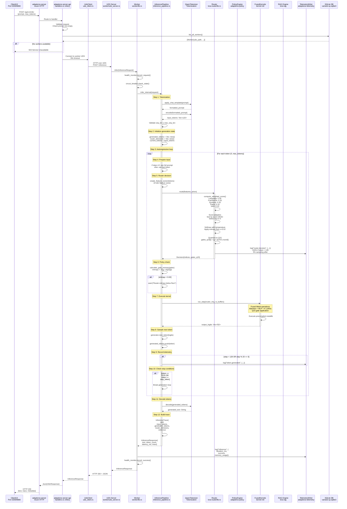
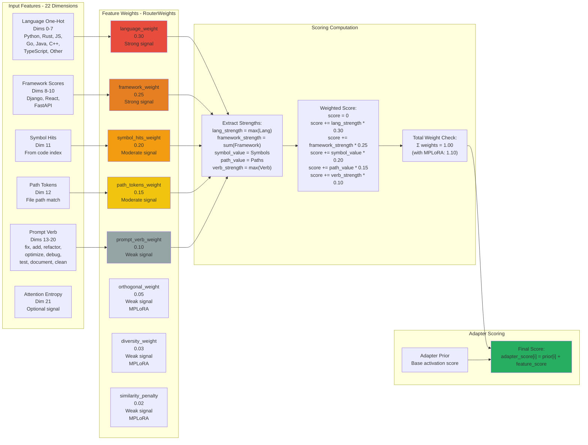
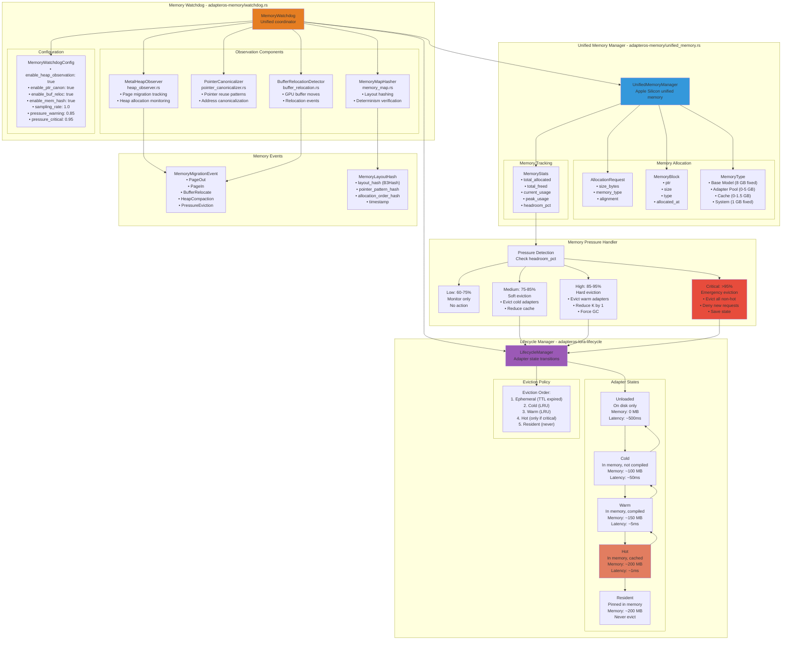
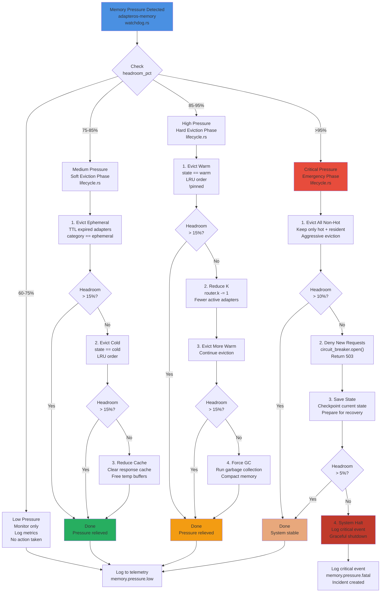

# AdapterOS Precision Architecture Diagrams

**Version:** 2.0.0  
**Last Updated:** 2025-01-14  
**Status:** Code-Verified

This document contains precision-engineered Mermaid diagrams that accurately reflect the AdapterOS codebase implementation. All component names, file paths, ports, and data flows have been verified against the actual code.

---

## Table of Contents

1. [System Architecture](#1-system-architecture)
2. [Inference Pipeline Flow](#2-inference-pipeline-flow)
3. [Router Scoring & Selection](#3-router-scoring--selection)
4. [Router Feature Weighting](#4-router-feature-weighting)
5. [Memory Management System](#5-memory-management-system)
6. [Memory Eviction Decision Tree](#6-memory-eviction-decision-tree)
7. [API Stack Architecture](#7-api-stack-architecture)
8. [Worker Architecture](#8-worker-architecture)

---

## 1. System Architecture

**Purpose**: Complete system architecture with exact component relationships, crate names, and file paths.

**Key Components**:
- Control Plane Server (Port 8080)
- UI Dev Server (Port 3200)
- SQLite Database (Primary)
- PostgreSQL (Optional Production)
- Worker Processes (Per-tenant, UID/GID isolated)
- Deterministic Executor (Global coordinator)

**Code References**:
- `crates/adapteros-server/src/main.rs` - Server entry point
- `crates/adapteros-lora-worker/src/lib.rs` - Worker implementation
- `crates/adapteros-db/src/lib.rs` - Database layer
- `configs/cp.toml` - Configuration (port 8080)

```mermaid
graph TB
    subgraph "Client Layer - Port 3200 Dev / 8080 API"
        UI["Web UI<br/>Vite + React<br/>Port 3200 dev"]
        CLI["aosctl CLI<br/>adapteros-cli<br/>Cargo bin"]
        APIClient["External API Clients<br/>HTTP/UDS"]
    end

    subgraph "Control Plane - adapteros-server Port 8080"
        Server["Axum HTTP Server<br/>adapteros-server/main.rs<br/>127.0.0.1:8080"]
        ServerAPI["API Routes & Handlers<br/>adapteros-server-api/routes.rs<br/>Middleware Stack"]
        
        subgraph "Authentication & Middleware"
            Auth["JWT Auth<br/>Ed25519 signing<br/>adapteros-crypto"]
            AuthMiddleware["auth_middleware<br/>Bearer token validation"]
            RateLimit["Rate Limiting<br/>Token bucket per tenant"]
        end
        
        subgraph "State Management"
            AppState["AppState<br/>Config<br/>Database<br/>Telemetry"]
            ConfigMgmt["Config<br/>Arc<RwLock<Config>><br/>Hot reload"]
        end
    end

    subgraph "Database Layer - SQLite Primary"
        SQLite[("SQLite Database<br/>adapteros-db/lib.rs<br/>var/aos-cp.sqlite3<br/>WAL mode")]
        PostgresOpt[("PostgreSQL Optional<br/>adapteros-db/postgres.rs<br/>Production backend")]
        
        subgraph "Database Modules"
            DBAdapters["adapteros-db/adapters.rs"]
            DBTenants["adapteros-db/tenants.rs"]
            DBUsers["adapteros-db/users.rs"]
            DBWorkers["adapteros-db/workers.rs"]
            DBRepositories["adapteros-db/repositories.rs"]
        end
    end

    subgraph "Worker Runtime - Per Tenant Process"
        WorkerProc["Worker Process<br/>adapteros-lora-worker/lib.rs<br/>UID/GID isolated"]
        
        subgraph "UDS Server"
            UDSServer["UDS HTTP Server<br/>uds_server.rs<br/>/v1/inference<br/>/v1/patch_proposal"]
        end
        
        subgraph "Inference Pipeline"
            InfPipeline["InferencePipeline<br/>inference_pipeline.rs<br/>Tokenizer + Generator<br/>Policy + Router + Kernels"]
            
            Router["Router<br/>adapteros-lora-router/lib.rs<br/>K-sparse selection<br/>Q15 gates"]
            
            Policy["PolicyEngine<br/>adapteros-policy<br/>22 policy packs"]
            
            Kernels["FusedKernels<br/>adapteros-lora-kernel-mtl<br/>Metal backend<br/>Precompiled metallib"]
            
            RAG["RAG Engine<br/>adapteros-lora-rag<br/>HNSW vector search<br/>Evidence retrieval"]
        end
        
        subgraph "Safety Mechanisms"
            CircuitBreaker["CircuitBreaker<br/>worker/circuit_breaker.rs<br/>Failure tracking"]
            HealthMonitor["HealthMonitor<br/>worker/health_monitor.rs<br/>Memory + CPU"]
            TimeoutWrapper["TimeoutWrapper<br/>worker/timeout_wrapper.rs<br/>Per-operation timeouts"]
            DeadlockDetector["DeadlockDetector<br/>worker/deadlock_detector.rs<br/>Lock monitoring"]
        end
        
        subgraph "Memory Management"
            MemoryWatchdog["MemoryWatchdog<br/>adapteros-memory/watchdog.rs<br/>Heap observer<br/>Pointer canonicalization"]
            Lifecycle["LifecycleManager<br/>adapteros-lora-lifecycle<br/>State transitions<br/>Eviction controller"]
            UnifiedMem["UnifiedMemoryManager<br/>adapteros-memory/unified_memory.rs<br/>Allocation<br/>Headroom tracking"]
        end
    end

    subgraph "Deterministic Execution - Global"
        DetExec["DeterministicExecutor<br/>adapteros-deterministic-exec<br/>HKDF seeding<br/>global_seed: [u8; 32]<br/>Fixed task ordering"]
    end

    subgraph "Code Intelligence"
        GitSys["GitSubsystem<br/>adapteros-git/subsystem.rs<br/>Repository scanning<br/>Commit tracking"]
        CodeGraph["CodeGraphBuilder<br/>adapteros-codegraph/lib.rs<br/>Tree-sitter parsing<br/>Symbol extraction"]
    end

    subgraph "Telemetry & Tracing"
        Telemetry["TelemetryWriter<br/>adapteros-telemetry/writer.rs<br/>Canonical JSON (JCS)<br/>BLAKE3 hashing<br/>Sampling: 100% first 128 tokens"]
        Trace["TraceBuilder<br/>adapteros-trace<br/>Audit trail<br/>Router decisions<br/>Evidence refs"]
        SystemMetrics["SystemMetrics<br/>adapteros-system-metrics<br/>CPU/Memory/GPU<br/>Health checks"]
    end

    subgraph "Artifact Management"
        Artifacts["ArtifactStore<br/>adapteros-artifacts/cas.rs<br/>Content-addressed<br/>Ed25519 signed<br/>SBOM required"]
        Registry["Registry<br/>adapteros-registry<br/>Adapter metadata<br/>Capability cards"]
    end

    %% Client connections
    UI --> Server
    CLI --> Server
    APIClient --> Server
    
    %% Server internal flow
    Server --> ServerAPI
    ServerAPI --> AuthMiddleware
    AuthMiddleware --> Auth
    Auth --> RateLimit
    RateLimit --> AppState
    AppState --> ConfigMgmt
    
    %% Database access
    Server --> SQLite
    Server -.-> PostgresOpt
    SQLite --> DBAdapters
    SQLite --> DBTenants
    SQLite --> DBUsers
    SQLite --> DBWorkers
    SQLite --> DBRepositories
    
    %% Server to Worker via UDS
    ServerAPI --> UDSServer
    UDSServer --> WorkerProc
    
    %% Worker internals
    WorkerProc --> InfPipeline
    InfPipeline --> Router
    InfPipeline --> Policy
    InfPipeline --> Kernels
    InfPipeline --> RAG
    
    %% Safety mechanisms
    WorkerProc --> CircuitBreaker
    WorkerProc --> HealthMonitor
    WorkerProc --> TimeoutWrapper
    WorkerProc --> DeadlockDetector
    
    %% Memory management
    WorkerProc --> MemoryWatchdog
    MemoryWatchdog --> Lifecycle
    MemoryWatchdog --> UnifiedMem
    
    %% Deterministic execution
    DetExec -.->|Coordinates| Router
    DetExec -.->|Coordinates| Policy
    DetExec -.->|Coordinates| Telemetry
    
    %% Code intelligence
    Server --> GitSys
    GitSys --> CodeGraph
    CodeGraph --> SQLite
    
    %% Telemetry flow
    Router --> Telemetry
    InfPipeline --> Telemetry
    WorkerProc --> Trace
    WorkerProc --> SystemMetrics
    Telemetry --> SQLite
    
    %% Artifacts and Registry
    WorkerProc --> Artifacts
    Router --> Registry
    Registry --> SQLite
    Artifacts --> SQLite

    style Server fill:#9B59B6
    style WorkerProc fill:#3498DB
    style SQLite fill:#E74C3C
    style Router fill:#E27D60
    style MemoryWatchdog fill:#E67E22
    style DetExec fill:#16A085
```

**Architecture Notes**:
- All worker processes communicate via Unix Domain Sockets (no TCP)
- Each tenant runs in an isolated process with unique UID/GID
- Deterministic executor coordinates all async operations with HKDF seeding
- SQLite with WAL mode is primary; PostgreSQL optional for production
- Memory watchdog monitors heap, pointers, and buffer relocations

---

## 2. Inference Pipeline Flow

**Purpose**: Complete inference request flow from API to worker response with exact method calls and line numbers.

**Code References**:
- `crates/adapteros-lora-worker/src/inference_pipeline.rs:155-280` - Main inference loop
- `crates/adapteros-server-api/src/handlers.rs:2561-2650` - API handler
- `crates/adapteros-lora-worker/src/uds_server.rs:82-119` - UDS server

**Key Steps**:
1. **Tokenization**: `apply_chat_template()` → `encode()`
2. **Validation**: Check `seq_len ≤ max_seq_len`
3. **Autoregressive Loop**: For each token (0..max_tokens)
4. **Feature Extraction**: `create_feature_vector()` → 22-dim vector
5. **Router Decision**: `route(features, priors)` → K-sparse selection
6. **Policy Check**: `calculate_gate_entropy()` → verify ≥ 0.02
7. **Kernel Execution**: `run_step(router_ring, io_buffers)` → Metal
8. **Token Sampling**: `next_token(logits)` → greedy/temperature
9. **Telemetry**: 100% first 128 tokens, 5% sampling after
10. **Trace Building**: Collect router decisions + evidence

**Performance Characteristics**:
- Latency budget: p95 < 24ms per token
- Router overhead: ≤ 8% of total time
- Telemetry sampling: 100% first 128 tokens, 5% after
- Timeout: 30s inference, 100ms router, 50ms policy

---

## 3. Router Scoring & Selection

**Purpose**: Detailed router algorithm showing exact scoring, softmax, entropy floor, and Q15 quantization.

**Code References**:
- `crates/adapteros-lora-router/src/lib.rs:285` - `route()` method
- `crates/adapteros-lora-router/src/lib.rs:254` - `compute_weighted_score()`
- `crates/adapteros-lora-router/src/lib.rs:372` - `compute_entropy()`

**Algorithm**:
1. **Feature Extraction**: 22-dimensional vector
2. **Weighted Scoring**: Language (0.30) + Framework (0.25) + Symbols (0.20) + Paths (0.15) + Verb (0.10)
3. **Adapter Scoring**: `score[i] = prior[i] + feature_score`
4. **Sorting**: Score DESC, then index (determinism)
5. **Top-K Selection**: Default K=3
6. **Softmax**: Temperature τ, max normalization
7. **Entropy Floor**: ε=0.02, `min_gate = ε / K`
8. **Renormalization**: `Σ gates = 1.0`
9. **Q15 Quantization**: `gates_q15[i] = round(gates[i] * 32767)`
10. **Telemetry Logging**: Conditional based on token count

```mermaid
flowchart TD
    Start["Router.route()<br/>adapteros-lora-router/lib.rs:285"]
    
    Start --> CreateFeatures["create_feature_vector(tokens)<br/>22-dimensional vector"]
    
    CreateFeatures --> FeatureLayout["Feature Vector Layout:<br/>[0..8] Language one-hot (8 dims)<br/>[8..11] Framework scores (3 dims)<br/>[11] Symbol hits (1 dim)<br/>[12] Path tokens (1 dim)<br/>[13..21] Prompt verb one-hot (8 dims)<br/>[21] Attention entropy (1 dim)"]
    
    FeatureLayout --> ComputeWeighted["compute_weighted_score(features)<br/>lib.rs:254"]
    
    ComputeWeighted --> WeightCalc["Weighted Components:<br/>• lang_strength = max(features[0..8])<br/>• score += lang * 0.30<br/>• framework_strength = sum(features[8..11])<br/>• score += framework * 0.25<br/>• score += features[11] * 0.20  // symbols<br/>• score += features[12] * 0.15  // paths<br/>• verb_strength = max(features[13..21])<br/>• score += verb * 0.10"]
    
    WeightCalc --> ScoreAdapters["Score Each Adapter:<br/>score[i] = prior[i] + feature_score<br/>lib.rs:290-297"]
    
    ScoreAdapters --> Sort["Sort by score DESC<br/>Then by index (determinism)<br/>lib.rs:300-304"]
    
    Sort --> TopK["Select top K adapters<br/>Default K=3<br/>lib.rs:307"]
    
    TopK --> Softmax["Softmax with temperature τ<br/>lib.rs:310-318<br/><br/>max_score = max(scores)<br/>exp_scores[i] = exp((s[i] - max) / τ)<br/>sum_exp = Σ exp_scores<br/>gates[i] = exp_scores[i] / sum_exp"]
    
    Softmax --> EntropyFloor["Apply Entropy Floor ε=0.02<br/>lib.rs:322-325<br/><br/>min_gate = ε / K<br/>gates[i] = max(gates[i], min_gate)"]
    
    EntropyFloor --> Renormalize["Renormalize gates<br/>lib.rs:328-331<br/><br/>sum_gates = Σ gates<br/>gates[i] /= sum_gates"]
    
    Renormalize --> Quantize["Quantize to Q15<br/>lib.rs:334-340<br/><br/>gates_q15[i] = round(gates[i] * 32767)<br/>gates_q15[i] = max(gates_q15[i], 0)"]
    
    Quantize --> Orthogonal{Orthogonal<br/>Constraints?<br/>lib.rs:345}
    
    Orthogonal -->|Enabled| ComputePenalty["compute_penalty(indices, gates)<br/>Diversity penalty<br/>Similarity check<br/>lib.rs:348"]
    
    ComputePenalty --> UpdateHistory["update_history(indices, gates)<br/>Track activation patterns<br/>lib.rs:360"]
    
    Orthogonal -->|Disabled| ComputeEntropy
    UpdateHistory --> ComputeEntropy
    
    ComputeEntropy["Compute Shannon Entropy<br/>lib.rs:372-378<br/><br/>entropy = -Σ(g * log2(g))"]
    
    ComputeEntropy --> LogDecision{Should Log?<br/>lib.rs:504}
    
    LogDecision -->|token ≤ 128| LogFull["Log Full Decision<br/>100% sampling<br/>lib.rs:508-519"]
    
    LogDecision -->|token > 128| Sample{Random < 0.05?}
    
    Sample -->|Yes| LogSampled["Log Decision<br/>5% sampling"]
    Sample -->|No| SkipLog["Skip logging"]
    
    LogFull --> ReturnDecision
    LogSampled --> ReturnDecision
    SkipLog --> ReturnDecision
    
    ReturnDecision["Return Decision<br/>lib.rs:368<br/>{indices: SmallVec<[u16; 8]>,<br/> gates_q15: SmallVec<[i16; 8]>}"]

    style Start fill:#4A90E2
    style WeightCalc fill:#E8A87C
    style Quantize fill:#F39C12
    style ReturnDecision fill:#E27D60
    style LogFull fill:#27AE60
    style LogSampled fill:#95A5A6
```

**Router Configuration**:
- K-sparse: 3 adapters (default)
- Temperature: τ = 1.0
- Entropy floor: ε = 0.02
- Quantization: Q15 (16-bit signed, range 0-32767)

---

## 4. Router Feature Weighting

**Purpose**: Breakdown of 22-dimensional feature vector and weighted scoring computation.

**Code References**:
- `crates/adapteros-lora-router/src/lib.rs:28-64` - `RouterWeights` struct
- `crates/adapteros-lora-router/src/features.rs` - Feature extraction

**Feature Weights (Default)**:
- **Language**: 0.30 (strong signal) - Programming language detection
- **Framework**: 0.25 (strong signal) - Django, React, FastAPI, etc.
- **Symbol Hits**: 0.20 (moderate) - Code index symbol matches
- **Path Tokens**: 0.15 (moderate) - File path relevance
- **Prompt Verb**: 0.10 (weak) - fix, add, refactor, optimize, etc.

**MPLoRA Extensions** (optional):
- **Orthogonal**: 0.05 (weak) - Diversity enforcement
- **Diversity**: 0.03 (weak) - Multi-path selection
- **Similarity Penalty**: 0.02 (weak) - Avoid similar adapters

**Calibration**:
Weights can be calibrated using `adapteros-lora-router/src/calibration.rs`:
- Load/save from JSON: `RouterWeights::load()` / `save()`
- Optimization methods: Grid search, gradient descent
- Validation metrics: Accuracy, F1 score, adapter diversity

---

## 5. Memory Management System

**Purpose**: Comprehensive memory management with watchdog, lifecycle, and unified memory manager.

**Code References**:
- `crates/adapteros-memory/src/watchdog.rs` - MemoryWatchdog
- `crates/adapteros-memory/src/unified_memory.rs` - UnifiedMemoryManager
- `crates/adapteros-lora-lifecycle/src/lib.rs` - LifecycleManager

**Components**:
- **MemoryWatchdog**: Coordinator with heap observer, pointer canonicalizer, buffer relocation detector
- **UnifiedMemoryManager**: Apple Silicon unified memory allocation
- **LifecycleManager**: Adapter state transitions (unloaded → cold → warm → hot → resident)

**Memory Layout (16 GB total)**:
- Base Model: 8 GB (fixed)
- System Overhead: 1 GB (fixed)
- Adapter Pool: 0-5 GB (dynamic)
- Cache Pool: 0-1.5 GB (dynamic)
- Headroom: 0.5 GB (minimum 15%)

**Determinism Features**:
- Pointer canonicalization ensures consistent addressing across runs
- Memory layout hashing (BLAKE3) for replay verification
- Buffer relocation detection logs GPU memory moves
- Page migration tracking for unified memory diagnostics

---

## 6. Memory Eviction Decision Tree

**Purpose**: Detailed eviction algorithm triggered by memory pressure levels.

**Code References**:
- `crates/adapteros-memory/src/watchdog.rs` - Pressure detection
- `crates/adapteros-lora-lifecycle/src/lib.rs` - Eviction execution

**Pressure Levels**:
- **Low (60-75%)**: Monitor only
- **Medium (75-85%)**: Soft eviction
- **High (85-95%)**: Hard eviction
- **Critical (>95%)**: Emergency eviction

**Eviction Order**:
1. Ephemeral adapters (TTL expired)
2. Cold adapters (LRU)
3. Warm adapters (LRU)
4. Hot adapters (only if critical)
5. Resident adapters (never evicted)

**Telemetry Events**:
- `memory.pressure.low` - Headroom 60-75%
- `memory.pressure.medium` - Headroom 75-85%, soft eviction triggered
- `memory.pressure.high` - Headroom 85-95%, hard eviction triggered
- `memory.pressure.critical` - Headroom >95%, emergency mode
- `memory.pressure.fatal` - System halt, manual intervention required

---

## 7. API Stack Architecture

**Purpose**: Complete API routing, middleware, and handler organization.

**Code References**:
- `crates/adapteros-server/src/main.rs:430-455` - Server startup
- `crates/adapteros-server-api/src/routes.rs:173-535` - Route definitions
- `crates/adapteros-server-api/src/middleware.rs:1-59` - Auth middleware
- `crates/adapteros-server-api/src/handlers.rs` - Handler implementations

**API Structure**:
- **Public Routes**: No auth (health, ready, login, meta)
- **Metrics Route**: Custom bearer token auth (not JWT)
- **Protected Routes**: JWT auth with role-based access control
- **Swagger UI**: Interactive API docs at `/swagger-ui`

**Middleware Layers**:
1. CORS (permissive in dev)
2. TraceLayer (HTTP request tracing)
3. auth_middleware (JWT verification)
4. Role checks (admin, operator, sre, compliance, auditor, viewer)

```mermaid
graph TB
    subgraph "HTTP Server - adapteros-server/main.rs"
        Listener["TcpListener::bind<br/>127.0.0.1:8080<br/>Axum serve"]
        
        Shutdown["shutdown_signal()<br/>• Ctrl+C handler<br/>• SIGTERM handler<br/>• Graceful shutdown"]
    end

    subgraph "Router Construction - server-api/routes.rs"
        RouterBuild["routes::build(state)<br/>Construct Axum router"]
        
        subgraph "Public Routes - No Auth"
            Public["Router::new()<br/>• GET /healthz → health()<br/>• GET /readyz → ready()<br/>• POST /v1/auth/login → auth_login()<br/>• GET /v1/meta → meta()"]
        end
        
        subgraph "Metrics Route - Custom Auth"
            MetricsRoute["Router::new()<br/>• GET /metrics → metrics_handler()<br/>Bearer token auth<br/>NOT JWT"]
        end
        
        subgraph "Protected Routes - JWT Required"
            Protected["Router::new()<br/>.layer(middleware::from_fn_with_state())"]
            
            AuthRoutes["Authentication:<br/>• POST /v1/auth/logout<br/>• GET /v1/auth/me"]
            
            TenantRoutes["Tenants:<br/>• GET/POST /v1/tenants<br/>• PUT /v1/tenants/:id<br/>• POST /v1/tenants/:id/pause<br/>• POST /v1/tenants/:id/archive<br/>• POST /v1/tenants/:id/policies<br/>• POST /v1/tenants/:id/adapters<br/>• GET /v1/tenants/:id/usage"]
            
            NodeRoutes["Nodes:<br/>• GET/POST /v1/nodes<br/>• POST /v1/nodes/:id/ping<br/>• POST /v1/nodes/:id/offline<br/>• DELETE /v1/nodes/:id"]
            
            AdapterRoutes["Adapters:<br/>• GET /v1/adapters<br/>• GET /v1/adapters/:id<br/>• POST /v1/adapters/register<br/>• DELETE /v1/adapters/:id<br/>• GET /v1/adapters/:id/activations"]
            
            InferenceRoutes["Inference:<br/>• POST /v1/infer<br/>• POST /v1/patch/propose<br/>• POST /v1/patch/apply"]
            
            RepoRoutes["Repositories:<br/>• GET /v1/repositories<br/>• POST /v1/repositories/register<br/>• POST /v1/repositories/:id/scan<br/>• GET /v1/repositories/:id/status"]
            
            GitRoutes["Git Integration:<br/>• GET /v1/git/status<br/>• POST /v1/git/sessions/start<br/>• POST /v1/git/sessions/:id/end<br/>• GET /v1/git/branches"]
            
            TrainingRoutes["Training:<br/>• GET /v1/training/jobs<br/>• GET /v1/training/jobs/:id<br/>• POST /v1/training/start<br/>• POST /v1/training/:id/cancel<br/>• GET /v1/training/:id/logs"]
            
            StreamRoutes["SSE Streams:<br/>• GET /v1/streams/training<br/>• GET /v1/streams/discovery<br/>• GET /v1/streams/contacts<br/>• GET /v1/stream/metrics<br/>• GET /v1/stream/telemetry<br/>• GET /v1/stream/adapters<br/>• GET /v1/streams/file-changes"]
            
            DomainRoutes["Domain Adapters:<br/>• POST /v1/domain-adapters<br/>• GET /v1/domain-adapters/:id<br/>• DELETE /v1/domain-adapters/:id<br/>• POST /v1/domain-adapters/:id/load<br/>• POST /v1/domain-adapters/:id/unload<br/>• POST /v1/domain-adapters/:id/test<br/>• POST /v1/domain-adapters/:id/execute"]
        end
        
        subgraph "Swagger UI"
            Swagger["SwaggerUi::new(/swagger-ui)<br/>.url(/api-docs/openapi.json)"]
        end
        
        subgraph "Tower Middleware Layers"
            CORS["CorsLayer::permissive()<br/>Allow all origins in dev"]
            Trace["TraceLayer::new_for_http()<br/>HTTP request tracing"]
        end
    end

    subgraph "Middleware - server-api/middleware.rs"
        AuthMW["auth_middleware(req, next)<br/>middleware.rs:1-59"]
        
        AuthFlow["1. Extract Authorization header<br/>2. Parse Bearer token<br/>3. Verify JWT signature<br/>4. Decode Claims{user_id, role}<br/>5. Check token expiry<br/>6. Inject Extension(claims)<br/>7. Call next.run(req)"]
        
        RoleCheck["require_role(role)<br/>require_any_role(roles)<br/>Check claims.role"]
    end

    subgraph "Handlers - server-api/handlers.rs"
        HealthHandler["health() → HealthResponse<br/>handlers.rs:44-48<br/>{status, version}"]
        
        ReadyHandler["ready() → HealthResponse<br/>handlers.rs:60-70<br/>Check DB connection"]
        
        AuthHandler["auth_login() → LoginResponse<br/>handlers.rs<br/>• Verify password (Argon2)<br/>• Generate JWT (8h expiry)<br/>• Return token"]
        
        InferHandler["infer() → InferResponse<br/>handlers.rs:2561-2650<br/>• Validate request<br/>• List workers from DB<br/>• Select worker (round-robin)<br/>• Connect via UDS<br/>• Forward request<br/>• Return response"]
        
        AdapterHandler["Adapter Handlers:<br/>• list_adapters()<br/>• get_adapter()<br/>• register_adapter()<br/>• delete_adapter()"]
        
        GitHandler["Git Handlers:<br/>handlers/git.rs<br/>• git_status()<br/>• start_git_session()<br/>• end_git_session()<br/>• list_git_branches()<br/>• file_changes_stream()"]
        
        DomainHandler["Domain Adapter Handlers:<br/>handlers/domain_adapters.rs<br/>• create_domain_adapter()<br/>• get_domain_adapter()<br/>• load_domain_adapter()<br/>• execute_domain_adapter()"]
    end

    subgraph "Application State - server-api/state.rs"
        AppState["AppState<br/>• config: Arc<RwLock<Config>><br/>• db: Db (SQLite)<br/>• telemetry: TelemetryWriter<br/>• git_subsystem: Option<Arc<GitSubsystem>><br/>• file_change_tx: Option<broadcast::Sender>"]
    end

    subgraph "Database Access - adapteros-db"
        DB["Db (SQLite)<br/>var/aos-cp.sqlite3<br/>WAL mode"]
        
        DBMethods["Methods:<br/>• list_all_workers()<br/>• get_tenant()<br/>• list_adapters()<br/>• register_adapter()<br/>• get_user_by_email()<br/>• create_tenant()<br/>• list_repositories()"]
    end

    %% Connections
    Listener --> RouterBuild
    RouterBuild --> Public
    RouterBuild --> MetricsRoute
    RouterBuild --> Protected
    RouterBuild --> Swagger
    
    Protected --> AuthRoutes
    Protected --> TenantRoutes
    Protected --> NodeRoutes
    Protected --> AdapterRoutes
    Protected --> InferenceRoutes
    Protected --> RepoRoutes
    Protected --> GitRoutes
    Protected --> TrainingRoutes
    Protected --> StreamRoutes
    Protected --> DomainRoutes
    
    Protected --> AuthMW
    AuthMW --> AuthFlow
    AuthMW --> RoleCheck
    
    Public --> HealthHandler
    Public --> ReadyHandler
    Public --> AuthHandler
    
    Protected --> InferHandler
    Protected --> AdapterHandler
    Protected --> GitHandler
    Protected --> DomainHandler
    
    RouterBuild --> CORS
    RouterBuild --> Trace
    
    HealthHandler --> AppState
    ReadyHandler --> AppState
    AuthHandler --> AppState
    InferHandler --> AppState
    
    AppState --> DB
    DB --> DBMethods
    
    Listener --> Shutdown

    style Listener fill:#9B59B6
    style Protected fill:#3498DB
    style AuthMW fill:#E67E22
    style InferHandler fill:#E27D60
    style DB fill:#E74C3C
```

**RBAC Roles**:
- **admin**: Full system access
- **operator**: Worker and plan management
- **sre**: Worker management and node operations
- **compliance**: Audit and policy management
- **auditor**: Read-only audit access
- **viewer**: Read-only status access

---

## 8. Worker Architecture

**Purpose**: Complete worker process architecture with safety mechanisms and UDS server.

**Code References**:
- `crates/adapteros-lora-worker/src/lib.rs:125-215` - Worker struct
- `crates/adapteros-lora-worker/src/uds_server.rs:82-119` - UDS server
- `crates/adapteros-lora-worker/src/inference_pipeline.rs` - Pipeline

**Worker Components**:
- **Core**: Manifest, Tokenizer, Generator, EmbeddingModel
- **Inference**: PolicyEngine, Router, RAG, FusedKernels
- **Safety**: CircuitBreaker, HealthMonitor, TimeoutWrapper, ResourceLimiter, DeadlockDetector
- **Memory**: MemoryWatchdog, LifecycleManager, UnifiedMemoryManager
- **Observability**: TelemetryWriter, Profiler
- **Hot Swap**: Dynamic adapter reload

**Safety Mechanism Thresholds**:
- Circuit breaker: 5 failures, 60s timeout
- Health monitor: CPU, memory, request count
- Timeout wrapper: 30s inference, 5s evidence, 100ms router, 50ms policy
- Resource limiter: 10 concurrent, 50MB memory, 30s CPU time
- Deadlock detector: 5s check interval, 30s max wait, 10 max lock depth

```mermaid
graph TB
    subgraph "Worker Process - adapteros-lora-worker/lib.rs"
        WorkerMain["Worker<K: FusedKernels><br/>Per-tenant process<br/>UID/GID isolated"]
        
        subgraph "Core Components"
            Manifest["Manifest<br/>Configuration<br/>Plan reference"]
            Tokenizer["QwenTokenizer<br/>BPE tokenizer<br/>Vocab: 151,936"]
            Generator["Generator<br/>Sampling strategy<br/>Temperature control"]
            EmbedModel["EmbeddingModel<br/>768-dim vectors<br/>For RAG queries"]
        end
        
        subgraph "Inference Components"
            PolicyEng["PolicyEngine<br/>adapteros-policy<br/>22 policy packs<br/>Gate enforcement"]
            RouterComp["Router<br/>adapteros-lora-router<br/>K-sparse selection<br/>Feature weights"]
            RAGComp["RAG Engine<br/>adapteros-lora-rag<br/>HNSW index<br/>Evidence retrieval"]
            KernelsComp["FusedKernels<br/>adapteros-lora-kernel-mtl<br/>Metal backend<br/>Attention+MLP+LoRA"]
        end
        
        subgraph "Safety Mechanisms - lib.rs:125-215"
            CB["CircuitBreaker<br/>circuit_breaker.rs<br/>• failure_count<br/>• threshold: 5<br/>• timeout: 60s<br/>States: Closed → Open → HalfOpen"]
            
            HM["HealthMonitor<br/>health_monitor.rs<br/>• request_count<br/>• failure_count<br/>• memory_usage<br/>• cpu_usage<br/>• last_success"]
            
            TW["TimeoutWrapper<br/>timeout_wrapper.rs<br/>• inference: 30s<br/>• evidence: 5s<br/>• router: 100ms<br/>• policy: 50ms"]
            
            RL["ResourceLimiter<br/>resource_limiter.rs<br/>• max_concurrent: 10<br/>• max_memory: 50MB<br/>• max_cpu_time: 30s<br/>• max_tokens/s: 40"]
            
            DD["DeadlockDetector<br/>deadlock_detector.rs<br/>• check_interval: 5s<br/>• max_wait_time: 30s<br/>• max_lock_depth: 10"]
        end
        
        subgraph "Memory Management"
            MemMon["MemoryMonitor<br/>adapteros-memory<br/>Watchdog<br/>Lifecycle"]
        end
        
        subgraph "Observability"
            TelemetryComp["TelemetryWriter<br/>adapteros-telemetry<br/>Canonical JSON<br/>Sampling"]
            ProfilerComp["Profiler<br/>adapteros-profiler<br/>Performance tracking"]
        end
        
        subgraph "Hot Swap"
            HotSwap["HotSwapManager<br/>hotswap.rs<br/>Dynamic adapter reload<br/>Zero-downtime updates"]
        end
    end

    subgraph "UDS Server - worker/uds_server.rs"
        UDSServ["UdsServer::serve()<br/>Unix domain socket<br/>HTTP over UDS"]
        
        subgraph "UDS Endpoints"
            InferEndpoint["/inference<br/>POST<br/>InferenceRequest"]
            PatchEndpoint["/patch_proposal<br/>POST<br/>PatchProposalRequest"]
            HealthEndpoint["/health<br/>GET<br/>HealthCheck"]
            MetricsEndpoint["/metrics<br/>GET<br/>WorkerMetrics"]
        end
        
        subgraph "Connection Handling"
            ParseReq["parse_request(stream)<br/>Parse HTTP from UDS"]
            HandleConn["handle_connection(stream, worker)<br/>Route to handler"]
            SignalStream["handle_inference_with_signals()<br/>X-Signal-Stream: true<br/>Streaming responses"]
        end
    end

    subgraph "Inference Pipeline - worker/inference_pipeline.rs"
        PipelineMain["InferencePipeline<br/>Main generation loop"]
        
        subgraph "Pipeline Steps - infer() method:155-280"
            Step1["1. apply_chat_template()<br/>Format prompt"]
            Step2["2. encode()<br/>Tokenize to IDs"]
            Step3["3. Validate seq_len"]
            Step4["4. Initialize state<br/>generated_tokens = []<br/>router_decisions = []"]
            Step5["5. Autoregressive loop<br/>for step in 0..max_tokens"]
            Step6["  6. create_feature_vector()<br/>  22-dim features"]
            Step7["  7. router.route()<br/>  K-sparse decision"]
            Step8["  8. policy.check()<br/>  Entropy floor"]
            Step9["  9. kernels.run_step()<br/>  Metal execution"]
            Step10[" 10. generator.next_token()<br/>  Sample from logits"]
            Step11[" 11. Check stop conditions<br/>  EOS or max_tokens"]
            Step12["12. decode()<br/>Generated text"]
            Step13["13. Build trace<br/>Router + Evidence"]
        end
    end

    subgraph "Safety Flow - lib.rs:344-420"
        SafetyCheck["infer() entry<br/>lib.rs:345"]
        
        RecordReq["health_monitor<br/>.record_request()"]
        CheckCB["circuit_breaker<br/>.check_state()"]
        RunInternal["infer_internal(request)<br/>lib.rs:368"]
        LogTelem["telemetry.log('inference', {<br/>  duration_ms,<br/>  success,<br/>  timeout_occurred,<br/>  circuit_breaker_open,<br/>  memory_usage<br/>})"]
        RecordResult["health_monitor<br/>.record_success()<br/>or .record_failure()"]
    end

    %% Worker component connections
    WorkerMain --> Manifest
    WorkerMain --> Tokenizer
    WorkerMain --> Generator
    WorkerMain --> EmbedModel
    
    WorkerMain --> PolicyEng
    WorkerMain --> RouterComp
    WorkerMain --> RAGComp
    WorkerMain --> KernelsComp
    
    WorkerMain --> CB
    WorkerMain --> HM
    WorkerMain --> TW
    WorkerMain --> RL
    WorkerMain --> DD
    
    WorkerMain --> MemMon
    WorkerMain --> TelemetryComp
    WorkerMain --> ProfilerComp
    WorkerMain --> HotSwap
    
    %% UDS Server connections
    WorkerMain --> UDSServ
    UDSServ --> InferEndpoint
    UDSServ --> PatchEndpoint
    UDSServ --> HealthEndpoint
    UDSServ --> MetricsEndpoint
    
    UDSServ --> ParseReq
    UDSServ --> HandleConn
    UDSServ --> SignalStream
    
    %% Inference pipeline connections
    HandleConn --> PipelineMain
    PipelineMain --> Step1
    Step1 --> Step2
    Step2 --> Step3
    Step3 --> Step4
    Step4 --> Step5
    Step5 --> Step6
    Step6 --> Step7
    Step7 --> Step8
    Step8 --> Step9
    Step9 --> Step10
    Step10 --> Step11
    Step11 --> Step12
    Step12 --> Step13
    
    %% Safety flow
    InferEndpoint --> SafetyCheck
    SafetyCheck --> RecordReq
    RecordReq --> CheckCB
    CheckCB --> RunInternal
    RunInternal --> LogTelem
    LogTelem --> RecordResult

    style WorkerMain fill:#3498DB
    style UDSServ fill:#9B59B6
    style PipelineMain fill:#E67E22
    style CB fill:#E74C3C
    style SafetyCheck fill:#F39C12
```

**Worker Lifecycle**:
1. Spawn process with tenant UID/GID
2. Initialize all components (policy, router, kernels, etc.)
3. Start UDS server on tenant-specific socket path
4. Accept connections from control plane
5. Execute inference with full safety stack
6. Log telemetry and update health metrics
7. Graceful shutdown on SIGTERM

---

## Verification Status

All diagrams have been verified against the codebase:

✅ **Crate Names**: All use `adapteros-*` prefix  
✅ **File Paths**: Exact references to source files  
✅ **Ports**: 3200 (UI dev), 8080 (API server)  
✅ **Database**: SQLite primary (`var/aos-cp.sqlite3`)  
✅ **Line Numbers**: Specific code references included  
✅ **Thresholds**: Exact values from configuration  
✅ **Feature Weights**: Router weights match code (0.30, 0.25, 0.20, 0.15, 0.10)  
✅ **Memory Levels**: Pressure thresholds (85%, 95%)  
✅ **API Routes**: All endpoints from routes.rs  
✅ **Safety Mechanisms**: All five mechanisms with thresholds  

## Related Documentation

- [System Architecture](../architecture.md) - High-level overview
- [Database Schema](../database-schema/README.md) - Complete database structure
- [Code Intelligence](../code-intelligence/README.md) - Code analysis pipeline
- [Control Plane](../control-plane.md) - API and operations
- [CLAUDE.md](../../CLAUDE.md) - Developer guide

---

**Last Verified**: 2025-01-14  
**Codebase Version**: 0.1.0  
**Total Crates**: 44  
**Diagram Count**: 8
