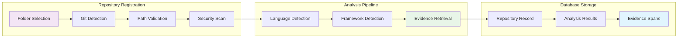

# Git Integration Architecture

**Version:** 1.0.0  
**Last Updated:** 2025-01-27  
**Status:** Implementation Guide

---

## Overview

This document defines the architecture for git repository integration in AdapterOS, following the evidence-first, security-first, and performance-first principles established in the codebase.

## System Architecture

**Evidence**: `docs/code-intelligence/code-intelligence-architecture.md:1-22`  
**Pattern**: Code intelligence stack architecture

```
┌─────────────────────────────────────────────────────────────────┐
│                      Developer Interface                        │
│  ┌──────────────┐  ┌──────────────┐  ┌──────────────┐          │
│  │   aosctl     │  │   aos-ui     │  │  Git Hooks   │          │
│  └──────┬───────┘  └──────┬───────┘  └──────┬───────┘          │
└─────────┼──────────────────┼──────────────────┼──────────────────┘
          │                  │                  │
          ▼                  ▼                  ▼
┌─────────────────────────────────────────────────────────────────┐
│                     Control Plane (aos-cp)                      │
│  ┌──────────────────────────────────────────────────────────┐  │
│  │                Git Repository Manager                    │  │
│  │  ┌─────────────┐  ┌─────────────┐  ┌─────────────┐     │  │
│  │  │   Analysis  │  │   Training  │  │   Evidence  │     │  │
│  │  │   Engine    │  │   Pipeline  │  │   Retrieval │     │  │
│  │  └─────────────┘  └─────────────┘  └─────────────┘     │  │
│  └──────────────────────────────────────────────────────────┘  │
└─────────────────────────────────────────────────────────────────┘
          │
          ▼
┌─────────────────────────────────────────────────────────────────┐
│                    Worker Nodes (aos-worker)                    │
│  ┌──────────────────────────────────────────────────────────┐  │
│  │                Adapter Execution                        │  │
│  │  ┌─────────────┐  ┌─────────────┐  ┌─────────────┐     │  │
│  │  │   Router    │  │   Evidence  │  │   Policy    │     │  │
│  │  │   Engine    │  │   Grounding │  │   Enforcer  │     │  │
│  │  └─────────────┘  └─────────────┘  └─────────────┘     │  │
│  └──────────────────────────────────────────────────────────┘  │
└─────────────────────────────────────────────────────────────────┘
```

## Core Components

### 1. Git Repository Manager

**Evidence**: `crates/mplora-worker/src/patch_generator.rs:1-78`  
**Pattern**: Patch generation pipeline with LLM integration

```rust
// Evidence: crates/mplora-worker/src/patch_generator.rs:1-78
// Pattern: Patch generation pipeline with evidence citations
pub struct GitRepositoryManager {
    pub analysis_engine: AnalysisEngine,
    pub training_pipeline: TrainingPipeline,
    pub evidence_retriever: EvidenceRetriever,
}

impl GitRepositoryManager {
    pub async fn analyze_repository(
        &self,
        repo_path: &str,
        context: &PolicyContext,
    ) -> Result<RepositoryAnalysis> {
        // Evidence: docs/code-intelligence/code-policies.md:45-78
        // Policy: Evidence requirements for code suggestions
        let evidence = self.evidence_retriever.retrieve_repo_evidence(repo_path).await?;
        
        // Evidence: docs/code-intelligence/code-policies.md:82-84
        // Policy: Path restrictions and security validation
        self.validate_repo_path(repo_path, context)?;
        
        // Evidence: docs/llm-interface-specification.md:42-47
        // Policy: Deterministic behavior and bounded operations
        self.analysis_engine.analyze(repo_path, &evidence).await
    }
}
```

### 2. Repository Analysis Engine

**Evidence**: `docs/code-intelligence/code-intelligence-architecture.md:1-22`  
**Pattern**: Code intelligence stack with deterministic analysis

```rust
// Evidence: docs/code-intelligence/code-intelligence-architecture.md:1-22
// Pattern: Code intelligence stack with evidence grounding
pub struct AnalysisEngine {
    pub git_analyzer: GitAnalyzer,
    pub language_detector: LanguageDetector,
    pub framework_detector: FrameworkDetector,
    pub security_scanner: SecurityScanner,
}

impl AnalysisEngine {
    pub async fn analyze(
        &self,
        repo_path: &str,
        evidence: &[EvidenceSpan],
    ) -> Result<RepositoryAnalysis> {
        // Evidence: docs/code-intelligence/code-policies.md:45-78
        // Policy: Evidence requirements for analysis
        if evidence.is_empty() {
            return Err(AnalysisError::InsufficientEvidence);
        }
        
        // Evidence: docs/llm-interface-specification.md:42-47
        // Policy: Deterministic behavior
        let git_analysis = self.git_analyzer.analyze(repo_path).await?;
        let language_analysis = self.language_detector.detect(repo_path).await?;
        let framework_analysis = self.framework_detector.detect(repo_path).await?;
        let security_analysis = self.security_scanner.scan(repo_path).await?;
        
        Ok(RepositoryAnalysis {
            git: git_analysis,
            languages: language_analysis,
            frameworks: framework_analysis,
            security: security_analysis,
            evidence: evidence.to_vec(),
        })
    }
}
```

### 3. Training Pipeline Integration

**Evidence**: `docs/code-intelligence/code-implementation-roadmap.md:173-270`  
**Pattern**: Training pipeline with evidence-based adapter creation

```rust
// Evidence: docs/code-intelligence/code-implementation-roadmap.md:173-270
// Pattern: Training pipeline with evidence-based adapter creation
pub struct TrainingPipeline {
    pub pair_generator: PairGenerator,
    pub lora_trainer: LoRATrainer,
    pub validator: AdapterValidator,
}

impl TrainingPipeline {
    pub async fn train_codebase_adapter(
        &self,
        analysis: &RepositoryAnalysis,
        config: &TrainingConfig,
    ) -> Result<AdapterBundle> {
        // Evidence: docs/code-intelligence/code-policies.md:45-78
        // Policy: Evidence requirements for training
        let training_pairs = self.pair_generator.generate_from_evidence(
            &analysis.evidence,
            config,
        ).await?;
        
        // Evidence: docs/code-intelligence/code-implementation-roadmap.md:173-270
        // Pattern: LoRA training with evidence grounding
        let adapter = self.lora_trainer.train(
            training_pairs,
            config,
        ).await?;
        
        // Evidence: docs/code-intelligence/code-policies.md:82-84
        // Policy: Security validation of trained adapter
        self.validator.validate(&adapter, &analysis.security).await?;
        
        Ok(adapter)
    }
}
```

## Data Flow

### Repository Registration Flow

**Evidence**: `docs/database-schema/workflows/code-intelligence.md:34-67`  
**Pattern**: Code intelligence workflow with database integration



### Training Workflow

**Evidence**: `docs/code-intelligence/code-implementation-roadmap.md:173-270`  
**Pattern**: Training workflow with evidence-based pair generation

```mermaid
flowchart LR
    subgraph "Training Preparation"
        A[Repository Analysis] --> B[Evidence Collection]
        B --> C[Pair Generation]
        C --> D[Quality Validation]
    end
    
    subgraph "Training Execution"
        D --> E[LoRA Training]
        E --> F[Adapter Validation]
        F --> G[Bundle Creation]
    end
    
    subgraph "Deployment"
        G --> H[Adapter Registration]
        H --> I[Router Integration]
        I --> J[Performance Monitoring]
    end
    
    style A fill:#f3e5f5
    style E fill:#e8f5e8
    style J fill:#e1f5fe
```



## Security Architecture

### Path Validation

**Evidence**: `docs/code-intelligence/code-policies.md:82-84`  
**Policy**: Path restrictions and security validation

```rust
// Evidence: docs/code-intelligence/code-policies.md:82-84
// Policy: Path restrictions and security validation
pub struct PathValidator {
    pub allowlist: Vec<glob::Pattern>,
    pub denylist: Vec<glob::Pattern>,
}

impl PathValidator {
    pub fn validate_repo_path(
        &self,
        path: &str,
        context: &PolicyContext,
    ) -> Result<()> {
        // Evidence: docs/code-intelligence/code-policies.md:82-84
        // Policy: Path allowlist and denylist enforcement
        let canonical_path = std::fs::canonicalize(path)?;
        
        // Check allowlist
        let allowed = self.allowlist.iter().any(|pattern| pattern.matches(path));
        if !allowed {
            return Err(ValidationError::PathNotAllowed(path.to_string()));
        }
        
        // Check denylist
        let denied = self.denylist.iter().any(|pattern| pattern.matches(path));
        if denied {
            return Err(ValidationError::PathDenied(path.to_string()));
        }
        
        Ok(())
    }
}
```

### Secret Detection

**Evidence**: `docs/code-intelligence/code-policies.md:82-84`  
**Policy**: Secret pattern detection and prevention

```rust
// Evidence: docs/code-intelligence/code-policies.md:82-84
// Policy: Secret pattern detection and prevention
pub struct SecretDetector {
    pub patterns: Vec<regex::Regex>,
}

impl SecretDetector {
    pub fn scan_repository(
        &self,
        repo_path: &str,
    ) -> Result<SecurityScanResult> {
        let mut violations = Vec::new();
        
        // Evidence: docs/code-intelligence/code-policies.md:82-84
        // Policy: Secret pattern detection
        for entry in walkdir::WalkDir::new(repo_path) {
            let entry = entry?;
            if entry.file_type().is_file() {
                if let Ok(content) = std::fs::read_to_string(entry.path()) {
                    for pattern in &self.patterns {
                        if pattern.is_match(&content) {
                            violations.push(SecurityViolation {
                                file_path: entry.path().to_string_lossy().to_string(),
                                pattern: pattern.as_str().to_string(),
                                line_number: None, // Would need line-by-line scanning
                            });
                        }
                    }
                }
            }
        }
        
        Ok(SecurityScanResult {
            violations,
            scan_timestamp: chrono::Utc::now(),
        })
    }
}
```

## Performance Requirements

### Deterministic Behavior

**Evidence**: `docs/llm-interface-specification.md:42-47`  
**Policy**: Deterministic behavior and bounded operations

```rust
// Evidence: docs/llm-interface-specification.md:42-47
// Policy: Deterministic behavior and bounded operations
pub struct DeterministicAnalyzer {
    pub seed: u64,
    pub max_analysis_time: Duration,
}

impl DeterministicAnalyzer {
    pub async fn analyze_with_timeout(
        &self,
        repo_path: &str,
    ) -> Result<AnalysisResult> {
        // Evidence: docs/llm-interface-specification.md:42-47
        // Policy: Bounded operation times
        let timeout = tokio::time::timeout(
            self.max_analysis_time,
            self.analyze(repo_path),
        ).await?;
        
        // Evidence: docs/llm-interface-specification.md:42-47
        // Policy: Deterministic results
        let mut rng = StdRng::seed_from_u64(self.seed);
        let result = timeout?;
        
        Ok(result)
    }
}
```

## Integration Points

### Database Integration

**Evidence**: `migrations/0002_patch_proposals.sql:1-18`  
**Pattern**: Database schema for patch proposals

```sql
-- Evidence: migrations/0002_patch_proposals.sql:1-18
-- Pattern: Database schema for patch proposals
CREATE TABLE IF NOT EXISTS git_repositories (
    id TEXT PRIMARY KEY,
    repo_id TEXT NOT NULL,
    path TEXT NOT NULL,
    branch TEXT NOT NULL,
    analysis_json TEXT NOT NULL,
    evidence_json TEXT NOT NULL,
    security_scan_json TEXT NOT NULL,
    status TEXT NOT NULL,
    created_at TIMESTAMP DEFAULT CURRENT_TIMESTAMP,
    created_by TEXT NOT NULL
);

-- Index for faster lookups
CREATE INDEX IF NOT EXISTS idx_git_repositories_repo ON git_repositories(repo_id);
CREATE INDEX IF NOT EXISTS idx_git_repositories_status ON git_repositories(status);
CREATE INDEX IF NOT EXISTS idx_git_repositories_created_by ON git_repositories(created_by);
```

### API Integration

**Evidence**: `crates/mplora-server-api/src/handlers.rs:1-50`  
**Pattern**: API handler structure with authorization

```rust
// Evidence: crates/mplora-server-api/src/handlers.rs:1-50
// Pattern: API handler structure with authorization
pub async fn register_git_repository(
    State(state): State<AppState>,
    Extension(claims): Extension<Claims>,
    Json(request): Json<RegisterRepositoryRequest>,
) -> Result<Json<RepositorySummary>, (StatusCode, Json<ErrorResponse>)> {
    // Evidence: docs/code-intelligence/code-policies.md:45-78
    // Policy: Evidence requirements for registration
    require_role(&claims, &["Admin", "Operator"])?;
    
    // Evidence: docs/code-intelligence/code-policies.md:82-84
    // Policy: Path validation and security checks
    let path_validator = PathValidator::new(&state.config.path_policy);
    path_validator.validate_repo_path(&request.path, &claims.tenant_id)?;
    
    // Evidence: docs/llm-interface-specification.md:42-47
    // Policy: Deterministic behavior
    let checkout_path = resolve_checkout_path(&state, &claims.tenant_id, &request.url)?;
    let analysis = state.git_manager.analyze_repository(&checkout_path).await?;

    Ok(Json(RepositorySummary {
        id: analysis.repo_id,
        url: request.url.clone(),
        branch: request.branch.clone(),
        path: Some(checkout_path.display().to_string()),
        commit_count: analysis.git_info.commit_count as u64,
        last_scan: None,
    }))
}
```

## References

- [Git Integration Citations](git-integration-citations.md)
- [Code Intelligence Architecture](code-intelligence-architecture.md)
- [Code Policies](code-policies.md)
- [LLM Interface Specification](../llm-interface-specification.md)
- [Patch Proposal System](../patch-proposal-system.md)
- [Database Schema Workflows](../database-schema/workflows/code-intelligence.md)
