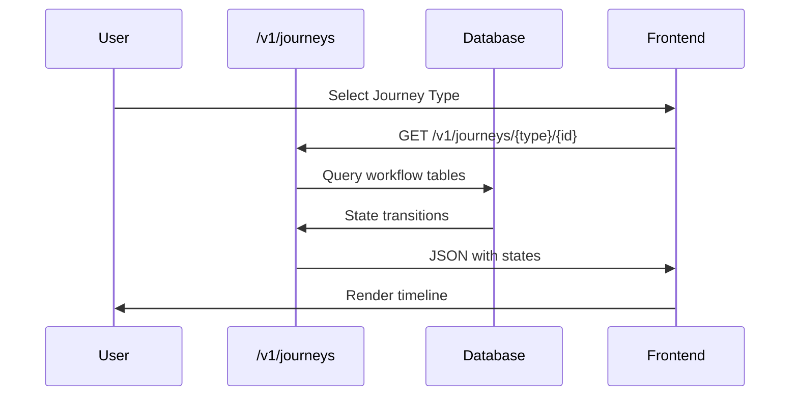

# Basic Workflow Examples

## Overview

Practical examples and tutorials for using the database schema animations and documentation effectively.

## For New Users

### Getting Started Journey
1. **Understand the Schema**: Start with [Schema Diagram](../schema-diagram.md) to see all tables and relationships
2. **Learn Core Concepts**: Review [Adapter Lifecycle](../workflows/adapter-lifecycle.md) for fundamental concepts
3. **Deployment Process**: Study [Promotion Pipeline](../workflows/promotion-pipeline.md) for deployment workflows
4. **Monitoring**: Familiarize with [Monitoring Flow](../workflows/monitoring-flow.md) for operational visibility

### First Week Learning Path
- **Day 1-2**: Schema diagram and adapter lifecycle
- **Day 3-4**: Promotion pipeline and security compliance
- **Day 5**: Monitoring flow and incident response

## For Troubleshooting

### Performance Issues
1. Check [Incident Response](../workflows/incident-response.md) for error resolution patterns
2. Use [Monitoring Flow](../workflows/monitoring-flow.md) for metrics analysis
3. Review [Performance Dashboard](../workflows/performance-dashboard.md) for trends

### Deployment Failures
1. Review [Promotion Pipeline](../workflows/promotion-pipeline.md) for rollback procedures
2. Check quality gates and audit logs
3. Verify adapter references and dependencies

### Security Concerns
1. Use [Security & Compliance](../workflows/security-compliance.md) for audit trails
2. Verify all signatures and SBOM completeness
3. Check ITAR compliance for restricted tenants

## For Development

### Building Code Intelligence Features
1. Study [Code Intelligence](../workflows/code-intelligence.md) for repository workflows
2. Review ephemeral adapter creation process
3. Understand commit tracking and patch proposals

### Implementing Replication
1. Review [Replication & Distribution](../workflows/replication-distribution.md) for scaling patterns
2. Understand artifact verification process
3. Study cross-node synchronization

### Performance Optimization
1. Use [Performance Dashboard](../workflows/performance-dashboard.md) for optimization insights
2. Analyze metrics aggregations
3. Implement caching strategies based on access patterns

## Common Tasks

### Task 1: Register a New Tenant
```sql
-- 1. Create tenant
INSERT INTO tenants (id, name, itar_flag, created_at)
VALUES ('tenant-001', 'Acme Corp', 0, CURRENT_TIMESTAMP);

-- 2. Verify tenant created
SELECT * FROM tenants WHERE id = 'tenant-001';
```

### Task 2: Deploy an Adapter
```sql
-- 1. Register adapter
INSERT INTO adapters (id, tenant_id, name, tier, category, scope, current_state)
VALUES ('adapter-001', 'tenant-001', 'python-stdlib', 'persistent', 'code', 'global', 'unloaded');

-- 2. Add adapter to plan
-- (via plan compilation)

-- 3. Deploy to worker
UPDATE adapters SET current_state = 'warm' WHERE id = 'adapter-001';

-- 4. Activate adapter
UPDATE adapters 
SET current_state = 'hot', 
    activation_count = 1,
    last_activated = CURRENT_TIMESTAMP
WHERE id = 'adapter-001';
```

### Task 3: Monitor System Health
```sql
-- 1. Check current metrics
SELECT * FROM system_metrics 
ORDER BY timestamp DESC 
LIMIT 1;

-- 2. Check for violations
SELECT * FROM threshold_violations 
WHERE resolved_at IS NULL;

-- 3. Check active incidents
SELECT * FROM incidents 
WHERE resolved = 0
ORDER BY severity DESC, created_at DESC;
```

### Task 4: Promote a Plan
```sql
-- 1. Create manifest
INSERT INTO manifests (id, tenant_id, hash_b3, body_json, created_at)
VALUES ('manifest-001', 'tenant-001', 'b3:...', '{"config": {...}}', CURRENT_TIMESTAMP);

-- 2. Compile plan
INSERT INTO plans (id, tenant_id, plan_id_b3, manifest_hash_b3, created_at)
VALUES ('plan-001', 'tenant-001', 'b3:...', 'b3:...', CURRENT_TIMESTAMP);

-- 3. Update CP pointer
UPDATE cp_pointers 
SET plan_id = 'plan-001', 
    promoted_at = CURRENT_TIMESTAMP,
    promoted_by = 'user-001'
WHERE name = 'production' AND tenant_id = 'tenant-001';

-- 4. Record promotion
INSERT INTO promotions (cpid, cp_pointer_id, promoted_by, quality_json, created_at)
VALUES ('cp-001', 'cp-pointer-001', 'user-001', '{"arr": 0.97}', CURRENT_TIMESTAMP);
```

## Animation Usage Tips

### Understanding Sequence Diagrams
- **Participants**: Represent database tables or system components
- **Arrows**: Show data flow and operations
- **Notes**: Provide additional context
- **Alt blocks**: Show conditional logic

### Understanding Flowcharts
- **Boxes**: Represent processes or states
- **Diamonds**: Represent decisions
- **Arrows**: Show flow direction
- **Colors**: Indicate severity or status

### Understanding State Diagrams
- **States**: Represent adapter or system states
- **Transitions**: Show state changes
- **Triggers**: Show what causes transitions

## Best Practices

### Documentation Navigation
- Use the index pages for quick navigation
- Follow the recommended learning paths for your role
- Bookmark frequently used workflows
- Refer to the schema diagram for table details

### Troubleshooting Approach
1. Identify the affected workflow
2. Review the relevant animation
3. Check database state
4. Follow resolution procedures
5. Document lessons learned

### Development Workflow
1. Study relevant animations first
2. Understand table relationships
3. Write queries based on patterns
4. Test with sample data
5. Document your changes

## Additional Resources

- [Schema Diagram](../schema-diagram.md) - Complete database structure
- [Validation Framework](../VALIDATION.md) - Validation procedures
- [Maintenance Guide](../MAINTENANCE.md) - Ongoing maintenance
- [System Architecture](../../architecture.md) - Overall system design

## API-Based Journeys

New endpoints allow programmatic access to workflow data:

### Journey Visualization Flow


### Examples
1. **Adapter Lifecycle**: `GET /v1/journeys/adapter-lifecycle/{adapter_id}` - Fetches state history from adapters table.
2. **Promotion Pipeline**: `GET /v1/journeys/promotion-pipeline/{plan_id}` - Promotion records from cp_pointers and promotions.

See [API Docs](../../api.md) for full schema.

---

**Next Steps**: Choose a workflow relevant to your current task and dive deeper into the implementation details.
