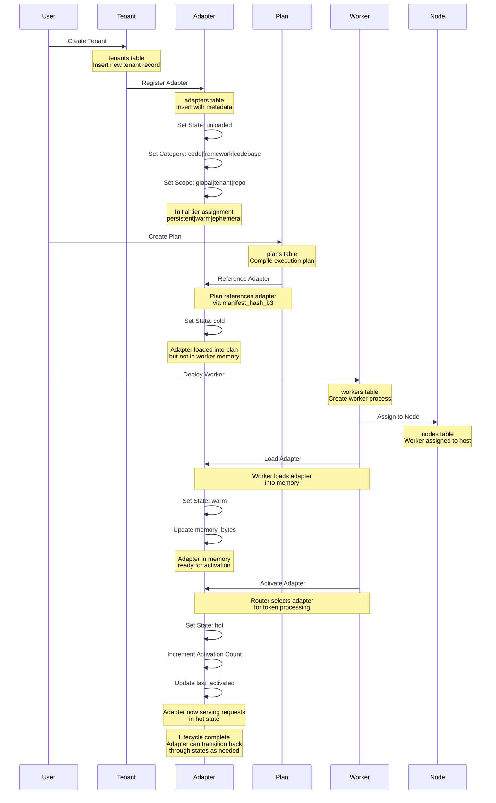
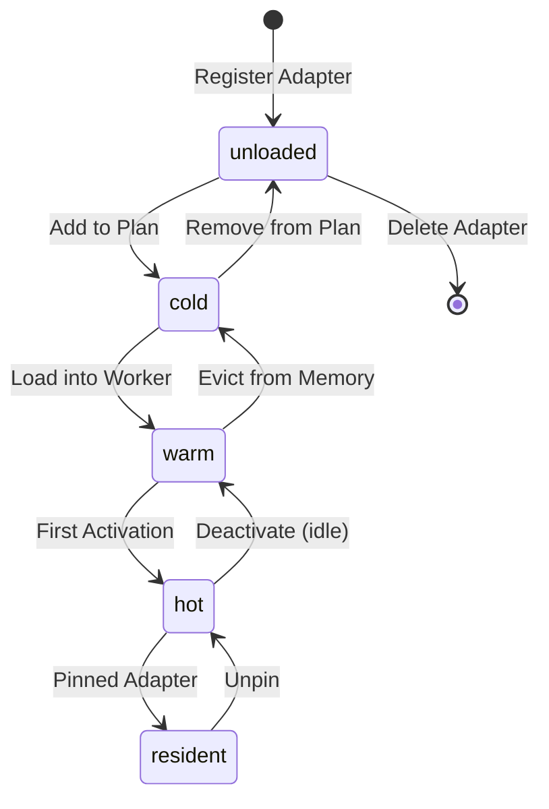
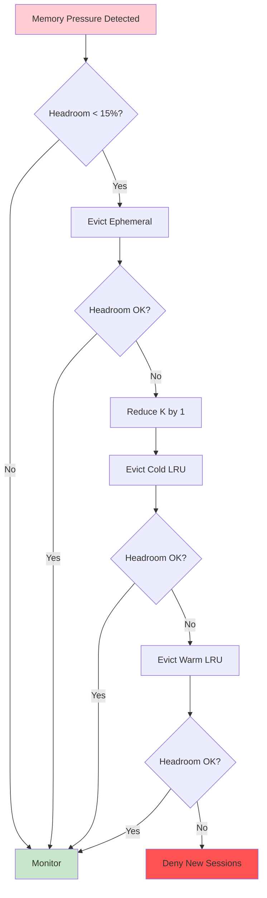

# Adapter Lifecycle Workflow

## Overview

This animated sequence shows the complete adapter lifecycle from creation to deployment, including state transitions, memory management, and activation tracking. This workflow is central to understanding how adapters are managed throughout their operational lifetime.

## Workflow Animation



## State Diagram



## Database Tables Involved

### Primary Tables

#### `tenants`
- **Purpose**: Multi-tenant isolation boundaries
- **Key Fields**: `id` (PK), `name` (UK), `itar_flag`, `created_at`
- **Role**: Owns all tenant-scoped adapters

#### `adapters`
- **Purpose**: LoRA adapter lifecycle management
- **Key Fields**: 
  - `id` (PK), `tenant_id` (FK)
  - `name`, `tier`, `hash_b3` (UK)
  - `rank`, `alpha`, `targets_json`
  - `category`, `scope`, `framework_id`
  - `current_state`, `pinned`, `memory_bytes`
  - `last_activated`, `activation_count`
- **States**: `unloaded`, `cold`, `warm`, `hot`, `resident`
- **Categories**: `code`, `framework`, `codebase`, `ephemeral`
- **Scopes**: `global`, `tenant`, `repo`, `commit`

#### `plans`
- **Purpose**: Compiled execution plans
- **Key Fields**: `id` (PK), `tenant_id` (FK), `plan_id_b3` (UK), `manifest_hash_b3` (FK)
- **Role**: References adapters via manifest configuration

#### `workers`
- **Purpose**: Active worker process management
- **Key Fields**: 
  - `id` (PK), `tenant_id` (FK), `node_id` (FK), `plan_id` (FK)
  - `uds_path`, `pid`, `status`
  - `memory_headroom_pct`, `k_current`
  - `adapters_loaded_json`
- **Role**: Loads adapters into memory and tracks activation

#### `nodes`
- **Purpose**: Worker host infrastructure
- **Key Fields**: `id` (PK), `hostname` (UK), `agent_endpoint`, `status`, `last_seen_at`
- **Role**: Hosts worker processes

### Supporting Tables

#### `adapter_provenance`
- **Purpose**: Cryptographic signer tracking
- **Key Fields**: `adapter_id` (PK, FK), `signer_key`, `registered_by`, `registered_uid`, `bundle_b3`
- **Role**: Tracks adapter origin and registration authority

#### `adapter_categories`
- **Purpose**: Reference table for adapter types
- **Key Fields**: `name` (PK)
- **Values**: `code`, `framework`, `codebase`, `ephemeral`

#### `adapter_scopes`
- **Purpose**: Reference table for adapter scopes
- **Key Fields**: `name` (PK)
- **Values**: `global`, `tenant`, `repo`, `commit`

#### `adapter_states`
- **Purpose**: Reference table for lifecycle states
- **Key Fields**: `name` (PK)
- **Values**: `unloaded`, `cold`, `warm`, `hot`, `resident`

## State Transitions Explained

### unloaded → cold
**Trigger**: Adapter added to execution plan  
**Database Changes**:
- `adapters.current_state` = `'cold'`
- `adapters.updated_at` = current timestamp
- Plan references adapter via `manifests.body_json`

### cold → warm
**Trigger**: Worker loads adapter into memory  
**Database Changes**:
- `adapters.current_state` = `'warm'`
- `adapters.memory_bytes` = actual memory usage
- `workers.adapters_loaded_json` includes adapter ID

### warm → hot
**Trigger**: Router selects adapter for token processing  
**Database Changes**:
- `adapters.current_state` = `'hot'`
- `adapters.activation_count` += 1
- `adapters.last_activated` = current timestamp

### hot → resident (optional)
**Trigger**: Adapter pinned by operator or policy  
**Database Changes**:
- `adapters.current_state` = `'resident'`
- `adapters.pinned` = 1
- Adapter protected from eviction

## Memory Management

### Eviction Priority
1. **Ephemeral adapters** (lowest priority to keep)
2. **Cold LRU** (least recently used in cold state)
3. **Warm LRU** (least recently used in warm state)
4. **Hot adapters** (avoid evicting if possible)
5. **Resident adapters** (never evict, pinned)

### Memory Tracking
- `workers.memory_headroom_pct`: Available memory percentage
- `adapters.memory_bytes`: Per-adapter memory usage
- `system_metrics.memory_usage`: Overall system memory

### Eviction Workflow


## Activation Tracking

### Metrics Collected
- **Total Activations**: `adapters.activation_count`
- **Last Activation**: `adapters.last_activated`
- **Adapter Selection**: Router telemetry events
- **Performance Impact**: Per-adapter latency and throughput

### Activation Thresholds
- **Minimum Activation**: `min_activation_pct` = 2.0%
- **Quality Delta**: `min_quality_delta` = 0.5
- **Eviction Criteria**: Adapters below thresholds are evicted

## Related Workflows

- [Promotion Pipeline](promotion-pipeline.md) - How plans are deployed with adapters
- [Monitoring Flow](monitoring-flow.md) - Real-time adapter performance tracking
- [Replication & Distribution](replication-distribution.md) - Cross-node adapter synchronization

## Related Documentation

- [Schema Diagram](../schema-diagram.md) - Complete database structure
- [System Architecture](../../ARCHITECTURE.md) - Overall system design
- [Router](../../architecture.md#router) - Adapter selection algorithm
- [Memory Management](../../architecture.md#memory-management) - Memory budgeting and eviction

## Implementation References

### Rust Crates
- `crates/mplora-db/src/adapters.rs` - Adapter database operations
- `crates/mplora-router/src/lib.rs` - Router and adapter selection
- `crates/mplora-worker/src/lib.rs` - Worker and adapter loading
- `crates/mplora-lifecycle/src/lib.rs` - Adapter lifecycle management

### API Endpoints
- `POST /v1/adapters` - Register new adapter
- `GET /v1/adapters/:id` - Get adapter details
- `PUT /v1/adapters/:id/state` - Update adapter state
- `GET /v1/adapters/:id/health` - Check adapter health

## Example Scenarios

### Scenario 1: New Code Adapter
```sql
-- 1. Register adapter
INSERT INTO adapters (id, tenant_id, name, tier, category, scope, current_state)
VALUES ('ada-001', 'tenant-1', 'python-stdlib', 'persistent', 'code', 'global', 'unloaded');

-- 2. Add to plan
UPDATE adapters SET current_state = 'cold' WHERE id = 'ada-001';

-- 3. Load into worker
UPDATE adapters 
SET current_state = 'warm', memory_bytes = 52428800 
WHERE id = 'ada-001';

-- 4. Activate
UPDATE adapters 
SET current_state = 'hot', 
    activation_count = activation_count + 1,
    last_activated = CURRENT_TIMESTAMP
WHERE id = 'ada-001';
```

### Scenario 2: Ephemeral Adapter
```sql
-- 1. Create ephemeral adapter for commit
INSERT INTO adapters (id, tenant_id, name, tier, category, scope, commit_sha, current_state)
VALUES ('ada-ephemeral-001', 'tenant-1', 'commit-abc123', 'ephemeral', 'ephemeral', 'commit', 'abc123', 'warm');

-- 2. Immediate activation (hot-loaded)
UPDATE adapters 
SET current_state = 'hot',
    activation_count = 1,
    last_activated = CURRENT_TIMESTAMP
WHERE id = 'ada-ephemeral-001';

-- 3. Auto-evict after TTL expires
DELETE FROM adapters WHERE id = 'ada-ephemeral-001';
```

## Best Practices

### Adapter Registration
- Always set appropriate `category` and `scope`
- Include `framework_id` and `repo_id` for code intelligence adapters
- Set `tier` based on expected usage patterns

### State Management
- Use atomic state transitions in database transactions
- Track `activation_count` for usage analytics
- Monitor `memory_bytes` for capacity planning

### Performance Optimization
- Pin frequently-used adapters to `resident` state
- Evict low-activation adapters proactively
- Use `k_current` to balance quality and memory

### Monitoring
- Alert on adapters stuck in `cold` state
- Track activation rate trends
- Monitor memory pressure and eviction events

---

**Adapter Lifecycle**: Complete journey from registration to serving, with comprehensive state management and memory optimization.
