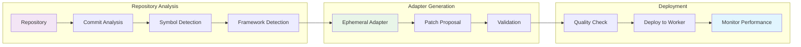

# Code Intelligence Workflow

## Overview

Shows how code analysis generates adapters through repository integration, commit tracking, and ephemeral adapter creation. This workflow demonstrates the complete code intelligence pipeline from repository registration to adapter deployment.

## Workflow Animation

## Database Tables Involved

### Primary Tables

#### `repositories`
- **Purpose**: Registered code repositories with language detection
- **Key Fields**:
  - `id` (PK), `repo_id` (UK)
  - `path`, `languages`, `default_branch`
  - `status` - registered|scanning|ready|error
  - `frameworks_json`, `file_count`, `symbol_count`

#### `commits`
- **Purpose**: Commit metadata and analysis with symbol tracking
- **Key Fields**:
  - `id` (PK), `repo_id` (FK), `sha`, `author`, `date`
  - `message`, `branch`, `changed_files_json`
  - `impacted_symbols_json`, `test_results_json`
  - `ephemeral_adapter_id`

#### `patch_proposals`
- **Purpose**: AI-generated code patches with validation
- **Key Fields**:
  - `id` (PK), `repo_id`, `commit_sha`
  - `description`, `target_files_json`, `patch_json`
  - `validation_result_json`, `status`, `created_by`

#### `ephemeral_adapters`
- **Purpose**: Commit-aware temporary adapters
- **Key Fields**: `id` (PK), `adapter_data`, `created_at`

#### `adapters`
- **Purpose**: LoRA adapters (ephemeral category)
- **Key Fields**: `id`, `category` = 'ephemeral', `scope` = 'commit', `commit_sha`, `repo_id`

## Related Workflows

- [Adapter Lifecycle](adapter-lifecycle.md) - Ephemeral adapter deployment
- [Promotion Pipeline](promotion-pipeline.md) - Quality checks

## Related Documentation

- [Schema Diagram](../schema-diagram.md) - Complete database structure
- [Code Intelligence](../../code-intelligence/README.md) - Complete code analysis stack

---

**Code Intelligence**: Repository integration and ephemeral adapter generation for commit-specific code assistance.
