# Git Repository Workflow

## Overview

Shows how git repository integration works through registration, analysis, evidence collection, and adapter training. This workflow demonstrates the complete git repository pipeline from folder selection to adapter deployment.

## Workflow Animation

```mermaid
flowchart LR
    subgraph "Repository Registration"
        A[Folder Selection] --> B[Git Detection]
        B --> C[Path Validation]
        C --> D[Security Scan]
    end
    
    subgraph "Analysis Pipeline"
        D --> E[Language Detection]
        E --> F[Framework Detection]
        F --> G[Evidence Collection]
    end
    
    subgraph "Training Pipeline"
        G --> H[Pair Generation]
        H --> I[LoRA Training]
        I --> J[Adapter Validation]
    end
    
    subgraph "Deployment"
        J --> K[Adapter Registration]
        K --> L[Router Integration]
        L --> M[Performance Monitoring]
    end
    
    style A fill:#f3e5f5
    style G fill:#e8f5e8
    style M fill:#e1f5fe
```



## Database Tables Involved

### Primary Tables

#### `git_repositories`
- **Purpose**: Registered git repositories with analysis metadata
- **Key Fields**:
  - `id` (PK), `repo_id` (UK)
  - `path`, `branch`, `analysis_json`
  - `evidence_json`, `security_scan_json`
  - `status` - registered|analyzing|ready|error
  - `created_by`, `created_at`

#### `repository_training_jobs`
- **Purpose**: Training job tracking and progress monitoring
- **Key Fields**:
  - `id` (PK), `repo_id` (FK)
  - `training_config_json`, `status`
  - `progress_json`, `started_at`, `completed_at`
  - `created_by`

#### `repository_evidence_spans`
- **Purpose**: Evidence spans for repository analysis
- **Key Fields**:
  - `id` (PK), `repo_id` (FK), `span_id`
  - `evidence_type`, `file_path`
  - `line_start`, `line_end`, `relevance_score`
  - `content`

#### `repository_security_violations`
- **Purpose**: Security scan results and violations
- **Key Fields**:
  - `id` (PK), `repo_id` (FK)
  - `file_path`, `pattern`, `line_number`
  - `severity`

#### `repository_analysis_cache`
- **Purpose**: Cached analysis results for performance
- **Key Fields**:
  - `id` (PK), `repo_id` (FK)
  - `analysis_type`, `analysis_data_json`
  - `cache_key`, `expires_at`

#### `repository_training_metrics`
- **Purpose**: Training metrics and performance tracking
- **Key Fields**:
  - `id` (PK), `training_job_id` (FK)
  - `metric_name`, `metric_value`
  - `metric_timestamp`

## Workflow Steps

### 1. Repository Registration

**Evidence**: `docs/code-intelligence/code-policies.md:45-78`  
**Policy**: Evidence requirements for repository registration

```sql
-- Register new git repository
INSERT INTO git_repositories (
    id, repo_id, path, branch, analysis_json, 
    evidence_json, security_scan_json, status, created_by
) VALUES (
    'repo_123', 'acme/payments', '/repos/acme/payments', 'main',
    '{"languages": [...], "frameworks": [...]}',
    '[]', '{}', 'registered', 'user_456'
);
```

### 2. Analysis Pipeline

**Evidence**: `docs/code-intelligence/code-intelligence-architecture.md:1-22`  
**Pattern**: Code intelligence stack with evidence grounding

```sql
-- Store evidence spans
INSERT INTO repository_evidence_spans (
    id, repo_id, span_id, evidence_type, file_path,
    line_start, line_end, relevance_score, content
) VALUES (
    'span_789', 'acme/payments', 'span_001', 'code_symbol',
    'src/auth.rs', 45, 67, 0.85, 'pub fn authenticate(...)'
);
```

### 3. Security Validation

**Evidence**: `docs/code-intelligence/code-policies.md:82-84`  
**Policy**: Security scan and violation tracking

```sql
-- Record security violations
INSERT INTO repository_security_violations (
    id, repo_id, file_path, pattern, line_number, severity
) VALUES (
    'violation_101', 'acme/payments', 'config/secrets.yml',
    'api_key.*=.*["\'].*["\']', 23, 'high'
);
```

### 4. Training Pipeline

**Evidence**: `docs/code-intelligence/code-implementation-roadmap.md:173-270`  
**Pattern**: Training pipeline with evidence-based adapter creation

```sql
-- Create training job
INSERT INTO repository_training_jobs (
    id, repo_id, training_config_json, status, progress_json, created_by
) VALUES (
    'job_202', 'acme/payments', '{"rank": 24, "alpha": 48, ...}',
    'started', '{"epoch": 0, "loss": 0.0}', 'user_456'
);
```

### 5. Metrics Tracking

**Evidence**: `docs/code-intelligence/code-implementation-roadmap.md:173-270`  
**Pattern**: Training metrics and performance tracking

```sql
-- Record training metrics
INSERT INTO repository_training_metrics (
    id, training_job_id, metric_name, metric_value
) VALUES (
    'metric_303', 'job_202', 'training_loss', 0.125
);
```

## Performance Considerations

### Indexing Strategy

**Evidence**: `migrations/0002_patch_proposals.sql:1-18`  
**Pattern**: Database schema for patch proposals

- **Primary Keys**: All tables use UUID primary keys for distributed systems
- **Foreign Keys**: Proper foreign key relationships for data integrity
- **Composite Indexes**: Multi-column indexes for common query patterns
- **Partial Indexes**: Status-based indexes for active records

### Caching Strategy

**Evidence**: `docs/code-intelligence/code-implementation-roadmap.md:173-270`  
**Pattern**: Analysis cache for performance optimization

```sql
-- Cache analysis results
INSERT INTO repository_analysis_cache (
    id, repo_id, analysis_type, analysis_data_json, cache_key, expires_at
) VALUES (
    'cache_404', 'acme/payments', 'language_detection',
    '{"rust": 0.6, "typescript": 0.4}', 'lang_det_abc123',
    datetime('now', '+1 hour')
);
```

## Security Considerations

### Path Validation

**Evidence**: `docs/code-intelligence/code-policies.md:82-84`  
**Policy**: Path restrictions and security validation

- **Allowlist**: Only specific paths allowed for repository registration
- **Denylist**: Sensitive paths blocked (secrets, configs, etc.)
- **Canonicalization**: Path canonicalization to prevent traversal attacks
- **Validation**: Real-time path validation during registration

### Secret Detection

**Evidence**: `docs/code-intelligence/code-policies.md:82-84`  
**Policy**: Secret pattern detection and prevention

- **Pattern Matching**: Regex patterns for common secret formats
- **Line-level Detection**: Precise line number tracking for violations
- **Severity Classification**: High/medium/low severity levels
- **Real-time Scanning**: Continuous security scanning during analysis

## Monitoring and Observability

### Training Metrics

**Evidence**: `docs/code-intelligence/code-implementation-roadmap.md:173-270`  
**Pattern**: Training metrics and performance tracking

- **Loss Tracking**: Training loss over time
- **Progress Monitoring**: Epoch-by-epoch progress tracking
- **Performance Metrics**: Throughput and latency measurements
- **Quality Metrics**: Evidence quality and relevance scores

### Error Tracking

**Evidence**: `docs/code-intelligence/code-policies.md:45-78`  
**Policy**: Error tracking and recovery

- **Status Tracking**: Repository status throughout lifecycle
- **Error Logging**: Detailed error information for debugging
- **Recovery Procedures**: Automated recovery from common failures
- **Alerting**: Real-time alerts for critical issues

## References

- [Git Integration Citations](../../code-intelligence/GIT-INTEGRATION-CITATIONS.md)
- [Git Integration Architecture](../../code-intelligence/git-integration-ARCHITECTURE.md)
- [Code Intelligence Workflow](CODE-INTELLIGENCE.MD)
- [Database Schema Migration](../../migrations/0013_git_repository_integration.sql)
- [Code Policies](../../code-intelligence/CODE-POLICIES.md)
