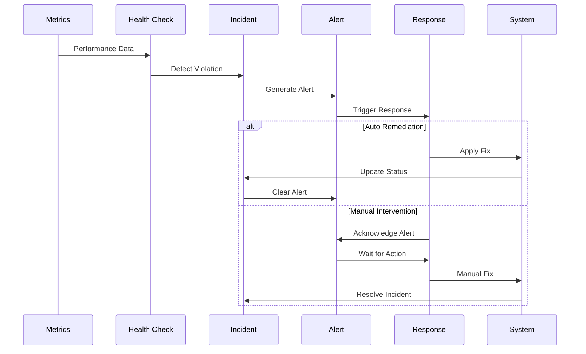

# Incident Response Workflow

## Overview

Shows how incidents are detected and resolved through automated remediation and manual intervention. This workflow provides a complete troubleshooting guide for operational issues.

## Workflow Animation

## Database Tables Involved

### Primary Tables

#### `incidents`
- **Purpose**: Security and policy violation tracking
- **Key Fields**:
  - `id`, `tenant_id`, `severity`, `kind`
  - `description`, `worker_id`, `bundle_id`
  - `resolved`, `created_at`, `resolved_at`
- **Severity Levels**: critical|high|medium|low

#### `alerts`
- **Purpose**: System-wide alerting
- **Key Fields**: `id`, `severity`, `kind`, `message`, `acknowledged`

#### `threshold_violations`
- **Purpose**: Performance threshold breach detection
- **Key Fields**: `metric_name`, `current_value`, `threshold_value`, `severity`

## Incident Types

### 1. Memory Pressure
- **Trigger**: Memory usage > 90%
- **Auto Remediation**: Evict ephemeral adapters → Reduce K → Evict cold
- **Manual**: Review memory allocation patterns

### 2. Router Skew
- **Trigger**: Adapter activation patterns anomalous
- **Auto Remediation**: Enable entropy floor → Cap activation
- **Manual**: Rebuild calibration → New PlanID

### 3. Determinism Failure
- **Trigger**: Replay results differ
- **Auto Remediation**: Freeze serving Plan → Export bundle
- **Manual**: Diff kernels → Rollback to last CP

### 4. Policy Violation
- **Trigger**: Policy check fails
- **Auto Remediation**: Isolate process → Export audit
- **Manual**: Rotate keys → Open incident ticket

## Response Procedures

### Critical Incidents
1. Immediate alert notification
2. Auto remediation attempt
3. Manual intervention if auto fails
4. Document resolution steps
5. Update runbooks

### High Incidents
1. Alert within 1 minute
2. Auto remediation attempt
3. Manual review required
4. Root cause analysis
5. Prevention measures

### Medium/Low Incidents
1. Alert within 5-15 minutes
2. Log for trending
3. Manual review in regular schedule
4. Pattern analysis
5. Proactive prevention

## Related Workflows

- [Monitoring Flow](MONITORING-FLOW.md) - Incident detection
- [Promotion Pipeline](PROMOTION-PIPELINE.md) - Rollback procedures

## Related Documentation

- [Schema Diagram](../SCHEMA-DIAGRAM.md) - Complete database structure
- [Runaway Prevention](../../RUNAWAY-PREVENTION.md) - Safety mechanisms and incident procedures

---

**Incident Response**: Comprehensive troubleshooting guide with automated remediation and manual intervention procedures for operational issues.
