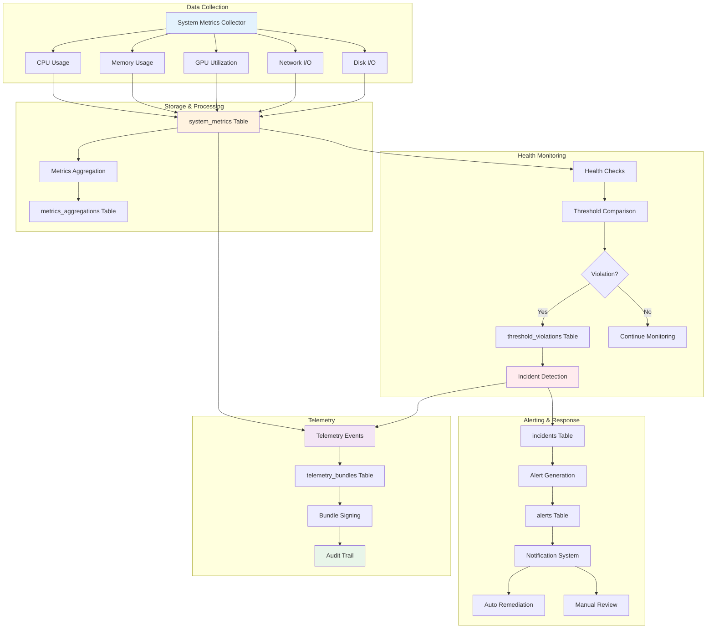
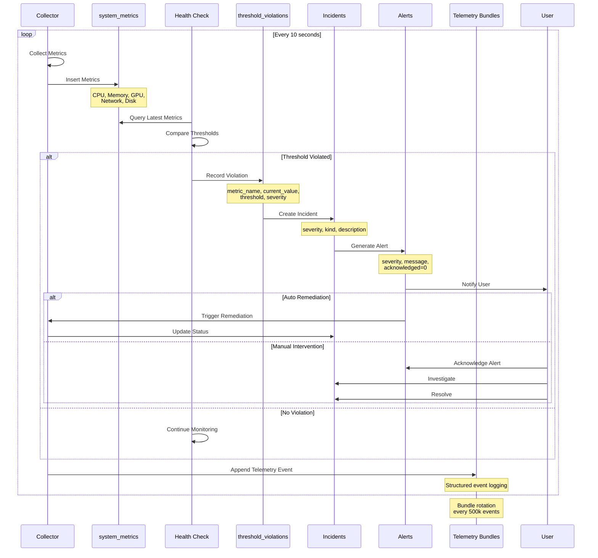
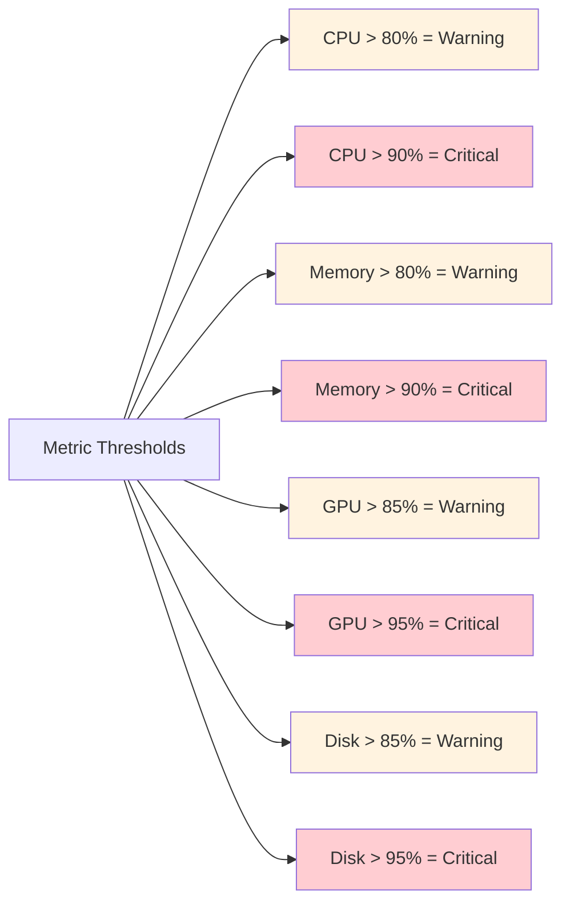
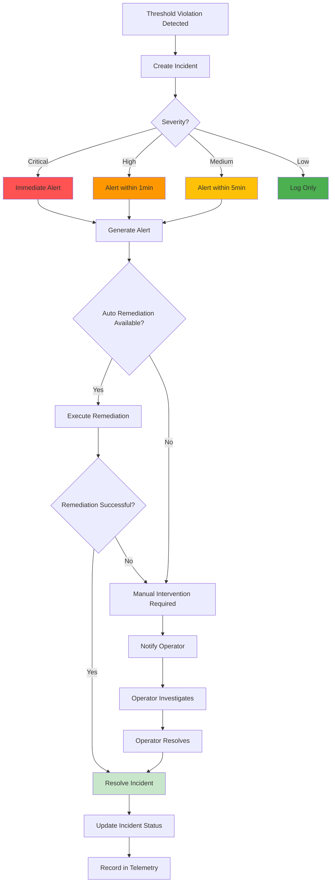

# Real-time Monitoring Flow

## Overview

Shows how system metrics flow through the monitoring system, from data collection to incident detection and alert generation. This workflow provides comprehensive operational visibility for system health and performance.

## Workflow Animation



## Detailed Sequence



## Database Tables Involved

### Primary Tables

#### `system_metrics`
- **Purpose**: Real-time system performance data
- **Backend Support**: SQLite and PostgreSQL with identical schema
- **Key Fields**:
  - `id` (PK) - Auto-increment (SERIAL in PostgreSQL)
  - `timestamp` - Unix timestamp (BIGINT in PostgreSQL)
  - `cpu_usage` - CPU usage percentage (DOUBLE PRECISION in PostgreSQL)
  - `memory_usage` - Memory usage percentage (DOUBLE PRECISION in PostgreSQL)
  - `disk_read_bytes`, `disk_write_bytes` - Disk I/O (BIGINT in PostgreSQL)
  - `network_rx_bytes`, `network_tx_bytes` - Network I/O (BIGINT in PostgreSQL)
  - `gpu_utilization` - GPU usage percentage (DOUBLE PRECISION in PostgreSQL)
  - `gpu_memory_used` - GPU memory (bytes) (BIGINT in PostgreSQL)
  - `uptime_seconds` - System uptime (BIGINT in PostgreSQL)
  - `process_count` - Number of processes
  - `load_1min`, `load_5min`, `load_15min` - Load averages (DOUBLE PRECISION in PostgreSQL)
  - `created_at` - Insert timestamp (TIMESTAMP WITH TIME ZONE in PostgreSQL)
- **Collection Frequency**: Every 10 seconds
- **Retention**: Configurable (default: 7 days raw, aggregated indefinitely)

#### `system_health_checks`
- **Purpose**: Automated health status validation
- **Backend Support**: SQLite and PostgreSQL with identical schema
- **Key Fields**:
  - `id` (PK) - Auto-increment (SERIAL in PostgreSQL)
  - `timestamp` - Unix timestamp (BIGINT in PostgreSQL)
  - `status` - healthy|warning|critical
  - `check_name` - Name of health check
  - `check_status` - Check result
  - `message` - Check result message
  - `value` - Current value (DOUBLE PRECISION in PostgreSQL)
  - `threshold` - Threshold value (DOUBLE PRECISION in PostgreSQL)
  - `created_at` - Insert timestamp (TIMESTAMP WITH TIME ZONE in PostgreSQL)
- **Check Types**: CPU, memory, disk, network, GPU, process, database
- **Check Frequency**: Every 30 seconds

#### `threshold_violations`
- **Purpose**: Performance threshold breach detection
- **Backend Support**: SQLite and PostgreSQL with identical schema
- **Key Fields**:
  - `id` (PK) - Auto-increment (SERIAL in PostgreSQL)
  - `timestamp` - Unix timestamp (BIGINT in PostgreSQL)
  - `metric_name` - Which metric violated
  - `current_value` - Current metric value (DOUBLE PRECISION in PostgreSQL)
  - `threshold_value` - Threshold that was exceeded (DOUBLE PRECISION in PostgreSQL)
  - `severity` - warning|critical
  - `resolved_at` - Resolution timestamp (null if unresolved) (BIGINT in PostgreSQL)
  - `created_at` - Insert timestamp (TIMESTAMP WITH TIME ZONE in PostgreSQL)
- **Severity Levels**: warning (80-90%), critical (>90%)

#### `metrics_aggregations`
- **Purpose**: Pre-computed time-series summaries
- **Backend Support**: SQLite and PostgreSQL with identical schema
- **Key Fields**:
  - `id` (PK) - Auto-increment (SERIAL in PostgreSQL)
  - `window_start`, `window_end` - Time window (BIGINT in PostgreSQL)
  - `window_type` - hour|day|week
  - `avg_cpu_usage`, `max_cpu_usage` - CPU stats (DOUBLE PRECISION in PostgreSQL)
  - `avg_memory_usage`, `max_memory_usage` - Memory stats (DOUBLE PRECISION in PostgreSQL)
  - `total_disk_read`, `total_disk_write` - Disk I/O totals (BIGINT in PostgreSQL)
  - `total_network_rx`, `total_network_tx` - Network I/O totals (BIGINT in PostgreSQL)
  - `sample_count` - Number of samples
  - `created_at` - Insert timestamp (TIMESTAMP WITH TIME ZONE in PostgreSQL)
- **Aggregation Schedule**: Hourly, daily, weekly

#### `incidents`
- **Purpose**: Security and policy violation tracking
- **Key Fields**:
  - `id` (PK), `tenant_id` (FK)
  - `severity` - critical|high|medium|low
  - `kind` - Incident type
  - `description` - Incident description
  - `worker_id` (FK) - Related worker
  - `bundle_id` (FK) - Related telemetry bundle
  - `resolved` - 0=unresolved, 1=resolved
  - `created_at`, `resolved_at`
- **Incident Types**: memory_pressure, router_skew, determinism_failure, policy_violation

#### `alerts`
- **Purpose**: System-wide alerting and notification management
- **Key Fields**:
  - `id` (PK)
  - `severity` - critical|high|medium|low
  - `kind` - Alert type
  - `subject_id` - Related entity ID
  - `message` - Alert message
  - `acknowledged` - 0=unacknowledged, 1=acknowledged
  - `created_at`
- **Alert Channels**: In-app, email, webhook (configurable)

#### `telemetry_bundles`
- **Purpose**: NDJSON event bundles with Merkle tree verification
- **Key Fields**:
  - `id` (PK), `tenant_id` (FK)
  - `cpid` - Control Plane ID
  - `path` (UK) - Bundle file path
  - `merkle_root_b3` - Merkle tree root hash
  - `start_seq`, `end_seq` - Sequence number range
  - `event_count` - Number of events
  - `created_at`
- **Rotation Triggers**: 500k events or 256MB size
- **Retention**: Configurable (default: last 12 bundles per CPID)

### Supporting Tables

#### `system_metrics_config`
- **Purpose**: Monitoring configuration parameters
- **Key Fields**: `id` (PK), `config_key` (UK), `config_value`, `updated_at`
- **Configurable Parameters**: collection_interval, aggregation_windows, retention_policy, alert_thresholds

#### `workers`
- **Purpose**: Worker health tracking
- **Key Fields**: `id`, `status`, `memory_headroom_pct`, `last_heartbeat_at`
- **Health Indicator**: `last_heartbeat_at` must be within 60 seconds

#### `nodes`
- **Purpose**: Node health tracking
- **Key Fields**: `id`, `hostname`, `status`, `last_seen_at`
- **Health Indicator**: `last_seen_at` must be within 120 seconds

## Monitoring Thresholds

### Default Thresholds



### Threshold Configuration
```json
{
  "cpu_usage_pct": {
    "warning": 80,
    "critical": 90,
    "duration_seconds": 300
  },
  "memory_usage_pct": {
    "warning": 80,
    "critical": 90,
    "duration_seconds": 180
  },
  "gpu_utilization_pct": {
    "warning": 85,
    "critical": 95,
    "duration_seconds": 300
  },
  "disk_usage_pct": {
    "warning": 85,
    "critical": 95,
    "duration_seconds": 0
  },
  "worker_heartbeat_max_age_seconds": 60,
  "node_heartbeat_max_age_seconds": 120
}
```

## Health Check Types

### System Health Checks
1. **CPU Health**: Load averages and usage patterns
2. **Memory Health**: Available memory and swap usage
3. **Disk Health**: Free space and I/O performance
4. **Network Health**: Connectivity and throughput
5. **GPU Health**: Utilization and memory availability
6. **Process Health**: Critical process status
7. **Database Health**: Connection pool and query performance

### Worker Health Checks
1. **Heartbeat**: Last heartbeat within 60 seconds
2. **Memory Headroom**: >= 15% available
3. **Adapter Load**: Adapters loaded successfully
4. **Plan Status**: Plan deployed correctly
5. **Socket Health**: UDS path accessible

### Node Health Checks
1. **Runtime Reachable**: HTTP endpoint responding
2. **Heartbeat**: Last seen within 120 seconds
3. **Worker Capacity**: Not over-provisioned
4. **Resource Availability**: Sufficient CPU/memory/GPU

## Incident Response Workflow



## Telemetry Event Types

### Metric Events
```json
{
  "event_type": "metric.collected",
  "timestamp": 1696800000,
  "data": {
    "cpu_usage": 65.3,
    "memory_usage": 72.1,
    "gpu_utilization": 85.0
  }
}
```

### Health Check Events
```json
{
  "event_type": "health.check",
  "timestamp": 1696800030,
  "check_name": "cpu_health",
  "status": "healthy",
  "value": 65.3,
  "threshold": 80.0
}
```

### Incident Events
```json
{
  "event_type": "incident.created",
  "timestamp": 1696800060,
  "incident_id": "inc-001",
  "severity": "critical",
  "kind": "memory_pressure",
  "description": "Memory usage exceeded 90%"
}
```

### Alert Events
```json
{
  "event_type": "alert.generated",
  "timestamp": 1696800061,
  "alert_id": "alert-001",
  "severity": "critical",
  "message": "Critical: Memory usage at 92%"
}
```

## Aggregation Queries

### Hourly Aggregation
```sql
INSERT INTO metrics_aggregations (
  window_start, window_end, window_type,
  avg_cpu_usage, max_cpu_usage,
  avg_memory_usage, max_memory_usage,
  total_disk_read, total_disk_write,
  total_network_rx, total_network_tx,
  sample_count
)
SELECT 
  DATE_TRUNC('hour', timestamp) as window_start,
  DATE_TRUNC('hour', timestamp) + INTERVAL '1 hour' as window_end,
  'hour' as window_type,
  AVG(cpu_usage) as avg_cpu_usage,
  MAX(cpu_usage) as max_cpu_usage,
  AVG(memory_usage) as avg_memory_usage,
  MAX(memory_usage) as max_memory_usage,
  SUM(disk_read_bytes) as total_disk_read,
  SUM(disk_write_bytes) as total_disk_write,
  SUM(network_rx_bytes) as total_network_rx,
  SUM(network_tx_bytes) as total_network_tx,
  COUNT(*) as sample_count
FROM system_metrics
WHERE timestamp >= NOW() - INTERVAL '1 hour'
GROUP BY DATE_TRUNC('hour', timestamp);
```

## Related Workflows

- [Incident Response](INCIDENT-RESPONSE.md) - Handling detected incidents
- [Performance Dashboard](PERFORMANCE-DASHBOARD.md) - Visualizing metrics
- [Promotion Pipeline](PROMOTION-PIPELINE.md) - Post-deployment monitoring

## Related Documentation

- [Schema Diagram](../SCHEMA-DIAGRAM.md) - Complete database structure
- [System Architecture](../../ARCHITECTURE.md) - Overall system design
- [Runaway Prevention](../../RUNAWAY-PREVENTION.md) - Safety mechanisms

## Implementation References

### Rust Crates
- `crates/mplora-system-metrics/src/collector.rs` - Metrics collection
- `crates/mplora-system-metrics/src/monitor.rs` - Health monitoring
- `crates/mplora-system-metrics/src/database.rs` - Database operations
- `crates/mplora-telemetry/src/lib.rs` - Telemetry event logging

### API Endpoints
- `GET /v1/metrics/system` - Get current system metrics
- `GET /v1/metrics/system/history` - Get historical metrics
- `GET /v1/health` - System health check
- `GET /v1/alerts` - List active alerts
- `POST /v1/alerts/:id/acknowledge` - Acknowledge alert
- `GET /v1/incidents` - List incidents
- `GET /v1/stream/metrics` - SSE stream for real-time metrics

## Example Scenarios

### Scenario 1: Memory Pressure Detection
```sql
-- 1. Collector inserts high memory metric
INSERT INTO system_metrics (timestamp, memory_usage, cpu_usage, gpu_utilization)
VALUES (CURRENT_TIMESTAMP, 92.5, 75.0, 80.0);

-- 2. Health check detects violation
SELECT * FROM system_metrics 
WHERE timestamp > NOW() - INTERVAL '1 minute'
  AND memory_usage > 90.0;

-- 3. Create threshold violation
INSERT INTO threshold_violations (timestamp, metric_name, current_value, threshold_value, severity)
VALUES (CURRENT_TIMESTAMP, 'memory_usage', 92.5, 90.0, 'critical');

-- 4. Create incident
INSERT INTO incidents (severity, kind, description, resolved)
VALUES ('critical', 'memory_pressure', 'Memory usage exceeded 90%', 0);

-- 5. Generate alert
INSERT INTO alerts (severity, kind, message, acknowledged)
VALUES ('critical', 'memory_pressure', 'Critical: Memory usage at 92.5%', 0);
```

### Scenario 2: Auto Remediation
```sql
-- 1. Detect high memory usage
-- 2. Create incident (as above)
-- 3. Trigger auto remediation: evict ephemeral adapters
DELETE FROM adapters WHERE tier = 'ephemeral' AND current_state = 'cold';

-- 4. Verify memory reduced
SELECT memory_usage FROM system_metrics ORDER BY timestamp DESC LIMIT 1;

-- 5. Resolve incident if successful
UPDATE incidents SET resolved = 1, resolved_at = CURRENT_TIMESTAMP WHERE id = 'inc-001';
```

## Best Practices

### Monitoring Configuration
- Set appropriate thresholds for your workload
- Configure alert notification channels
- Enable auto-remediation for known issues
- Regularly review and adjust thresholds

### Performance Optimization
- Use aggregation tables for historical queries
- Implement retention policies for raw metrics
- Index frequently queried time ranges
- Batch insert metrics to reduce write load

### Incident Management
- Acknowledge alerts promptly to track response time
- Document resolution steps for common incidents
- Review incident patterns weekly
- Update runbooks based on lessons learned

### Telemetry Bundle Management
- Rotate bundles at 500k events or 256MB
- Sign bundles for audit trail integrity
- Retain last 12 bundles per CPID minimum
- Archive bundles for long-term compliance

---

**Real-time Monitoring**: Comprehensive operational visibility with automated health checks, threshold detection, incident management, and telemetry bundling for full audit trail.
