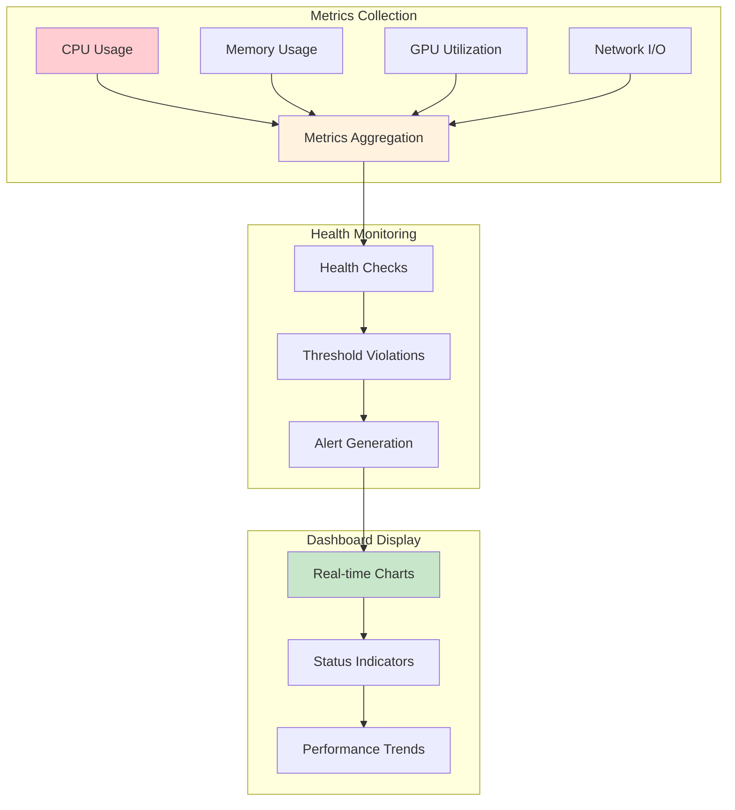

# Performance Monitoring Dashboard

## Overview

Shows real-time system health monitoring with comprehensive performance visualization. This workflow demonstrates how metrics are collected, processed, and displayed for operational insights.

## Workflow Animation

## Database Tables Involved

### Primary Tables

#### `system_metrics`
- **Purpose**: Real-time performance monitoring
- **Key Fields**: CPU, memory, GPU, network, disk metrics
- **Collection**: Every 10 seconds

#### `metrics_aggregations`
- **Purpose**: Pre-computed time-series summaries
- **Windows**: hour|day|week
- **Metrics**: Averages, maximums, totals

#### `system_health_checks`
- **Purpose**: Automated health validation
- **Status**: healthy|warning|critical

## Dashboard Components

### 1. Real-time Metrics
- CPU usage graph (last hour)
- Memory usage graph (last hour)
- GPU utilization graph (last hour)
- Network throughput graph (last hour)

### 2. Status Indicators
- System health: Green/Yellow/Red
- Worker health: Count and status
- Node health: Count and status
- Alert count: Active alerts

### 3. Performance Trends
- 24-hour trends
- 7-day trends
- 30-day trends

## Related Workflows

- [Monitoring Flow](MONITORING-FLOW.md) - Detailed monitoring process
- [Incident Response](INCIDENT-RESPONSE.md) - Handling performance issues

## Related Documentation

- [Schema Diagram](../SCHEMA-DIAGRAM.md) - Complete database structure
- [System Metrics](../../SYSTEM-METRICS.md) - Metrics collection

---

**Performance Dashboard**: Real-time visualization of system health and performance metrics for operational insights.
