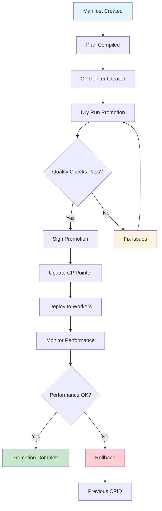
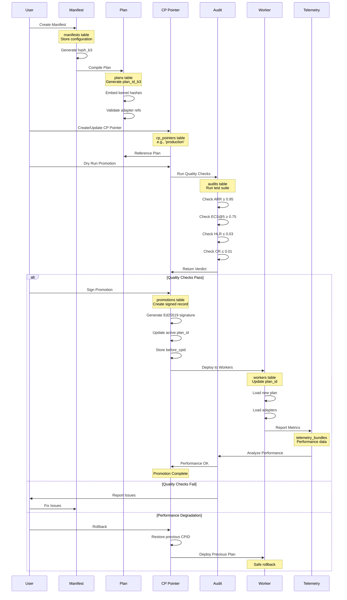
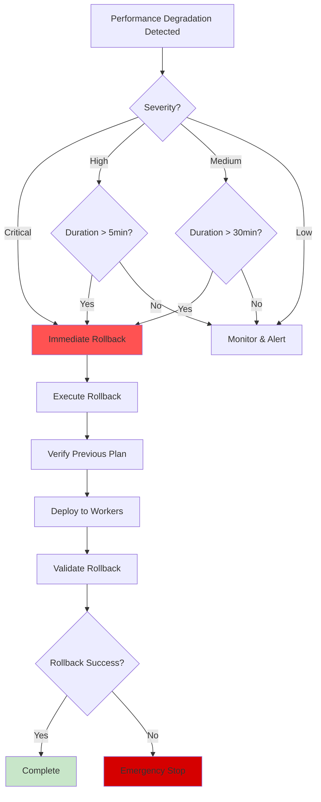

# Promotion Pipeline Workflow

## Overview

Shows the control plane promotion process from manifest creation to production deployment, including quality checks, signing procedures, and rollback mechanisms. This workflow is critical for safe, auditable deployments in production environments.

## Workflow Animation



## Detailed Sequence



## Database Tables Involved

### Primary Tables

#### `manifests`
- **Purpose**: Declarative configuration definitions
- **Key Fields**: `id` (PK), `tenant_id` (FK), `hash_b3` (UK), `body_json`, `created_at`
- **Role**: Source of truth for plan configuration

#### `plans`
- **Purpose**: Compiled execution plans
- **Key Fields**: 
  - `id` (PK), `tenant_id` (FK)
  - `plan_id_b3` (UK) - BLAKE3 hash of compiled plan
  - `manifest_hash_b3` (FK) - References source manifest
  - `kernel_hashes_json` - Embedded kernel verification
  - `layout_hash_b3` - Memory layout hash
  - `metadata_json` - Plan metadata
- **Role**: Immutable deployment unit

#### `cp_pointers`
- **Purpose**: Active plan pointers (production/staging)
- **Key Fields**: 
  - `id` (PK), `tenant_id` (FK)
  - `name` - e.g., 'production', 'staging', 'canary'
  - `plan_id` (FK) - Current active plan
  - `active` - 0=inactive, 1=active
  - `promoted_by` (FK) - User who promoted
  - `promoted_at` - Promotion timestamp
  - `signing_public_key` - Ed25519 public key
- **Role**: Named references to deployed plans

#### `promotions`
- **Purpose**: Signed promotion records
- **Key Fields**: 
  - `id` (PK), `cpid` - Control Plane ID
  - `cp_pointer_id` (FK) - Which pointer was promoted
  - `promoted_by` (FK) - User who promoted
  - `promoted_at` - Promotion timestamp
  - `signature_b64` - Ed25519 signature
  - `signer_key_id` - Key identifier
  - `quality_json` - Quality metrics (ARR, ECS5, HLR, CR)
  - `before_cpid` - Previous CPID for rollback
- **Role**: Audit trail for all promotions

#### `workers`
- **Purpose**: Deployment targets
- **Key Fields**: `id` (PK), `tenant_id` (FK), `node_id` (FK), `plan_id` (FK), `status`
- **Role**: Execute the deployed plan

#### `audits`
- **Purpose**: Quality verification
- **Key Fields**: 
  - `id` (PK), `tenant_id` (FK)
  - `cpid`, `suite_name`, `bundle_id` (FK)
  - `arr`, `ecs5`, `hlr`, `cr`, `nar`, `par` - Quality metrics
  - `verdict` - pass|fail|warn
  - `details_json` - Audit details
  - `before_cpid`, `after_cpid`, `status`
- **Role**: Gate promotions based on quality metrics

### Supporting Tables

#### `telemetry_bundles`
- **Purpose**: Performance monitoring data
- **Key Fields**: `id` (PK), `tenant_id` (FK), `cpid`, `path` (UK), `merkle_root_b3`, `event_count`
- **Role**: Post-deployment performance validation

#### `users`
- **Purpose**: Promotion authorization
- **Key Fields**: `id` (PK), `email`, `role`
- **Role**: Only authorized users can promote

#### `policies`
- **Purpose**: Policy packs per tenant
- **Key Fields**: `id` (PK), `tenant_id` (FK), `hash_b3`, `body_json`, `active`
- **Role**: Enforce promotion policies and quality gates

## Promotion Gates

### Quality Metrics Thresholds

```mermaid
graph LR
    A[Quality Checks] --> B[ARR ≥ 0.95]
    A --> C[ECS@5 ≥ 0.75]
    A --> D[HLR ≤ 0.03]
    A --> E[CR ≤ 0.01]
    A --> F[NAR ≥ 0.90]
    A --> G[PAR ≥ 0.95]
    
    B --> H{All Pass?}
    C --> H
    D --> H
    E --> H
    F --> H
    G --> H
    
    H -->|Yes| I[Approve Promotion]
    H -->|No| J[Block Promotion]
    
    style I fill:#c8e6c9
    style J fill:#ffcdd2
```

### Metric Definitions
- **ARR** (Answer Relevance Rate): ≥ 0.95 - Answers are relevant to questions
- **ECS@5** (Evidence Coverage Score @5): ≥ 0.75 - Top-5 retrieval coverage
- **HLR** (Hallucination Rate): ≤ 0.03 - Fabricated information rate
- **CR** (Conflict Rate): ≤ 0.01 - Contradictory answer rate
- **NAR** (Numeric Accuracy Rate): ≥ 0.90 - Correct numeric values
- **PAR** (Provenance Attribution Rate): ≥ 0.95 - Proper source citation

### Determinism Requirements
- **Metallib Embed**: Required - Precompiled `.metallib` blobs embedded
- **Kernel Hash Match**: Required - Kernel hashes match plan metadata
- **RNG Seeded**: Required - All RNG derived from `seed_global` and HKDF
- **Retrieval Deterministic**: Required - Tie-breaking by `(score desc, doc_id asc)`

### Egress Requirements
- **PF Rules Active**: Required - Packet Filter rules enforced
- **Outbound Blocked**: Required - All outbound connections denied
- **UDS Only**: Required - Unix domain sockets only, no TCP ports

## Rollback Procedure

### Immediate Rollback
```sql
-- 1. Get previous CPID from promotion record
SELECT before_cpid FROM promotions 
WHERE cpid = 'current-cpid' 
ORDER BY promoted_at DESC LIMIT 1;

-- 2. Find plan ID for previous CPID
SELECT plan_id FROM cp_pointers 
WHERE name = 'production' AND created_at = (
  SELECT promoted_at FROM promotions WHERE cpid = 'previous-cpid'
);

-- 3. Update CP pointer to previous plan
UPDATE cp_pointers 
SET plan_id = 'previous-plan-id', 
    promoted_at = CURRENT_TIMESTAMP,
    promoted_by = 'rollback-user-id'
WHERE name = 'production';

-- 4. Update all workers to previous plan
UPDATE workers 
SET plan_id = 'previous-plan-id',
    status = 'draining'
WHERE plan_id = 'current-plan-id';

-- 5. Record rollback promotion
INSERT INTO promotions (cpid, cp_pointer_id, promoted_by, quality_json, before_cpid)
VALUES ('rollback-cpid', 'cp-pointer-id', 'user-id', '{"rollback": true}', 'failed-cpid');
```

### Rollback Decision Tree


## Dry Run Process

### Dry Run Validation
1. **Compile Plan**: Verify plan compiles without errors
2. **Check Adapters**: Verify all referenced adapters exist
3. **Validate Policies**: Ensure policies are satisfied
4. **Run Test Suite**: Execute hallucination metrics suite
5. **Check Determinism**: Verify replay produces same results
6. **Verify Signatures**: Check artifact signatures
7. **Estimate Resources**: Validate memory and compute requirements

### Dry Run Response Structure
```json
{
  "status": "pass|fail|warn",
  "gates_status": [
    {"gate": "arr", "status": "pass", "value": 0.97, "threshold": 0.95},
    {"gate": "ecs5", "status": "pass", "value": 0.82, "threshold": 0.75},
    {"gate": "hlr", "status": "pass", "value": 0.01, "threshold": 0.03},
    {"gate": "cr", "status": "pass", "value": 0.005, "threshold": 0.01}
  ],
  "warnings": [
    "Adapter X has low activation rate (1.2%)"
  ],
  "errors": [],
  "estimated_memory_gb": 12.5,
  "estimated_latency_p95_ms": 22
}
```

## Related Workflows

- [Adapter Lifecycle](ADAPTER-LIFECYCLE.md) - How adapters are deployed with plans
- [Monitoring Flow](MONITORING-FLOW.md) - Post-deployment performance monitoring
- [Incident Response](INCIDENT-RESPONSE.md) - Handling promotion failures

## Related Documentation

- [Schema Diagram](../SCHEMA-DIAGRAM.md) - Complete database structure
- [Control Plane](../../CONTROL-PLANE.md) - Control plane architecture
- [Runaway Prevention](../../RUNAWAY-PREVENTION.md) - Safety mechanisms
- [Deployment Guide](../../DEPLOYMENT.md) - Deployment procedures

## Implementation References

### Rust Crates
- `crates/adapteros-lora-plan/src/lib.rs` - Plan compilation
- `crates/adapteros-policy/src/lib.rs` - Policy enforcement
- `crates/adapteros-crypto/src/lib.rs` - Signing and verification
- `crates/adapteros-db/src/promotions.rs` - Promotion database operations

### API Endpoints
- `POST /v1/manifests` - Create manifest
- `POST /v1/plans` - Compile plan
- `POST /v1/promotions/dry-run` - Dry run promotion
- `POST /v1/promotions` - Execute promotion
- `POST /v1/promotions/:id/rollback` - Rollback promotion
- `GET /v1/promotions/history` - Get promotion history

## Example Scenarios

### Scenario 1: Successful Promotion
```bash
# 1. Create manifest
curl -X POST /v1/manifests \
  -H "Content-Type: application/json" \
  -d '{"config": {...}, "adapters": [...]}'

# 2. Compile plan
curl -X POST /v1/plans \
  -d '{"manifest_hash": "b3:..."}'

# 3. Dry run
curl -X POST /v1/promotions/dry-run \
  -d '{"plan_id": "plan-123", "cp_pointer": "production"}'

# 4. Promote
curl -X POST /v1/promotions \
  -d '{"plan_id": "plan-123", "cp_pointer": "production", "signature": "..."}'
```

### Scenario 2: Failed Promotion with Rollback
```bash
# 1. Detect performance degradation
curl /v1/metrics/system
# Returns: latency_p95 = 250ms (threshold: 24ms)

# 2. Initiate rollback
curl -X POST /v1/promotions/current/rollback \
  -d '{"reason": "Performance degradation", "severity": "critical"}'

# 3. Verify rollback
curl /v1/promotions/history
# Confirms rollback to previous CPID
```

## Best Practices

### Before Promotion
- Run comprehensive test suite on staging CP pointer
- Validate all quality gates pass
- Review adapter activation patterns
- Check memory and compute capacity
- Verify rollback plan is available

### During Promotion
- Monitor real-time metrics dashboard
- Watch for error rate spikes
- Track latency percentiles (p50, p95, p99)
- Verify worker health checks
- Monitor memory pressure

### After Promotion
- Capture telemetry bundles for analysis
- Run post-deployment audit
- Update documentation with CPID
- Archive promotion artifacts
- Review lessons learned

### Rollback Triggers
- **Automatic**: Latency p95 > 2x baseline for 5+ minutes
- **Automatic**: Error rate > 5% for 2+ minutes
- **Automatic**: Memory pressure > 85% sustained
- **Manual**: Quality degradation observed
- **Manual**: Compliance violation detected

---

**Promotion Pipeline**: Safe, auditable deployments with comprehensive quality gates, signing procedures, and instant rollback capabilities.
