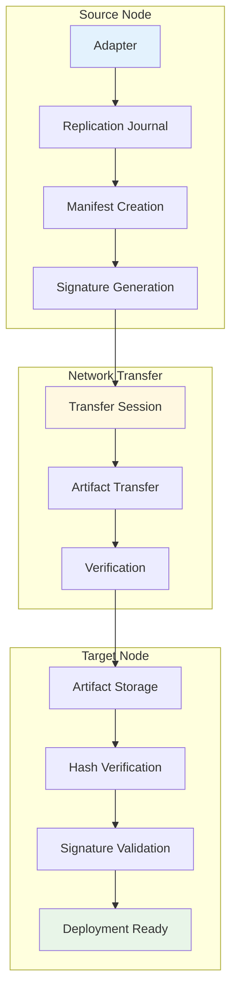

# Replication & Distribution Workflow

## Overview

Shows how artifacts are replicated across nodes for horizontal scaling and high availability. This workflow ensures consistent artifact distribution with cryptographic verification across the distributed infrastructure.

## Workflow Animation



## Database Tables Involved

### Primary Tables

#### `replication_journal`
- **Purpose**: Cross-node replication sessions with manifest signing
- **Key Fields**:
  - `session_id` (PK) - UUID primary key
  - `from_node` (FK) - References nodes.id
  - `to_node` (FK) - References nodes.id
  - `bytes` - Total bytes transferred
  - `artifacts` - Number of artifacts replicated
  - `started_at`, `completed_at` - Session timestamps
  - `result` - success|failed|partial
  - `error_message` - Error details
  - `manifest_b3` - BLAKE3 hash of replication manifest
  - `signature` - Ed25519 signature of manifest

#### `replication_artifacts`
- **Purpose**: Individual artifact transfers with verification
- **Key Fields**:
  - `id` (PK) - Auto-increment primary key
  - `session_id` (FK) - References replication_journal.session_id
  - `adapter_id` (FK) - References adapters.id
  - `artifact_hash` - BLAKE3 hash of artifact
  - `size_bytes` - Artifact size in bytes
  - `transferred_at` - Transfer completion timestamp
  - `verified` - Hash verification status (boolean)

#### `nodes`
- **Purpose**: Worker host management
- **Key Fields**: `id` (PK), `hostname` (UK), `agent_endpoint`, `status`, `last_seen_at`, `labels_json`

#### `artifacts`
- **Purpose**: Content-addressed storage
- **Key Fields**: `hash_b3` (PK), `kind`, `signature_b64`, `sbom_hash_b3`, `size_bytes`

#### `adapters`
- **Purpose**: LoRA adapters to be replicated
- **Key Fields**: `id` (PK), `tenant_id` (FK), `hash_b3` (UK), `name`, `tier`

## Replication Process

### 1. Initiate Replication
```sql
-- Create replication session
INSERT INTO replication_journal (session_id, from_node, to_node, started_at, result, manifest_b3)
VALUES ('session-001', 'node-a', 'node-b', CURRENT_TIMESTAMP, 'in_progress', 'b3:...');
```

### 2. Transfer Artifacts
```sql
-- Record artifact transfer
INSERT INTO replication_artifacts (session_id, adapter_id, artifact_hash, size_bytes, transferred_at, verified)
VALUES ('session-001', 'adapter-001', 'b3:...', 52428800, CURRENT_TIMESTAMP, false);
```

### 3. Verify Transfer
```sql
-- Verify artifact hash matches
UPDATE replication_artifacts
SET verified = true
WHERE session_id = 'session-001' AND artifact_hash = 'b3:...';
```

### 4. Complete Session
```sql
-- Mark session complete
UPDATE replication_journal
SET completed_at = CURRENT_TIMESTAMP, result = 'success',
    bytes = (SELECT SUM(size_bytes) FROM replication_artifacts WHERE session_id = 'session-001'),
    artifacts = (SELECT COUNT(*) FROM replication_artifacts WHERE session_id = 'session-001')
WHERE session_id = 'session-001';
```

## Related Workflows

- [Adapter Lifecycle](adapter-lifecycle.md) - Adapter deployment
- [Security & Compliance](security-compliance.md) - Signature verification

## Related Documentation

- [Schema Diagram](../schema-diagram.md) - Complete database structure
- [System Architecture](../../architecture.md) - Overall system design

---

**Replication & Distribution**: Secure, verified artifact replication across nodes for horizontal scaling and high availability.
