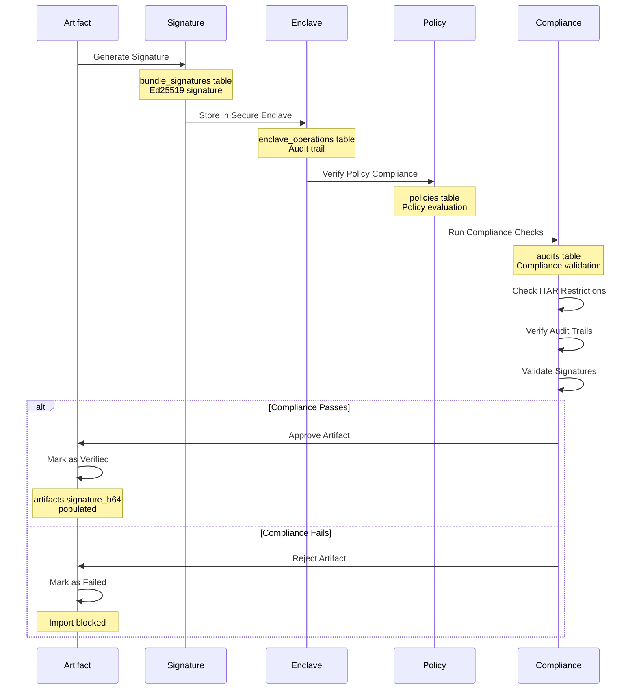
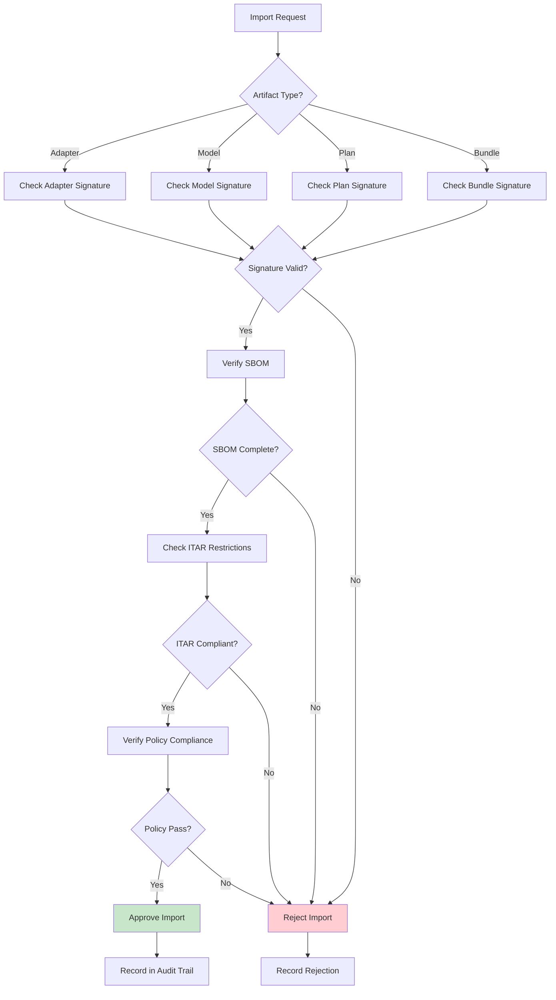
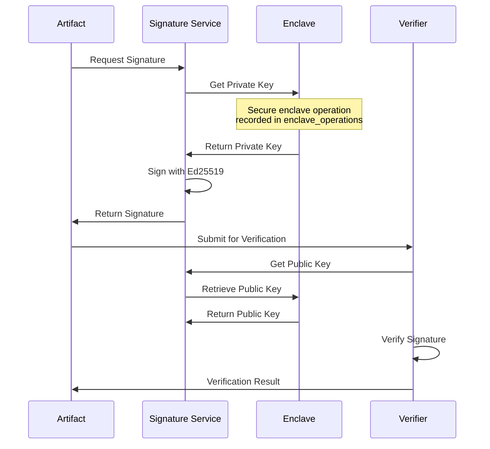
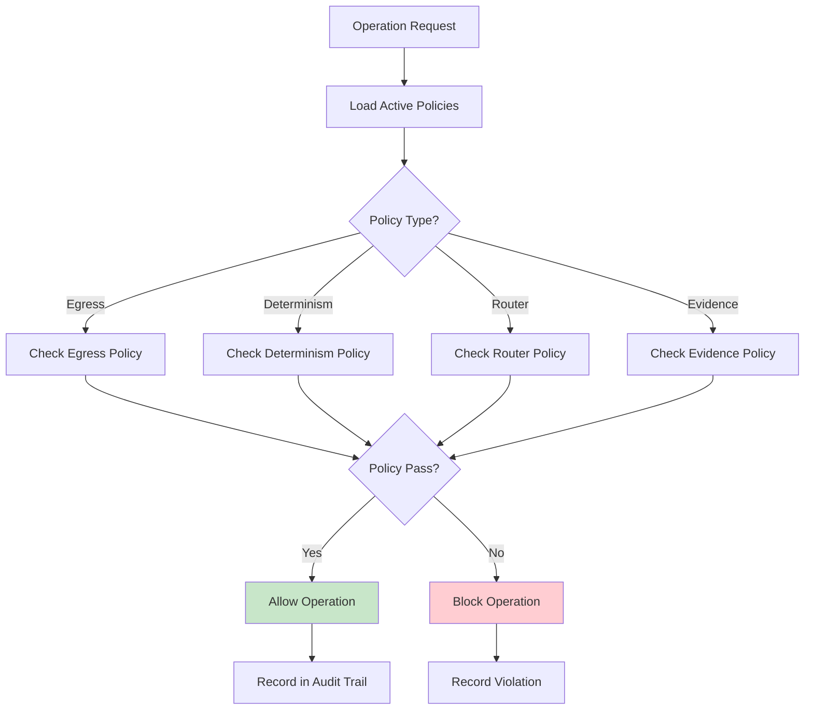

# Security & Compliance Workflow

## Overview

Shows the security and compliance verification process, including artifact signature generation, secure enclave operations, policy compliance checks, and ITAR restriction enforcement. This workflow ensures cryptographic verification and audit trail completeness.

## Workflow Animation



## Database Tables Involved

### Primary Tables

#### `artifacts`
- **Purpose**: Content-addressed storage with signatures
- **Key Fields**:
  - `hash_b3` (PK) - BLAKE3 hash as primary key
  - `kind` - model|adapter|metallib|sbom|plan|bundle
  - `signature_b64` - Ed25519 signature (base64)
  - `sbom_hash_b3` - BLAKE3 hash of SBOM
  - `size_bytes` - Artifact size
  - `imported_by` (FK) - References users.id
  - `imported_at` - ISO timestamp
- **Security**: All imports require valid signature and SBOM

#### `bundle_signatures`
- **Purpose**: Cryptographic verification and provenance
- **Key Fields**:
  - `id` (PK) - UUID primary key
  - `bundle_hash_b3` (UK) - BLAKE3 hash of bundle
  - `cpid` - Control Plane ID
  - `signature_hex` - Ed25519 signature (hex)
  - `public_key_hex` - Ed25519 public key (hex)
  - `created_at` - ISO timestamp
- **Verification**: All bundles signed before deployment

#### `enclave_operations`
- **Purpose**: Secure enclave audit trail
- **Key Fields**:
  - `id` (PK) - UUID primary key
  - `timestamp` - Unix timestamp
  - `operation` - sign|seal|unseal|get_public_key
  - `requester` - Operation requester
  - `artifact_hash` - Artifact hash
  - `result` - success|error
  - `error_message` - Error details
  - `created_at` - ISO timestamp
- **Operations**: All enclave operations audited

#### `key_metadata`
- **Purpose**: Cryptographic key lifecycle management
- **Key Fields**:
  - `key_label` (PK) - Key label
  - `created_at` - Creation timestamp
  - `source` - keychain|manual
  - `key_type` - signing|encryption
  - `last_checked` - Last check timestamp
- **Key Rotation**: Keys rotated at each CP promotion

#### `policies`
- **Purpose**: Policy packs per tenant with versioning
- **Key Fields**:
  - `id` (PK), `tenant_id` (FK)
  - `hash_b3` - BLAKE3 hash of policy content
  - `body_json` - Policy configuration (JSON)
  - `active` - 0=inactive, 1=active
  - `created_at` - ISO timestamp
- **Enforcement**: Policy checks gate all critical operations

#### `audits`
- **Purpose**: Comprehensive hallucination metrics and compliance checks
- **Key Fields**:
  - `id` (PK), `tenant_id` (FK)
  - `cpid` - Control Plane ID
  - `suite_name` - Test suite name
  - `bundle_id` (FK) - References telemetry_bundles.id
  - `arr`, `ecs5`, `hlr`, `cr`, `nar`, `par` - Quality metrics
  - `verdict` - pass|fail|warn
  - `details_json` - Audit details (JSON)
  - `before_cpid`, `after_cpid`, `status`
- **Compliance Gates**: All promotions require passing audits

### Supporting Tables

#### `tenants`
- **Purpose**: ITAR-compliant multi-tenant isolation
- **Key Fields**: `id` (PK), `name` (UK), `itar_flag`, `created_at`
- **ITAR Flag**: `1` = ITAR restricted, `0` = no restrictions

#### `users`
- **Purpose**: Multi-role authentication with Argon2 password hashing
- **Key Fields**: `id` (PK), `email` (UK), `role`, `pw_hash`, `disabled`
- **Roles**: admin|operator|sre|compliance|auditor|viewer

#### `jwt_secrets`
- **Purpose**: Cryptographic token rotation with BLAKE3 hashing
- **Key Fields**: `id` (PK), `secret_hash`, `not_before`, `not_after`, `active`
- **Rotation**: Regular rotation for security

## Compliance Verification Flow



## ITAR Compliance Checks

### ITAR Restricted Operations
1. **Cross-tenant Data Access**: Blocked for ITAR tenants
2. **Export Control**: Artifacts cannot be exported
3. **User Access**: Only authorized personnel can access
4. **Audit Trail**: All access attempts logged
5. **Network Egress**: All outbound connections blocked

### ITAR Verification Query
```sql
-- Check if operation violates ITAR restrictions
SELECT 
  t.id,
  t.name,
  t.itar_flag,
  COUNT(a.id) as artifact_count
FROM tenants t
LEFT JOIN artifacts a ON a.tenant_id = t.id
WHERE t.itar_flag = 1
GROUP BY t.id, t.name, t.itar_flag;

-- Verify no cross-tenant access for ITAR tenant
SELECT * FROM audit_trail
WHERE tenant_id = 'itar-tenant-id'
  AND operation = 'cross_tenant_access'
  AND result = 'blocked';
```

## Signature Verification

### Ed25519 Signature Verification


### Signature Verification Query
```sql
-- Verify artifact signature
SELECT 
  a.hash_b3,
  a.kind,
  a.signature_b64,
  bs.signature_hex,
  bs.public_key_hex,
  bs.created_at
FROM artifacts a
LEFT JOIN bundle_signatures bs ON a.hash_b3 = bs.bundle_hash_b3
WHERE a.hash_b3 = 'artifact-hash';

-- Verify all signatures for CPID
SELECT * FROM bundle_signatures
WHERE cpid = 'current-cpid'
ORDER BY created_at DESC;
```

## SBOM Validation

### SBOM Requirements
1. **Completeness**: All dependencies listed
2. **Version Pinning**: Exact versions specified
3. **License Compliance**: Compatible licenses only
4. **Vulnerability Scan**: No known CVEs
5. **Provenance**: Source and build info included

### SBOM Verification
```json
{
  "sbom_version": "2.0",
  "artifact_hash": "b3:...",
  "components": [
    {
      "name": "tokio",
      "version": "1.35.0",
      "license": "MIT",
      "source": "https://crates.io/crates/tokio/1.35.0"
    }
  ],
  "build_info": {
    "builder": "rust-1.75.0",
    "timestamp": "2025-10-09T00:00:00Z",
    "reproducible": true
  }
}
```

## Policy Enforcement

### Policy Check Flow


### Policy Evaluation Query
```sql
-- Evaluate policy compliance for tenant
SELECT 
  p.id,
  p.hash_b3,
  p.active,
  JSON_EXTRACT(p.body_json, '$.egress.mode') as egress_mode,
  JSON_EXTRACT(p.body_json, '$.determinism.require_kernel_hash_match') as determinism_required
FROM policies p
WHERE p.tenant_id = 'tenant-id'
  AND p.active = 1
ORDER BY p.created_at DESC
LIMIT 1;
```

## Audit Trail

### Audit Events
1. **Artifact Import**: All imports logged with signature
2. **Enclave Operations**: All key operations recorded
3. **Policy Violations**: All violations tracked
4. **ITAR Access**: All access attempts logged
5. **Signature Verification**: All verifications recorded

### Audit Query
```sql
-- Generate audit report for compliance review
SELECT 
  a.id,
  a.cpid,
  a.suite_name,
  a.verdict,
  a.arr,
  a.ecs5,
  a.hlr,
  a.cr,
  a.created_at,
  u.email as auditor
FROM audits a
JOIN users u ON a.created_by = u.id
WHERE a.tenant_id = 'tenant-id'
  AND a.created_at >= DATE_SUB(NOW(), INTERVAL 30 DAY)
ORDER BY a.created_at DESC;
```

## Related Workflows

- [Promotion Pipeline](promotion-pipeline.md) - Deployment with quality gates
- [Adapter Lifecycle](adapter-lifecycle.md) - Adapter provenance tracking
- [Monitoring Flow](monitoring-flow.md) - Security event monitoring

## Related Documentation

- [Schema Diagram](../schema-diagram.md) - Complete database structure
- [Runaway Prevention](../../runaway-prevention.md) - Safety mechanisms
- [Code Policies](../../code-intelligence/code-policies.md) - Policy configuration

## Implementation References

### Rust Crates
- `crates/adapteros-crypto/src/lib.rs` - Cryptographic operations
- `crates/adapteros-policy/src/lib.rs` - Policy enforcement
- `crates/adapteros-secd/src/lib.rs` - Secure enclave operations
- `crates/adapteros-artifacts/src/lib.rs` - Artifact verification

### API Endpoints
- `POST /v1/artifacts/import` - Import artifact with signature
- `POST /v1/artifacts/verify` - Verify artifact signature
- `GET /v1/policies` - Get active policies
- `POST /v1/audits` - Create audit record
- `GET /v1/enclave/operations` - Get enclave audit trail

## Best Practices

### Artifact Security
- Always sign artifacts with Ed25519
- Include complete SBOM with all dependencies
- Verify signatures before import
- Store keys in secure enclave
- Rotate signing keys at CP promotion

### ITAR Compliance
- Flag ITAR tenants explicitly
- Block all cross-tenant access for ITAR
- Audit all access attempts
- Enforce egress deny-all policy
- Regular compliance reviews

### Policy Management
- Keep policies versioned and hashed
- Test policies before activation
- Document all policy changes
- Regular policy audits
- Emergency policy rollback procedures

### Audit Trail Management
- Log all security-relevant operations
- Retain audit logs per compliance requirements
- Regular audit trail reviews
- Automated anomaly detection
- Incident response procedures documented

---

**Security & Compliance**: Comprehensive cryptographic verification, ITAR compliance, policy enforcement, and complete audit trail for regulatory compliance.
