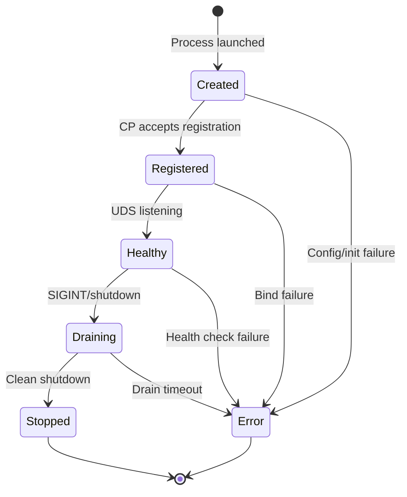
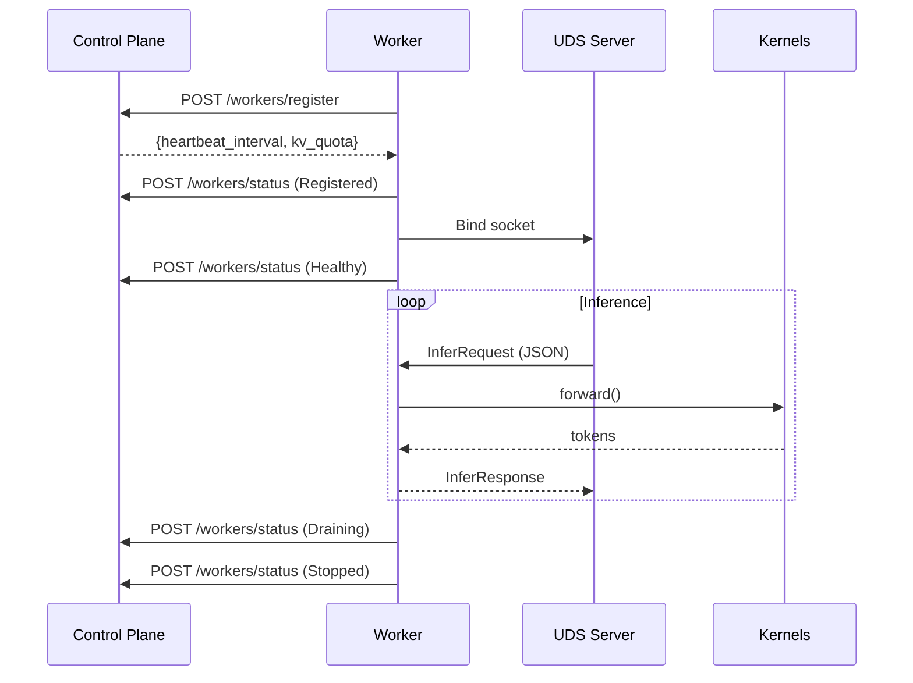
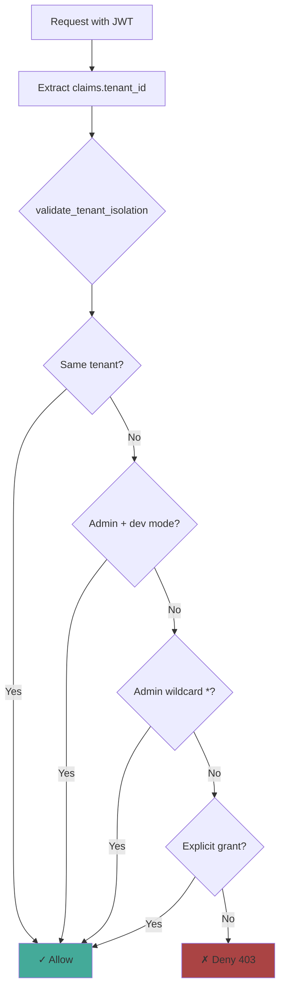
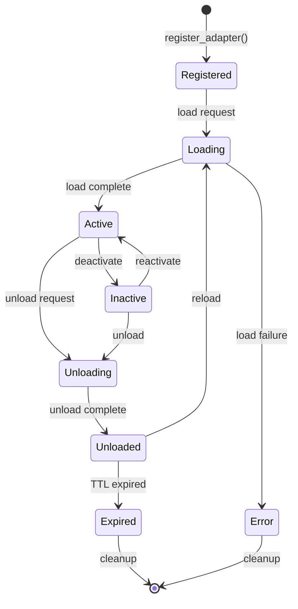
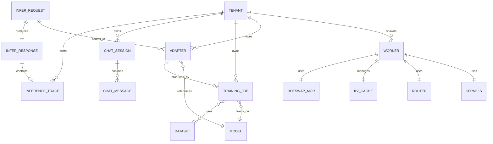
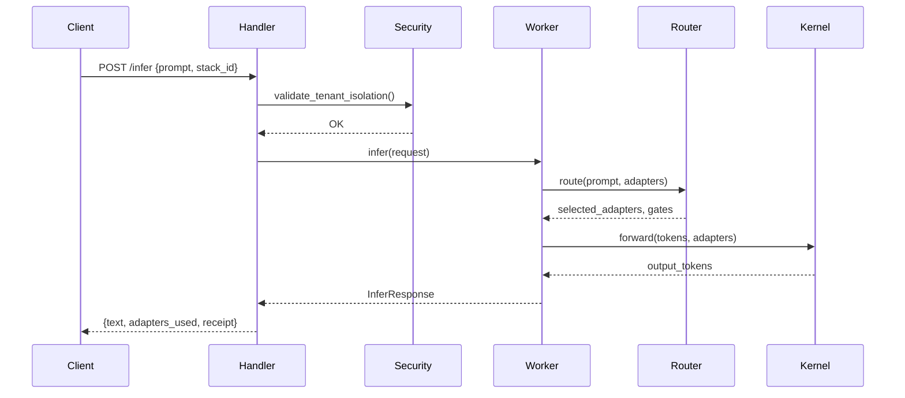
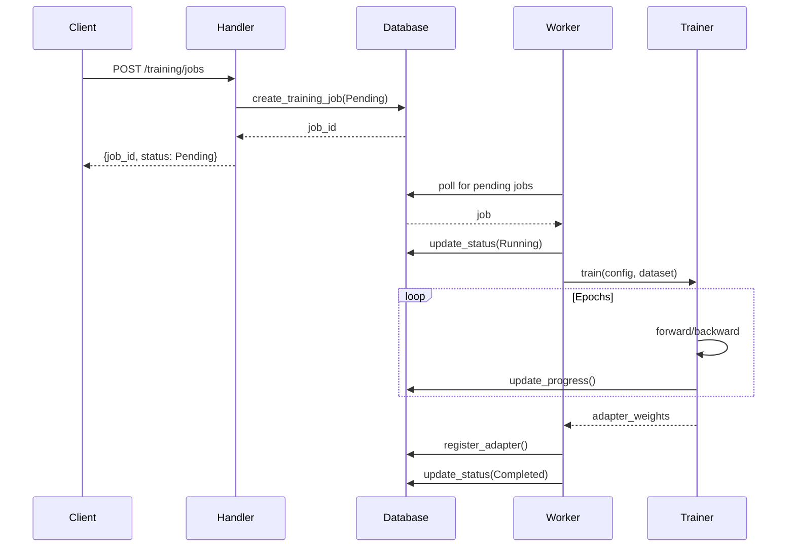
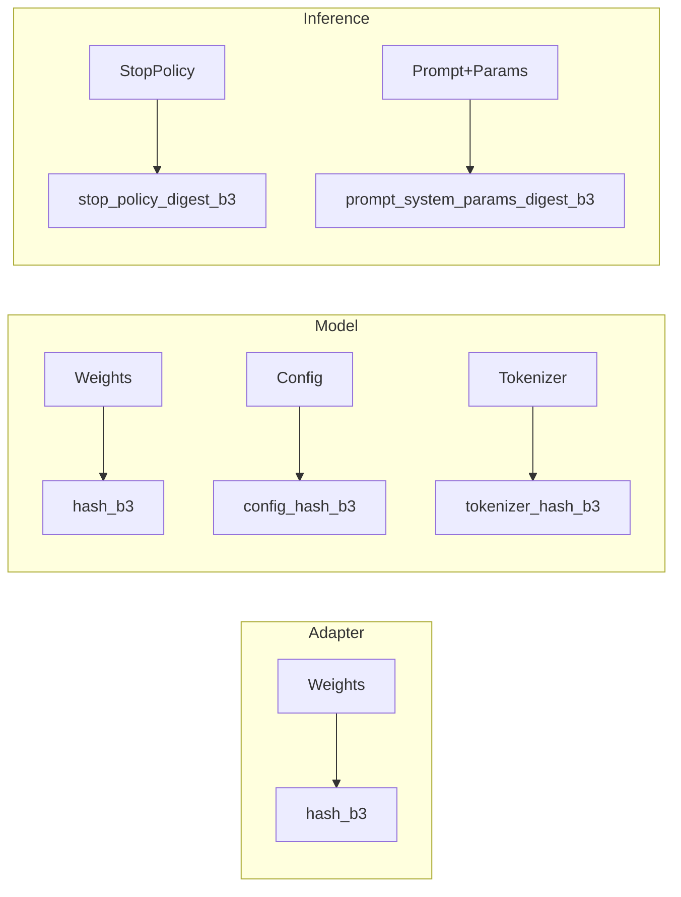
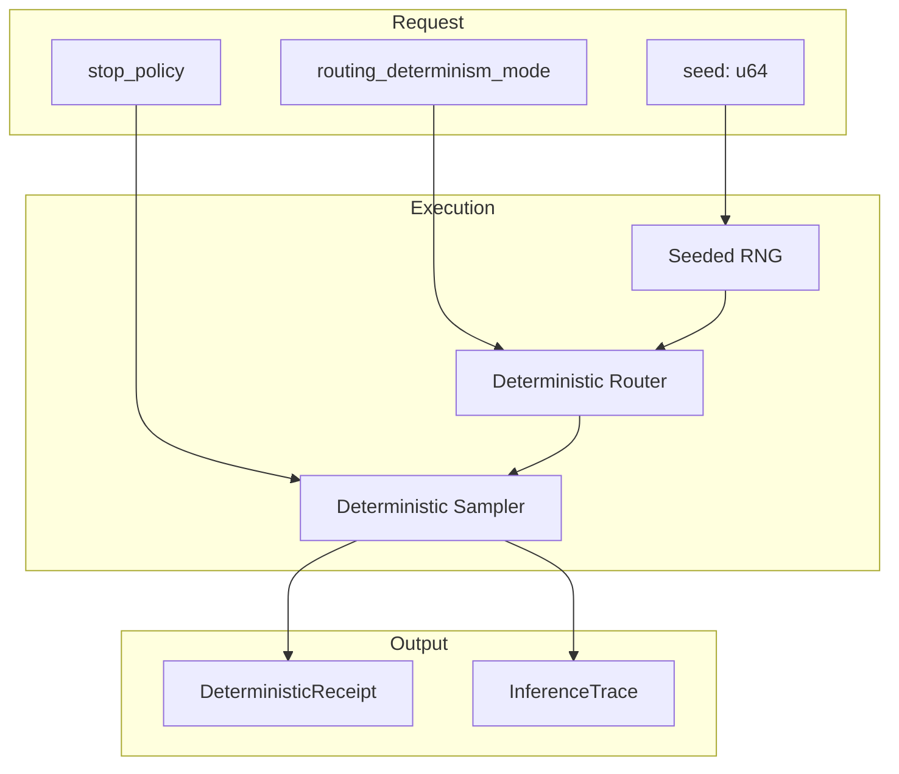

# Critical Function Glossary

> **Validated**: All locations and signatures verified against source code.

## Quick Reference

| Entity | Purpose | Location (Verified) |
|--------|---------|---------------------|
| **Worker** | Inference/training execution | `lora-worker/src/lib.rs:1109` |
| **Tenant** | Multi-tenancy isolation | `core/src/tenant.rs:65` |
| **Adapter** | LoRA adapter lifecycle | `types/src/adapters/metadata.rs:53` |
| **Model** | Base model management | `db/src/models.rs` |
| **Backend** | Execution backend | `core/src/backend.rs:15` |
| **WorkerStatus** | Worker lifecycle states | `core/src/worker_status.rs:55` |

---

## 1. WORKERS

### Worker Struct
**Location:** `crates/adapteros-lora-worker/src/lib.rs:1109`

```rust
pub struct Worker<K: FusedKernels + StrictnessControl + Send + Sync> {
    manifest: ManifestV3,
    policy: PolicyEngine,
    router: Router,
    kernels: Arc<Mutex<K>>,
    kv_cache: Arc<Mutex<KvCache>>,
    hotswap: Arc<HotSwapManager<K>>,
    worker_id: u32,
    // ... safety mechanisms
}
```

### Worker Lifecycle State Machine
**Location:** `crates/adapteros-core/src/worker_status.rs:55`



**Valid Transitions (from source):**
```rust
WorkerStatus::Created    => [Registered, Error]
WorkerStatus::Registered => [Healthy, Error]
WorkerStatus::Healthy    => [Draining, Error]
WorkerStatus::Draining   => [Stopped, Error]
WorkerStatus::Stopped    => []  // terminal
WorkerStatus::Error      => []  // terminal
```

### Worker Communication Flow



### Kernel Types

| Type | Location | Purpose |
|------|----------|---------|
| `DirectKernels` | lib.rs:335 | Single backend, no fallback |
| `CoordinatedKernels` | lib.rs:351 | Primary + fallback |
| `KernelWrapper` | lib.rs:380 | Unified enum |

---

## 2. BACKENDS

### BackendKind Enum
**Location:** `crates/adapteros-core/src/backend.rs:15`

```rust
pub enum BackendKind {
    Auto,      // Deterministic auto-selection
    CoreML,    // CoreML/ANE (macOS)
    Mlx,       // MLX FFI
    MlxBridge, // MLX subprocess (MoE)
    Metal,     // Metal GPU
    CPU,       // CPU-only
}
```

### Backend Fallback Chain


**From source** (`backend.rs:64-74`):
```rust
pub fn inference_priority() -> &'static [BackendKind] {
    static ORDER: [BackendKind; 5] = [
        BackendKind::CoreML,
        BackendKind::Mlx,
        BackendKind::MlxBridge,
        BackendKind::Metal,
        BackendKind::CPU,
    ];
    &ORDER
}
```

---

## 3. TENANTS

### TenantId
**Location:** `crates/adapteros-core/src/tenant.rs:65`

```rust
pub struct TenantId(String);  // 1-64 chars, alphanumeric
```

**Validation Rules:**
- 1-64 characters
- Start/end with alphanumeric
- May contain `-` and `_`
- No path traversal (`..`, `/`, `\`)

**Special Values:**
- `"primary"` - Single-tenant default
- `"system"` - System operations

### Tenant Isolation Flow



### Critical Isolation Functions

| Function | Location | Signature |
|----------|----------|-----------|
| `validate_tenant_isolation` | `server-api/src/security/mod.rs:125` | `(claims: &Claims, resource_tenant_id: &str) -> Result<()>` |
| `check_tenant_access` | `server-api/src/security/mod.rs` | `(claims: &Claims, resource_tenant_id: &str) -> bool` |

### Tenant-Scoped DB Queries (All include `WHERE tenant_id = ?`)

| Function | Location |
|----------|----------|
| `list_adapters_for_tenant()` | `db/src/adapters.rs` |
| `get_adapter_for_tenant()` | `db/src/adapters.rs` |
| `get_training_jobs_for_tenant()` | `db/src/training_jobs.rs` |
| `list_workers_by_tenant()` | `db/src/workers.rs` |

---

## 4. ADAPTERS

### AdapterMetadata
**Location:** `crates/adapteros-types/src/adapters/metadata.rs:53`

```rust
pub struct AdapterMetadata {
    pub adapter_id: String,
    pub name: String,
    pub hash_b3: String,      // BLAKE3 content hash
    pub rank: i32,            // LoRA rank
    pub tier: i32,            // Memory tier
    pub languages: Vec<String>,
    pub framework: Option<String>,
    pub domain: Option<String>,
    pub scope_path: Option<String>,
    pub lora_tier: Option<LoraTier>,
    pub lora_strength: Option<f32>,
}
```

### Adapter Lifecycle States
**Location:** `crates/adapteros-types/src/adapters/metadata.rs:227`



**From source** (`metadata.rs:227-251`):
```rust
pub enum LifecycleState {
    Registered,  // Registered but not loaded
    Loading,     // Currently loading
    Active,      // Ready for inference
    Inactive,    // Temporarily inactive
    Unloading,   // Being unloaded
    Unloaded,    // Unloaded from memory
    Expired,     // Marked for deletion
    Error,       // Error state
}
```

### Memory Tiers

| Tier | Value | Location | Latency |
|------|-------|----------|---------|
| Metal GPU | 0 | VRAM | ~1ms |
| System RAM | 1 | RAM | ~5ms |
| Disk | 2 | SSD/NVMe | ~50ms |

---

## 5. ENTITY RELATIONSHIPS



---

## 6. REQUEST/RESPONSE FLOW

### Inference Pipeline



### Training Pipeline



---

## 7. CRITICAL FUNCTIONS BY IMPACT

### Changes to Worker affect:

| Function | Location | Impact |
|----------|----------|--------|
| `Worker::new()` | lib.rs:1160 | Initialization, kernel setup |
| `Worker::infer()` | lib.rs:1678 | All inference requests |
| `UdsServer::handle_request()` | uds_server.rs | IPC protocol |
| `StrictnessControl` impls | lib.rs:265 | Backend selection |

### Changes to Tenant affect:

| Function | Location | Impact |
|----------|----------|--------|
| `validate_tenant_isolation()` | security/mod.rs:125 | Every endpoint |
| `list_*_for_tenant()` | db/*.rs | All list queries |
| `TenantKvQuotaManager` | kv_quota.rs | Cache allocation |
| `NodeAgent::spawn_worker()` | node/agent.rs | Worker isolation |

### Changes to Adapter affect:

| Function | Location | Impact |
|----------|----------|--------|
| `Router::route()` | router/mod.rs | Adapter selection |
| `HotSwapManager::swap()` | hot_swap.rs | Runtime loading |
| `register_adapter()` | db/adapters.rs | Adapter creation |
| Training packager | training/packager.rs | Adapter output |

### Changes to Backend affect:

| Function | Location | Impact |
|----------|----------|--------|
| `BackendKind::inference_priority()` | backend.rs:64 | Fallback order |
| Kernel creation | aos_worker.rs | Worker init |
| `CoordinatedKernels` | lib.rs:351 | Fallback logic |
| `FusedKernels` impls | kernel crates | All inference |

---

## 8. CONTENT ADDRESSING

All major entities use BLAKE3 hashing for integrity:



---

## 9. DETERMINISTIC EXECUTION



**Key fields for reproducibility:**
- `InferRequest.seed` - Random seed
- `InferRequest.routing_determinism_mode` - Router behavior
- `InferRequest.stop_policy` - Deterministic stop
- `DeterministicReceipt` - Audit trail

---

## 10. QUICK LOOKUP TABLE

| What | Where | Line |
|------|-------|------|
| Worker struct | `lora-worker/src/lib.rs` | 1109 |
| Worker::new() | `lora-worker/src/lib.rs` | 1160 |
| Worker::infer() | `lora-worker/src/lib.rs` | 1678 |
| WorkerStatus enum | `core/src/worker_status.rs` | 55 |
| BackendKind enum | `core/src/backend.rs` | 15 |
| inference_priority() | `core/src/backend.rs` | 64 |
| TenantId struct | `core/src/tenant.rs` | 65 |
| validate_tenant_isolation() | `server-api/src/security/mod.rs` | 125 |
| AdapterMetadata struct | `types/src/adapters/metadata.rs` | 53 |
| LifecycleState enum | `types/src/adapters/metadata.rs` | 227 |
| UdsServer struct | `lora-worker/src/uds_server.rs` | 63 |
| Router struct | `lora-router/src/lib.rs` | - |
| HotSwapManager | `aos/src/hot_swap.rs` | - |
