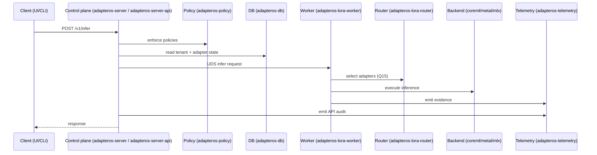
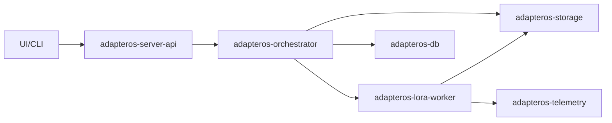
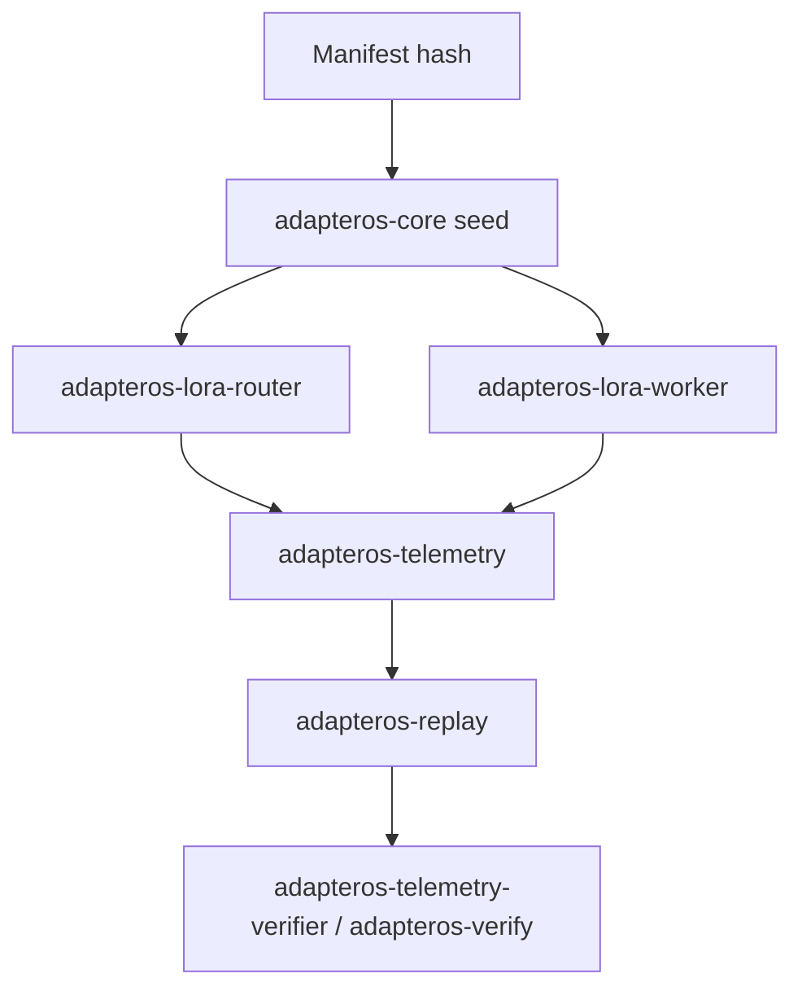
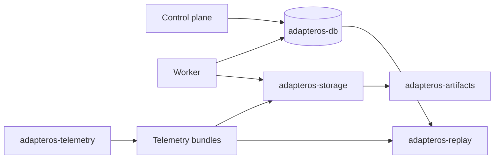

# adapterOS Codebase Map (Audit)

Purpose: Provide a code-level map of adapterOS components, their roles, and how they connect at runtime. This is a conceptual interaction map, not a compile-time dependency graph.

Scope:
- Control plane, workers, router, backends, storage, policy, telemetry, replay, CLI/UI, and tooling.
- Sources: workspace members in `Cargo.toml` and existing architecture documentation.

Non-goal:
- Exact crate dependency edges. For build-graph accuracy, use `cargo metadata` or `cargo tree`.

---

## Vocabulary (audit view)

Use `docs/GLOSSARY.md` for canonical definitions. This list is a quick orientation for this audit.

- Control plane: API + orchestration layer (`adapteros-server`, `adapteros-server-api`).
- Worker: Per-tenant inference/training executor (`adapteros-lora-worker`).
- Router: K-sparse adapter selector with Q15 gates (`adapteros-lora-router`).
- Backend: Execution kernel implementations (CoreML, Metal, MLX crates).
- DIR: Deterministic Inference Runtime, core deterministic engine (see `docs/DETERMINISM.md`).
- TAS: Token Artifact System, reusable inference artifacts (see `README.md`).
- Tenant: Top-level isolation unit for data and execution.
- Adapter: LoRA module with lifecycle and router gates.
- Stack: Tenant-scoped adapter set + workflow rules.
- Manifest: Versioned configuration + hash for determinism seeds.
- Policy pack: Enforced behavior contract (`adapteros-policy`).
- Telemetry bundle: Signed event bundles used for audit and replay.
- Replay: Deterministic re-execution and verification (`adapteros-replay`).
- UDS: Unix domain sockets for CP <-> worker communication.

---

## Codebase taxonomy (by layer)

This table is representative, not exhaustive. See the inventory for the full list.

| Layer | Role | Primary crates |
| --- | --- | --- |
| Clients | User entry points | `adapteros-cli`, `adapteros-tui`, `adapteros-ui` |
| Control plane | HTTP API, auth, policy hooks, orchestration | `adapteros-server`, `adapteros-server-api`, `adapteros-orchestrator`, `adapteros-service-supervisor` |
| Worker + routing | Inference/training execution and adapter routing | `adapteros-lora-worker`, `adapteros-lora-router`, `adapteros-lora-lifecycle`, `adapteros-lora-plan` |
| Backends | Kernel implementations | `adapteros-lora-kernel-coreml`, `adapteros-lora-kernel-mtl`, `adapteros-lora-mlx-ffi`, `adapteros-lora-kernel-api` |
| Data + storage | Relational DB and content-addressed storage | `adapteros-db`, `adapteros-storage`, `adapteros-artifacts`, `adapteros-registry`, `adapteros-manifest` |
| Observability + policy | Enforcement and audit trail | `adapteros-policy`, `adapteros-telemetry`, `adapteros-trace`, `adapteros-telemetry-verifier` |
| Determinism + replay | Seed derivation, replay verification | `adapteros-core`, `adapteros-deterministic-exec`, `adapteros-replay` |
| Tooling | Build/test/maintenance | `xtask`, `sign-migrations`, `fuzz` |

---

## Mermaid diagrams

Legend:
- Boxes are logical groups, not strict build graph boundaries.
- Arrows show runtime interaction or data flow.

### 1) Runtime layers (macro view)

```mermaid
flowchart TB
    subgraph Clients
        UI[adapteros-ui (Leptos)]
        CLI[adapteros-cli]
        TUI[adapteros-tui]
    end

    subgraph ControlPlane
        Server[adapteros-server]
        API[adapteros-server-api]
        Orchestrator[adapteros-orchestrator]
        Supervisor[adapteros-service-supervisor]
    end

    subgraph WorkerLayer
        Worker[adapteros-lora-worker]
        Router[adapteros-lora-router]
        Lifecycle[adapteros-lora-lifecycle]
    end

    subgraph Backends
        CoreML[adapteros-lora-kernel-coreml]
        Metal[adapteros-lora-kernel-mtl]
        MLX[adapteros-lora-mlx-ffi]
    end

    subgraph Data
        DB[adapteros-db]
        Storage[adapteros-storage]
        Artifacts[adapteros-artifacts]
        Manifest[adapteros-manifest]
        Registry[adapteros-registry]
    end

    subgraph ObservabilityPolicy
        Policy[adapteros-policy]
        Telemetry[adapteros-telemetry]
        Trace[adapteros-trace]
        Replay[adapteros-replay]
    end

    subgraph Foundation
        Core[adapteros-core]
        Config[adapteros-config]
        Crypto[adapteros-crypto]
        Types[adapteros-types]
        Numerics[adapteros-numerics]
    end

    Clients --> ControlPlane
    ControlPlane -->|UDS| WorkerLayer
    ControlPlane --> Data
    WorkerLayer --> Backends
    ControlPlane --> ObservabilityPolicy
    WorkerLayer --> ObservabilityPolicy
    Foundation --> ControlPlane
    Foundation --> WorkerLayer
```

### 2) Inference request path (crate-level)



### 3) Training orchestration path



### 4) Determinism and replay chain



### 5) Data + audit trail flow



---

## Workspace inventory (from Cargo.toml)

Ordered as listed in the workspace `members` array.

- adapteros-boot
- adapteros-core
- adapteros-crypto
- adapteros-platform
- adapteros-manifest
- adapteros-registry
- adapteros-artifacts
- adapteros-aos
- adapteros-lora-kernel-api
- adapteros-lora-kernel-coreml
- adapteros-types
- adapteros-lora-kernel-mtl
- adapteros-system-metrics
- adapteros-lora-mlx-ffi
- adapteros-autograd
- adapteros-lora-plan
- adapteros-lora-router
- adapteros-lora-rag
- adapteros-ingest-docs
- adapteros-lora-worker
- adapteros-telemetry
- adapteros-policy
- adapteros-config
- adapteros-config-types
- adapteros-cli
- adapteros-tui
- adapteros-api
- adapteros-sbom
- adapteros-lora-quant
- adapteros-server
- adapteros-server-api
- adapteros-db
- adapteros-client
- adapteros-node
- adapteros-chat
- adapteros-metrics-exporter
- adapteros-orchestrator
- adapteros-profiler
- adapteros-lora-lifecycle
- adapteros-scenarios
- adapteros-git
- adapteros-deterministic-exec
- adapteros-graph
- adapteros-codegraph
- adapteros-replay
- adapteros-trace
- adapteros-numerics
- adapteros-memory
- adapteros-lint
- adapteros-verify
- adapteros-federation
- adapteros-domain
- adapteros-error-recovery
- adapteros-base-llm
- adapteros-testing
- adapteros-verification
- adapteros-lora-mlx-ffi (listed twice in Cargo.toml)
- sign-migrations
- adapteros-plugin-advanced-metrics
- xtask
- fuzz
- adapteros-service-supervisor
- adapteros-model-hub
- adapteros-storage
- adapteros-telemetry-verifier

---

## Suggestions

- Add an auto-generated dependency graph (for example, `cargo metadata` to Mermaid) and link it here to keep the build graph honest.
- Add a per-crate "owner + public surface" snippet in each crate README to reduce documentation drift.
- Add an explicit CP <-> worker contract doc (UDS request/response schema) and a thin compatibility test suite.
- Add a backend feature matrix that maps `coreml-backend` / `metal-backend` / `mlx-backend` to supported crates and CI coverage.
- Add a short "update checklist" for docs that are coupled to invariants (determinism, Q15, tenant isolation).
