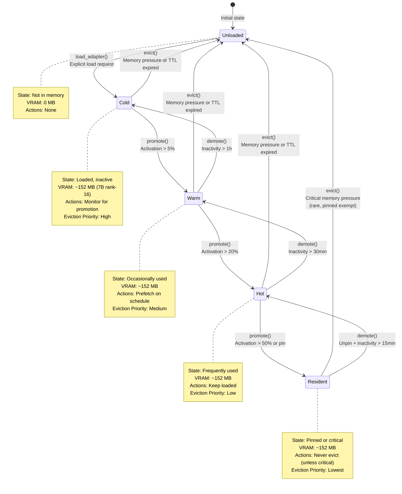
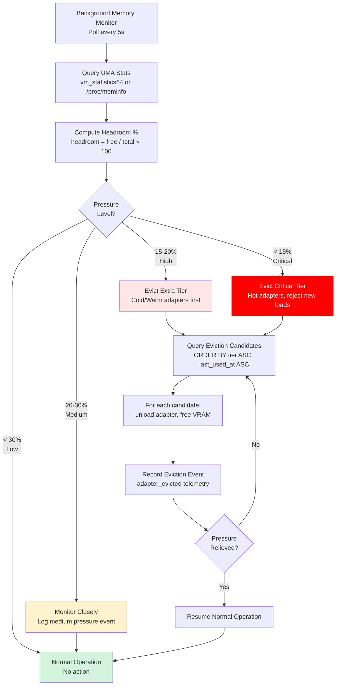
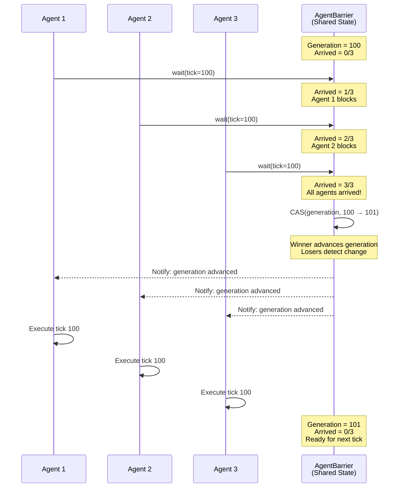
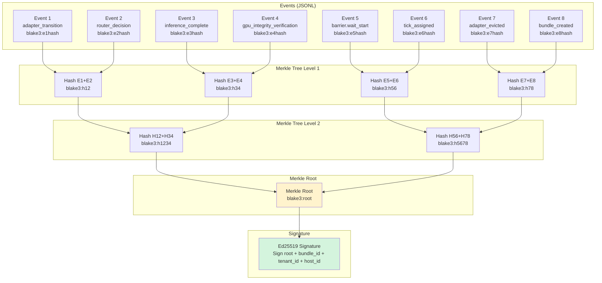
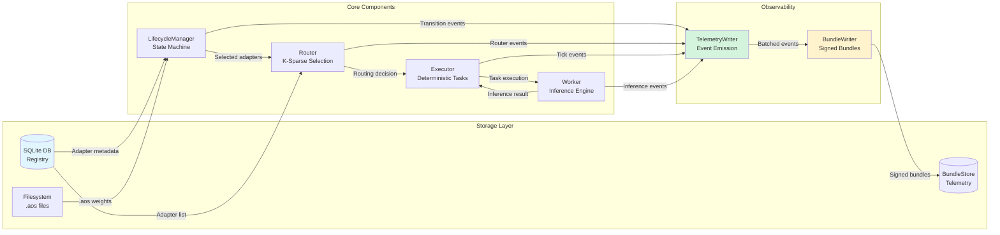

# AdapterOS Flow Diagrams and Schemas

**Purpose**: Visual reference for system dataflows, state machines, and telemetry schemas.
**Last Updated**: 2025-11-18

---

## 1. Complete System Dataflow

```mermaid
graph TB
    subgraph "1. Request Ingress"
        A[Client Request<br/>POST /api/chat/completions] --> B[API Gateway<br/>UDS Socket]
        B --> C[Auth Middleware<br/>JWT Validation]
        C --> D[Policy Check<br/>Tenant ACL]
    end

    subgraph "2. Load Flow"
        D --> E[Lifecycle Manager<br/>Check Adapter State]
        E --> F{Adapter<br/>Loaded?}
        F -->|No| G[Load Adapter<br/>Unloaded → Cold]
        F -->|Yes| H[Check Memory Pressure]
        G --> H
        H --> I{Pressure<br/>> 85%?}
        I -->|Yes| J[Evict Cold Adapters<br/>Free VRAM]
        I -->|No| K[Proceed to Routing]
        J --> K
    end

    subgraph "3. Route Flow"
        K --> L[Extract Prompt Features<br/>Language, Framework, Symbols]
        L --> M[Query Available Adapters<br/>Filter by Tenant + State]
        M --> N[Score Each Adapter<br/>8 Weighted Features]
        N --> O[Q15 Quantization<br/>f32 → i16]
        O --> P[Top-K Selection<br/>HKDF Tie-Breaking]
        P --> Q[Record Router Decision<br/>Update Activation Counts]
    end

    subgraph "4. Run Flow"
        Q --> R[Spawn Deterministic Task<br/>FIFO Queue]
        R --> S[Allocate Unique Tick<br/>Atomic Fetch-Add]
        S --> T[Execute Inference<br/>Metal Kernels]
        T --> U{Multi-Agent?}
        U -->|Yes| V[AgentBarrier::wait<br/>CAS Synchronization]
        U -->|No| W[Sample Tokens<br/>HKDF-Seeded RNG]
        V --> W
        W --> X[Record Tick to Ledger<br/>Merkle Chain]
    end

    subgraph "5. Record Flow"
        X --> Y[Emit Telemetry Events<br/>Canonical JSON]
        Y --> Z[Hash Event<br/>BLAKE3]
        Z --> AA[Batch Events<br/>Max 1000 or 60s]
        AA --> AB[Compute Merkle Root<br/>Binary Tree]
        AB --> AC[Sign Bundle<br/>Ed25519]
        AC --> AD[Write to Disk<br/>JSONL + Metadata]
        AD --> AE[Index in BundleStore<br/>SQLite]
    end

    subgraph "6. Response"
        X --> AF[Format Response<br/>JSON or SSE Stream]
        AF --> AG[Emit to Client<br/>200 OK]
    end

    style A fill:#e1f5ff
    style AG fill:#d4f4dd
    style G fill:#fff3cd
    style I fill:#ffe6e6
    style P fill:#fff3cd
    style V fill:#fff3cd
    style AC fill:#fff3cd
```



---

## 2. Adapter Lifecycle State Machine



### State Transition Triggers

| Transition | Trigger | Policy | Location |
|------------|---------|--------|----------|
| Unloaded → Cold | `load_adapter()` | Explicit API call | `LifecycleManager::load_adapter()` |
| Cold → Warm | `promote()` | `activation_pct > 5%` | `LifecycleManager::check_promotion()` |
| Warm → Hot | `promote()` | `activation_pct > 20%` | `LifecycleManager::check_promotion()` |
| Hot → Resident | `promote()` | `activation_pct > 50%` OR `pinned=true` | `LifecycleManager::promote_to_resident()` |
| * → Unloaded | `evict()` | Memory pressure > 85% OR TTL expired | `LifecycleManager::evict_adapter()` |
| Warm → Cold | `demote()` | Inactivity > 1 hour | `LifecycleManager::check_demotion()` |
| Hot → Warm | `demote()` | Inactivity > 30 minutes | `LifecycleManager::check_demotion()` |
| Resident → Hot | `demote()` | Unpin + inactivity > 15 minutes | `LifecycleManager::demote_from_resident()` |

[source: crates/adapteros-lora-lifecycle/src/state.rs, CLAUDE.md § Adapter Lifecycle State Machine]

---

## 3. Memory Pressure and Eviction Flow



### UMA Pressure Levels

| Level | Headroom % | Action | Priority |
|-------|-----------|--------|----------|
| **Low** | > 30% | Normal operation | No eviction |
| **Medium** | 20-30% | Monitor closely, log events | No eviction |
| **High** | 15-20% | Evict Extra tier (Cold/Warm) | FIFO within tier |
| **Critical** | < 15% | Evict Critical tier (Hot), reject new loads | FIFO, alert ops |

[source: crates/adapteros-lora-worker/src/memory.rs:1-150, CLAUDE.md § UMA Backpressure & Eviction]

---

## 4. Multi-Agent Barrier Synchronization



### Barrier Events Timeline

```mermaid
gantt
    title Multi-Agent Barrier Event Timeline
    dateFormat X
    axisFormat %L ms

    section Agent 1
    barrier.wait_start (A1) :a1, 0, 50
    Waiting for peers :50, 150
    barrier.generation_advanced (A1 CAS winner) :active, 150, 151
    Execute tick 100 :151, 200

    section Agent 2
    barrier.wait_start (A2) :a2, 30, 80
    Waiting for peers :80, 150
    barrier.cas_loser_proceed (A2) :crit, 151, 152
    Execute tick 100 :152, 200

    section Agent 3
    barrier.wait_start (A3) :a3, 100, 150
    Trigger release :milestone, 150, 150
    barrier.cas_loser_proceed (A3) :crit, 151, 152
    Execute tick 100 :152, 200
```



[source: crates/adapteros-deterministic-exec/src/multi_agent.rs, CLAUDE.md § Multi-Agent Coordination]

---

## 5. Telemetry Event Schema

### Comprehensive Event Catalog

| Event Type | Component | Log Level | When Emitted | Key Metadata Fields |
|------------|-----------|-----------|--------------|---------------------|
| **Lifecycle Events** |||||
| `adapter_transition` | `adapteros-lora-lifecycle` | Info | State change (Unloaded→Cold, etc.) | `adapter_id`, `from_state`, `to_state`, `reason`, `memory_mb` |
| `adapter_loaded` | `adapteros-lora-lifecycle` | Info | Adapter load complete | `adapter_id`, `tier`, `memory_mb`, `hash`, `load_duration_ms` |
| `adapter_evicted` | `adapteros-lora-lifecycle` | Warn | Adapter evicted due to memory pressure | `adapter_id`, `from_state`, `memory_freed`, `eviction_reason` |
| `adapter_promoted` | `adapteros-lora-lifecycle` | Info | Tier promotion (Cold→Warm, etc.) | `adapter_id`, `old_tier`, `new_tier`, `activation_pct` |
| `adapter_demoted` | `adapteros-lora-lifecycle` | Info | Tier demotion due to inactivity | `adapter_id`, `old_tier`, `new_tier`, `inactive_duration_min` |
| `adapter_crash_detected` | `adapteros-lora-lifecycle` | Warn | Stale adapter recovered (heartbeat timeout) | `adapter_id`, `last_heartbeat`, `recovery_action` |
| **Router Events** |||||
| `router_decision` | `adapteros-lora-router` | Info | K-sparse adapter selection complete | `prompt_hash`, `selected_adapters[]`, `candidate_count`, `features{}`, `selection_duration_ms` |
| `rng_snapshot` | `adapteros-lora-router` | Debug | Tie-breaking RNG used | `label`, `seed_hash`, `sequence_number`, `tied_adapters[]`, `selected` |
| **Deterministic Execution Events** |||||
| `task_spawn` | `adapteros-deterministic-exec` | Debug | Task added to FIFO queue | `task_id`, `task_name`, `sequence_number` |
| `task_complete` | `adapteros-deterministic-exec` | Debug | Task finished execution | `task_id`, `duration_ms`, `result` |
| `tick_assigned` | `adapteros-deterministic-exec` | Debug | Unique tick allocated | `tick`, `task_id`, `timestamp` |
| `tick_ledger.consistent` | `adapteros-deterministic-exec` | Info | Cross-host tick ledger verified | `start_tick`, `end_tick`, `host_count`, `match_rate` |
| `tick_ledger.inconsistent` | `adapteros-deterministic-exec` | Warn | Divergence detected between hosts | `divergent_ticks[]`, `divergence_count`, `hosts[]` |
| **Barrier Coordination Events** |||||
| `barrier.wait_start` | `adapteros-deterministic-exec` | Debug | Agent enters barrier | `agent_id`, `tick`, `generation`, `total_agents` |
| `barrier.generation_advanced` | `adapteros-deterministic-exec` | Info | CAS winner advances generation | `agent_id`, `tick`, `generation`, `wait_duration_ms`, `living_agents`, `dead_agents` |
| `barrier.cas_loser_proceed` | `adapteros-deterministic-exec` | Debug | CAS loser detects generation change | `agent_id`, `expected_gen`, `actual_gen` |
| `barrier.agent.removed` | `adapteros-deterministic-exec` | Warn | Agent marked as dead | `agent_id`, `dead_count`, `remaining_agents`, `generation` |
| `barrier.timeout` | `adapteros-deterministic-exec` | Error | Barrier wait timeout (30s) | `agent_id`, `tick`, `timeout_seconds`, `wait_duration_ms` |
| **Integrity Events** |||||
| `gpu_integrity_verification` | `adapteros-lora-lifecycle` | Info | GPU buffer hash verified | `adapter_id`, `adapter_idx`, `verified`, `buffer_bytes`, `checkpoint_hash`, `z_score` |
| `gpu_integrity_violation` | `adapteros-lora-lifecycle` | Error | GPU buffer integrity violation | `adapter_id`, `adapter_idx`, `violation_type`, `details`, `z_score` |
| `adapter_load_hash_mismatch` | `adapteros-lora-lifecycle` | Error | Adapter load hash validation failed | `adapter_id`, `adapter_idx`, `expected_hash`, `actual_hash` |
| **Inference Events** |||||
| `inference_start` | `adapteros-lora-worker` | Debug | Inference request started | `request_id`, `prompt_hash`, `model_id`, `adapters[]` |
| `inference_complete` | `adapteros-lora-worker` | Info | Inference finished | `request_id`, `tokens_generated`, `latency_ms`, `throughput_tok_s` |
| `sampling_step` | `adapteros-lora-worker` | Trace | Token sampling step | `request_id`, `token_idx`, `logits_hash`, `sampled_token`, `seed_hash` |
| **Memory Events** |||||
| `uma.pressure` | `adapteros-lora-worker` | Warn | UMA memory pressure detected | `usage_pct`, `headroom_pct`, `used_mb`, `total_mb`, `pressure_level` |
| `memory_allocation` | `adapteros-lora-worker` | Debug | VRAM allocation | `adapter_id`, `bytes`, `total_allocated` |
| `memory_deallocation` | `adapteros-lora-worker` | Debug | VRAM deallocation | `adapter_id`, `bytes`, `total_allocated` |
| **Policy Events** |||||
| `policy_violation` | `adapteros-policy` | Error | Policy check failed | `policy_name`, `violation_type`, `details`, `tenant_id` |
| `policy_hash_validation` | `adapteros-policy` | Info | Policy pack hash validated | `policy_pack_id`, `hash`, `validation_status` |
| **Bundle Events** |||||
| `bundle_created` | `adapteros-telemetry` | Info | Telemetry bundle signed and written | `bundle_id`, `event_count`, `merkle_root`, `signature` |
| `bundle_gc` | `adapteros-telemetry` | Info | Garbage collection executed | `deleted_bundles`, `reclaimed_bytes`, `duration_ms` |

### Event Metadata Schema (JSON)

#### adapter_transition
```json
{
  "event_type": "adapter_transition",
  "timestamp": 1700305800,
  "log_level": "info",
  "message": "Adapter state transition: unloaded → cold",
  "component": "adapteros-lora-lifecycle",
  "metadata": {
    "adapter_id": "tenant-a/rust/auth/r003",
    "from_state": "unloaded",
    "to_state": "cold",
    "reason": "explicit_load_request",
    "memory_mb": 152,
    "tier_priority": 3
  },
  "tags": ["lifecycle", "state_transition"],
  "tenant_id": "tenant-a"
}
```

#### router_decision
```json
{
  "event_type": "router_decision",
  "timestamp": 1700305805,
  "log_level": "info",
  "message": "Router selected 3 adapters for prompt",
  "component": "adapteros-lora-router",
  "metadata": {
    "prompt_hash": "blake3:1a2b3c4d...",
    "selected_adapters": [
      {"id": "tenant-a/rust/auth/r003", "score": 0.87, "q15_score": 28500},
      {"id": "tenant-a/rust/web/r002", "score": 0.82, "q15_score": 26870},
      {"id": "tenant-a/general/code/r001", "score": 0.78, "q15_score": 25559}
    ],
    "candidate_count": 12,
    "features": {
      "language": "rust",
      "framework": null,
      "symbols": ["auth", "rs", "bug"],
      "path_tokens": ["auth.rs"],
      "verb": "fix"
    },
    "selection_duration_ms": 4
  },
  "tags": ["routing", "k_sparse"],
  "tenant_id": "tenant-a"
}
```

#### barrier.generation_advanced
```json
{
  "event_type": "barrier.generation_advanced",
  "timestamp": 1700305810,
  "log_level": "info",
  "message": "Barrier generation advanced at tick 100",
  "component": "adapteros-deterministic-exec",
  "metadata": {
    "agent_id": "agent-1",
    "tick": 100,
    "generation": 101,
    "wait_duration_ms": 45,
    "living_agents": 3,
    "dead_agents": 0,
    "cas_winner": true
  },
  "tags": ["barrier", "synchronization", "multi_agent"]
}
```

#### gpu_integrity_verification
```json
{
  "event_type": "gpu_integrity_verification",
  "timestamp": 1700305815,
  "log_level": "info",
  "message": "GPU buffer integrity verified for adapter",
  "component": "adapteros-lora-lifecycle",
  "metadata": {
    "adapter_id": "tenant-a/rust/auth/r003",
    "adapter_idx": 0,
    "verified": true,
    "buffer_bytes": 159203328,
    "checkpoint_hash": "blake3:abcdef1234...",
    "memory_footprint_within_tolerance": true,
    "z_score": 0.23,
    "baseline_mean": 159000000.0
  },
  "tags": ["integrity", "gpu", "verification"]
}
```

#### uma.pressure
```json
{
  "event_type": "uma.pressure",
  "timestamp": 1700305820,
  "log_level": "warn",
  "message": "High memory pressure detected",
  "component": "adapteros-lora-worker",
  "metadata": {
    "usage_pct": 87.3,
    "headroom_pct": 12.7,
    "used_mb": 14285,
    "total_mb": 16384,
    "pressure_level": "high",
    "eviction_triggered": true,
    "eviction_candidates": ["adapter-1", "adapter-2"]
  },
  "tags": ["memory", "pressure", "eviction"]
}
```

[source: crates/adapteros-telemetry/src/unified_events.rs, CLAUDE.md § Telemetry Event Catalog]

---

## 6. Bundle Merkle Tree Structure



[source: crates/adapteros-telemetry/src/merkle.rs, crates/adapteros-telemetry/src/bundle.rs]

---

## 7. Cross-Component Data Flow



---

**References**:
- [Load Flow](load.md)
- [Route Flow](route.md)
- [Run Flow](run.md)
- [Record Flow](record.md)
- [Replay Flow](replay.md)
- [CLAUDE.md](../../CLAUDE.md)
- [Architecture Index](../ARCHITECTURE_INDEX.md)
