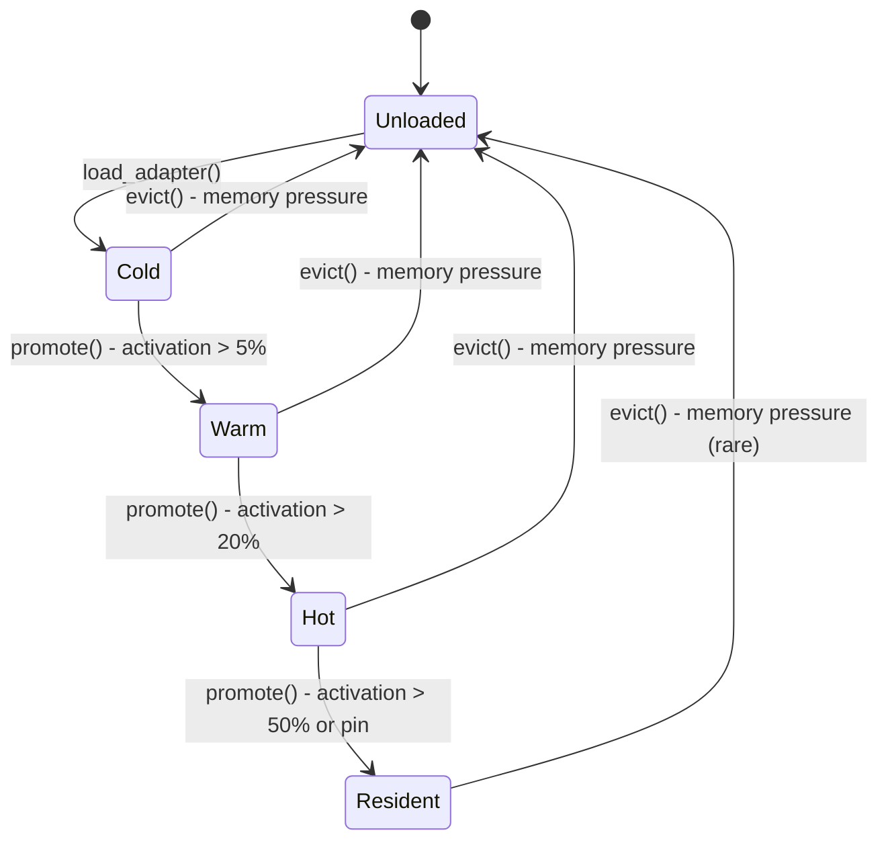

# Load Flow: Adapter Loading and State Initialization

**Status**: ✅ Implemented
**Primary Crate**: `adapteros-lora-lifecycle`
**Entry Point**: `LifecycleManager::load_adapter()`

## Overview

The load flow orchestrates adapter state transitions from `Unloaded` → `Cold` → `Warm` → `Hot` → `Resident`, manages memory allocation, validates hashes, and emits telemetry.

## Flow Diagram

```mermaid
flowchart TD
    A[API Request<br/>POST /api/adapters/load] --> B[1. Validate Request]
    B --> |Check adapter_id exists<br/>Verify tenant ACL<br/>Check current state| C[2. Memory Pressure Check]
    C --> |✅ check_memory_pressure<br/>crates/adapteros-lora-worker/src/memory.rs:1-150<br/>Query UMA stats, compute headroom<br/>Evict if pressure > 85%| D[3. State Transition]
    D --> |✅ State update via DB<br/>crates/adapteros-db/src/adapters.rs:724<br/>Update DB state to 'cold'<br/>Emit transition telemetry| E[4. Load Weights]
    E --> |✅ AdapterTable::preload<br/>crates/adapteros-lora-worker/src/adapter_hotswap.rs:187<br/>Read .aos archive<br/>Parse manifest, load safetensors<br/>Validate BLAKE3 hash| F[5. GPU Upload]
    F --> |✅ GPU allocation<br/>Metal buffer management<br/>Copy weights CPU → GPU| G[6. Hash Verification]
    G --> |✅ GpuIntegrityVerificationEvent<br/>crates/adapteros-lora-lifecycle/src/lib.rs:60-73<br/>Recompute BLAKE3 of GPU buffer<br/>Rollback on mismatch| H[7. Heartbeat Registration]
    H --> |✅ DB heartbeat update<br/>crates/adapteros-db/src/adapters.rs:~870<br/>Update last_heartbeat timestamp<br/>5min timeout monitoring| I[8. Update State to Target Tier]
    I --> |✅ update_adapter_state_tx<br/>crates/adapteros-db/src/adapters.rs:763-799<br/>Transaction-protected update<br/>Set tier, update memory_usage_mb| J[9. Emit Telemetry]
    J --> |✅ adapter_loaded event<br/>crates/adapteros-telemetry/src/unified_events.rs<br/>Metadata: adapter_id, tier, memory_mb, hash| K[200 OK Response]
    K --> |JSON response with adapter_id, state, memory_mb| L[Complete]

    style A fill:#e1f5ff
    style K fill:#d4f4dd
    style G fill:#fff3cd
```



## State Machine



### State Transitions

| From | To | Trigger | Location |
|------|----|---------| ---------|
| Unloaded | Cold | Explicit load request | `LifecycleManager::load_adapter()` |
| Cold | Warm | Activation % > 5% | `LifecycleManager::check_promotion()` |
| Warm | Hot | Activation % > 20% | `LifecycleManager::check_promotion()` |
| Hot | Resident | Pin or activation % > 50% | `LifecycleManager::promote_to_resident()` |
| * | Unloaded | Memory pressure eviction | `LifecycleManager::evict_adapter()` |

## Telemetry Events

### AdapterTransitionEvent
```json
{
  "event_type": "adapter_transition",
  "adapter_id": "tenant-a/engineering/code-review/r001",
  "from_state": "unloaded",
  "to_state": "cold",
  "reason": "explicit_load_request",
  "timestamp": "2025-11-18T10:30:00Z"
}
```

### GpuIntegrityVerificationEvent
```json
{
  "event_type": "gpu_integrity_verification",
  "adapter_id": "tenant-a/engineering/code-review/r001",
  "adapter_idx": 0,
  "verified": true,
  "buffer_bytes": 159203328,
  "checkpoint_hash": "blake3:abcdef1234...",
  "memory_footprint_within_tolerance": true,
  "z_score": 0.23,
  "baseline_mean": 159000000.0,
  "timestamp": 1700305800
}
```

### AdapterLoadHashMismatchEvent (Failure Case)
```json
{
  "event_type": "adapter_load_hash_mismatch",
  "adapter_id": "tenant-a/engineering/code-review/r001",
  "adapter_idx": 0,
  "expected_hash": "blake3:abcdef1234...",
  "actual_hash": "blake3:fedcba4321...",
  "timestamp": 1700305800
}
```

## Error Handling

| Error Type | AosError Variant | Rollback Action | Retry Policy |
|------------|------------------|-----------------|--------------|
| Hash mismatch | `DeterminismViolation` | Reset to Unloaded | No auto-retry (manual investigation) |
| Memory pressure | `PolicyViolation` | Evict cold adapters, retry | Exponential backoff (2s, 4s, 8s) |
| Missing file | `NotFound` | None | No retry (fix path) |
| GPU allocation failure | `Io` | Reset to Unloaded | 3 retries with 1s delay |

[source: crates/adapteros-lora-lifecycle/src/lib.rs:450-700]

## RCU Hot-Swap Integration

When loading during a hot-swap operation:
1. Adapter loaded into **staging area** (not active)
2. Atomic pointer swap when ready (`AdapterTable::swap()`)
3. Retired adapters unloaded when `Arc<> refcount == 0`
4. Event-driven retirement monitor wakes within 5ms of ref==0

[source: crates/adapteros-lora-worker/src/adapter_hotswap.rs:400-550]

## Memory Management

### UMA Pressure Levels

| Level | Headroom % | Action | Priority |
|-------|-----------|--------|----------|
| Low | > 30% | Normal operation | - |
| Medium | 20-30% | Monitor closely | - |
| High | 15-20% | Evict Cold/Warm adapters | Extra tier first |
| Critical | < 15% | Evict Hot adapters, reject new loads | FIFO within tier |

[source: crates/adapteros-lora-worker/src/memory.rs:1-150]

## Database Schema

```sql
-- Adapter state tracking
UPDATE adapters
SET
  current_state = 'cold',
  memory_usage_mb = 152,
  last_heartbeat = strftime('%s', 'now'),
  updated_at = datetime('now')
WHERE adapter_id = ?;
```

[source: migrations/0055_model_backend_fields.sql]

## Testing Coverage

- ✅ Integration: `test_update_adapter_state_persists_to_db` - State persistence (crates/adapteros-lora-lifecycle/tests/lifecycle_db.rs:27)
- ✅ Integration: `test_record_adapter_activation_updates_db` - Activation tracking (crates/adapteros-lora-lifecycle/tests/lifecycle_db.rs:92)
- ✅ Integration: `test_evict_adapter_updates_state_and_memory` - Eviction flow (crates/adapteros-lora-lifecycle/tests/lifecycle_db.rs:157)
- ✅ Integration: `test_multiple_activations_increment_count` - Concurrent activations (crates/adapteros-lora-lifecycle/tests/lifecycle_db.rs:232)
- ✅ Unit: `test_lifecycle_basic` - Lifecycle state machine (crates/adapteros-lora-lifecycle/src/lib.rs:1670)
- ✅ Stress: `test_concurrent_state_update_race_condition` - Transaction safety (tests/stability_reinforcement_tests.rs)

[source: crates/adapteros-lora-lifecycle/tests/lifecycle_db.rs, tests/stability_reinforcement_tests.rs]

## Production Metrics

Query via `/v1/system/memory`:
```json
{
  "total_mb": 16384,
  "used_mb": 12000,
  "headroom_pct": 26.7,
  "pressure_level": "medium",
  "loaded_adapters": 8,
  "eviction_candidates": ["adapter-1", "adapter-2"]
}
```

## Reality vs Plan

| Feature | Status | Notes |
|---------|--------|-------|
| Basic load flow | ✅ Implemented | Full state machine |
| Hash verification | ✅ Implemented | BLAKE3 GPU fingerprinting |
| Memory pressure | ✅ Implemented | UMA monitoring, tiered eviction |
| Heartbeat recovery | ✅ Implemented | 5-min timeout auto-reset |
| Secure Enclave keys | 🔧 Planned | macOS only, see PRD-06 |
| Federation sync | 🔧 Planned | Cross-host state sync |

---

**References**:
- [LifecycleManager](../../crates/adapteros-lora-lifecycle/src/lib.rs)
- [AdapterTable](../../crates/adapteros-lora-worker/src/adapter_hotswap.rs)
- [Memory Monitoring](../../crates/adapteros-lora-worker/src/memory.rs)
- [CLAUDE.md § Adapter Lifecycle](../../CLAUDE.md#adapter-lifecycle-state-machine)
