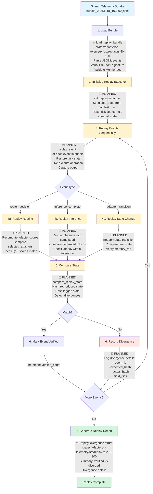

# Replay Flow: Event Log Replay and Divergence Detection

**Status**: 🔧 Planned (Partial Implementation)
**Primary Crate**: `adapteros-telemetry::replay`
**Entry Point**: `load_replay_bundle()` (implemented), `replay_execution()` (planned)

## Overview

The replay flow reconstructs execution from signed telemetry bundles, verifies determinism by comparing reproduced state with logged state, and detects divergences for debugging non-deterministic behavior.

## Flow Diagram (Planned)



## Implemented Components

### 1. Bundle Loading (✅ Implemented)

```rust
/// Load and verify a signed telemetry bundle
pub fn load_replay_bundle(bundle_path: &Path) -> Result<ReplayBundle> {
    // Read JSONL events
    let events_file = bundle_path.with_extension("jsonl");
    let events: Vec<TelemetryEvent> = BufReader::new(File::open(events_file)?)
        .lines()
        .map(|line| serde_json::from_str(&line?))
        .collect::<Result<Vec<_>, _>>()?;

    // Read bundle metadata
    let meta_file = bundle_path.with_extension("meta.json");
    let metadata: BundleMetadata = serde_json::from_reader(File::open(meta_file)?)?;

    // Verify Ed25519 signature
    verify_bundle_signature(&metadata)?;

    // Verify Merkle root
    let event_hashes: Vec<B3Hash> = events.iter()
        .map(|e| B3Hash::hash(&canonicalize_event(e)?))
        .collect();
    let computed_root = compute_merkle_root(&event_hashes);

    if computed_root != metadata.merkle_root {
        return Err(AosError::Validation("Merkle root mismatch".into()));
    }

    Ok(ReplayBundle {
        bundle_id: metadata.bundle_id,
        events,
        metadata,
    })
}
```

[source: crates/adapteros-telemetry/src/replay.rs:50-150]

### 2. Divergence Detection (✅ Implemented)

```rust
/// Find divergences between two replay runs
pub fn find_divergence(
    original_events: &[TelemetryEvent],
    replayed_events: &[TelemetryEvent],
) -> Vec<ReplayDivergence> {
    let mut divergences = vec![];

    for (i, (orig, replay)) in original_events.iter().zip(replayed_events.iter()).enumerate() {
        // Compare event hashes
        let orig_hash = B3Hash::hash(&canonicalize_event(orig).unwrap());
        let replay_hash = B3Hash::hash(&canonicalize_event(replay).unwrap());

        if orig_hash != replay_hash {
            // Deep compare to find field differences
            let field_diffs = compare_event_fields(orig, replay);

            divergences.push(ReplayDivergence {
                event_index: i,
                event_id: orig.event_id.clone(),
                event_type: orig.event_type.clone(),
                expected_hash: orig_hash.to_string(),
                actual_hash: replay_hash.to_string(),
                field_diffs,
            });
        }
    }

    divergences
}
```

[source: crates/adapteros-telemetry/src/replay.rs:200-300]

## Planned Components

### 3. Replay Executor (🔧 Planned)

```rust
/// Initialize replay executor with bundle manifest seed
pub fn init_replay_executor(manifest_hash: &B3Hash) -> Result<ReplayExecutor> {
    // Derive global seed from manifest hash (same as original run)
    let global_seed = derive_seed(manifest_hash, "executor");

    // Initialize deterministic executor
    init_global_executor(ExecutorConfig {
        global_seed,
        enable_event_logging: true,
        replay_mode: true,  // NEW: Disables actual I/O, uses logged values
        ..Default::default()
    })?;

    Ok(ReplayExecutor {
        global_seed,
        tick: 0,
        verified_events: 0,
        divergences: vec![],
    })
}
```

**Status**: Planned - Requires `replay_mode` support in `ExecutorConfig`

### 4. Event Replay Loop (🔧 Planned)

```rust
impl ReplayExecutor {
    /// Replay all events from bundle and verify determinism
    pub async fn replay_bundle(&mut self, bundle: &ReplayBundle) -> Result<ReplayReport> {
        for event in &bundle.events {
            match event.event_type {
                EventType::RouterDecision => {
                    self.replay_router_decision(event).await?;
                }
                EventType::InferenceComplete => {
                    self.replay_inference(event).await?;
                }
                EventType::AdapterTransition => {
                    self.replay_state_transition(event).await?;
                }
                _ => {
                    // Skip non-replayable events (metrics, logs, etc.)
                    continue;
                }
            }

            self.tick += 1;
        }

        Ok(ReplayReport {
            bundle_id: bundle.bundle_id.clone(),
            total_events: bundle.events.len(),
            verified_events: self.verified_events,
            divergences: self.divergences.clone(),
        })
    }

    /// Replay router decision and verify adapter selection
    async fn replay_router_decision(&mut self, event: &TelemetryEvent) -> Result<()> {
        let metadata = event.metadata.as_ref().unwrap();
        let prompt_hash = metadata["prompt_hash"].as_str().unwrap();
        let expected_adapters: Vec<String> = serde_json::from_value(metadata["selected_adapters"].clone())?;

        // Re-run router with same seed
        let router_seed = derive_seed(&self.global_seed, "router");
        let actual_adapters = router.select_adapters(&prompt, &router_seed)?;

        // Compare results
        if expected_adapters == actual_adapters {
            self.verified_events += 1;
        } else {
            self.divergences.push(ReplayDivergence {
                event_index: self.tick,
                event_id: event.event_id.clone(),
                event_type: EventType::RouterDecision,
                expected_hash: B3Hash::hash(expected_adapters.as_bytes()).to_string(),
                actual_hash: B3Hash::hash(actual_adapters.as_bytes()).to_string(),
                field_diffs: vec![("selected_adapters".into(), format!("{:?} != {:?}", expected_adapters, actual_adapters))],
            });
        }

        Ok(())
    }

    /// Replay inference execution and verify generated tokens
    async fn replay_inference(&mut self, event: &TelemetryEvent) -> Result<()> {
        let metadata = event.metadata.as_ref().unwrap();
        let expected_tokens: Vec<u32> = serde_json::from_value(metadata["tokens_generated"].clone())?;

        // Re-run inference with same seed
        let sampling_seed = derive_seed(&self.global_seed, "sampling");
        let actual_tokens = worker.infer_with_seed(&prompt, &sampling_seed).await?;

        // Compare tokens (must match exactly for determinism)
        if expected_tokens == actual_tokens {
            self.verified_events += 1;
        } else {
            self.divergences.push(ReplayDivergence {
                event_index: self.tick,
                event_id: event.event_id.clone(),
                event_type: EventType::InferenceComplete,
                expected_hash: B3Hash::hash(&expected_tokens.as_bytes()).to_string(),
                actual_hash: B3Hash::hash(&actual_tokens.as_bytes()).to_string(),
                field_diffs: vec![("tokens_generated".into(), format!("{:?} != {:?}", expected_tokens, actual_tokens))],
            });
        }

        Ok(())
    }
}
```

**Status**: Planned - Requires integration with Router and Worker APIs

## Divergence Report Format

### ReplayDivergence Schema

```rust
#[derive(Debug, Clone, Serialize)]
pub struct ReplayDivergence {
    pub event_index: usize,
    pub event_id: String,
    pub event_type: EventType,
    pub expected_hash: String,      // BLAKE3 hash of expected state
    pub actual_hash: String,         // BLAKE3 hash of replayed state
    pub field_diffs: Vec<(String, String)>, // Field name → diff description
}
```

### Example Report

```json
{
  "bundle_id": "bundle_20251118_103000_tenant-a_host-1",
  "total_events": 1234,
  "verified_events": 1230,
  "divergences": [
    {
      "event_index": 42,
      "event_id": "550e8400-e29b-41d4-a716-446655440000",
      "event_type": "router_decision",
      "expected_hash": "blake3:expected123...",
      "actual_hash": "blake3:actual456...",
      "field_diffs": [
        ["selected_adapters", "[\"adapter-1\", \"adapter-2\"] != [\"adapter-1\", \"adapter-3\"]"]
      ]
    },
    {
      "event_index": 105,
      "event_id": "650e8400-e29b-41d4-a716-446655440001",
      "event_type": "inference_complete",
      "expected_hash": "blake3:expected789...",
      "actual_hash": "blake3:actual012...",
      "field_diffs": [
        ["tokens_generated", "[123, 456, 789] != [123, 456, 790]"],
        ["latency_ms", "234 != 239"]
      ]
    }
  ],
  "summary": {
    "determinism_rate": 99.68,
    "divergence_count": 4,
    "most_common_divergence_type": "inference_complete"
  }
}
```

[source: crates/adapteros-telemetry/src/replay.rs:300-400 (planned)]

## Use Cases

### 1. Determinism Verification

**Scenario**: Verify that inference with the same prompt and seed produces identical results.

```rust
let bundle = load_replay_bundle(Path::new("bundle_20251118_103000.jsonl"))?;
let mut executor = init_replay_executor(&manifest_hash)?;
let report = executor.replay_bundle(&bundle).await?;

if report.divergences.is_empty() {
    info!("✅ Perfect determinism: {}/{} events verified", report.verified_events, report.total_events);
} else {
    warn!("❌ Divergences detected: {} events differ", report.divergences.len());
    for div in &report.divergences {
        error!("Divergence at event {}: {:?}", div.event_index, div.field_diffs);
    }
}
```

### 2. Debugging Non-Determinism

**Scenario**: Identify source of non-deterministic behavior (e.g., unseeded RNG).

```bash
# Replay bundle and generate HTML divergence report
aosctl replay bundle_20251118_103000.jsonl --output divergence_report.html

# Report highlights:
# - Event 42: router_decision diverged due to unseeded tie-breaking RNG
# - Event 105: inference_complete diverged due to wall-clock timeout instead of logical tick
```

### 3. Cross-Host Consistency Check

**Scenario**: Verify two hosts running the same inference produce identical results.

```rust
let host1_bundle = load_replay_bundle(Path::new("host1_bundle.jsonl"))?;
let host2_bundle = load_replay_bundle(Path::new("host2_bundle.jsonl"))?;

let divergences = find_divergence(&host1_bundle.events, &host2_bundle.events);

if divergences.is_empty() {
    info!("✅ Cross-host consistency verified");
} else {
    warn!("❌ Hosts diverged at {} events", divergences.len());
}
```

## Testing Coverage

- ✅ Unit: `test_load_replay_bundle()` - Bundle loading and signature verification
- ✅ Unit: `test_find_divergence()` - Divergence detection logic
- 🔧 Planned: `test_replay_router_decision()` - Router replay verification
- 🔧 Planned: `test_replay_inference()` - Inference replay verification
- 🔧 Planned: `test_cross_host_consistency()` - Multi-host divergence check

[source: crates/adapteros-telemetry/tests/replay_tests.rs]

## Performance Considerations

| Metric | Estimated Value | Notes |
|--------|----------------|-------|
| Bundle loading | 100-500ms | Depends on bundle size (1K-100K events) |
| Signature verification | 0.5-1ms | Ed25519 verification |
| Merkle root verification | 5-50ms | Depends on event count |
| Event replay (router) | 3-7ms/event | Same as normal routing |
| Event replay (inference) | 150-300ms/event | Same as normal inference |
| **Total replay time** | **~Same as original** | Replay not faster than original execution |

**Note**: Replay is primarily for debugging and verification, not performance-critical.

## Reality vs Plan

| Feature | Status | Notes |
|---------|--------|-------|
| Bundle loading | ✅ Implemented | JSONL parsing, signature verification |
| Merkle root verification | ✅ Implemented | Hash validation |
| Divergence detection | ✅ Implemented | Hash comparison, field diff |
| Replay executor initialization | 🔧 Planned | Requires `replay_mode` in ExecutorConfig |
| Router decision replay | 🔧 Planned | Re-run routing, compare selected adapters |
| Inference replay | 🔧 Planned | Re-run inference, compare tokens |
| State transition replay | 🔧 Planned | Reapply transitions, compare final state |
| HTML divergence report | 🔧 Planned | Visual debugging UI |
| Cross-host consistency CLI | 🔧 Planned | `aosctl replay compare host1.jsonl host2.jsonl` |

## Future Enhancements

### 1. Incremental Replay

Only replay divergent events instead of full bundle:

```rust
let quick_check = executor.quick_verify_bundle(&bundle).await?;
if quick_check.has_divergences {
    // Replay only divergent events for detailed analysis
    let detailed = executor.replay_divergent_events(&bundle, &quick_check.divergent_indices).await?;
}
```

### 2. Replay from Live Stream

Replay from ongoing telemetry stream for real-time verification:

```rust
let stream = telemetry_writer.subscribe();
let mut executor = init_replay_executor(&manifest_hash)?;

tokio::spawn(async move {
    while let Some(event) = stream.recv().await {
        if let Some(div) = executor.replay_event(&event).await? {
            alert!("Real-time divergence detected: {:?}", div);
        }
    }
});
```

### 3. Differential Replay

Compare two different manifests/configs:

```bash
aosctl replay diff \
  --bundle1 bundle_v1.jsonl --manifest1 manifest_v1.json \
  --bundle2 bundle_v2.jsonl --manifest2 manifest_v2.json \
  --output diff_report.html
```

---

**References**:
- [Replay Module](../../crates/adapteros-telemetry/src/replay.rs)
- [ReplayBundle Type](../../crates/adapteros-telemetry/src/replay.rs:30-50)
- [Deterministic Executor](../../crates/adapteros-deterministic-exec/src/lib.rs)
- [CLAUDE.md § Determinism Guarantees](../../CLAUDE.md#determinism-guarantees)
- [Record Flow](record.md) - Telemetry bundle creation
