# Route Flow: K-Sparse Adapter Selection

**Status**: ✅ Implemented
**Primary Crate**: `adapteros-lora-router`
**Entry Point**: `LoraRouter::select_adapters()`

## Overview

The route flow performs deterministic K-sparse adapter selection using Q15-quantized gate scores. It extracts prompt features, scores all available adapters, and selects the top-K with tie-breaking via seeded RNG.

## Flow Diagram

```mermaid
flowchart TD
    A[Inference Request<br/>Prompt: 'Fix bug in auth.rs'<br/>Model: qwen2.5-coder-7b] --> B[1. Feature Extraction]
    B --> |✅ extract_prompt_features<br/>crates/adapteros-lora-router/src/features.rs:1-200<br/>Language: Rust, Framework: none<br/>Symbols: auth, rs<br/>Path: auth.rs, Verb: Fix| C[2. Query Available Adapters]
    C --> |✅ list_adapters_for_tenant<br/>crates/adapteros-db/src/adapters.rs:200-250<br/>Filter: tenant_id, state != unloaded<br/>Filter: pinned OR ttl valid<br/>Sort: activation_pct DESC| D[3. Score Each Adapter]
    D --> |✅ compute_adapter_score<br/>crates/adapteros-lora-router/src/scoring.rs:50-300<br/>score = Σ feature_weight × match<br/>8 features weighted| E[4. Q15 Quantization]
    E --> |✅ quantize_to_q15<br/>crates/adapteros-lora-router/src/lib.rs:400-450<br/>Convert f32 → i16<br/>Scale: i16 = f32 × 32767<br/>Deterministic comparison| F[5. Top-K Selection]
    F --> |✅ select_top_k_deterministic<br/>crates/adapteros-lora-router/src/lib.rs:500-650<br/>Sort by Q15 score DESC<br/>Tie-break: HKDF-seeded RNG<br/>Return exactly K adapters| G[6. Record Router Decision]
    G --> |✅ record_router_decision<br/>crates/adapteros-lora-lifecycle/src/lib.rs:800-850<br/>Increment activation count<br/>Update activation_pct<br/>Trigger promotion check| H[7. Emit Router Telemetry]
    H --> |✅ RouterDecisionEvent<br/>crates/adapteros-telemetry/src/events.rs:200-250<br/>Metadata: prompt_hash, selected_adapters<br/>candidate_count, features, duration| I[Selected Adapters]
    I --> |adapter-1: 0.87 Q15:28500<br/>adapter-2: 0.82 Q15:26870<br/>adapter-3: 0.78 Q15:25559| J[Complete]

    style A fill:#e1f5ff
    style I fill:#d4f4dd
    style F fill:#fff3cd
```



## Scoring Algorithm

### Feature Weights (Default)

```rust
pub struct RouterWeights {
    pub language_weight: f32,        // 0.2727 (27.27%)
    pub framework_weight: f32,       // 0.2273 (22.73%)
    pub symbol_hits_weight: f32,     // 0.1818 (18.18%)
    pub path_tokens_weight: f32,     // 0.1364 (13.64%)
    pub prompt_verb_weight: f32,     // 0.0909 (9.09%)
    pub orthogonal_weight: f32,      // 0.0455 (4.55%)
    pub diversity_weight: f32,       // 0.0273 (2.73%)
    pub similarity_penalty: f32,     // 0.0182 (1.82%)
}
```

[source: crates/adapteros-lora-router/src/lib.rs:34-70]

### Score Computation

```
final_score = language_match × 0.27
            + framework_match × 0.23
            + symbol_hits × 0.18
            + path_tokens × 0.14
            + verb_match × 0.09
            + orthogonality × 0.05
            + diversity × 0.03
            - similarity_penalty × 0.02
```

### Q15 Quantization

```rust
fn quantize_to_q15(score: f32) -> i16 {
    let clamped = score.clamp(0.0, 1.0);
    (clamped * 32767.0).round() as i16
}
```

**Why Q15?**
- Eliminates floating-point non-determinism across hardware
- i16 comparison is bitwise reproducible
- Sufficient resolution (32768 discrete levels)

[source: crates/adapteros-lora-router/src/lib.rs:400-450]

## Tie-Breaking Mechanism

When multiple adapters have identical Q15 scores at the K-th position:

```rust
use rand::{Rng, SeedableRng};
use rand_chacha::ChaCha20Rng;
use adapteros_core::derive_seed;

let router_seed = derive_seed(&global_seed, "router");
let mut rng = ChaCha20Rng::from_seed(router_seed);

// Shuffle tied candidates deterministically
tied_adapters.shuffle(&mut rng);
```

**Determinism guarantee**: Same global seed → same shuffle order → same selection

[source: crates/adapteros-lora-router/src/lib.rs:500-650, crates/adapteros-core/src/hash.rs:100-150]

## Telemetry Events

### RouterDecisionEvent
```json
{
  "event_type": "router_decision",
  "prompt_hash": "blake3:1a2b3c4d...",
  "selected_adapters": [
    {"id": "tenant-a/rust/auth/r003", "score": 0.87, "q15_score": 28500},
    {"id": "tenant-a/rust/web/r002", "score": 0.82, "q15_score": 26870},
    {"id": "tenant-a/general/code/r001", "score": 0.78, "q15_score": 25559}
  ],
  "candidate_count": 12,
  "features": {
    "language": "rust",
    "framework": null,
    "symbols": ["auth", "rs", "bug"],
    "path_tokens": ["auth.rs"],
    "verb": "fix"
  },
  "selection_duration_ms": 3,
  "timestamp": "2025-11-18T10:30:00Z"
}
```

### RngSnapshot (Tie-Breaking Audit)
```json
{
  "event_type": "rng_snapshot",
  "label": "router_tie_break",
  "seed_hash": "blake3:seed123...",
  "sequence_number": 42,
  "tied_adapters": ["adapter-1", "adapter-2"],
  "selected": "adapter-1",
  "timestamp": "2025-11-18T10:30:00Z"
}
```

[source: crates/adapteros-telemetry/src/events.rs:200-300]

## State Updates

After routing, adapter activation counts are updated:

```sql
-- Update activation count
UPDATE adapters
SET
  activation_count = activation_count + 1,
  activation_pct = CAST(activation_count AS REAL) / total_requests * 100,
  last_used_at = datetime('now')
WHERE adapter_id IN ('adapter-1', 'adapter-2', 'adapter-3');

-- Check for promotion
-- If activation_pct crosses threshold:
--   Cold→Warm at 5%, Warm→Hot at 20%, Hot→Resident at 50%
```

[source: crates/adapteros-db/src/adapters.rs:600-700]

## Performance Metrics

| Metric | Typical Value | Location |
|--------|---------------|----------|
| Feature extraction | 0.5-1ms | `extract_prompt_features()` |
| Adapter scoring (100 adapters) | 2-5ms | `compute_adapter_score()` |
| Q15 quantization + sort | < 0.1ms | `quantize_to_q15()` |
| Tie-breaking RNG | < 0.01ms | `shuffle()` |
| **Total routing latency** | **3-7ms** | End-to-end |

[source: crates/adapteros-lora-router/src/metrics.rs]

## Framework-Specific Routing

For specialized frameworks (e.g., React, Django):

```rust
pub fn compute_framework_scores(
    features: &CodeFeatures,
    adapters: &[AdapterMetadata],
) -> Vec<FrameworkRoutingScore> {
    adapters.iter().map(|adapter| {
        let base_score = compute_adapter_score(features, adapter);

        // Boost if framework matches
        let framework_boost = if features.framework == adapter.framework {
            0.15 // 15% boost
        } else {
            0.0
        };

        FrameworkRoutingScore {
            adapter_id: adapter.id.clone(),
            score: base_score + framework_boost,
        }
    }).collect()
}
```

[source: crates/adapteros-lora-router/src/framework_routing.rs:1-100]

## Path-Based Routing

For directory-scoped adapters:

```rust
pub fn compute_path_scores(
    features: &CodeFeatures,
    adapters: &[AdapterMetadata],
) -> Vec<PathRoutingScore> {
    adapters.iter().map(|adapter| {
        let path_match = features.path_tokens.iter()
            .filter(|token| adapter.path_scope.contains(token))
            .count() as f32 / features.path_tokens.len() as f32;

        PathRoutingScore {
            adapter_id: adapter.id.clone(),
            score: path_match,
        }
    }).collect()
}
```

[source: crates/adapteros-lora-router/src/path_routing.rs:1-100]

## Error Handling

| Error Type | AosError Variant | Action | Retry |
|------------|------------------|--------|-------|
| No adapters available | `NotFound` | Return base model only | No |
| Invalid feature vector | `Validation` | Use default features | No |
| Scoring overflow | `Validation` | Clamp to [0.0, 1.0] | No |
| RNG initialization failure | `Crypto` | Fall back to lexicographic order | Log alert |

## Testing Coverage

- ✅ Unit: `test_q15_quantization_determinism()` - Q15 stability
- ✅ Unit: `test_tie_breaking_reproducibility()` - Seeded RNG
- ✅ Unit: `test_feature_extraction_rust()` - Language detection
- ✅ Integration: `test_routing_with_promotion()` - Activation count updates
- ✅ Stress: `test_routing_100_adapters()` - Performance under load

[source: crates/adapteros-lora-router/tests/router_tests.rs]

## Production Metrics

Query via `/v1/router/stats`:
```json
{
  "total_routing_requests": 10000,
  "avg_latency_ms": 4.2,
  "p95_latency_ms": 6.8,
  "p99_latency_ms": 9.1,
  "tie_break_count": 234,
  "adapters_considered_avg": 87,
  "top_selected_adapters": [
    {"id": "tenant-a/rust/auth/r003", "count": 3456},
    {"id": "tenant-a/python/ml/r002", "count": 2987}
  ]
}
```

## Reality vs Plan

| Feature | Status | Notes |
|---------|--------|-------|
| K-sparse routing | ✅ Implemented | Default K=3 |
| Q15 quantization | ✅ Implemented | Deterministic scores |
| HKDF tie-breaking | ✅ Implemented | Seeded RNG |
| Feature extraction | ✅ Implemented | 5 base features + 3 MPLoRA |
| Framework routing | ✅ Implemented | React, Django, etc. |
| Path-based routing | ✅ Implemented | Directory scoping |
| Calibration | 🔧 Planned | Weight tuning via labeled data |
| Orthogonal constraints | ⚠️ Partial | Implemented but not tuned |
| Diversity penalty | ⚠️ Partial | Implemented but low weight |

---

**References**:
- [Router Core](../../crates/adapteros-lora-router/src/lib.rs)
- [Feature Extraction](../../crates/adapteros-lora-router/src/features.rs)
- [Scoring Functions](../../crates/adapteros-lora-router/src/scoring.rs)
- [CLAUDE.md § K-Sparse Routing](../../CLAUDE.md#k-sparse-routing)
- [ROUTER_DETERMINISM_PROOF.md](../ROUTER_DETERMINISM_PROOF.md)
