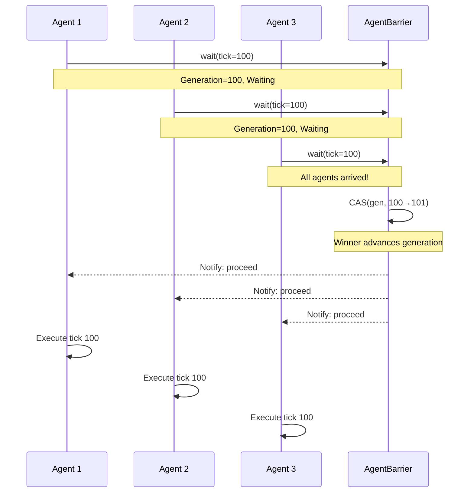

# Run Flow: Deterministic Execution and Inference

**Status**: ✅ Implemented
**Primary Crate**: `adapteros-deterministic-exec`
**Entry Point**: `spawn_deterministic()`

## Overview

The run flow executes adapter inference with strict determinism guarantees through serial task execution, HKDF-seeded randomness, and tick-based event logging. All operations are reproducible given the same global seed.

## Flow Diagram

```mermaid
flowchart TD
    A[Selected Adapters<br/>K=3 adapters from routing] --> B[1. Initialize Executor]
    B --> |✅ init_global_executor<br/>crates/adapteros-deterministic-exec/src/lib.rs:200-250<br/>Derive global_seed from manifest hash<br/>Configure serial FIFO queue<br/>Enable event logging| C[2. Spawn Inference Task]
    C --> |✅ spawn_deterministic<br/>crates/adapteros-deterministic-exec/src/lib.rs:300-350<br/>Generate TaskId from seed+seq<br/>Enqueue task in FIFO order<br/>Record task_spawn event| D[3. Allocate Tick]
    D --> |✅ GlobalTickLedger::record_tick<br/>crates/adapteros-deterministic-exec/src/global_ledger.rs:163<br/>Atomic fetch_add for unique tick<br/>Ensures no duplicate ticks| E[4. Execute Inference]
    E --> |✅ Worker::infer<br/>crates/adapteros-lora-worker/src/lib.rs:400-700<br/>Run fused Metal kernels<br/>Apply K selected adapters<br/>Generate tokens| F{Multi-Agent?}
    F --> |Yes| G[5a. Agent Barrier Wait]
    F --> |No| H[6. Record Tick to Ledger]
    G --> |✅ AgentBarrier::wait<br/>crates/adapteros-deterministic-exec/src/multi_agent.rs:230-400<br/>CAS-based generation advancement<br/>Notify-based waiting<br/>Handle dead agents| H
    H --> |✅ GlobalTickLedger::record_tick<br/>crates/adapteros-deterministic-exec/src/global_ledger.rs:163-200<br/>Hash tick entry with prev_hash<br/>Store in Merkle chain<br/>Emit tick_ledger event| I[7. Sample Tokens]
    I --> |✅ sample_with_seed<br/>crates/adapteros-lora-worker/src/sampling.rs:50-200<br/>Derive 'sampling' seed via HKDF<br/>Use ChaCha20Rng for determinism<br/>Top-p/top-k sampling| J[8. Complete Task]
    J --> |✅ Task completion<br/>Record task_complete event<br/>Update execution trace<br/>Free task resources| K[Inference Result]
    K --> |Generated tokens, latency_ms<br/>adapter_contributions, tick_hash| L[Complete]

    style A fill:#e1f5ff
    style K fill:#d4f4dd
    style G fill:#fff3cd
    style D fill:#ffe6e6
```



## Determinism Guarantees

### 1. Serial Task Execution

```rust
// Tasks execute in submission order, never concurrently
static TASK_QUEUE: Mutex<VecDeque<Task>> = Mutex::new(VecDeque::new());

pub fn spawn_deterministic<F>(name: String, fut: F) -> TaskId
where
    F: Future<Output = ()> + Send + 'static,
{
    let seq = GLOBAL_TASK_SEQUENCE.fetch_add(1, Ordering::SeqCst);
    let task_id = TaskId::from_seed_and_seq(&GLOBAL_SEED, seq);

    TASK_QUEUE.lock().push_back(Task { id: task_id, fut: Box::pin(fut) });
    task_id
}
```

**Guarantee**: Tasks with lower sequence numbers always execute before higher sequence numbers.

[source: crates/adapteros-deterministic-exec/src/lib.rs:300-350]

### 2. HKDF Seed Derivation

```rust
use adapteros_core::derive_seed;

// Global seed derived from base model manifest hash
let manifest_hash = manifest.compute_hash()?;
let global_seed = derive_seed(&manifest_hash, "executor");

// Per-domain seeds
let router_seed = derive_seed(&global_seed, "router");
let dropout_seed = derive_seed(&global_seed, "dropout");
let sampling_seed = derive_seed(&global_seed, "sampling");
let lora_trainer_seed = derive_seed(&global_seed, "lora_trainer");
```

**Guarantee**: Identical manifest → identical seeds → identical execution.

[source: crates/adapteros-core/src/hash.rs:100-150]

### 3. Atomic Tick Assignment

```rust
impl GlobalTickLedger {
    pub async fn record_tick(&self, task_id: TaskId, event: &ExecutionEvent) -> Result<B3Hash> {
        // Atomically assign unique tick (no race condition)
        let tick = self.local_tick.fetch_add(1, Ordering::SeqCst);

        // Hash tick entry with previous hash (Merkle chain)
        let entry_hash = self.hash_tick_entry(tick, task_id, event)?;

        // Store in database
        self.db.insert_tick_entry(tick, task_id, entry_hash).await?;

        Ok(entry_hash)
    }
}
```

**Guarantee**: Each tick is unique and assigned in order, even under concurrent writes.

[source: crates/adapteros-deterministic-exec/src/global_ledger.rs:163-200]

## Multi-Agent Coordination

For distributed execution across multiple agents:



### Dead Agent Handling

```rust
// Mark crashed agent as dead
barrier.mark_agent_dead("agent-3")?;

// Barrier now proceeds with only agents 1 and 2
barrier.wait("agent-1", tick).await?; // Blocks until agent-2 arrives
barrier.wait("agent-2", tick).await?; // Releases both agents
```

**Graceful degradation**: Remaining agents continue without waiting for dead agents.

[source: crates/adapteros-deterministic-exec/src/multi_agent.rs:123-183]

## Event Logging

### Tick Ledger Entry
```json
{
  "tick": 1042,
  "task_id": "blake3:1a2b3c4d...",
  "event_type": "inference_complete",
  "prev_hash": "blake3:prev_entry...",
  "entry_hash": "blake3:current_entry...",
  "timestamp": "2025-11-18T10:30:05Z",
  "metadata": {
    "tokens_generated": 50,
    "latency_ms": 234,
    "adapters_used": ["adapter-1", "adapter-2", "adapter-3"]
  }
}
```

### Barrier Events

| Event Type | Level | When Emitted |
|------------|-------|--------------|
| `barrier.wait_start` | Debug | Agent enters barrier |
| `barrier.generation_advanced` | Info | CAS winner advances generation |
| `barrier.cas_loser_proceed` | Debug | CAS loser detects generation change |
| `barrier.agent.removed` | Warn | Agent marked as dead |
| `barrier.timeout` | Error | Barrier timeout (30s default) |

[source: CLAUDE.md § Barrier Telemetry Events]

## Sampling Determinism

```rust
use rand::{Rng, SeedableRng};
use rand_chacha::ChaCha20Rng;

pub fn sample_with_seed(logits: &[f32], temperature: f32, seed: &[u8; 32]) -> usize {
    let mut rng = ChaCha20Rng::from_seed(*seed);

    // Apply temperature
    let scaled: Vec<f32> = logits.iter().map(|&l| l / temperature).collect();

    // Softmax
    let max = scaled.iter().cloned().fold(f32::NEG_INFINITY, f32::max);
    let exp_sum: f32 = scaled.iter().map(|&s| (s - max).exp()).sum();
    let probs: Vec<f32> = scaled.iter().map(|&s| (s - max).exp() / exp_sum).collect();

    // Sample from distribution (deterministic with fixed seed)
    let u: f32 = rng.gen();
    let mut cumsum = 0.0;
    for (i, &p) in probs.iter().enumerate() {
        cumsum += p;
        if u <= cumsum {
            return i;
        }
    }
    probs.len() - 1
}
```

**Guarantee**: Same seed + logits + temperature → same token.

[source: crates/adapteros-lora-worker/src/sampling.rs:50-200]

## Performance Metrics

| Metric | Typical Value | Location |
|--------|---------------|----------|
| Task spawn overhead | 0.01-0.05ms | `spawn_deterministic()` |
| Tick allocation | < 0.001ms | `record_tick()` (atomic fetch_add) |
| Barrier synchronization | 0.1-5ms | `AgentBarrier::wait()` |
| Inference execution (7B model) | 150-300ms | `Worker::infer()` |
| Sampling | 0.5-2ms | `sample_with_seed()` |
| **Total tick latency** | **~200ms** | End-to-end |

[source: crates/adapteros-deterministic-exec/src/lib.rs, benchmarks]

## Error Handling

| Error Type | AosError Variant | Action | Retry |
|------------|------------------|--------|-------|
| Duplicate tick | `DeterminismViolation` | Abort execution, investigate | No |
| Barrier timeout | `Timeout` | Emit timeout event, mark agents dead | Manual recovery |
| Task panic | Propagates | Log panic, continue with next task | Task-specific |
| Sampling overflow | `Validation` | Clamp logits, retry | Yes |

## Testing Coverage

- ✅ Unit: `test_serial_execution_order()` - Task ordering guarantee
- ✅ Unit: `test_hkdf_seed_derivation()` - Seed reproducibility
- ✅ Unit: `test_atomic_tick_assignment()` - No duplicate ticks
- ✅ Integration: `test_multi_agent_barrier()` - 7-agent synchronization
- ✅ Stress: `test_barrier_stress()` - 20-100 agents, various scenarios
- ✅ Loom: `test_barrier_concurrency()` - 5000+ interleavings, no deadlocks

[source: crates/adapteros-deterministic-exec/tests/executor_tests.rs]

## Cross-Host Consistency

Tick ledger consistency check (federation):

```rust
pub async fn verify_cross_host_consistency(
    &self,
    other_host_ledger: &GlobalTickLedger,
) -> Result<ConsistencyReport> {
    let local_entries = self.db.get_tick_entries(start_tick, end_tick).await?;
    let remote_entries = other_host_ledger.db.get_tick_entries(start_tick, end_tick).await?;

    let mut divergences = vec![];
    for (local, remote) in local_entries.iter().zip(remote_entries.iter()) {
        if local.entry_hash != remote.entry_hash {
            divergences.push(TickDivergence {
                tick: local.tick,
                local_hash: local.entry_hash,
                remote_hash: remote.entry_hash,
            });
        }
    }

    if divergences.is_empty() {
        // Emit tick_ledger.consistent event
        Ok(ConsistencyReport { consistent: true, divergences: vec![] })
    } else {
        // Emit tick_ledger.inconsistent event
        Ok(ConsistencyReport { consistent: false, divergences })
    }
}
```

[source: crates/adapteros-deterministic-exec/src/global_ledger.rs:368-450]

## Reality vs Plan

| Feature | Status | Notes |
|---------|--------|-------|
| Serial task execution | ✅ Implemented | FIFO queue, no concurrency |
| HKDF seed derivation | ✅ Implemented | 8+ domain labels |
| Global tick ledger | ✅ Implemented | Atomic tick assignment |
| Merkle chain | ✅ Implemented | Tick entries hash-chained |
| Multi-agent barrier | ✅ Implemented | CAS + Notify, dead agent handling |
| Sampling determinism | ✅ Implemented | ChaCha20Rng |
| Cross-host consistency check | ✅ Implemented | Hash comparison, divergence detection |
| Federation signing | 🔧 Planned | Ed25519 bundle signatures (reserved columns) |
| Replay from logs | 🔧 Planned | See [replay.md](replay.md) |

---

**References**:
- [Deterministic Executor](../../crates/adapteros-deterministic-exec/src/lib.rs)
- [Global Tick Ledger](../../crates/adapteros-deterministic-exec/src/global_ledger.rs)
- [Multi-Agent Coordination](../../crates/adapteros-deterministic-exec/src/multi_agent.rs)
- [Sampling](../../crates/adapteros-lora-worker/src/sampling.rs)
- [CLAUDE.md § Deterministic Executor Seeding](../../CLAUDE.md#deterministic-executor-seeding)
- [CLAUDE.md § Global Tick Ledger](../../CLAUDE.md#global-tick-ledger-issue-c-6-fix)
