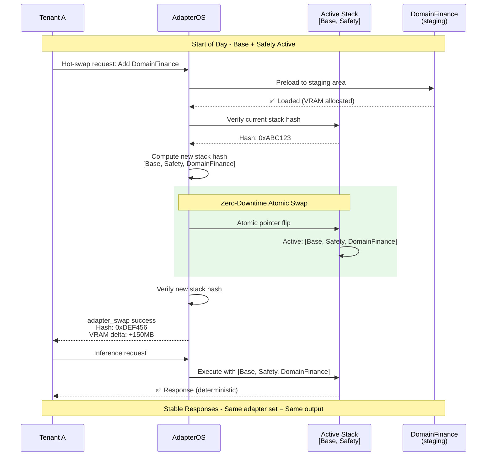
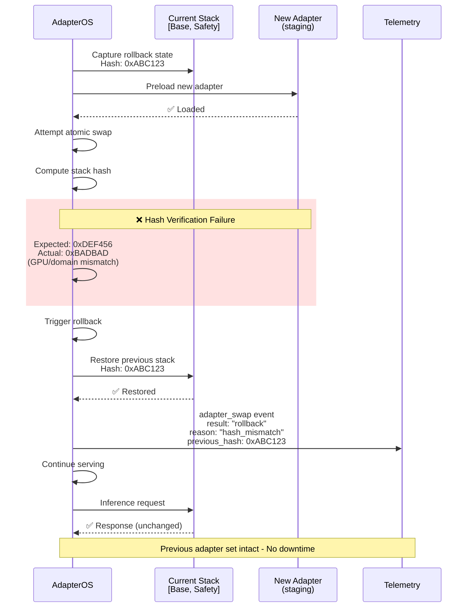

# Hot-swap CI Contract Stories

These stories capture the “what does good look like” acceptance criteria for AdapterOS hot-swapping. Each scenario should map to a guarded integration test that exercises the registry/lifecycle state, the swap/failure, and the resulting adapter stack, hash, and (where applicable) inference output.

## S1 – Mid-day DomainFinance Injection for Tenant A

📊 Scenario Sequence Diagram

Tenant **A** starts the day with the `Base` and `Safety` adapters loaded and serving traffic. Part way through the day they switch to `DomainFinance` to handle a new class of requests. The system must:

- Hot-swap `DomainFinance` into the running stack with **no downtime** (the `Base` + `Safety` adapters stay active while the swap proceeds).
- Emit a single `adapter_swap` success event with the expected stack hash/VRAM delta.
- Produce **stable responses** after the swap that match the responses that would have been returned if `DomainFinance` had been loaded at the start of day (same adapter set ⇒ same deterministic output and stack hash).

## S2 – Hash Mismatch Rollback with Telemetry

📊 Rollback Scenario Diagram

A hot-swap attempt that uplifts the stack to a higher hash fails integrity verification (e.g., GPU/domain hash mismatch). The requirement is:

- Detect the hash mismatch and **rollback immediately** to the previous verified stack.
- Continue serving with the **previous adapter set** unchanged.
- Emit an `adapter_swap` event marked as `result: "rollback"` and include the stack hash from the last verified state.

## S3 – DomainCompliance → DomainRisk Rotation for Tenant C
Tenant **C** rotates out `DomainCompliance` for `DomainRisk` while keeping `Base` alive. Goals:

- Swap out `DomainCompliance`, add `DomainRisk`, and ensure the active adapter set is `{Base, DomainRisk}`.
- Verify the new stack hash differs from the old stack hash because the set changed.
- Verify deterministic inference output also changes to reflect the new domain and that telemetry records the exact VRAM delta.

## S4 – Safety Tier Toggle with Deterministic Cycles for Tenant D
Tenant **D** repeatedly toggles between `Safety` and `Safety_v2` without stalling inference. Expectations:

- Each swap cycle removes the currently active safety adapter and stages the alternate.
- The stack hash/output when `Safety` is installed after a full cycle matches the original hash/output (deterministic re-install).
- Stage buffers are cleared between swaps and the stack never becomes empty (no downtime).

## S5 – Stack Checkpoint Verification for Tenant E
Tenant **E** captures a cross-layer checkpoint after loading `DomainFinance` alongside `Base` + `Safety`. Future hot-swap/verification attempts must:

- Create a checkpoint (metadata + GPU fingerprint) after the swap.
- Successfully verify against the checkpoint when GPU fingerprints are identical.
- Detect a GPU fingerprint mismatch and signal the mismatch (resulting in a rollback if verification is part of the hot-swap flow).
- Emit stack verification telemetry that includes the checkpoint hash when verification succeeds/fails.

