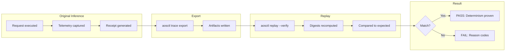
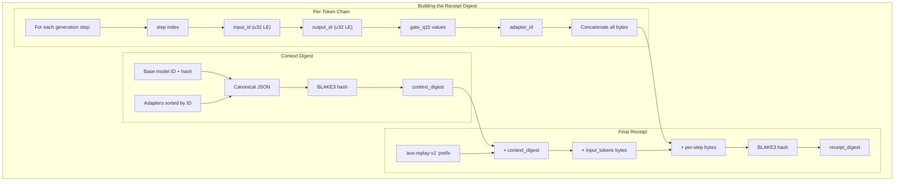
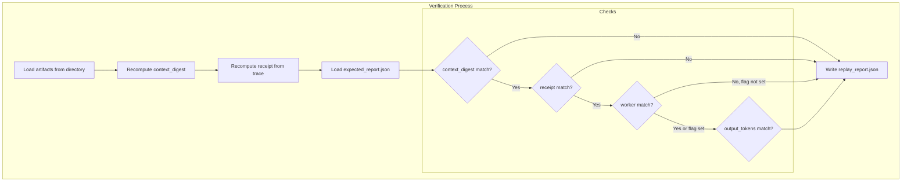

# Replay Harness and Verifier

**Purpose:** Replay a recorded inference from artifacts only (no network) and prove determinism via context digest + receipt.

---

## Overview



---

## Commands

```bash
# Export trace artifacts
aosctl trace export --request <id> --out <dir>

# Replay and verify
aosctl replay --dir <dir> --verify
```

---

## Artifacts

| File | Contents |
|------|----------|
| `context_manifest.json` | Base model, adapters, request/plan IDs, worker ID, `allow_cross_worker` |
| `token_trace.json` | Seed + per-step: input_id, output_id, gate_q15, adapter_id |
| `input_tokens.json` | Prompt tokens (array of u32) |
| `expected_report.json` | Expected digests (written by export) |
| `replay_report.json` | Verification results (written by replay) |

---

## Receipt Generation



---

## Verification Flow



---

## Tamper Detection

| Tampering | Detection | Reason Code |
|-----------|-----------|-------------|
| Adapter hash changed | context_digest mismatch | `CONTEXT_MISMATCH` |
| Gate value modified | receipt mismatch | `RECEIPT_MISMATCH` |
| Token edited | receipt mismatch | `RECEIPT_MISMATCH` |
| Worker swapped (flag=false) | worker check fails | `WORKER_MISMATCH` |
| Output tokens edited | output comparison fails | `OUTPUT_TOKENS_MISMATCH` |

---

## Offline Verification

Reports are fully usable offline:
- No network calls required
- CI fixtures can embed expectations
- Verification is pure computation (BLAKE3 hashing)

---

## Test Fixtures

| Fixture | Purpose |
|---------|---------|
| `test_data/replay_fixtures/basic` | Happy path verification |
| `test_data/replay_fixtures/cross_worker` | Cross-worker replay allowed |

---

## Acceptance Criteria

| Action | Expected Result |
|--------|-----------------|
| Export then replay | PASS |
| Tweak a gate value | FAIL: receipt mismatch |
| Tweak adapter hash | FAIL: context digest mismatch |
| Cross-worker with flag | PASS |
| Cross-worker without flag | FAIL: worker_mismatch |

---

**See also:** [DETERMINISM.md](DETERMINISM.md) for full determinism guarantees.

MLNavigator Inc 2025-12-18.
