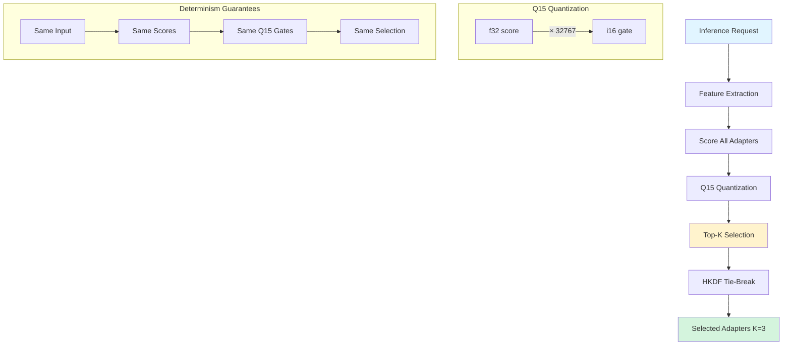

# Routing Documentation

Documentation for AdapterOS router decision tracking, telemetry, and K-sparse adapter selection.

> **⚠️ Known Limitation:** Multi-adapter routing is currently broken - only the first adapter in a stack is used. See [CLAUDE.md](../CLAUDE.md) for current status.

---

## 📚 Documents

### Core Documentation

- **[Telemetry V1 Skeleton Status](./TELEMETRY-V1-SKELETON-STATUS.md)**
  - Complete infrastructure inventory for router decision telemetry
  - Component locations and APIs
  - Testing status and deployment checklist
  - Database schema and query examples

- **[Telemetry Integration Guide](./TELEMETRY-INTEGRATION-GUIDE.md)**
  - Step-by-step integration examples
  - Router-level vs. Worker-level approaches
  - Background persistence setup
  - Unit and integration test examples
  - Monitoring and observability guidance

---

## 🎯 Quick Start

### What is Router Telemetry?

Router telemetry captures every routing decision during inference, including the K-sparse adapter selection process:
- **Step**: Token generation step (0-indexed)
- **Candidates**: Adapters with raw scores and Q15 gates
- **Entropy**: Shannon entropy of gate distribution
- **Parameters**: tau (temperature), entropy_floor (epsilon)

### Components

1. **Event Schema**: `RouterDecisionEvent` in `adapteros-telemetry`
2. **Writer**: `RouterDecisionWriter` - async buffered, non-blocking
3. **Database**: `routing_decisions` table (migration 0070)
4. **API**: POST `/v1/telemetry/routing`, GET `/v1/routing/decisions`

### K-Sparse Selection Algorithm

The router uses K-sparse selection with Q15-quantized gates for deterministic adapter selection:



**Key Properties:**
- **Q15 Quantization**: Converts f32 scores to i16 gates (score × 32767) for bitwise-reproducible comparison
- **K-Sparse**: Selects exactly K adapters (default K=3) from scored candidates
- **HKDF Tie-Break**: When multiple adapters have identical Q15 scores, uses seeded RNG for deterministic ordering
- **Deterministic**: Same input + same seed = same adapter selection across all hardware

For detailed flow with code references, see [flows/route.md](../flows/route.md).

### Implementation Status

✅ **Complete (95%)**
- Event schema defined
- Async buffered writer implemented
- Database schema and functions
- Server ingestion endpoints
- Telemetry bridge for persistence

⏳ **Pending (5%)**
- Router emission integration (30 min effort)

See [Telemetry V1 Skeleton Status](./TELEMETRY-V1-SKELETON-STATUS.md) for full details.

---

## 🔧 Integration

### Recommended Approach (Worker-Level)

```rust
// In worker inference loop
let decision = router.route(&features, &priors);

// Emit telemetry (non-blocking)
if let Some(ref telemetry_writer) = self.telemetry_writer {
    let event = create_router_decision_event(&decision, step, &router);
    let _ = telemetry_writer.emit(event);  // Fire-and-forget
}
```

Full examples in [Telemetry Integration Guide](./TELEMETRY-INTEGRATION-GUIDE.md).

---

## 📊 Observability

### Query Recent Decisions

```sql
SELECT * FROM routing_decisions
WHERE tenant_id = 'default'
ORDER BY timestamp DESC
LIMIT 50;
```

### Find Anomalies

```sql
-- High overhead (>8% budget)
SELECT * FROM routing_decisions_high_overhead LIMIT 100;

-- Low entropy (<0.5, potential routing issues)
SELECT * FROM routing_decisions_low_entropy LIMIT 100;
```

### Monitor Drop Rate

```rust
let drop_rate = telemetry_writer.drop_rate();
if drop_rate > 0.05 {  // Alert if >5%
    tracing::warn!("High router telemetry drop rate: {}", drop_rate);
}
```

---

## 📖 Related Documentation

- **Policy**: `crates/adapteros-policy/src/packs/router.rs` - K-sparse routing policy
- **Router Implementation**: `crates/adapteros-lora-router/src/lib.rs` - Core routing logic
- **Database Schema**: `migrations/0070_routing_decisions.sql` - Telemetry tables
- **API Handlers**: `crates/adapteros-server-api/src/handlers/routing_decisions.rs`

---

## 🚀 Performance

- **Emission Overhead**: <1% (non-blocking channel writes)
- **Channel Capacity**: 1000 events (configurable)
- **Database Writes**: ~1000/sec sustainable (SQLite WAL)
- **Rollback**: Set `telemetry_writer` to `None` for instant no-op

---

## 📋 Deployment Checklist

1. ✅ Migration 0070 applied to database
2. ✅ Telemetry writer created and passed to router/worker
3. ✅ Background persistence task running
4. ✅ Monitoring alerts for high drop rate configured
5. ⏳ Router emission integrated (see Integration Guide)

---

**Status**: Ready for integration testing
**Version**: Telemetry V1 Skeleton
**Last Updated**: 2025-11-18

---

## See Also

- **[Route Flow: K-Sparse Adapter Selection](../flows/route.md)** - Detailed flow diagram with code references for K-sparse routing
- **[Telemetry Events Catalog](../TELEMETRY_EVENTS.md)** - Complete event catalog including `RouterDecisionEvent` schema
- **[Router Determinism Proof](../ROUTER_DETERMINISM_PROOF.md)** - Formal proof of deterministic routing guarantees
- **[CLAUDE.md Architecture Patterns](../../CLAUDE.md)** - K-Sparse Routing pattern and Q15 quantization policy
