# AdapterOS Runtime Architecture Diagrams

**Version:** 1.0.0  
**Last Updated:** 2025-10-09

This document contains comprehensive Mermaid.js diagrams for the AdapterOS runtime system.

---

## Table of Contents

1. [System Architecture](#1-system-architecture)
2. [Request Flow](#2-request-flow)
3. [Adapter Lifecycle](#3-adapter-lifecycle)
4. [Memory Management](#4-memory-management)
5. [Router Pipeline](#5-router-pipeline)
6. [Evidence Retrieval](#6-evidence-retrieval)
7. [Policy Enforcement](#7-policy-enforcement)
8. [State Management](#8-state-management)
9. [Telemetry Flow](#9-telemetry-flow)
10. [Error Handling](#10-error-handling)
11. [Security Boundaries](#11-security-boundaries)
12. [Deployment Architecture](#12-deployment-architecture)

---

## 1. System Architecture

### 1.1 High-Level Component Architecture

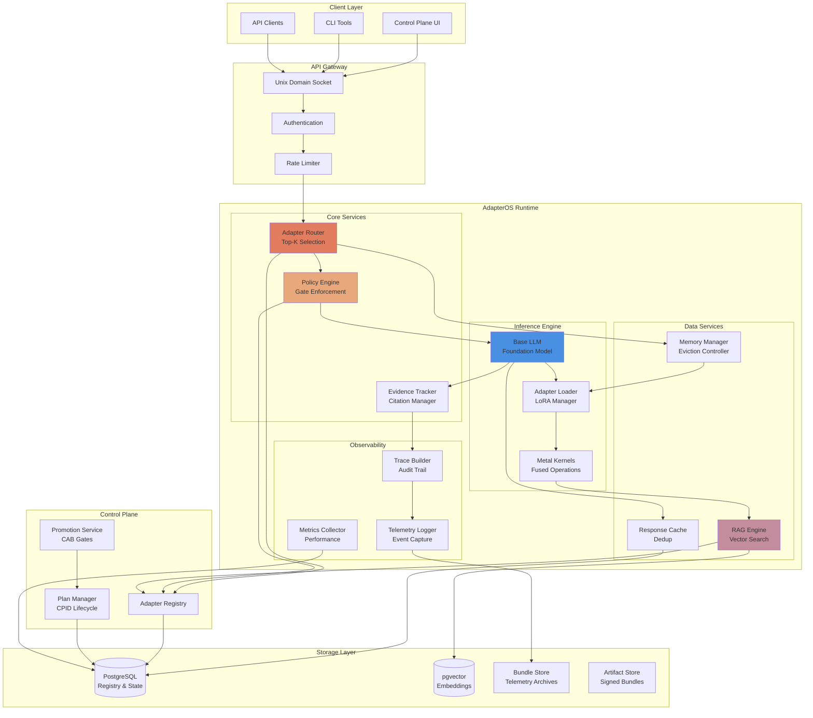
```mermaid
graph TB
    subgraph "Client Layer"
        UI[Control Plane UI]
        CLI[CLI Tools]
        API_Client[API Clients]
    end

    subgraph "API Gateway"
        UDS[Unix Domain Socket]
        Auth[Authentication]
        RateLimit[Rate Limiter]
    end

    subgraph "AdapterOS Runtime"
        subgraph "Core Services"
            Router[Adapter Router<br/>Top-K Selection]
            Policy[Policy Engine<br/>Gate Enforcement]
            Evidence[Evidence Tracker<br/>Citation Manager]
        end

        subgraph "Inference Engine"
            LLM[Base LLM<br/>Foundation Model]
            AdapterLoader[Adapter Loader<br/>LoRA Manager]
            MetalKernel[Metal Kernels<br/>Fused Operations]
        end

        subgraph "Data Services"
            RAG[RAG Engine<br/>Vector Search]
            Cache[Response Cache<br/>Dedup]
            Memory[Memory Manager<br/>Eviction Controller]
        end

        subgraph "Observability"
            Telemetry[Telemetry Logger<br/>Event Capture]
            Trace[Trace Builder<br/>Audit Trail]
            Metrics[Metrics Collector<br/>Performance]
        end
    end

    subgraph "Storage Layer"
        Postgres[(PostgreSQL<br/>Registry & State)]
        VectorDB[(pgvector<br/>Embeddings)]
        BundleStore[Bundle Store<br/>Telemetry Archives]
        Artifacts[Artifact Store<br/>Signed Bundles]
    end

    subgraph "Control Plane"
        Registry[Adapter Registry]
        PlanManager[Plan Manager<br/>CPID Lifecycle]
        Promotion[Promotion Service<br/>CAB Gates]
    end

    UI --> UDS
    CLI --> UDS
    API_Client --> UDS
    UDS --> Auth
    Auth --> RateLimit
    RateLimit --> Router

    Router --> Policy
    Policy --> LLM
    LLM --> AdapterLoader
    AdapterLoader --> MetalKernel
    MetalKernel --> RAG
    RAG --> VectorDB

    LLM --> Evidence
    Evidence --> Trace
    Trace --> Telemetry
    Telemetry --> BundleStore

    Router --> Memory
    Memory --> AdapterLoader
    
    LLM --> Cache
    Cache --> Postgres

    Router --> Registry
    Policy --> Registry
    RAG --> Registry
    
    Registry --> Postgres
    PlanManager --> Postgres
    Promotion --> PlanManager
    
    Metrics --> Postgres

    style LLM fill:#4A90E2
    style Router fill:#E27D60
    style Policy fill:#E8A87C
    style RAG fill:#C38D9E
```

### 1.2 Process Model

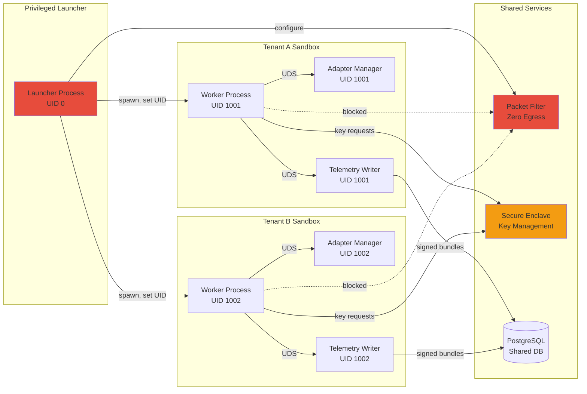
```mermaid
graph LR
    subgraph "Privileged Launcher"
        PL[Launcher Process<br/>UID 0]
    end

    subgraph "Tenant A Sandbox"
        TA_Worker[Worker Process<br/>UID 1001]
        TA_Adapter[Adapter Manager<br/>UID 1001]
        TA_Telemetry[Telemetry Writer<br/>UID 1001]
    end

    subgraph "Tenant B Sandbox"
        TB_Worker[Worker Process<br/>UID 1002]
        TB_Adapter[Adapter Manager<br/>UID 1002]
        TB_Telemetry[Telemetry Writer<br/>UID 1002]
    end

    subgraph "Shared Services"
        PF[Packet Filter<br/>Zero Egress]
        SE[Secure Enclave<br/>Key Management]
        DB[(PostgreSQL<br/>Shared DB)]
    end

    PL -->|spawn, set UID| TA_Worker
    PL -->|spawn, set UID| TB_Worker
    PL -->|configure| PF

    TA_Worker -->|UDS| TA_Adapter
    TA_Worker -->|UDS| TA_Telemetry
    TB_Worker -->|UDS| TB_Adapter
    TB_Worker -->|UDS| TB_Telemetry

    TA_Telemetry -->|signed bundles| DB
    TB_Telemetry -->|signed bundles| DB

    TA_Worker -.->|blocked| PF
    TB_Worker -.->|blocked| PF

    TA_Worker -->|key requests| SE
    TB_Worker -->|key requests| SE

    style PL fill:#E74C3C
    style PF fill:#E74C3C
    style SE fill:#F39C12
```

---

## 2. Request Flow

### 2.1 Complete Request Lifecycle

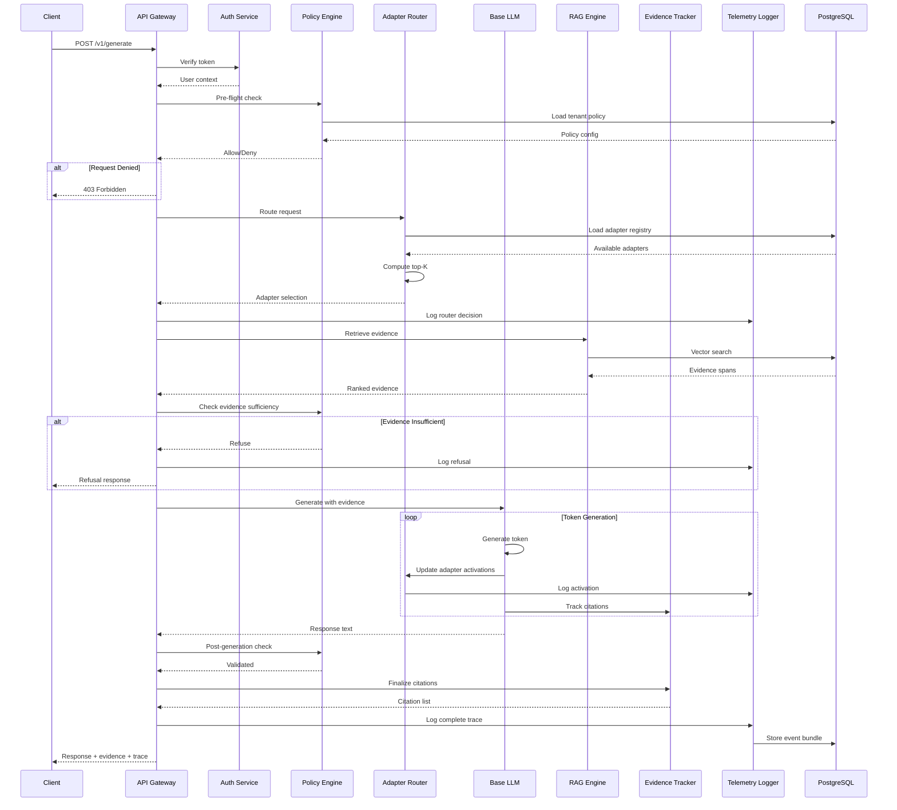
```mermaid
sequenceDiagram
    participant Client
    participant Gateway as API Gateway
    participant Auth as Auth Service
    participant Policy as Policy Engine
    participant Router as Adapter Router
    participant LLM as Base LLM
    participant RAG as RAG Engine
    participant Evidence as Evidence Tracker
    participant Telemetry as Telemetry Logger
    participant DB as PostgreSQL

    Client->>Gateway: POST /v1/generate
    Gateway->>Auth: Verify token
    Auth-->>Gateway: User context
    
    Gateway->>Policy: Pre-flight check
    Policy->>DB: Load tenant policy
    DB-->>Policy: Policy config
    Policy-->>Gateway: Allow/Deny
    
    alt Request Denied
        Gateway-->>Client: 403 Forbidden
    end

    Gateway->>Router: Route request
    Router->>DB: Load adapter registry
    DB-->>Router: Available adapters
    Router->>Router: Compute top-K
    Router-->>Gateway: Adapter selection
    
    Gateway->>Telemetry: Log router decision
    
    Gateway->>RAG: Retrieve evidence
    RAG->>DB: Vector search
    DB-->>RAG: Evidence spans
    RAG-->>Gateway: Ranked evidence
    
    Gateway->>Policy: Check evidence sufficiency
    alt Evidence Insufficient
        Policy-->>Gateway: Refuse
        Gateway->>Telemetry: Log refusal
        Gateway-->>Client: Refusal response
    end
    
    Gateway->>LLM: Generate with evidence
    
    loop Token Generation
        LLM->>LLM: Generate token
        LLM->>Router: Update adapter activations
        Router->>Telemetry: Log activation
        LLM->>Evidence: Track citations
    end
    
    LLM-->>Gateway: Response text
    
    Gateway->>Policy: Post-generation check
    Policy-->>Gateway: Validated
    
    Gateway->>Evidence: Finalize citations
    Evidence-->>Gateway: Citation list
    
    Gateway->>Telemetry: Log complete trace
    Telemetry->>DB: Store event bundle
    
    Gateway-->>Client: Response + evidence + trace
```

### 2.2 Streaming Response Flow

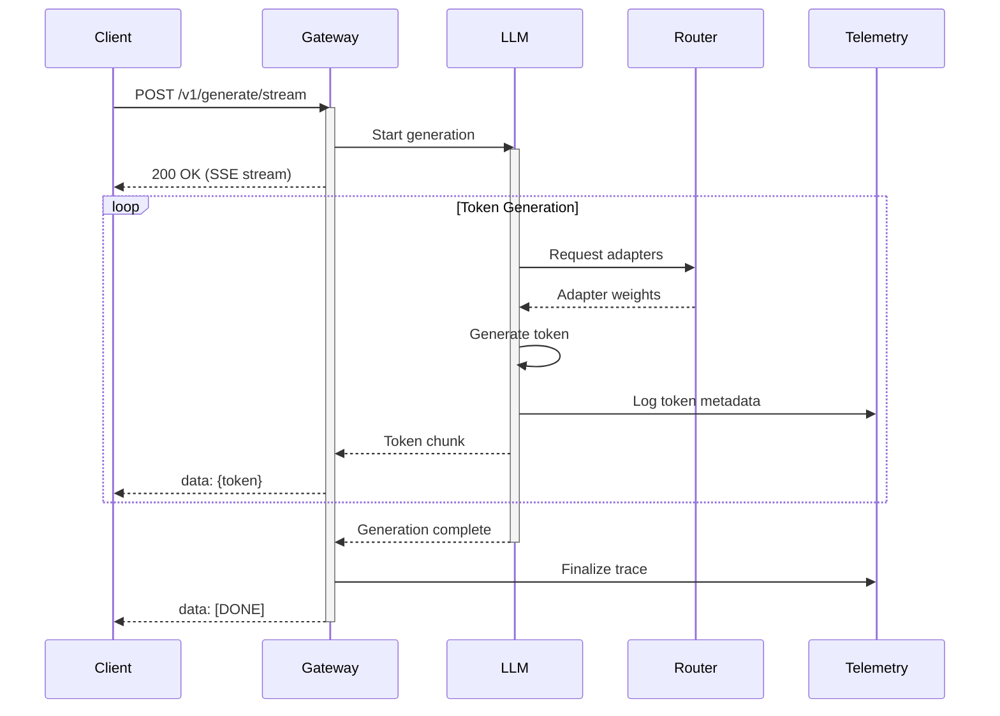
```mermaid
sequenceDiagram
    participant Client
    participant Gateway
    participant LLM
    participant Router
    participant Telemetry

    Client->>Gateway: POST /v1/generate/stream
    activate Gateway
    Gateway->>LLM: Start generation
    activate LLM
    
    Gateway-->>Client: 200 OK (SSE stream)
    
    loop Token Generation
        LLM->>Router: Request adapters
        Router-->>LLM: Adapter weights
        LLM->>LLM: Generate token
        LLM->>Telemetry: Log token metadata
        LLM-->>Gateway: Token chunk
        Gateway-->>Client: data: {token}
    end
    
    LLM-->>Gateway: Generation complete
    deactivate LLM
    
    Gateway->>Telemetry: Finalize trace
    Gateway-->>Client: data: [DONE]
    deactivate Gateway
```

---

## 3. Adapter Lifecycle

### 3.1 Adapter State Machine

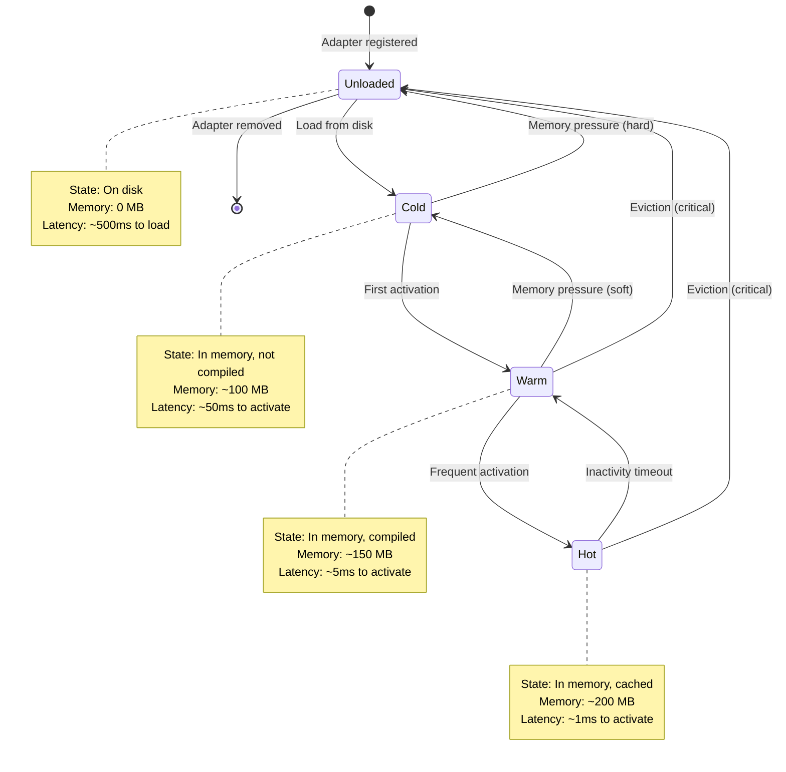
```mermaid
stateDiagram-v2
    [*] --> Unloaded: Adapter registered
    
    Unloaded --> Cold: Load from disk
    Cold --> Warm: First activation
    Warm --> Hot: Frequent activation
    
    Hot --> Warm: Inactivity timeout
    Warm --> Cold: Memory pressure (soft)
    Cold --> Unloaded: Memory pressure (hard)
    
    Hot --> Unloaded: Eviction (critical)
    Warm --> Unloaded: Eviction (critical)
    
    Unloaded --> [*]: Adapter removed
    
    note right of Unloaded
        State: On disk
        Memory: 0 MB
        Latency: ~500ms to load
    end note
    
    note right of Cold
        State: In memory, not compiled
        Memory: ~100 MB
        Latency: ~50ms to activate
    end note
    
    note right of Warm
        State: In memory, compiled
        Memory: ~150 MB
        Latency: ~5ms to activate
    end note
    
    note right of Hot
        State: In memory, cached
        Memory: ~200 MB
        Latency: ~1ms to activate
    end note
```

### 3.2 Adapter Loading Sequence

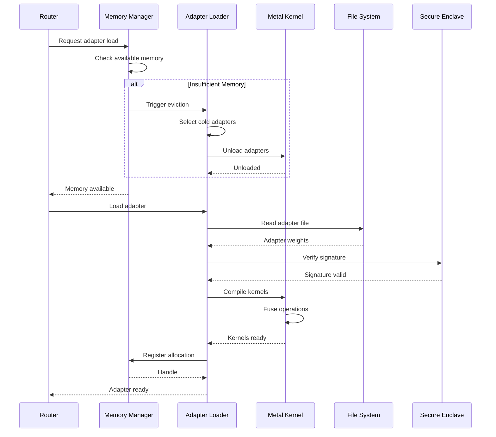
```mermaid
sequenceDiagram
    participant Router
    participant Memory as Memory Manager
    participant Loader as Adapter Loader
    participant Metal as Metal Kernel
    participant FS as File System
    participant SE as Secure Enclave

    Router->>Memory: Request adapter load
    Memory->>Memory: Check available memory
    
    alt Insufficient Memory
        Memory->>Loader: Trigger eviction
        Loader->>Loader: Select cold adapters
        Loader->>Metal: Unload adapters
        Metal-->>Loader: Unloaded
    end
    
    Memory-->>Router: Memory available
    
    Router->>Loader: Load adapter
    Loader->>FS: Read adapter file
    FS-->>Loader: Adapter weights
    
    Loader->>SE: Verify signature
    SE-->>Loader: Signature valid
    
    Loader->>Metal: Compile kernels
    Metal->>Metal: Fuse operations
    Metal-->>Loader: Kernels ready
    
    Loader->>Memory: Register allocation
    Memory-->>Loader: Handle
    
    Loader-->>Router: Adapter ready
```

---

## 4. Memory Management

### 4.1 Memory Allocation Strategy

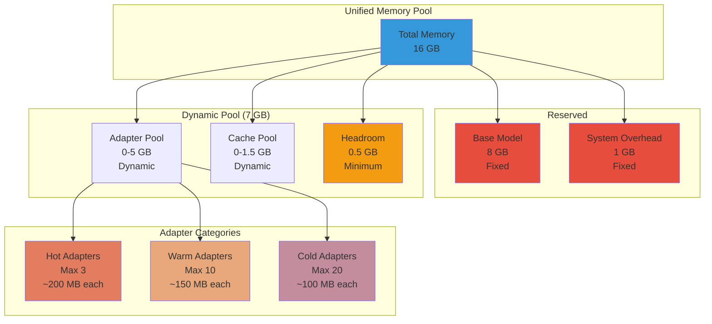
```mermaid
graph TB
    subgraph "Unified Memory Pool"
        Total[Total Memory<br/>16 GB]
    end

    subgraph "Reserved"
        Base[Base Model<br/>8 GB<br/>Fixed]
        System[System Overhead<br/>1 GB<br/>Fixed]
    end

    subgraph "Dynamic Pool (7 GB)"
        AdapterPool[Adapter Pool<br/>0-5 GB<br/>Dynamic]
        CachePool[Cache Pool<br/>0-1.5 GB<br/>Dynamic]
        HeadRoom[Headroom<br/>0.5 GB<br/>Minimum]
    end

    subgraph "Adapter Categories"
        Hot[Hot Adapters<br/>Max 3<br/>~200 MB each]
        Warm[Warm Adapters<br/>Max 10<br/>~150 MB each]
        Cold[Cold Adapters<br/>Max 20<br/>~100 MB each]
    end

    Total --> Base
    Total --> System
    Total --> AdapterPool
    Total --> CachePool
    Total --> HeadRoom

    AdapterPool --> Hot
    AdapterPool --> Warm
    AdapterPool --> Cold

    style Total fill:#3498DB
    style Base fill:#E74C3C
    style System fill:#E74C3C
    style HeadRoom fill:#F39C12
    style Hot fill:#E27D60
    style Warm fill:#E8A87C
    style Cold fill:#C38D9E
```

### 4.2 Eviction Decision Tree

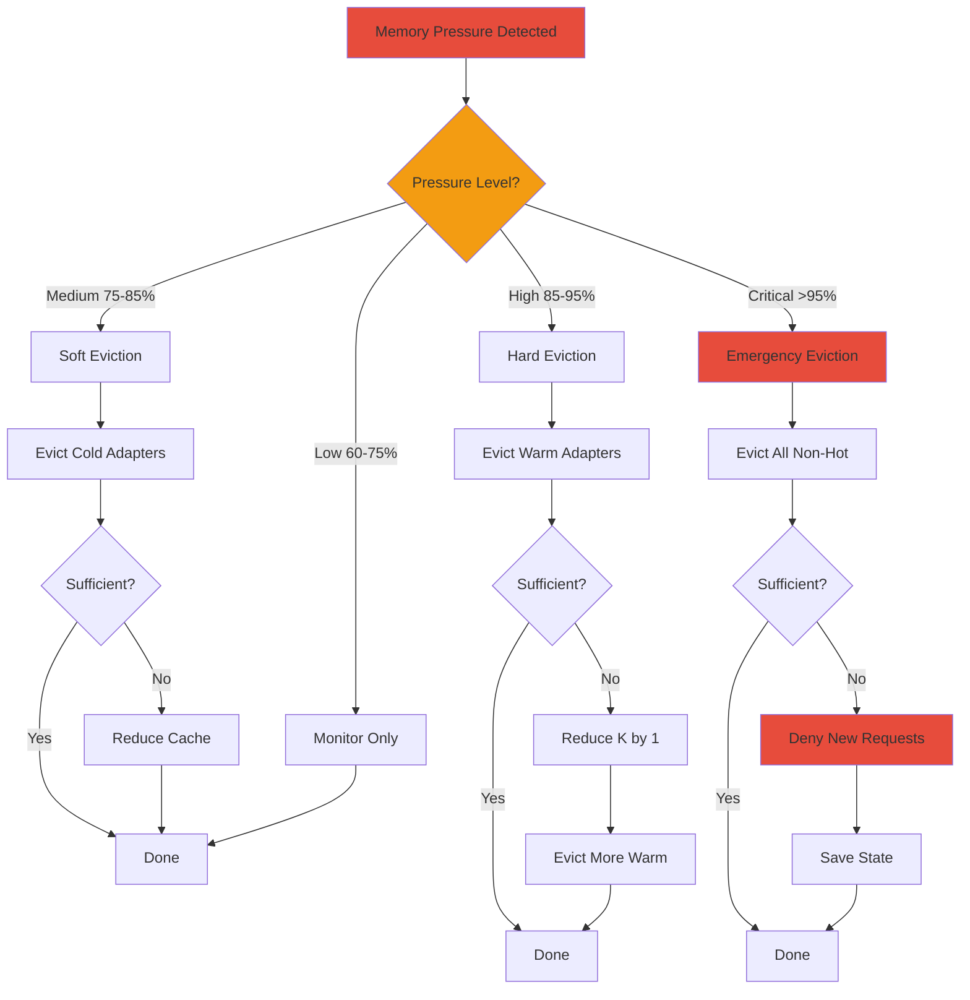
```mermaid
graph TD
    Start[Memory Pressure Detected]
    CheckLevel{Pressure Level?}
    
    Start --> CheckLevel
    
    CheckLevel -->|Low 60-75%| Monitor[Monitor Only]
    CheckLevel -->|Medium 75-85%| SoftEvict[Soft Eviction]
    CheckLevel -->|High 85-95%| HardEvict[Hard Eviction]
    CheckLevel -->|Critical >95%| Emergency[Emergency Eviction]
    
    SoftEvict --> EvictCold[Evict Cold Adapters]
    EvictCold --> CheckSufficient1{Sufficient?}
    CheckSufficient1 -->|Yes| Done1[Done]
    CheckSufficient1 -->|No| ReduceCache[Reduce Cache]
    ReduceCache --> Done1
    
    HardEvict --> EvictWarm[Evict Warm Adapters]
    EvictWarm --> CheckSufficient2{Sufficient?}
    CheckSufficient2 -->|Yes| Done2[Done]
    CheckSufficient2 -->|No| ReduceK[Reduce K by 1]
    ReduceK --> EvictWarm2[Evict More Warm]
    EvictWarm2 --> Done2
    
    Emergency --> EvictAll[Evict All Non-Hot]
    EvictAll --> CheckSufficient3{Sufficient?}
    CheckSufficient3 -->|Yes| Done3[Done]
    CheckSufficient3 -->|No| DenyNew[Deny New Requests]
    DenyNew --> SaveState[Save State]
    SaveState --> Done3

    Monitor --> Done1
    
    style Start fill:#E74C3C
    style CheckLevel fill:#F39C12
    style Emergency fill:#E74C3C
    style DenyNew fill:#E74C3C
```

---

## 5. Router Pipeline

### 5.1 Router Architecture

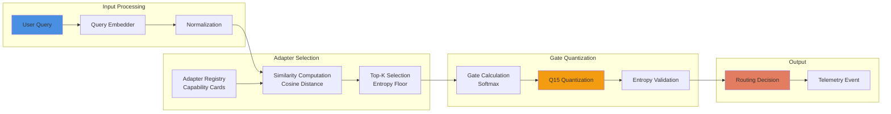
```mermaid
graph LR
    subgraph "Input Processing"
        Query[User Query]
        Embed[Query Embedder]
        Norm[Normalization]
    end

    subgraph "Adapter Selection"
        Registry[Adapter Registry<br/>Capability Cards]
        Similarity[Similarity Computation<br/>Cosine Distance]
        TopK[Top-K Selection<br/>Entropy Floor]
    end

    subgraph "Gate Quantization"
        GateCalc[Gate Calculation<br/>Softmax]
        Q15[Q15 Quantization]
        Validate[Entropy Validation]
    end

    subgraph "Output"
        Routing[Routing Decision]
        Telemetry[Telemetry Event]
    end

    Query --> Embed
    Embed --> Norm
    Norm --> Similarity
    
    Registry --> Similarity
    Similarity --> TopK
    
    TopK --> GateCalc
    GateCalc --> Q15
    Q15 --> Validate
    
    Validate --> Routing
    Routing --> Telemetry

    style Query fill:#4A90E2
    style Routing fill:#E27D60
    style Q15 fill:#F39C12
```

### 5.2 Top-K Adapter Selection Flow

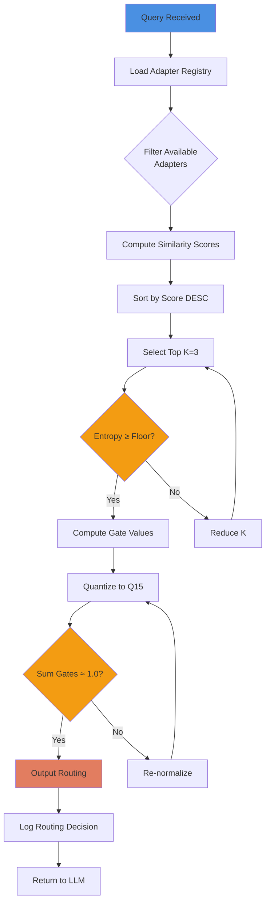
```mermaid
flowchart TD
    Start[Query Received]
    
    Start --> LoadRegistry[Load Adapter Registry]
    LoadRegistry --> FilterAvailable{Filter Available<br/>Adapters}
    
    FilterAvailable --> ComputeScores[Compute Similarity Scores]
    ComputeScores --> SortScores[Sort by Score DESC]
    SortScores --> SelectTopK[Select Top K=3]
    
    SelectTopK --> CheckEntropy{Entropy ≥ Floor?}
    
    CheckEntropy -->|Yes| ComputeGates[Compute Gate Values]
    CheckEntropy -->|No| AdjustK[Reduce K]
    AdjustK --> SelectTopK
    
    ComputeGates --> QuantizeGates[Quantize to Q15]
    QuantizeGates --> ValidateSum{Sum Gates ≈ 1.0?}
    
    ValidateSum -->|Yes| Output[Output Routing]
    ValidateSum -->|No| Normalize[Re-normalize]
    Normalize --> QuantizeGates
    
    Output --> LogDecision[Log Routing Decision]
    LogDecision --> End[Return to LLM]

    style Start fill:#4A90E2
    style Output fill:#E27D60
    style CheckEntropy fill:#F39C12
    style ValidateSum fill:#F39C12
```

---

## 6. Evidence Retrieval

### 6.1 RAG Pipeline

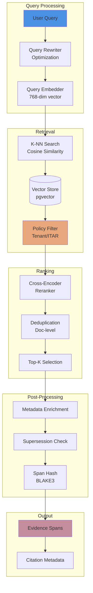
```mermaid
graph TB
    subgraph "Query Processing"
        UserQuery[User Query]
        Rewrite[Query Rewriter<br/>Optimization]
        Embed[Query Embedder<br/>768-dim vector]
    end

    subgraph "Retrieval"
        VectorDB[(Vector Store<br/>pgvector)]
        KNN[K-NN Search<br/>Cosine Similarity]
        Filter[Policy Filter<br/>Tenant/ITAR]
    end

    subgraph "Ranking"
        CrossEncoder[Cross-Encoder<br/>Reranker]
        Dedupe[Deduplication<br/>Doc-level]
        TopK[Top-K Selection]
    end

    subgraph "Post-Processing"
        Metadata[Metadata Enrichment]
        Supersession[Supersession Check]
        Hash[Span Hash<br/>BLAKE3]
    end

    subgraph "Output"
        Evidence[Evidence Spans]
        Citations[Citation Metadata]
    end

    UserQuery --> Rewrite
    Rewrite --> Embed
    Embed --> KNN
    
    KNN --> VectorDB
    VectorDB --> Filter
    Filter --> CrossEncoder
    
    CrossEncoder --> Dedupe
    Dedupe --> TopK
    
    TopK --> Metadata
    Metadata --> Supersession
    Supersession --> Hash
    
    Hash --> Evidence
    Evidence --> Citations

    style UserQuery fill:#4A90E2
    style Evidence fill:#C38D9E
    style Filter fill:#E8A87C
```

### 6.2 Evidence Validation Flow

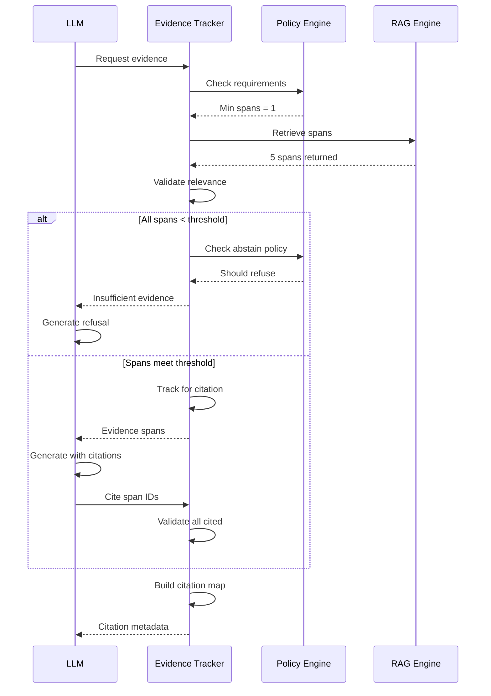
```mermaid
sequenceDiagram
    participant LLM
    participant Evidence as Evidence Tracker
    participant Policy as Policy Engine
    participant RAG as RAG Engine

    LLM->>Evidence: Request evidence
    Evidence->>Policy: Check requirements
    Policy-->>Evidence: Min spans = 1
    
    Evidence->>RAG: Retrieve spans
    RAG-->>Evidence: 5 spans returned
    
    Evidence->>Evidence: Validate relevance
    
    alt All spans < threshold
        Evidence->>Policy: Check abstain policy
        Policy-->>Evidence: Should refuse
        Evidence-->>LLM: Insufficient evidence
        LLM->>LLM: Generate refusal
    else Spans meet threshold
        Evidence->>Evidence: Track for citation
        Evidence-->>LLM: Evidence spans
        LLM->>LLM: Generate with citations
        LLM->>Evidence: Cite span IDs
        Evidence->>Evidence: Validate all cited
    end
    
    Evidence->>Evidence: Build citation map
    Evidence-->>LLM: Citation metadata
```

---

## 7. Policy Enforcement

### 7.1 Policy Gate Architecture

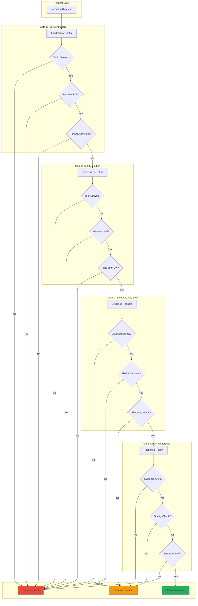
```mermaid
graph TB
    subgraph "Request Entry"
        Request[Incoming Request]
    end

    subgraph "Gate 1: Pre-Generation"
        G1[Load Policy Config]
        G1_Check{Topic Allowed?}
        G1_User{User Has Role?}
        G1_Tenant{Tenant Authorized?}
    end

    subgraph "Gate 2: Tool Execution"
        G2[Tool Call Detected]
        G2_Check{Tool Allowed?}
        G2_Params{Params Valid?}
        G2_Rate{Rate Limit OK?}
    end

    subgraph "Gate 3: Evidence Retrieval"
        G3[Evidence Request]
        G3_Check{Classification OK?}
        G3_ITAR{ITAR Compliant?}
        G3_Effectivity{Effectivity Match?}
    end

    subgraph "Gate 4: Post-Generation"
        G4[Response Ready]
        G4_Check{Evidence Cited?}
        G4_Quality{Quality Check?}
        G4_Export{Export Allowed?}
    end

    subgraph "Decision"
        Allow[Allow Response]
        Refuse[Generate Refusal]
        Block[Block Request]
    end

    Request --> G1
    G1 --> G1_Check
    G1_Check -->|No| Block
    G1_Check -->|Yes| G1_User
    G1_User -->|No| Block
    G1_User -->|Yes| G1_Tenant
    G1_Tenant -->|No| Block
    G1_Tenant -->|Yes| G2

    G2 --> G2_Check
    G2_Check -->|No| Block
    G2_Check -->|Yes| G2_Params
    G2_Params -->|No| Block
    G2_Params -->|Yes| G2_Rate
    G2_Rate -->|No| Block
    G2_Rate -->|Yes| G3

    G3 --> G3_Check
    G3_Check -->|No| Block
    G3_Check -->|Yes| G3_ITAR
    G3_ITAR -->|No| Block
    G3_ITAR -->|Yes| G3_Effectivity
    G3_Effectivity -->|No| Refuse
    G3_Effectivity -->|Yes| G4

    G4 --> G4_Check
    G4_Check -->|No| Refuse
    G4_Check -->|Yes| G4_Quality
    G4_Quality -->|No| Refuse
    G4_Quality -->|Yes| G4_Export
    G4_Export -->|No| Block
    G4_Export -->|Yes| Allow

    style Block fill:#E74C3C
    style Refuse fill:#F39C12
    style Allow fill:#27AE60
```

### 7.2 Refusal Decision Tree

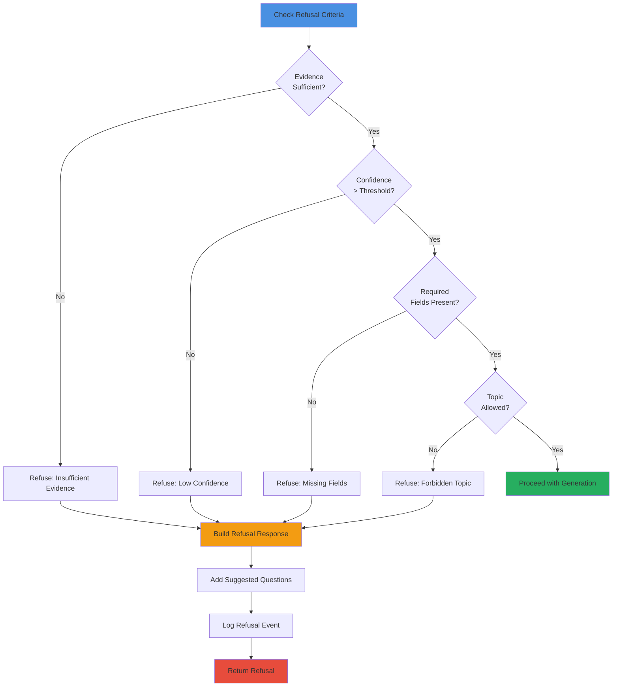
```mermaid
graph TD
    Start[Check Refusal Criteria]
    
    Start --> CheckEvidence{Evidence<br/>Sufficient?}
    CheckEvidence -->|No| RefuseEvidence[Refuse: Insufficient Evidence]
    CheckEvidence -->|Yes| CheckConfidence
    
    CheckConfidence{Confidence<br/>> Threshold?}
    CheckConfidence -->|No| RefuseConfidence[Refuse: Low Confidence]
    CheckConfidence -->|Yes| CheckFields
    
    CheckFields{Required<br/>Fields Present?}
    CheckFields -->|No| RefuseFields[Refuse: Missing Fields]
    CheckFields -->|Yes| CheckTopic
    
    CheckTopic{Topic<br/>Allowed?}
    CheckTopic -->|No| RefuseTopic[Refuse: Forbidden Topic]
    CheckTopic -->|Yes| Proceed
    
    Proceed[Proceed with Generation]
    
    RefuseEvidence --> BuildRefusal[Build Refusal Response]
    RefuseConfidence --> BuildRefusal
    RefuseFields --> BuildRefusal
    RefuseTopic --> BuildRefusal
    
    BuildRefusal --> AddSuggestions[Add Suggested Questions]
    AddSuggestions --> LogRefusal[Log Refusal Event]
    LogRefusal --> ReturnRefusal[Return Refusal]

    style Start fill:#4A90E2
    style Proceed fill:#27AE60
    style BuildRefusal fill:#F39C12
    style ReturnRefusal fill:#E74C3C
```

---

## 8. State Management

### 8.1 State Hierarchy

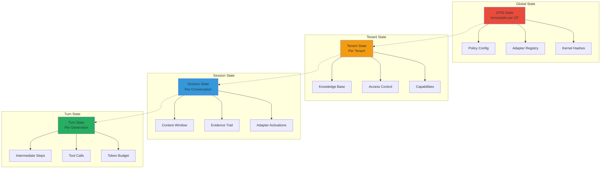
```mermaid
graph TD
    subgraph "Global State"
        CPID[CPID State<br/>Immutable per CP]
        CPID --> CPPolicy[Policy Config]
        CPID --> CPAdapters[Adapter Registry]
        CPID --> CPKernels[Kernel Hashes]
    end

    subgraph "Tenant State"
        Tenant[Tenant State<br/>Per Tenant]
        Tenant --> TenantKB[Knowledge Base]
        Tenant --> TenantACL[Access Control]
        Tenant --> TenantCap[Capabilities]
    end

    subgraph "Session State"
        Session[Session State<br/>Per Conversation]
        Session --> SessionContext[Context Window]
        Session --> SessionEvidence[Evidence Trail]
        Session --> SessionAdapters[Adapter Activations]
    end

    subgraph "Turn State"
        Turn[Turn State<br/>Per Generation]
        Turn --> TurnSteps[Intermediate Steps]
        Turn --> TurnTools[Tool Calls]
        Turn --> TurnBudget[Token Budget]
    end

    CPID -.-> Tenant
    Tenant -.-> Session
    Session -.-> Turn

    style CPID fill:#E74C3C
    style Tenant fill:#F39C12
    style Session fill:#3498DB
    style Turn fill:#27AE60
```

### 8.2 Checkpoint Flow

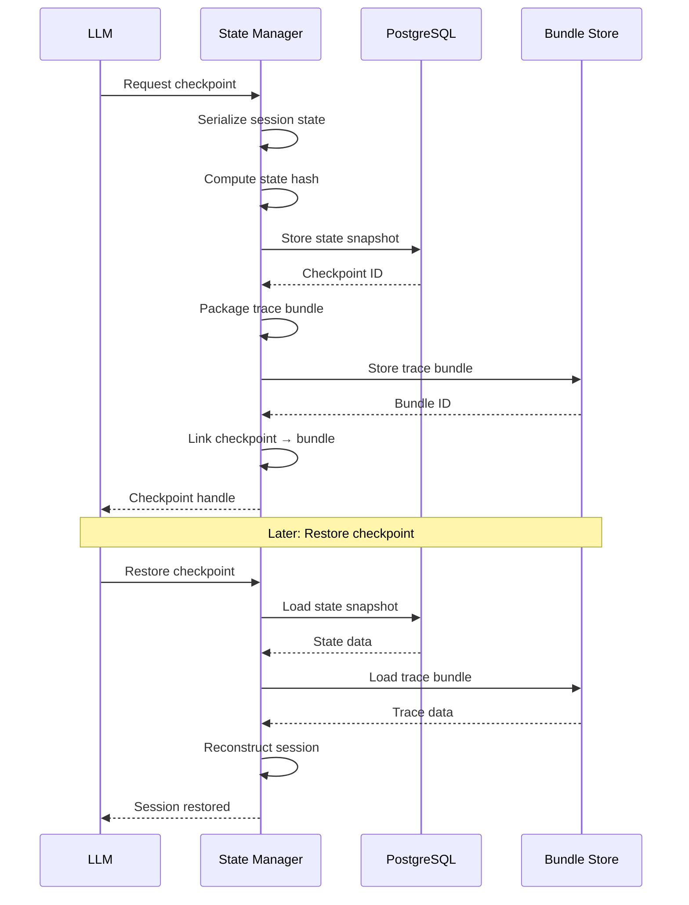
```mermaid
sequenceDiagram
    participant LLM
    participant State as State Manager
    participant DB as PostgreSQL
    participant Bundle as Bundle Store

    LLM->>State: Request checkpoint
    State->>State: Serialize session state
    
    State->>State: Compute state hash
    State->>DB: Store state snapshot
    DB-->>State: Checkpoint ID
    
    State->>State: Package trace bundle
    State->>Bundle: Store trace bundle
    Bundle-->>State: Bundle ID
    
    State->>State: Link checkpoint → bundle
    State-->>LLM: Checkpoint handle
    
    Note over LLM,Bundle: Later: Restore checkpoint
    
    LLM->>State: Restore checkpoint
    State->>DB: Load state snapshot
    DB-->>State: State data
    
    State->>Bundle: Load trace bundle
    Bundle-->>State: Trace data
    
    State->>State: Reconstruct session
    State-->>LLM: Session restored
```

---

## 9. Telemetry Flow

### 9.1 Event Pipeline

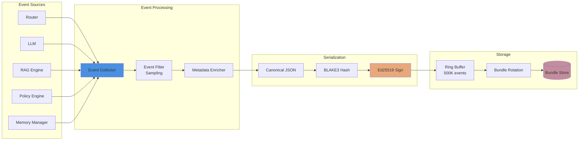
```mermaid
graph LR
    subgraph "Event Sources"
        Router[Router]
        LLM[LLM]
        RAG[RAG Engine]
        Policy[Policy Engine]
        Memory[Memory Manager]
    end

    subgraph "Event Processing"
        Collector[Event Collector]
        Filter[Event Filter<br/>Sampling]
        Enrich[Metadata Enricher]
    end

    subgraph "Serialization"
        Canonical[Canonical JSON]
        Hash[BLAKE3 Hash]
        Sign[Ed25519 Sign]
    end

    subgraph "Storage"
        Buffer[Ring Buffer<br/>500K events]
        Rotate[Bundle Rotation]
        Bundle[(Bundle Store)]
    end

    Router --> Collector
    LLM --> Collector
    RAG --> Collector
    Policy --> Collector
    Memory --> Collector

    Collector --> Filter
    Filter --> Enrich
    Enrich --> Canonical
    Canonical --> Hash
    Hash --> Sign
    Sign --> Buffer
    Buffer --> Rotate
    Rotate --> Bundle

    style Collector fill:#4A90E2
    style Sign fill:#E8A87C
    style Bundle fill:#C38D9E
```

### 9.2 Trace Construction

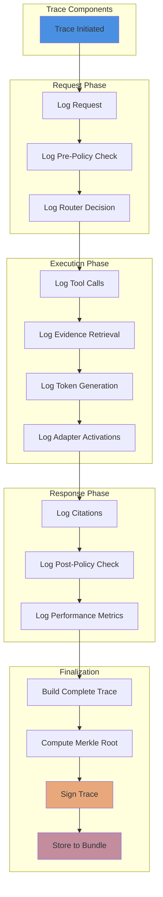
```mermaid
graph TB
    subgraph "Trace Components"
        TraceStart[Trace Initiated]
    end

    subgraph "Request Phase"
        ReqLog[Log Request]
        ReqPolicy[Log Pre-Policy Check]
        ReqRouter[Log Router Decision]
    end

    subgraph "Execution Phase"
        ExecTools[Log Tool Calls]
        ExecEvidence[Log Evidence Retrieval]
        ExecTokens[Log Token Generation]
        ExecAdapters[Log Adapter Activations]
    end

    subgraph "Response Phase"
        RespCitations[Log Citations]
        RespPolicy[Log Post-Policy Check]
        RespMetrics[Log Performance Metrics]
    end

    subgraph "Finalization"
        BuildTrace[Build Complete Trace]
        ComputeMerkle[Compute Merkle Root]
        SignTrace[Sign Trace]
        StoreTrace[Store to Bundle]
    end

    TraceStart --> ReqLog
    ReqLog --> ReqPolicy
    ReqPolicy --> ReqRouter
    
    ReqRouter --> ExecTools
    ExecTools --> ExecEvidence
    ExecEvidence --> ExecTokens
    ExecTokens --> ExecAdapters
    
    ExecAdapters --> RespCitations
    RespCitations --> RespPolicy
    RespPolicy --> RespMetrics
    
    RespMetrics --> BuildTrace
    BuildTrace --> ComputeMerkle
    ComputeMerkle --> SignTrace
    SignTrace --> StoreTrace

    style TraceStart fill:#4A90E2
    style SignTrace fill:#E8A87C
    style StoreTrace fill:#C38D9E
```

---

## 10. Error Handling

### 10.1 Error Recovery Flow

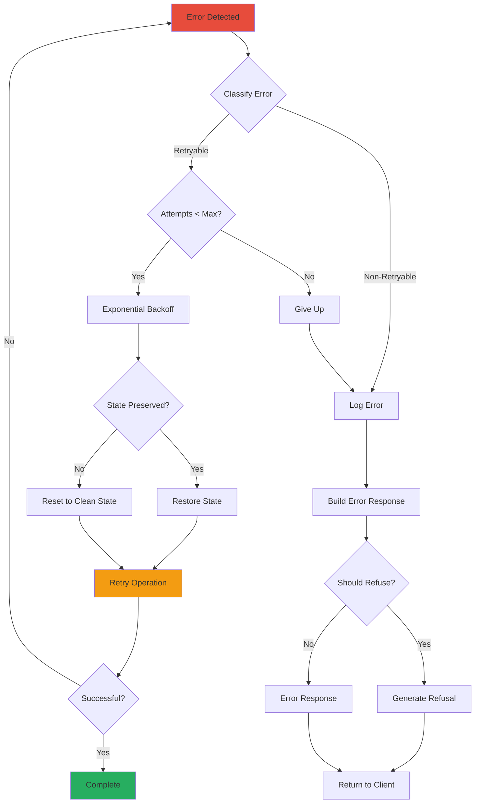
```mermaid
graph TD
    Error[Error Detected]
    
    Error --> Classify{Classify Error}
    
    Classify -->|Retryable| CheckAttempts{Attempts < Max?}
    Classify -->|Non-Retryable| LogError[Log Error]
    
    CheckAttempts -->|Yes| Backoff[Exponential Backoff]
    CheckAttempts -->|No| GiveUp[Give Up]
    
    Backoff --> CheckState{State Preserved?}
    CheckState -->|Yes| Restore[Restore State]
    CheckState -->|No| Reset[Reset to Clean State]
    
    Restore --> Retry[Retry Operation]
    Reset --> Retry
    
    Retry --> Success{Successful?}
    Success -->|Yes| Complete[Complete]
    Success -->|No| Error
    
    GiveUp --> LogError
    LogError --> BuildErrorResp[Build Error Response]
    BuildErrorResp --> CheckRefuse{Should Refuse?}
    
    CheckRefuse -->|Yes| Refusal[Generate Refusal]
    CheckRefuse -->|No| ErrorResp[Error Response]
    
    Refusal --> Return[Return to Client]
    ErrorResp --> Return

    style Error fill:#E74C3C
    style Complete fill:#27AE60
    style Retry fill:#F39C12
```

### 10.2 Adapter Failure Handling

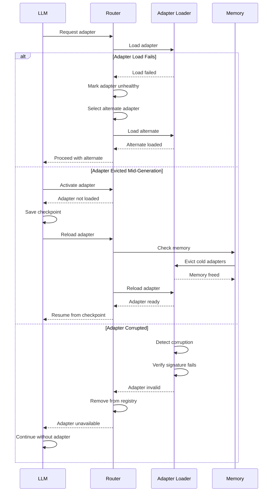
```mermaid
sequenceDiagram
    participant LLM
    participant Router
    participant Loader as Adapter Loader
    participant Memory

    LLM->>Router: Request adapter
    Router->>Loader: Load adapter
    
    alt Adapter Load Fails
        Loader-->>Router: Load failed
        Router->>Router: Mark adapter unhealthy
        Router->>Router: Select alternate adapter
        Router->>Loader: Load alternate
        Loader-->>Router: Alternate loaded
        Router-->>LLM: Proceed with alternate
    else Adapter Evicted Mid-Generation
        LLM->>Router: Activate adapter
        Router-->>LLM: Adapter not loaded
        LLM->>LLM: Save checkpoint
        LLM->>Router: Reload adapter
        Router->>Memory: Check memory
        Memory->>Loader: Evict cold adapters
        Loader-->>Memory: Memory freed
        Router->>Loader: Reload adapter
        Loader-->>Router: Adapter ready
        Router-->>LLM: Resume from checkpoint
    else Adapter Corrupted
        Loader->>Loader: Detect corruption
        Loader->>Loader: Verify signature fails
        Loader-->>Router: Adapter invalid
        Router->>Router: Remove from registry
        Router-->>LLM: Adapter unavailable
        LLM->>LLM: Continue without adapter
    end
```

---

## 11. Security Boundaries

### 11.1 Isolation Model

```mermaid
graph TB
    subgraph "Hardware Layer"
        CPU[Apple Silicon<br/>M1/M2/M3]
        Memory[Unified Memory]
        SE[Secure Enclave]
    end

    subgraph "OS Layer"
        Kernel[macOS Kernel]
        PF[Packet Filter<br/>Zero Egress]
        UID[UID/GID Isolation]
    end

    subgraph "Tenant A Sandbox"
        TA_Proc[Process<br/>UID 1001]
        TA_Mem[Memory Region A]
        TA_UDS[Unix Socket A]
        TA_Files[File Namespace A]
    end

    subgraph "Tenant B Sandbox"
        TB_Proc[Process<br/>UID 1002]
        TB_Mem[Memory Region B]
        TB_UDS[Unix Socket B]
        TB_Files[File Namespace B]
    end

    subgraph "Shared Resources"
        SharedDB[(PostgreSQL<br/>Row-level isolation)]
        SharedBundles[Bundle Store<br/>Encrypted at rest]
    end

    CPU --> Kernel
    Memory --> Kernel
    SE --> Kernel
    
    Kernel --> PF
    Kernel --> UID
    
    PF -.->|blocks egress| TA_Proc
    PF -.->|blocks egress| TB_Proc
    
    UID --> TA_Proc
    UID --> TB_Proc
    
    TA_Proc --> TA_Mem
    TA_Proc --> TA_UDS
    TA_Proc --> TA_Files
    
    TB_Proc --> TB_Mem
    TB_Proc --> TB_UDS
    TB_Proc --> TB_Files
    
    TA_Proc -.->|RLS policies| SharedDB
    TB_Proc -.->|RLS policies| SharedDB
    
    TA_Proc -.->|signed writes| SharedBundles
    TB_Proc -.->|signed writes| SharedBundles

    style PF fill:#E74C3C
    style SE fill:#F39C12
    style TA_Proc fill:#3498DB
    style TB_Proc fill:#27AE60
```

### 11.2 Data Classification Flow

```mermaid
graph LR
    subgraph "Data Ingestion"
        Raw[Raw Data]
        Classify[Auto-Classifier]
        Manual[Manual Review]
    end

    subgraph "Classification Levels"
        Public[Public]
        Internal[Internal]
        Confidential[Confidential]
        Restricted[Restricted/ITAR]
    end

    subgraph "Storage"
        PublicDB[(Public DB)]
        InternalDB[(Internal DB)]
        ConfidentialDB[(Confidential DB)]
        RestrictedDB[(Restricted DB<br/>Encrypted)]
    end

    subgraph "Access Control"
        ACL[ACL Engine]
        RBAC[RBAC Policies]
        Audit[Audit Logger]
    end

    Raw --> Classify
    Classify --> Manual
    
    Manual --> Public
    Manual --> Internal
    Manual --> Confidential
    Manual --> Restricted
    
    Public --> PublicDB
    Internal --> InternalDB
    Confidential --> ConfidentialDB
    Restricted --> RestrictedDB
    
    PublicDB --> ACL
    InternalDB --> ACL
    ConfidentialDB --> ACL
    RestrictedDB --> ACL
    
    ACL --> RBAC
    RBAC --> Audit

    style Restricted fill:#E74C3C
    style RestrictedDB fill:#E74C3C
    style Audit fill:#F39C12
```

---

## 12. Deployment Architecture

### 12.1 Production Deployment

```mermaid
graph TB
    subgraph "Edge Layer"
        LB[Load Balancer<br/>Nginx]
        WAF[Web Application Firewall]
    end

    subgraph "Application Layer"
        subgraph "Control Plane Cluster"
            CP1[Control Plane 1]
            CP2[Control Plane 2]
            CP3[Control Plane 3]
        end
        
        subgraph "Worker Nodes"
            W1[Worker Node 1<br/>M2 Ultra]
            W2[Worker Node 2<br/>M2 Ultra]
            W3[Worker Node 3<br/>M2 Ultra]
        end
    end

    subgraph "Data Layer"
        subgraph "Primary Region"
            DB_Primary[(PostgreSQL<br/>Primary)]
            Vec_Primary[(pgvector<br/>Primary)]
        end
        
        subgraph "Replica Region"
            DB_Replica[(PostgreSQL<br/>Replica)]
            Vec_Replica[(pgvector<br/>Replica)]
        end
        
        Bundle_Store[Bundle Store<br/>S3-compatible]
        Artifact_Store[Artifact Store<br/>Signed Bundles]
    end

    subgraph "Monitoring"
        Metrics[Prometheus]
        Logs[Loki]
        Traces[Jaeger]
        Dashboard[Grafana]
    end

    LB --> WAF
    WAF --> CP1
    WAF --> CP2
    WAF --> CP3
    
    CP1 --> W1
    CP2 --> W2
    CP3 --> W3
    
    W1 --> DB_Primary
    W2 --> DB_Primary
    W3 --> DB_Primary
    
    W1 --> Vec_Primary
    W2 --> Vec_Primary
    W3 --> Vec_Primary
    
    DB_Primary -->|streaming replication| DB_Replica
    Vec_Primary -->|streaming replication| Vec_Replica
    
    W1 --> Bundle_Store
    W2 --> Bundle_Store
    W3 --> Bundle_Store
    
    W1 --> Artifact_Store
    W2 --> Artifact_Store
    W3 --> Artifact_Store
    
    W1 --> Metrics
    W2 --> Metrics
    W3 --> Metrics
    
    Metrics --> Dashboard
    Logs --> Dashboard
    Traces --> Dashboard

    style LB fill:#3498DB
    style DB_Primary fill:#E74C3C
    style Bundle_Store fill:#C38D9E
    style Dashboard fill:#F39C12
```

### 12.2 CPID Promotion Flow

```mermaid
sequenceDiagram
    participant Dev as Developer
    participant CI as CI/CD Pipeline
    participant Test as Test Environment
    participant Staging as Staging Environment
    participant CAB as Change Advisory Board
    participant Prod as Production

    Dev->>CI: Push code changes
    CI->>CI: Run tests
    CI->>CI: Build Plan bundle
    CI->>CI: Generate CPID
    
    CI->>Test: Deploy to test
    Test->>Test: Run determinism tests
    Test->>Test: Run policy compliance tests
    Test->>Test: Run hallucination metrics
    
    Test-->>CI: Test results
    
    alt Tests Failed
        CI-->>Dev: Deployment blocked
    end
    
    CI->>Staging: Deploy to staging
    Staging->>Staging: Run promotion gates
    Staging->>Staging: Dry-run validation
    Staging->>Staging: Generate gate report
    
    Staging-->>CI: Gate results
    
    CI->>CAB: Submit for approval
    CAB->>CAB: Review gate results
    CAB->>CAB: Review evidence
    CAB->>CAB: Approve/Reject
    
    alt Rejected
        CAB-->>Dev: Changes required
    end
    
    CAB->>Prod: Approve promotion
    Prod->>Prod: Sign Plan bundle
    Prod->>Prod: Update CPID
    Prod->>Prod: Rotate keys
    Prod->>Prod: Activate new CP
    
    Prod-->>CAB: Promotion complete
    CAB->>CAB: Log promotion event
```

---

## Summary

These diagrams provide a comprehensive visual reference for the AdapterOS runtime architecture, covering:

1. **System Architecture** - Component relationships and process model
2. **Request Flow** - Complete request lifecycle and streaming
3. **Adapter Lifecycle** - State machine and loading sequence
4. **Memory Management** - Allocation strategy and eviction logic
5. **Router Pipeline** - Adapter selection and gate quantization
6. **Evidence Retrieval** - RAG pipeline and validation
7. **Policy Enforcement** - Gate architecture and refusal logic
8. **State Management** - Hierarchy and checkpointing
9. **Telemetry Flow** - Event pipeline and trace construction
10. **Error Handling** - Recovery flow and adapter failures
11. **Security Boundaries** - Isolation model and data classification
12. **Deployment Architecture** - Production setup and CPID promotion

All diagrams are rendered using Mermaid.js and can be embedded in documentation, presentations, or rendered in compatible viewers.

---

**For more details, refer to:**
- [LLM Interface Specification](./llm-interface-specification.md)
- [Policy Rulesets](../rulesets/)
- [API Documentation](../api/)

