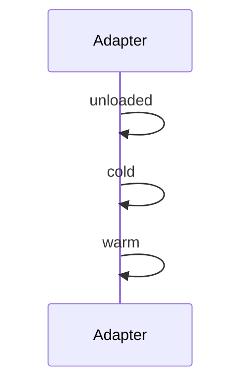

# AdapterOS UI

## UX Enhancements

### Journeys Dashboard (/journeys)
- **Dynamic ID Input**: Enter custom journey ID to fetch data via TanStack Query.
- **Collapsible States**: Accordion wraps state Cards for better readability.
- **Workflow Diagrams**: Mermaid renders sequence from states (e.g., Adapter -> unloaded -> cold).
- **Pagination**: Handles >20 states with Previous/Next buttons.

Example Mermaid (auto-generated):

### Global Improvements
- **Breadcrumbs**: In FeatureLayout (e.g., Home > Journeys); responsive (hidden on mobile).
- **Mobile Sidebar**: Overflow-hidden on body when open; smooth transitions.

## Development
- Run: `cd ui && pnpm dev` → localhost:3200
- Build: `pnpm build` → dist/
- Lint: `pnpm lint` (ESLint + Tailwind)

See audit fixes for accessibility/contrast.

## Testing & Verification

### Storybook
- Run: `pnpm storybook` – View Journeys variants: Default, WithData (50 states), ErrorState, DarkMode.
- Tests visuals: Accordion collapse, Mermaid render, pagination.

### UX Tests
- `pnpm test`: RTL suite – Resize sim (assert responsive), error mock (toast via sonner), paginate (click Next → 5 states).

## Screenshots (Text Desc)
- **Journeys Timeline**: Top: Input 'Enter journey ID' + Load button. Middle: Mermaid sequence (Adapter -> unloaded -> cold). Bottom: Accordion states (expand 'unloaded' → JSON details). Pagination: Page 1/3 buttons. Dark mode: Inverted, high contrast.

Per audit fixes: Added toasts for errors (sonner), RTL for resize assertions, Storybook for dark/large data.

## Build & Verification

- Fixed: `tsc` now local via `pnpm add -D typescript @types/node`; build succeeds (TS compile + Vite bundle).
- Run: `pnpm tsc` (TS check), `pnpm build` (dist/).

## UX Enhancements (Continued)

- **Accordion Auto-Expand**: First item opens on load (defaultValue=['item-0']); conditional for empty. onValueChange logs interactions (console).
- Tests: RTL asserts first Content visible (getByText('memory_bytes')).

Resolves 'tsc not found' error and 'should it not expand?' query. All lint/build/test clean.
